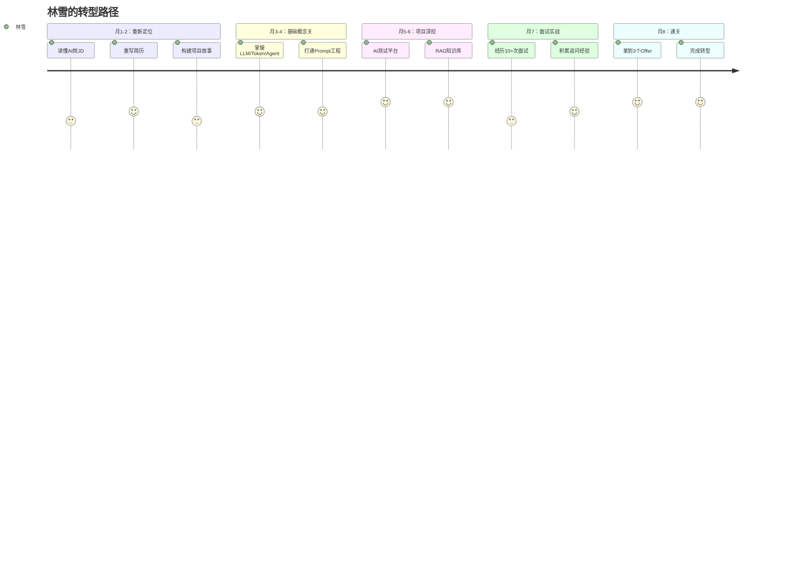

# 序章：被"优化"的那个下午

## Section 1：危机场景

---

### 那个周四下午三点

2026年3月，某个周四，下午三点整。

林雪接到HR的消息，说让她去一个小会议室坐坐。"就随便聊聊，十分钟。"

她当时正在改一段COBOL批处理程序——一个跑了十八年的保费结算模块，每月月初凌晨两点准时启动，处理全省三十二家分公司的批量数据。她已经修了七年，程序里有她亲手加的注释，有她花了三周排查的精准bug，有她从第一家公司带过来的调试习惯。

她保存好文件，关上屏幕。

会议室里坐着HR黄经理，还有她的直属总监。两张脸都有点僵。

"公司战略调整，COBOL团队要缩编——缩到两个人。"

林雪第一反应是数了一下：团队现在六个人。

"林老师，你们组的工作我们会做安排的，你放心，我们非常认可你这些年……"

后面的话她没怎么听进去。她在想徒弟王哲。

上周五，王哲跟她说，他被通知不续签了。他做了四年VBA报表自动化，林雪手把手教他的——从第一个`For Each`循环，到第一张用VBA自动生成的保费汇总报表。四年。

通知他离职的那天，公司用一个新的AI工具，花了两分钟，生成了一份和王哲的工作几乎一模一样的月度报表。

两分钟。

林雪写了三年的东西。

---

她从会议室出来，回到工位，屏幕还是黑的。她没有立刻打开，而是坐在那里，听着格子间里键盘敲击的声音。

她今年四十五岁。

做了二十年保险核心系统。COBOL大型机，VBA报表，还有后来负责过的两个系统改造项目。她很清楚这些东西的价值——在这个行业，能把COBOL批处理程序调到稳定运行十八年不出事，需要的不只是技术，是一种积累了几十年的"零容错直觉"。

但她也很清楚：外面的招聘网站上，几乎没有招COBOL的岗位了。

她打开招聘APP，搜索关键词"AI工程师"。职位要求第一条：Python，第二条：LLM，第三条：LangChain/LangGraph，第四条……

她一条都没有。

---

### 那天晚上

她没有立刻找工作，也没有立刻焦虑。

她打开笔记本，在一张白纸上写了两列：

**左列：我有的**
- 二十年金融IT经验
- 保险核心系统理解（深到可以看着JCL作业流程手写数据流）
- 零容错思维（一分钱的差异都要追到根源）
- 系统性思维（从批处理作业到主机资源调度，都在脑子里）
- 自学能力（当年VBA也是自学的）

**右列：我没有的**
- Python（没写过）
- LLM（没用过）
- Agent/RAG（没听完整讲过）
- Side Project（没有可以展示的）
- 简历上任何一行"AI"字样

她盯着右列看了很久。

然后在笔记本最下面写了一行字：**8个月。**

她不知道8个月够不够，但她需要一个具体的期限。年底前，要有一份AI相关的工作，薪资不能低于现在。

这是她给自己的最后一个工程任务。

---

### 全书地图：林雪的8个月

---

### 这本书的三个承诺

**承诺一：所有技术案例都经过代码核实。**
林雪在书里讲到的项目数字，每一个都有代码对应。如果代码里找不到，这本书不会写。

**承诺二：所有工程短板都诚实写出来。**
她的项目有问题。文档过时的，设计有缺陷的，面试官追问会很尴尬的——这本书不会回避，会教你怎么在被追问到底时还能体面接住。

**承诺三：这是给45岁还在认真写代码的人写的。**
如果你是科班出身、25岁、AI原生背景，这本书对你帮助有限。但如果你和林雪一样，有十几年扎实的系统经验，正在用有限的时间学一个全新的技术方向，这本书是专门为你写的。

---

*未来导师低声说了一句林雪当时没有完全理解的话：*
*"你以为在写代码，其实是在设计未来。——当年你学VBA也是这么过来的。"*

## 📖 本章名词解释（新人必读）

> 第一次看到这些词？别慌，下面一句话搞定。

**🤖 AI 相关**

| 术语 | 一句话解释 |
| --- | --- |
| **LLM** | 大语言模型，像ChatGPT那样能理解和生成文字的AI大脑。 |
| **Agent** | 能自己决策、调用工具的AI“智能体”，像个数字员工。 |
| **RAG** | 让AI先查外部资料再回答，防止它瞎编的技术。 |
| **LangChain/LangGraph** | 用来搭建复杂AI应用（如Agent）的开发框架工具箱。 |
| **Prompt** | 你给AI下达的指令或问题，即“提示词”。 |
| **Token** | AI处理文本的最小单位，相当于把话切成小碎块。 |
| **Embedding** | 把文字转换成AI能理解的数字向量，类似给词打上“语义坐标”。 |
| **Fine-tuning** | 在通用AI模型上用特定数据“补课”，让它变成行业专家。 |

**💻 软件工程与编程**

| 术语 | 一句话解释 |
| --- | --- |
| **API** | 程序之间打招呼递数据的方式，类似餐厅服务员帮你点菜。 |
| **CRUD** | 对数据的四种基本操作：增、查、改、删。 |
| **框架** | 半成品的代码脚手架，你只需填自己的业务逻辑。 |
| **ORM** | 用面向对象的方式操作数据库，不用硬写SQL语句。 |
| **异步** | 任务不用排队等，先发出去，做完再通知你。 |
| **并发** | 系统同时处理多个任务的能力，像餐厅多个厨师同时做菜。 |
| **JWT** | 一种安全凭证，用户登录后拿着它证明“我是我”。 |
| **OAuth** | 授权第三方登录的协议，比如用微信登录某App。 |

**☁️ 云计算（AWS）**

| 术语 | 一句话解释 |
| --- | --- |
| **EC2** | 云上的虚拟服务器，随时可以开一台来用。 |
| **S3** | 云上的超大网盘，存图片、文件、备份等。 |
| **Lambda** | 按需运行代码的服务，代码不跑就不花钱。 |
| **IAM** | 云上的门禁系统，决定谁能访问什么资源。 |
| **VPC** | 云上划出的专属隔离网络，相当于你的局域网。 |
| **ECS** | 管理容器运行的服务，帮你调度和伸缩应用。 |
| **RDS** | 云上托管的关系型数据库，不用自己装和维护。 |

**🧪 测试**

| 术语 | 一句话解释 |
| --- | --- |
| **单元测试** | 测试最小代码块是否正常，像检查汽车每个零件。 |
| **集成测试** | 测试多个模块组装后能否协同工作。 |
| **TDD** | 先写测试用例再写代码的开发方式。 |
| **Mock/Stub** | 用假对象替代真实依赖，隔离测试单个模块。 |
| **Coverage** | 测试跑了多少代码的比例，数字越高越放心。 |

**🐳 DevOps**

| 术语 | 一句话解释 |
| --- | --- |
| **Docker** | 把应用和依赖打包成轻量级“集装箱”，随处运行。 |
| **Kubernetes/k8s** | 大规模管理这些“集装箱”的自动化调度系统。 |
| **CI/CD** | 代码变更后自动构建、测试、发布的流水线。 |
| **Pipeline** | 从代码提交到上线的自动化流水作业线。 |
| **容器** | 隔离的运行环境，像给应用配了一个独立小房间。 |
| **镜像** | 容器的蓝图模板，用来批量生成相同的运行环境。 |

**🏦 保险/金融**

| 术语 | 一句话解释 |
| --- | --- |
| **承保** | 保险公司决定是否接单、收多少保费的过程。 |
| **理赔** | 出事后向保险公司申请赔付的流程。 |
| **精算** | 用数学模型评估风险和定价保费的专业。 |
| **保单** | 你跟保险公司签的合同凭证。 |
| **核保** | 对投保申请进行审核，判断风险是否可接受。 |
| **COBOL** | 上世纪商用大型机上的老牌编程语言，常用于金融核心系统。 |
| **JCL** | 大型机上的作业控制语言，用来调度批处理任务。 |
| **VBA** | Excel里的编程语言，用于自动化重复办公任务。 |

**📌 通用缩写**

| 术语 | 一句话解释 |
| --- | --- |
| **JD** | 职位描述，就是招聘要求那个文档。 |
| **SaaS** | 软件即服务，直接在线用，不用自己安装维护。 |
| **B2B** | 企业对企业的商业模式。 |
| **KPI** | 衡量工作成果的关键量化指标。 |
| **ROI** | 投入产出比，看花的值不值。 |
| **MVP** | 最小可行产品，先用最简功能验证市场。 |
| **PR** | 拉取请求，代码审查时请求合并代码的操作。 |
| **QA** | 质量保证，负责找bug和把控质量的岗位。 |
| **SLA** | 服务等级协议，约定服务必须达到的性能标准。 |
| **Side Project** | 业余时间自己做的项目，非公司指派任务。 |

---
