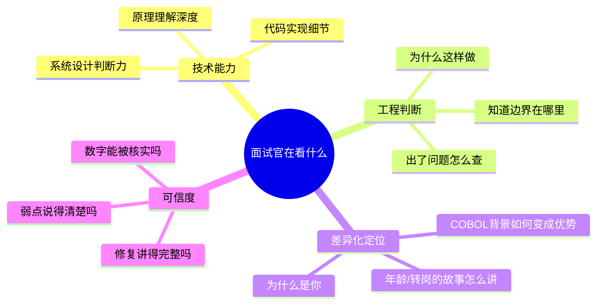

# 第1章：面试官到底在看什么

## Section 1：面试复盘的意外发现

---

### 第一轮技术面，三周后

第三个月末的那个下午，林雪提前二十分钟到了。

她坐在等候区，公文包放在腿上。白色背景上有一排公司logo，字体很小，她没有认真看。她在等人叫她的名字。

她那时刚把LangGraph的多Agent架构读完，能把ReAct循环画出来，能解释Agent为什么需要工具调用而不能全靠LLM裸推理。她觉得自己准备得还行。

面试官是一家中等规模互联网公司的技术总监，很年轻，戴眼镜，提问语速很快。

"你了解LangGraph吗？"

林雪答了。

"AgentState和MemorySaver的区别？"

也答了，还举了自己项目的例子。

"你们的Agent失控了怎么办？"

她说了recursion_limit，说了ConsecutiveRetryGuardMiddleware，说了60次限制是怎么定的。

整个面试她觉得回答得相当完整。

---

大约四十分钟后，面试官放下笔，往椅背上靠了靠。

面试官合上笔记本，停了一下。林雪注意到桌上的那杯水，从进来到现在，她一口都没有喝过。

"好，我这里没有问题了。"他说，"你有什么想问我的吗？"

林雪心里松了一口气。

她准备了两个问题。选了第一个：

"请问团队现在主要在做哪个方向的AI落地？"

面试官说了几句话，大意是保险风控和客服自动化。林雪点头，说了一句"这个方向挺有意思的"。

面试官站起来，伸手。

"辛苦了，我们会跟进你的。"

林雪握了手，说了句谢谢，收拾桌上的笔记本和水杯。

她把所有问题都答了。没有哪道题完全卡住，没有冷场，没有答着答着说"这个我不太确定"之后陷入沉默。她心里做了个模糊的估算：应该不差。

---

下楼，出大堂，往地铁站走。

路上她想给家人发条消息——"面试感觉还不错"。

打开手机，停了一下，没发。

等结果出来再说。

地铁里人不多，她找了个靠窗的位置坐下。窗外隧道的黑一段一段往后退。她没有刷手机，就靠着坐着，感觉还行。

---

第二天，她检查了两次邮件。

第三天，检查了三次。

第四天下午，一封邮件出现在收件箱。发件人是那家公司的HR。

> *非常感谢您拨冗参与我们的面试，经过综合评估……*

她看到"综合评估"，就知道了。

---

林雪做了一件事：她找到了一个认识这家公司面试官的猎头，托对方侧面了解了一下当时的评分。

猎头给了她一个具体的数字。

"评分表上写的是5分。"他说，"10分制。"

"技术没问题，"猎头说，"但面试官觉得你对AI工程的思路还停在'使用者'层面，而不是'构建者'层面。"

林雪沉默了一会儿。

猎头补了一句：

"他们说不知道你为什么来做这个岗位。"

她愣了一下。

**她没有讲为什么她要转型做AI。**

她以为那个是HR问的。

技术面试官其实在等的，是：**你为什么选择用这条路径进入AI，这意味着你能解决什么别人解决不了的问题。**

这是她在书里学不到的东西。

---

### 章节学习目标

学完这一章，你能回答：

1. 技术面试官和HR，评分维度有什么本质区别？
2. "我了解LLM原理"这句话，在面试官耳朵里是几分？
3. 为什么有COBOL背景在某类面试官面前是加分项？
4. 面试结束后那10分钟，面试官在填什么？

## 📖 本章名词解释（新人必读）

> 第一次看到这些词？别慌，下面一句话搞定。

**🤖 AI 相关**

| 术语 | 一句话解释 |
| --- | --- |
| **LLM** | 大语言模型，像ChatGPT那样能理解和生成文字的AI大脑。 |
| **LangGraph** | 用来构建多Agent协作流程的框架，像给Agent画流程图。 |
| **Agent** | 能自己决策、调用工具的AI“智能体”，像个数字员工。 |
| **ReAct循环** | Agent交替执行“思考-行动-观察”的决策循环模式。 |
| **工具调用** | Agent调用外部函数或API来完成具体操作的能力。 |
| **裸推理** | 仅靠模型自身知识推理，不借助外部工具或检索。 |
| **AgentState** | LangGraph中存储Agent当前状态的对象，像备忘录。 |
| **MemorySaver** | LangGraph中保存对话历史的组件，帮Agent记住之前的事。 |

**💻 软件工程与编程**

| 术语 | 一句话解释 |
| --- | --- |
| **recursion\_limit** | 递归调用的最大深度限制，防止程序无限循环下去。 |
| **中间件** | 在请求处理前后插入的通用逻辑层，像安检通道。 |

**📌 通用缩写**

| 术语 | 一句话解释 |
| --- | --- |
| **HR** | 人力资源部，负责招聘、考核、薪酬等人事工作。 |
| **JD** | 职位描述，就是招聘要求那个文档。 |

---
