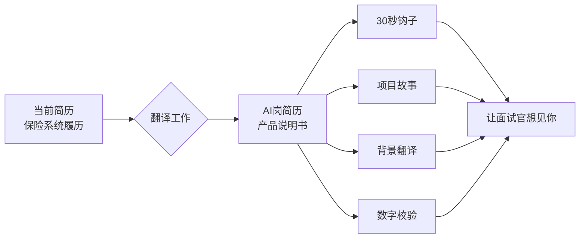

# 第2章：简历不是你的履历，是你的产品说明书

## Section 1：30秒决定

---

### 被挂断的那通电话

林雪第一次投AI工程师的简历，发生在第四个月初。

她选了一家做金融AI的中型公司，职位描述里有"LangChain"、"RAG系统"——正好是她做的东西。她觉得方向对了，就直接投了第一版简历。

三天后，HR打来了电话。

"你好，我是XXX公司的HR小陈，看到你投了我们AI工程师岗位……"

"是的，你好。"

"……你现在的职位是？"

"保险核心系统工程师。"

两秒沉默。

"你做了多少年了？"

"二十年。"

又是三秒沉默。然后对方语气变得礼貌而遥远：

"好的，我们会看一下，有进展会联系你的。"

电话挂了。

林雪盯着手机看了一会儿。她知道这个"有进展会联系"意味着什么。

那通电话持续了53秒。

---

两周后，她鼓起勇气给那个HR发了一封邮件，问是否方便透露一下没有进入面试的原因。

对方回复了三个字：

"经验不符。"

但林雪知道她有两个AI项目——RAG系统和AI测试平台，合计8个月的实际开发经验。那张简历上是写了的。

问题是：**写了，但没有被看见。**

---

### 猎头的诊断

林雪决定去找一个猎头聊聊。

这个猎头做了十五年科技行业招聘，专做中高端技术岗。她帮林雪看了简历，用手指在第一行画了一道横线，停在"2004"处没有移动。沉默了大约三十秒，然后说了一句话：

"你这份简历，是一个做了二十年保险核心系统的COBOL工程师的简历。"

林雪说："是的，因为我是。"

猎头说："面试官在找的，是一个AI工程师。"

林雪说："但我现在有两个AI项目……"

猎头打断了她："我知道，我看到了。但它们藏在第二页的下半部分，在你列了十二条保险系统工作内容之后。一个筛简历的HR在30秒内不会看到那里。"

林雪问："那她在30秒内看到了什么？"

猎头说："'二十年COBOL工程师'。就这一条。"

---

那通53秒的电话，林雪终于明白发生了什么：

HR在打电话之前，大概花了15秒扫了一眼简历。她看到的是"保险核心系统，二十年"。

然后她打了一通礼貌性的筛查电话，确认自己的判断。

确认之后，挂掉了。

那两个AI项目，从来没有进入她的视野。

---

那天深夜，林雪把自己的第一版简历打印出来，铺在桌上，用工程师看bug的眼神审视它。

她做了二十年的系统文档。保险核心系统的每一次版本迭代，都要配一份技术文档——写到什么程度？新来的工程师，从没碰过这套系统，坐下来读一小时，能找到他需要改的那个模块在哪，能明白这个系统在解决谁的问题、用什么方式解决的。

那是她引以为傲的事。她写的文档，不需要有人来解释，文档本身会说话。

但现在桌上这份"文档"，是她写的、关于她自己的。

她假装自己是那个陌生的HR，第一次看到这份简历——三十秒后，她抬起头。

她没看懂。

不是因为内容不够。是因为这份文档不知道它的读者是谁。她写系统文档，第一行永远是：**本文档面向XX角色，目的是帮助读者在YY时间内完成ZZ任务**。但这份简历的第一行，是她的名字和一个邮箱地址。

后面跟着二十年的时间线，从2004年写到2024年，一丝不苟，完整，准确。

这不是给面试官写的文档。这是给自己写的档案。

她想起一句话，是当年带她的老工程师说的：**"文档写给谁看，比写什么更重要。"**

她当时以为这是系统文档的道理。

那天深夜，她意识到：这是所有文档的道理。

她把台灯关掉。打印纸还摊在桌上，在手机屏幕微弱的蓝光里，那行"2004年—2024年"的时间线还清晰可见。外面有地铁最后一班经过，声音低沉，从楼下穿过去，然后什么都没了。

---

### 简历的真正功能

大多数人对简历有一个根本性的误解：简历是你的履历——你做过什么，在哪里做的，做了多少年。

但如果你在换方向，这个定义会害了你。

**换方向时，简历的功能只有一个：在30秒内，让看到这份简历的人想见你。**

不是让他们了解你，不是证明你有多资深，是**让他们想见你**。

这两件事有根本的区别：

- "让他们了解你"：你需要展示全部的经历，证明深度和广度
- "让他们想见你"：你需要找到那个让他们心跳加速的一两个点，其他都是背景

林雪的问题不是没有内容。她的问题是：**她把所有内容都给了，但没有帮面试官找到那个点。**

---

### 章节学习目标

学完这一章，你能做到：

1. 写出一段25字以内的"职业定位语"，适合换方向的时候用
2. 把一个Side Project写成3行简历条目，包含数字、技术栈、解决的问题
3. 把COBOL背景翻译成AI工程师听得懂的语言
4. 知道哪些数字可以写进简历、哪些不能（因为经不起核实）

## 📖 本章名词解释（新人必读）

> 第一次看到这些词？别慌，下面一句话搞定。

**🤖 AI 相关**

| 术语 | 一句话解释 |
| --- | --- |
| **RAG** | 让AI先查外部资料再回答，防止它瞎编的技术。 |
| **LangChain** | 一个用来搭建LLM应用的热门开发框架工具箱。 |
| **Side Project** | 业余时间自己做的项目，非公司指派任务。 |

**💻 软件工程与编程**

| 术语 | 一句话解释 |
| --- | --- |
| **技术栈** | 项目使用的所有技术工具的集合。 |

**📌 通用缩写**

| 术语 | 一句话解释 |
| --- | --- |
| **COBOL** | 上世纪商用大型机上的老牌编程语言，常用于金融核心系统。 |
| **HR** | 人力资源部，负责招聘、考核、薪酬等人事工作。 |
| **JD** | 职位描述，就是招聘要求那个文档。 |

---
