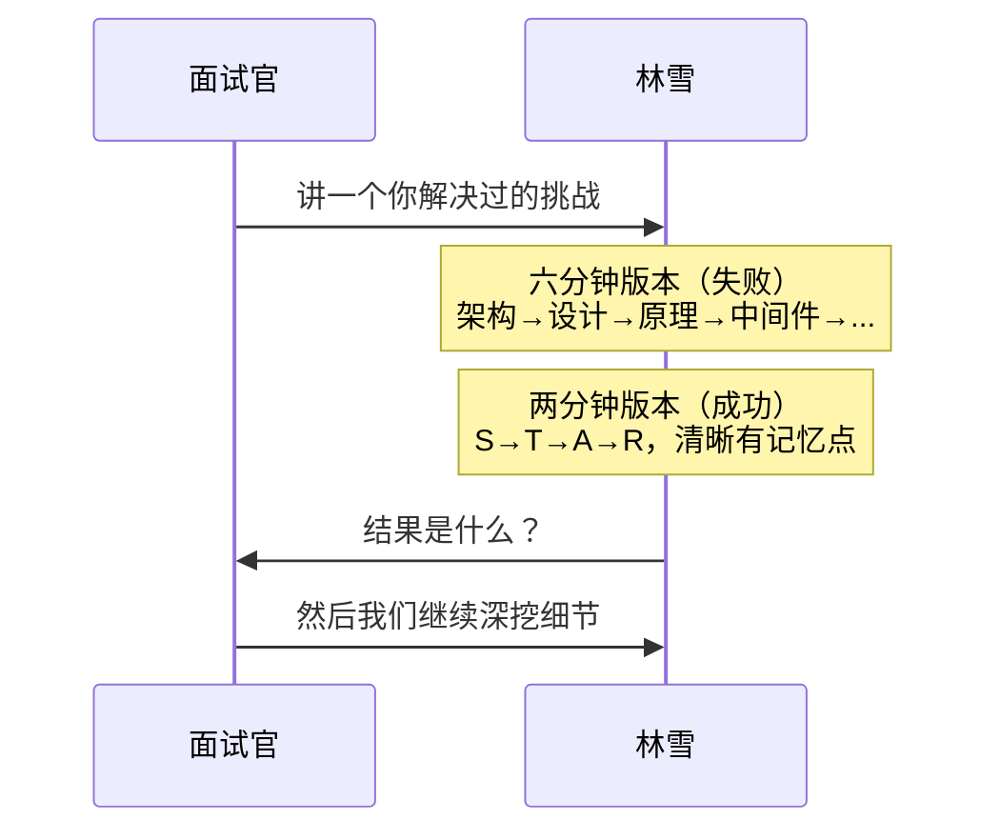

# 第3章：STAR故事框架——把技术决策讲成人话

## Section 1：六分钟讲了什么都没说清楚

---

### 第一个面试邀请

视频面试，下午两点整。

林雪把耳机插上，调了一下屏幕亮度。背景墙还是那面白墙，书架那排她已经拍照确认过三次——没有不合适的东西，也没有需要显眼的东西。

摄像头亮了。

面试官是CTO，三十多岁，直接。他出现在屏幕上的时候，背景是一个开放式办公区，说话声里有隐约的键盘声。

开场标准三件套：项目介绍、技术栈、最近在学什么。都过了。

然后他问了一个问题，是林雪事后复盘认为是整场面试关键的那一问：

**"你能说说一个你解决过的最有挑战性的技术问题吗？**

详细说说，怎么发现的，怎么分析的，最后怎么解决的。"

林雪想了三秒，开口说：

"好的，我们的UI Agent之前有一个成本的问题……"

然后她讲了六分钟。

讲了UI Agent的架构，讲了为什么有多个Agent，讲了LangGraph的状态机，讲了为什么需要中间件，讲了recursion_limit的原理，讲了Token预算的设计……

面试官打断了她。

"你说了很多，但我还是不清楚：具体的问题是什么，你具体做了什么，结果是什么。"

---

她出来之后在停车场站了几分钟。

技术都对。内容都是真实的。但她没有让对方听懂。

她掏出手机，打开备忘录，准备输入——但什么都没打。

她在想的不是"下次怎么说"。她在想的是：讲了六分钟，他到底想听什么。

这是两个不同的问题。第一个是表达问题，第二个是需求分析。

她站在停车场，把手机收回口袋，开始在脑子里跑分析。

然后她停住，把手机重新拿出来，在备忘录里打了三个字：

**先讲什么**

**讲项目，和讲故事，是两件完全不同的事。**

讲项目：把你知道的都倒出来，越详细越好
讲故事：帮听者在两分钟内看到问题→动作→结果这条线

工程师天然擅长第一种，但面试考的是第二种。

---

### STAR框架的本质

STAR不是公式，是压缩算法。

它做的事是：把一个工程师可以讲三十分钟的事，压缩成两分钟听完就能记住的版本。

**S — Situation（背景）**：一句话，问题是什么
**T — Task（任务）**：你的目标是什么
**A — Action（行动）**：你具体做了什么，为什么这样做
**R — Result（结果）**：发生了什么，可以量化的量化，不能量化的清楚描述

林雪那六分钟的问题，是她把所有时间都花在了背景上（S），没有给Action和Result留空间。

---

### 章节学习目标

学完这一章，你能做到：

1. 把TestAgentPythonProject里的成本优化事件，打包成一个两分钟的STAR故事
2. 把anything-chat-rag里的检索模式选型，打包成一个两分钟的STAR故事
3. 知道什么时候该讲STAR，什么时候该切换到技术深挖
4. 处理"讲完之后面试官继续追问"的情况

## 📖 本章名词解释（新人必读）

> 第一次看到这些词？别慌，下面一句话搞定。

**🤖 AI 相关**

| 术语 | 一句话解释 |
| --- | --- |
| **Agent** | 能自己决策、调用工具的AI“智能体”，像个数字员工。 |
| **LangGraph** | 用来构建多Agent协作流程的框架，像给Agent画流程图。 |
| **中间件** | 在请求处理前后插入的通用逻辑层，像安检通道。 |
| **recursion\_limit** | 递归调用的最大深度限制，防止程序无限循环下去。 |
| **Token** | AI处理文本的最小计量单位，像字数但不等同于字数。 |
| **状态机** | 在不同状态间切换的逻辑模型，像电梯门开关运行。 |

**💻 软件工程与编程**

| 术语 | 一句话解释 |
| --- | --- |
| **技术栈** | 项目使用的所有技术工具的集合。 |
| **STAR框架** | Situation/Task/Action/Result，讲故事的四步框架。 |
| **压缩算法** | 把大量信息精简为关键信息的处理方式。 |

**📌 通用缩写**

| 术语 | 一句话解释 |
| --- | --- |
| **CTO** | 首席技术官，公司技术最高负责人。 |
| **UI** | 用户界面，用户直接看到的操作和显示部分。 |
| **API** | 程序之间打招呼递数据的方式，类似餐厅服务员帮你点菜。 |

---
