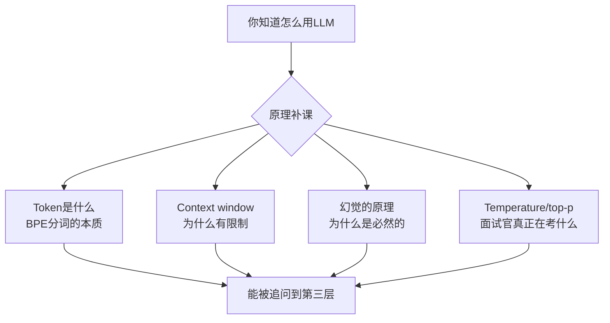

# 第4章：LLM基础——面试官真正在考什么

## Section 1：被"原理"考住的那次

---

### 技术面第二轮

进入第二轮面试之前，林雪做了充分的准备——她把两个项目的技术细节又过了一遍，把STAR故事练了几遍，把追问链上到第四层都准备了。

她觉得准备好了。

面试官是AI架构师，三十岁出头，说话慢，但每句话都很精准。

开场就不一样：

"我假设你已经知道LLM的基本用法了。我们不聊那些——我想聊聊你对LLM原理的理解，因为我发现很多用LLM构建系统的工程师，实际上是在用一个黑盒，他们不清楚为什么LLM会做出某些行为。"

林雪回答："好的，没问题。"

她以为没问题。

"Token是什么，和传统的字符处理有什么本质区别，这个区别对你的系统设计有什么影响？"

她开始答。

答了一分钟之后，她意识到：**她说的都是Token计费的事，不是Token在推理过程里的角色。**

面试官没有打断她，只是安静地等她讲完，然后问："你说了Token用来计费，我想听的是：从模型内部的角度，Token是什么单位，为什么是这个单位而不是字符或者词语？"

她卡住了。

不是完全不知道——她知道BPE是Byte Pair Encoding，知道它把文本切成子词单元。但"为什么是这个单位而不是字符或词语"这个问题，她说不出来。

面试官等了三秒，然后继续往下走。

---

但这个问题在她脑子里挂了两个星期。

两个星期后，她做测试平台的时候，有一个用例让她猝不及防：

她在测试LLM生成保险费率计算说明，给出的样本输入是"投保金额123456元，费率0.0023，应缴保费283.9488元"——她让模型解释这个计算过程。

模型回答了，推理过程清晰，但最后给出的保费是**284.4700元**。

差了零点几，但是差了。

她查了几次，以为是Prompt问题，换了几种写法，还是差。

最后她在GitHub上找到一篇Issue，才搞清楚：

`123456 × 0.0023`这个算式，BPE把`0.0023`切成了`0`、`.`、`002`、`3`——不是四个独立的数字，而是三个字符+一个子词。模型在重构这个数时，依赖的是"见过类似Token序列时的概率分布"，而不是算术。

它不是在算，是在**猜**。而且它猜得非常自信。

这不是偶发的——这是BPE的结构性问题：数字的精确性依赖字符边界，但BPE的切分边界是统计的，不是语义的。在处理精确数字时，同一个数字可能被切成完全不同的Token序列，导致模型无法稳定复现正确结果。

在二十年保险系统工作里，她从来不会让系统"猜"一个保费数字。

但LLM，是在猜的。

这件事她在那次被问住之后，用了两周才真正理解。

不是理解了"BPE是什么"——而是理解了**为什么这件事在保险场景里是一个不能忽视的问题**。

后来在每一个需要精确数字的地方，她都加了代码执行器做验证层，不让模型直接输出数字。

---

林雪后来复盘这件事，有一个发现：

**她用了LLM将近一年，但她以为"知道怎么用"等于"知道为什么这样"。**

这两件事不一样。知道怎么用LLM，是会调API。知道为什么LLM这样运作，是能解释Token在推理时的角色、为什么Context window有限制、为什么幻觉是必然的而不是偶发的。

面试官要的是第二种。

---

### 章节学习目标

学完这一章，你能回答：

1. Token是什么单位，为什么不是字符，为什么不是词？
2. Context window的限制来自哪里，对系统设计有什么影响？
3. 幻觉是偶发的bug还是必然的现象，从原理上怎么解释？
4. Temperature和top-p，面试官问这两个参数想考察什么？

## 📖 本章名词解释（新人必读）

> 第一次看到这些词？别慌，下面一句话搞定。

**🤖 AI 相关**

| 术语 | 一句话解释 |
| --- | --- |
| **LLM** | 大语言模型，像ChatGPT那样能理解和生成文字的AI大脑。 |
| **Token** | AI处理文本的最小计量单位，像字数但不等同于字数。 |
| **Context window** | AI一次能记住的对话或文本总量上限，像短期记忆力。 |
| **幻觉** | AI胡编乱造但语气自信，像一本正经胡说八道。 |
| **Temperature** | 控制AI回答随机性的参数，值越高创意越强、越不按套路。 |
| **top-p** | 控制AI候选词池大小的参数，调低会缩小选择范围。 |
| **BPE** | 一种分词算法，按常见字母组合切分，而非按词或字符。 |
| **子词** | 介于字符和单词之间的片段，如"ing"/"tion"这样的单位。 |
| **Prompt** | 你给AI下达的指令或问题，即“提示词”。 |

**💻 软件工程与编程**

| 术语 | 一句话解释 |
| --- | --- |
| **API** | 程序之间打招呼递数据的方式，类似餐厅服务员帮你点菜。 |
| **黑盒** | 内部逻辑不透明，只知输入输出，不知具体处理过程。 |
| **验证层** | 在AI输出后加一道检查关卡，确保结果安全可靠。 |
| **代码执行器** | 真正运行代码来算出结果，而不是让AI猜。 |
| **字符编码** | 把文字转成计算机能存的二进制数字的规则表。 |
| **统计分布** | 基于历史数据预测各种结果出现的概率。 |
| **GitHub Issue** | 开源项目的讨论区，用来报告bug和提出问题。 |

**📌 通用缩写**

| 术语 | 一句话解释 |
| --- | --- |
| **STAR** | Situation/Task/Action/Result，讲故事的四步框架。 |

---
