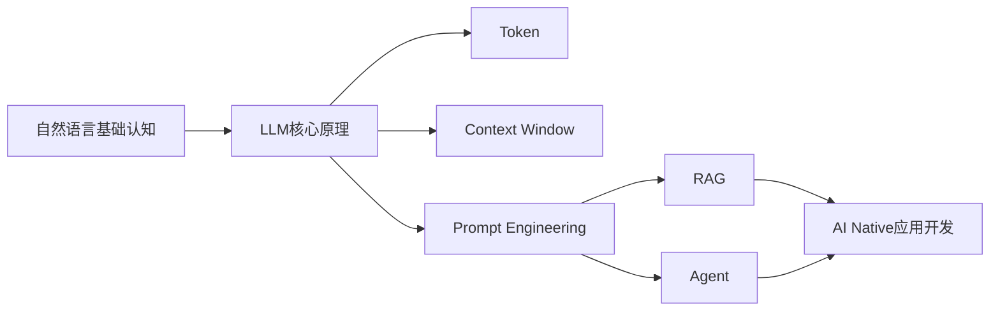
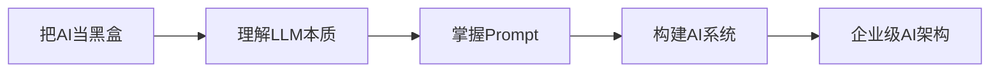
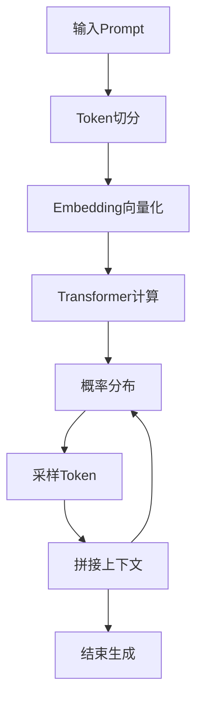
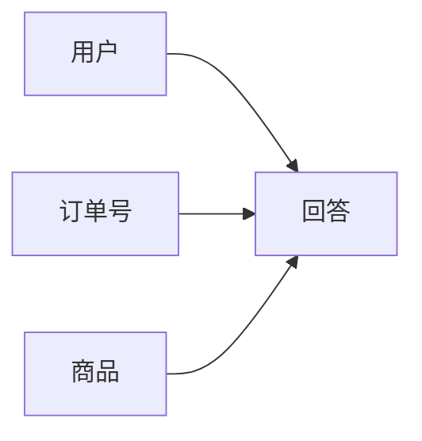
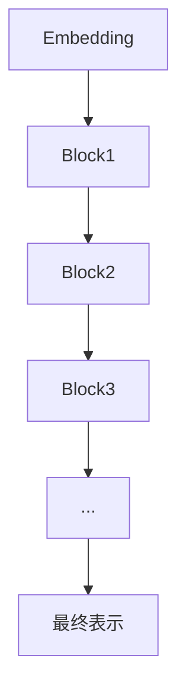
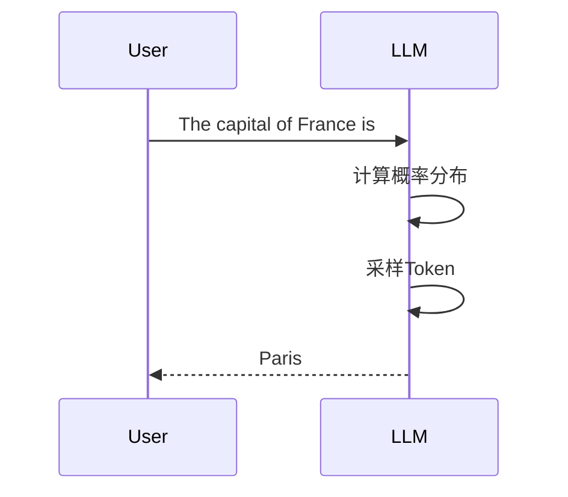
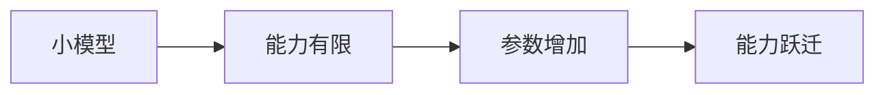
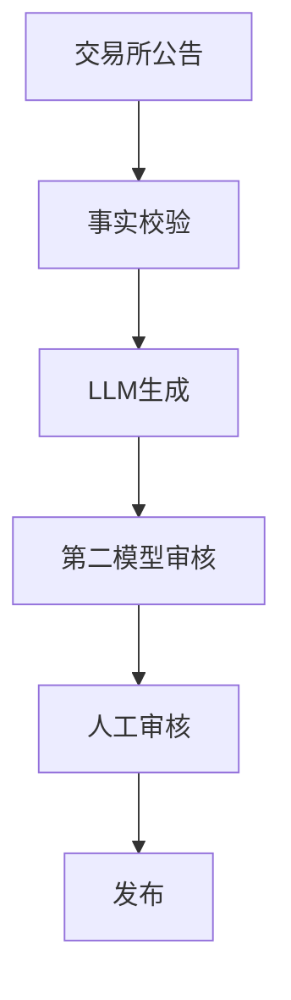
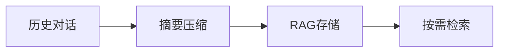
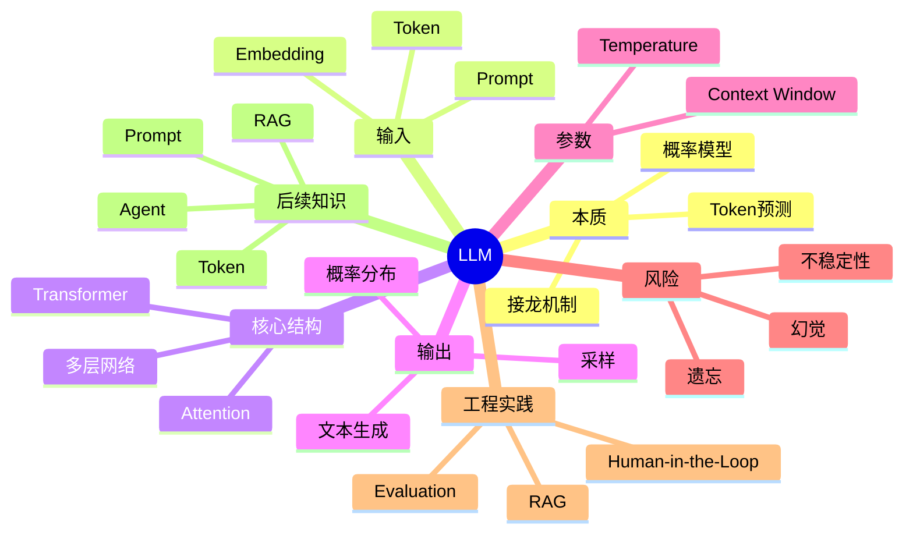

# 第1章：LLM（Large Language Model）——为什么它看起来会思考？ [L0-L1]

## Part 1：为什么要学这个？[认知冲突先行]

你正在调试一个 AI 客服系统。

用户输入：

> 我上周买的商品什么时候发货？

为了让模型掌握上下文，你把完整聊天记录都放进 Prompt。

里面包含：

* 用户姓名
* 订单号
* 商品信息
* 下单时间

模型回答：

> 您的订单 A2024-98172 预计明天发货。

看起来非常合理。

但当你查询数据库时却发现：

**这个订单号根本不存在。**

很多人的第一反应是：

> 它不是已经看到了订单号吗？

> 它为什么没有记住？

> 它是不是理解错了？

问题就在这里。

你已经默认了一个前提：

> LLM 在理解内容。

实际上并不是。

LLM 不知道什么是订单。

不知道什么是发货。

不知道什么是商品。

它真正做的事情只有一个：

> 根据前面的 Token，预测下一个最可能出现的 Token。

订单号出错，不是因为它没认真看。

而是因为它进行了概率补全。

对于模型而言：

正确订单号和错误订单号本质上都是 Token 序列。

如果错误序列在当前概率分布下也看起来合理，它就可能生成出来。

这就是为什么：

* 它会编造事实
* 它会产生幻觉
* 它会自信地说错话

本章要解决的问题：

* LLM 到底是什么？
* 它为什么能回答问题？
* 它为什么会产生幻觉？
* 它为什么看起来像思考？
* 它和真正的人类思维有什么区别？

学完本章后，你会建立整个 AI Native 工程体系最重要的认知基础：

> LLM 是概率预测系统，不是思考系统。

---

## Part 2：学习路径定位

很多人一开始就学习 Prompt Engineering。

学了很多技巧后仍然困惑：

* 为什么 Prompt 有效？
* 为什么模型会遗忘？
* 为什么会胡说八道？

因为没有理解底层原理。

本章位于整个学习路线的起点。



### 当前所处位置



### 前置知识

无。

这是整本书的真正起点。

### 后续知识

学习完本章后，你将继续学习：

* Token
* Context Window
* Prompt Engineering
* RAG
* Agent

这些知识都建立在同一个基础之上：

> LLM 本质是 Token 概率预测器。

---

## Part 3：用生活理解它

想象班里有一个学生。

他把全世界的教材都背下来了。

你问：

> 秦始皇统一六国是哪一年？

他回答：

> 公元前221年。

你再问：

> 牛顿建立了什么体系？

他回答：

> 经典力学体系。

看起来像理解。

实际上未必。

因为他只是见过太多类似内容。

熟悉到知道：

什么句子后面最可能接什么句子。

LLM 与这种学生非常像。

训练阶段：

它阅读海量文本。

推理阶段：

它根据已有内容预测后续内容。

但还有一个关键差异。

如果这个学生遇到一本从没见过的书。

看到一句：

> 未来的量子计算机会……

他未必能背出原文。

他可能会自己补一句：

> 改变整个计算产业。

这并不是记忆。

而是根据经验猜测。

这才更接近 LLM。

它不是死记硬背。

而是在做条件概率预测。

### 类比的边界

这个类比并不完全成立。

因为：

* 人类拥有意识
* 人类拥有目标
* 人类拥有真实世界经验

而 LLM 没有。

它只有统计规律。

所以：

> 看起来像理解 ≠ 真正理解。

---

## Part 4：AI如何映射到传统概念

如果你来自传统软件开发领域。

可以这样建立映射关系。

| 传统软件  | AI世界           |
| ----- | -------------- |
| 函数    | Prompt         |
| 输入参数  | Prompt内容       |
| 返回值   | 模型输出           |
| 数据库查询 | RAG检索          |
| 规则引擎  | Prompt约束       |
| 执行逻辑  | Token生成        |
| 缓存    | Context Window |
| 监控系统  | Evaluation     |
| 代码逻辑  | 模型权重           |

最大的区别：

传统程序：

```text
输入固定
输出固定
```

例如：

```python
print(1 + 1)
```

永远输出：

```text
2
```

而 LLM：

```text
输入固定
输出不一定固定
```

因为它是在概率空间中采样。

不是执行确定性规则。

---

## Part 5：技术本质深讲

### 一句话理解

LLM 本质上是：

> 下一个 Token 概率预测器。

完整流程如下。



### 第一步：Tokenization

模型不直接处理文字。

它处理 Token。

例如：

```text
I love AI
```

可能变成：

```text
[I]
[love]
[AI]
```

中文同样如此。

```text
我喜欢人工智能
```

可能变成：

```text
[我]
[喜欢]
[人工]
[智能]
```

---

### 第二步：Embedding

Token 无法直接进入神经网络。

需要映射成向量。

```text
AI
```

可能被表示为：

```text
[0.23, -0.54, 0.81, ...]
```

这一步称为 Embedding。

---

### 第三步：Attention

Transformer 最重要的创新。

每个 Token 都可以关注其他 Token。



模型通过 Attention 判断：

哪些信息更重要。

---

### 第四步：多层Transformer

一层无法提取复杂语义。

所以需要很多层。



现代模型通常包含数十到上百层 Transformer Block。

---

### 第五步：计算概率分布

例如输入：

```text
The capital of France is
```

模型可能得到：

| Token  | 概率  |
| ------ | --- |
| Paris  | 92% |
| London | 4%  |
| Berlin | 2%  |
| Tokyo  | 1%  |

注意：

模型输出的不是答案。

而是一组概率。

---

### 第六步：采样生成



随后继续预测下一个 Token。

不断重复。

直到结束。

---

### 为什么会出现幻觉？

因为模型没有事实校验机制。

例如：

```text
请告诉我某公司最新营收
```

当训练数据中不存在该信息时。

模型不会自动查询数据库。

它更可能继续生成一个看起来合理的数字。

于是幻觉产生。

---

### 涌现现象

能力增长并不是线性的。



很多研究发现。

当模型规模达到某些阈值后。

会突然出现此前没有的能力。

例如：

* 少样本学习
* 复杂推理
* 代码生成

一个经典现象是：

GPT-3 的 175B 参数版本在少样本推理任务上明显优于 13B 级别模型。

很多能力跃迁常出现在参数规模超过 100B 后。

这类非线性提升现象被称为：

> Emergence（涌现）。

---

## Part 6：动手Demo（可运行代码）

下面用带权重的概率采样模拟 LLM。

```python
import random

transitions = {
    "我": {
        "喜欢": 0.8,
        "讨厌": 0.2
    },
    "喜欢": {
        "AI": 0.7,
        "编程": 0.2,
        "学习": 0.1
    },
    "讨厌": {
        "加班": 1.0
    },
    "AI": {
        "。": 1.0
    },
    "编程": {
        "。": 1.0
    },
    "学习": {
        "。": 1.0
    },
    "加班": {
        "。": 1.0
    }
}

current = "我"
sentence = [current]

while current != "。":
    next_tokens = list(transitions[current].keys())
    probabilities = list(transitions[current].values())

    next_token = random.choices(
        next_tokens,
        weights=probabilities,
        k=1
    )[0]

    sentence.append(next_token)
    current = next_token

print("".join(sentence))
```

### 关键代码说明

* transitions 表示条件概率分布
* random.choices 表示带权重采样
* weights 模拟 Token 概率
* while 模拟逐 Token 生成

### 运行结果

可能出现：

```text
我喜欢AI。
```

也可能出现：

```text
我喜欢编程。
```

或者：

```text
我讨厌加班。
```

其中：

“喜欢AI”出现概率最高。

因为其权重最高。

这比等概率随机更接近真实 LLM。

---

## Part 7：真实项目场景

### AI财经新闻自动生成

某财经媒体尝试利用 LLM 自动生成财报快讯。

业务流程：


上线后出现事故。

原始公告：

```text
净利润同比增长15%
```

模型生成：

```text
营收暴跌80%
```

结果引发市场误解。

紧急下线。

问题根源并不是模型没有看到原文。

而是：

模型进行了概率补全。

它生成了统计上合理但事实错误的内容。

### 改进方案

团队引入三层防御。



核心原则：

* 数据库负责事实
* LLM负责表达
* 人工负责最终审核

最终：

* 事实错误率显著下降
* 逻辑冲突明显减少
* 自动化效率提升

这也是企业级 AI 系统的标准模式。

---

## Part 8：这里容易踩坑

### 坑1：把LLM当数据库

错误做法：

```python
question = "请告诉我某公司2024年Q3营收"
```

直接相信结果。

风险：

模型可能编造数字。

正确做法：

```python
revenue = get_revenue_from_database()

prompt = f"""
营收数据如下：

{revenue}

请生成分析报告。
"""
```

原则：

> 数据来自数据库，语言来自模型。

---

### 坑2：认为Temperature=0绝对稳定

错误认知：

```text
Temperature = 0
=
确定性系统
```

实际上并非如此。

原因包括：

* GPU浮点运算并非严格确定
* 并行计算顺序可能不同
* 不同推理框架的 Softmax 实现存在差异

这些因素会导致概率分布出现极小偏移。

极端情况下：

最终选择的 Token 也可能发生变化。

错误做法：

```python
temperature = 0
```

上线。

不做任何监控。

正确做法：

```python
temperature = 0

# Evaluation
# Regression Test
# Human Review
```

---

### 坑3：认为模型记得所有历史

错误认知：

```text
聊天一年
模型一直记得
```

现实情况：

Context Window 有上限。

超出部分直接被截断。

错误设计：

```text
保存所有历史
直接全部发送
```

正确设计：



---

## Part 9：面试怎么答

### L1：LLM的本质是什么？

回答框架：

* 本质是概率模型
* 输入 Token 序列
* 输出概率分布
* 采样得到下一个 Token
* 重复生成直到结束

一句话总结：

> LLM不是查答案，而是在接龙。

面试官可能追问：

> 为什么同一个问题会得到不同答案？

需要进一步解释 Temperature 与采样机制。

---

### L2：LLM为什么会产生幻觉？

回答框架：

* 没有事实校验机制
* 本质是概率预测
* 缺少知识时仍继续生成
* 长上下文会出现注意力衰减

缓解方案：

* RAG
* Fact Check
* Evaluation
* Human-in-the-Loop

面试官可能追问：

> 如果你的系统不能接受任何幻觉，你会优先选择 RAG 还是微调？

回答重点：

优先选择 RAG。

因为事实更新成本低，可追溯，可审计。

---

### L3：Context Window是什么？

回答框架：

* 单次推理可处理的最大 Token 数
* 超出窗口直接遗忘

工程方案：

* 滑动窗口
* 历史摘要
* RAG检索
* 长期记忆系统

需要平衡：

* 成本
* 延迟
* 准确率

面试官可能追问：

> 百万 Token 窗口出现后，RAG 是否会消失？

回答：

不会。

因为成本、延迟和检索精度问题依然存在。

---

## Part 10：考点速查

### **LLM本质**

预测下一个 Token 的概率模型。

### **Token**

模型处理文本的最小单位。

### **Temperature**

控制采样随机性。

### **Context Window**

模型一次能够看到的最大 Token 数量。

### **Hallucination**

生成看似合理但事实错误的内容。

### **Emergence**

模型规模达到阈值后能力非线性提升。

---

## Part 11：必背金句

**[本质]：LLM预测下一个词，而不是理解这句话。**

**[认知]：看起来像思考，不代表真的在思考。**

**[事实]：事实应该来自数据系统，而不是模型记忆。**

**[工程]：LLM是概率组件，不是确定性函数。**

**[系统]：Evaluation不是可选项，而是生产必需品。**

---

## Part 12：快速参考表

| 概念                | 作用    | 示例             |
| ----------------- | ----- | -------------- |
| LLM               | 文本生成  | GPT、Claude     |
| Token             | 处理单位  | AI             |
| Embedding         | 向量表示  | 1536维          |
| Attention         | 建立关联  | Self-Attention |
| Temperature       | 控制随机性 | 0~2            |
| Context Window    | 上下文容量 | 128K           |
| Hallucination     | 幻觉    | 虚构订单           |
| RAG               | 检索增强  | 向量库            |
| Evaluation        | 质量监控  | 准确率            |
| Human-in-the-Loop | 人工审核  | 审批流程           |

---

## Part 13：思维导图



---

## Part 14：本章小结

LLM 并不会思考，它只是预测下一个最可能出现的 Token。

它之所以表现出惊人的能力，是因为训练过程中学习到了海量文本中的统计规律。

从学习路径来看：

* L0：把 AI 当黑盒
* L1：理解 Token 预测机制
* L2：理解 Prompt 与概率分布
* L3：理解如何构建 AI 系统

---

## Part 15：下一章预告

本章我们解决了一个核心问题：

> LLM 为什么看起来会思考？

答案是：

它没有真正思考。

它只是在预测下一个 Token。

新的问题随之出现：

* Token 到底是什么？
* 一个汉字等于几个 Token？
* 为什么模型收费按 Token 计算？
* 为什么 Context Window 用 Token 衡量？

下一章我们将进入整个大模型世界最基础的计量单位：

**Token——AI 世界里的字节、货币与容量单位。**