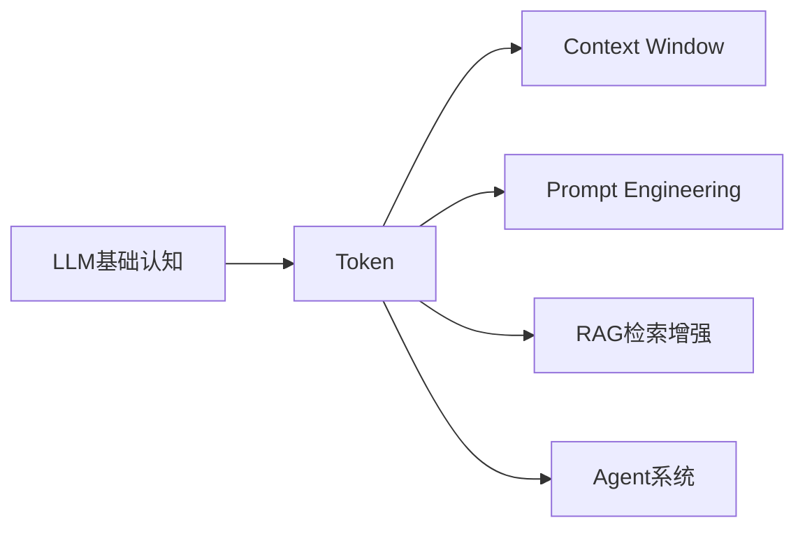
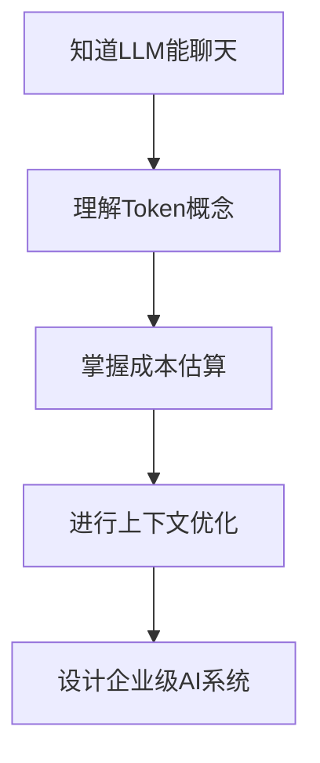
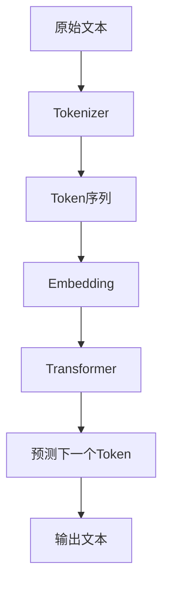
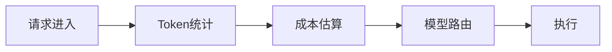
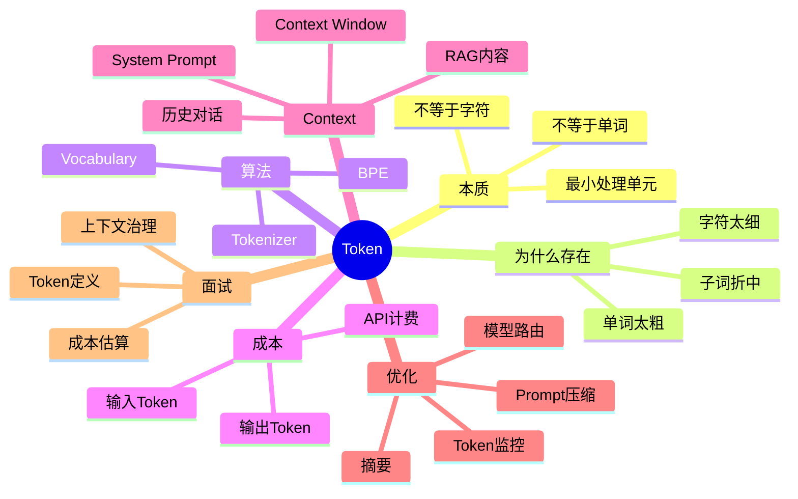

# 第2章：Token——LLM世界里的“计量单位” [L0-L1]

## Part 1：为什么要学这个？[认知冲突先行]

你正在开发一个智能客服系统。

产品经理说：

> “支持多轮对话就行，成本应该不高吧？”

你快速估算：

* 用户问题：1000字
* AI回复：1000字
* 中文约1.5 Token/字

于是得到：

```text
(1000 + 1000) × 1.5
≈ 3000 Token
```

看起来很便宜。

上线前，你决定测一次真实消耗。

结果吓了一跳：

```text
实际消耗：
12000+ Token
```

你开始排查。

发现Prompt里除了用户输入和AI输出，还有：

* System Prompt（系统角色说明）
* 最近5轮历史对话
* 用户画像
* RAG检索结果
* 工具调用返回内容

全部都被送进了模型。

更可怕的是：

```text
System Prompt：
800字
≈ 1200 Token

历史对话：
5轮 × 900 Token
≈ 4500 Token

RAG检索：
2250 Token

用户输入：
1500 Token

模型输出：
2500 Token
```

加起来轻松破万。

此时你才意识到：

> Token不是“用户输入多少字”那么简单。

它是LLM世界里的货币单位。

所有成本计算、上下文窗口规划、Prompt设计、RAG优化，本质上都围绕Token展开。

本章要解决的问题：

* Token到底是什么？
* 为什么不是字符，也不是单词？
* 为什么同样一句话，中英文Token数不同？
* Token和成本是什么关系？
* Context Window为什么用Token计算？

理解Token，是进入LLM工程世界的第一道门。

---

## Part 2：学习路径定位

很多人学完LLM后马上开始写Prompt。

结果发现：

* 成本算不准
* Context Window经常爆掉
* RAG效果越来越差

根本原因：

> 不理解Token。

在知识体系中的位置如下：



学习路径：



前置知识：

* 第1章：LLM

后置知识：

* 第3章：Context Window
* Prompt Engineering
* RAG
* Agent

如果把LLM比作汽车：

```text
LLM = 发动机
Token = 油耗单位
Context Window = 油箱容量
```

不懂油耗，根本谈不上开车。

---

## Part 3：用生活理解它

想象你寄快递。

你认为收费依据是：

```text
书本重量
```

实际上快递公司计算的是：

```text
书本
+包装盒
+胶带
+填充物
+说明单
```

总重量。

Token也是一样。

很多人以为：

```text
Token = 用户说的话
```

实际上：

```text
System Prompt
+历史对话
+RAG内容
+工具结果
+用户输入
+模型输出
```

全部计算Token。

### 类比的边界

这个类比只能帮助理解“计费”。

但Token和重量并不一样：

* 重量是连续值
* Token是离散单位

而且：

```text
hello
```

和

```text
 hello
```

可能是两个不同Token。

所以Token本质上不是字数统计，而是模型词表中的编码单元。

---

## Part 4：AI如何映射到传统概念

如果你来自传统软件开发领域，可以这样理解。

| 传统软件概念   | AI世界对应概念       |
| -------- | -------------- |
| 字节(Byte) | Token          |
| CPU时间    | 推理Token消耗      |
| 内存容量     | Context Window |
| 数据包大小    | Prompt长度       |
| 数据压缩     | Prompt压缩       |
| 流量费用     | Token费用        |
| API调用次数  | Token总量        |

进一步看：

| 问题   | 传统系统  | AI系统           |
| ---- | ----- | -------------- |
| 性能瓶颈 | CPU   | Token长度        |
| 成本瓶颈 | 服务器   | Token消耗        |
| 容量限制 | 内存    | Context Window |
| 优化方向 | 算法复杂度 | Token效率        |

对于AI工程师来说：

```text
传统工程师看CPU

AI工程师看Token
```

这是思维方式的重要转变。

---

## Part 5：技术本质深讲

### 为什么不用字符？

假设一句话：

```text
unbelievable
```

按字符切分：

```text
u
n
b
e
l
i
e
v
a
b
l
e
```

共12个单位。

序列会非常长。

Transformer计算复杂度大约与长度平方相关。

长度翻倍，成本可能增长4倍。

因此字符粒度太细。

---

### 为什么不用完整单词？

如果词表按单词建立：

```text
cat
dog
apple
computer
```

看起来很好。

但现实中会出现：

```text
ChatGPT
DeepSeek
ClaudeCode
Tokenization
MicroserviceArchitecture
```

新词不断产生。

词表会无限膨胀。

模型无法覆盖所有词汇。

---

### Token的核心思想

Token采用折中方案：

```text
字符太小
单词太大

Token刚刚好
```

例如：

```text
unbelievable
```

可能被切分成：

```text
un
believ
able
```

三个Token。

模型既能识别常见结构。

又能组合新词。

---

### BPE（Byte Pair Encoding）

主流模型广泛采用BPE思想。

训练阶段：

```text
a
b
c
```

开始统计。

发现：

```text
th
he
ing
tion
```

频繁出现。

于是不断合并。

最终形成：

```text
词表（Vocabulary）
≈ 50000~100000 Token
```

---

### Token工作流程



例如：

输入：

```text
The capital of France is
```

模型内部可能变成：

```text
["The"," capital"," of"," France"," is"]
```

模型预测：

```text
Paris
```

生成：

```text
The capital of France is Paris
```

注意：

模型预测的不是字符。

也不是句子。

而是：

```text
下一个Token
```

---

### 中文为什么更贵？

经验估算：

```text
英文：
1个词 ≈ 1.3 Token

中文：
1个字 ≈ 1~1.5 Token
```

例如：

```text
人工智能改变世界
```

可能接近：

```text
6~9 Token
```

而英文：

```text
Artificial intelligence changes the world
```

约：

```text
5~7 Token
```

同样表达的信息量。

中文往往消耗更多Token。

---

### 成本计算公式

```text
总成本

=
输入Token × 输入单价

+

输出Token × 输出单价
```

很多模型：

```text
输出价格
>
输入价格
```

因为生成比理解更耗计算资源。

---

## Part 6：动手Demo（可运行代码）

下面演示如何估算Token数量。

```python
import re

text_cn = """
人工智能正在改变软件开发方式。
Prompt、RAG和Agent都是热门方向。
"""

text_en = """
Artificial intelligence is changing software development.
Prompt engineering and RAG are popular topics.
"""

def estimate_cn_tokens(text):
    chars = len(re.sub(r"\s+", "", text))
    return int(chars * 1.5)

def estimate_en_tokens(text):
    words = len(text.split())
    return int(words * 1.3)

cn_tokens = estimate_cn_tokens(text_cn)
en_tokens = estimate_en_tokens(text_en)

print("中文字符数:", len(re.sub(r"\s+", "", text_cn)))
print("中文估算Token:", cn_tokens)

print("英文单词数:", len(text_en.split()))
print("英文估算Token:", en_tokens)

input_tokens = cn_tokens + en_tokens
output_tokens = 500

input_price = 0.001
output_price = 0.003

cost = (
    input_tokens / 1000 * input_price
    + output_tokens / 1000 * output_price
)

print("输入Token:", input_tokens)
print("输出Token:", output_tokens)
print("预计成本($):", round(cost, 6))
```

### 关键代码说明

* `estimate_cn_tokens()`：中文字数×1.5估算
* `estimate_en_tokens()`：英文词数×1.3估算
* `input_tokens`：输入成本
* `output_tokens`：输出成本
* `cost`：模拟API计费

### 运行后你会看到什么

输出类似：

```text
中文字符数: 24
中文估算Token: 36

英文单词数: 11
英文估算Token: 14

输入Token: 50
输出Token: 500

预计成本($): 0.002
```

实际生产环境建议使用：

```text
tiktoken
```

进行精确计算。

---

## Part 7：真实项目场景

### AI编程助手成本失控事件

某科技公司内部推广AI编程工具。

工程师大量使用：

* Claude Code
* GPT
* Agent工具

公司认为：

```text
AI很便宜
```

结果数月后发现：

```text
部分工程师：
每月Token费用
500~2000美元
```

管理层震惊。

调查后发现：

### 问题1：超长Prompt

系统提示词：

```text
架构规范
编码规范
团队约定
安全策略
```

累计：

```text
3500+ Token
```

每次调用都重复发送。

---

### 问题2：历史对话无限增长

Agent不断追加：

```text
历史消息
工具调用结果
日志
```

Prompt越来越大。

---

### 问题3：没人监控Token

团队只看：

```text
调用次数
```

没人看：

```text
Token数量
```

---

### 解决方案

建立Token治理体系。



实施措施：

#### Prompt压缩

```text
3500 Token
↓
1200 Token
```

#### 模型路由

简单任务：

```text
廉价模型
```

复杂任务：

```text
旗舰模型
```

#### Token监控

记录：

```text
输入Token
输出Token
模型名称
调用成本
```

#### 自动告警

超过预算：

```text
降级
限流
阻断
```

最终：

```text
成本下降约88%
```

Token利用率显著提升。

这也是企业级AI系统的标准实践。

---

## Part 8：这里容易踩坑

### 坑1：认为1个汉字=1个Token

错误理解：

```python
text = "人工智能"
tokens = len(text)
print(tokens)
```

正确理解：

```python
estimated_tokens = int(len(text) * 1.5)
```

原因：

* Token不是字
* 中文通常大于1 Token/字

---

### 坑2：把整个文档塞进Prompt

错误做法：

```python
prompt = huge_document
```

可能：

```text
100页文档
全部输入
```

结果：

* 成本暴涨
* Context Window爆掉

正确做法：

```python
prompt = summary + related_chunks
```

只保留相关内容。

---

### 坑3：只统计用户输入

错误估算：

```python
cost = user_input_tokens
```

正确估算：

```python
cost = (
    system_prompt
    + history
    + rag_context
    + user_input
    + output
)
```

原因：

Prompt中的所有Token都收费。

---

## Part 9：面试怎么答

### L1：Token是什么？为什么LLM不用字符或单词？

#### 回答框架

1. Token是模型处理文本的最小单位
2. 字符粒度太细
3. 单词粒度太粗
4. Token是折中方案
5. 常见算法是BPE

核心结论：

```text
字符太长
单词太大
Token最合适
```

---

### L2：如何估算Token数？成本如何计算？

#### 回答框架

经验公式：

```text
中文字数 × 1.5

英文词数 × 1.3
```

成本：

```text
输入Token × 输入单价

+

输出Token × 输出单价
```

补充：

```text
输出Token通常更贵
```

---

### L3：生产环境如何优化Token成本？

#### 回答框架

五个方向：

1. Prompt压缩
2. RAG结果裁剪
3. 对话摘要
4. 限制输出长度
5. 模型路由

Context Window满了怎么办：

```text
滑动窗口
摘要压缩
RAG检索
```

这是标准答案结构。

---

## Part 10：考点速查

### **Token ≠ 字符 ≠ 单词**

Token是模型处理单位，不是文字单位。

---

### **BPE是主流Tokenization算法**

通过高频片段不断合并形成词表。

---

### **Context Window按Token计算**

不是按字数计算。

---

### **API按Token收费**

输入和输出都收费。

---

### **输出Token通常更贵**

生成比理解更耗算力。

---

## Part 11：必背金句

### [原则1]：Token不是字，是模型的积木块

模型看到的是Token序列，不是原始文字。

### [原则2]：字符太细，单词太粗，Token刚刚好

这是Token存在的根本原因。

### [原则3]：Context Window的单位是Token

窗口大小决定模型能看到多少内容。

### [原则4]：Prompt中的每个Token都在花钱

系统提示词和历史对话也收费。

### [原则5]：优化Token本质是在提升信息密度

目标不是最少Token，而是最高价值Token。

---

## Part 12：快速参考表

| 概念                 | 作用      | 示例值            |
| ------------------ | ------- | -------------- |
| Token              | 模型处理单位  | "hello"        |
| Vocabulary         | Token词表 | 50K~100K       |
| BPE                | 分词算法    | GPT系列常见        |
| 中文估算               | 字→Token | 1字≈1~1.5 Token |
| 英文估算               | 词→Token | 1词≈1.3 Token   |
| Context Window     | 上下文容量   | 128K Token     |
| Input Token        | 输入计费    | Prompt部分       |
| Output Token       | 输出计费    | 回复部分           |
| Token Cost         | 成本计算    | 输入+输出          |
| Prompt Compression | 压缩优化    | 减少Token        |

---

## Part 13：思维导图



---

## Part 14：本章小结

你已经知道：

* LLM真正处理的是Token，而不是字符或单词。
* API成本和Context Window都以Token为单位计算。
* Prompt工程、RAG和Agent优化，本质上都离不开Token管理。

成长路径：

```text
L0：
以为Token就是字数

↓

L1：
理解Token是模型处理单位

↓

L2：
能估算成本和窗口容量

↓

L3：
能设计Token优化方案
```

记住本章最重要的一句话：

> Token不是字，是积木块；中文字×1.5，英文词×1.3；输入输出都算钱，输出通常更贵。

---

## Part 15：下一章预告

这一章解决了：

```text
模型如何计算内容长度？
模型如何收费？
为什么Prompt越来越贵？
```

但新的问题出现了：

即使你知道Token数量。

模型究竟能记住多少Token？

如果：

```text
Prompt = 150000 Token
```

而模型窗口只有：

```text
128000 Token
```

会发生什么？

哪些内容会被丢弃？

为什么长对话后模型会“失忆”？

下一章：

# 第3章：Context Window——LLM的记忆桌面

你将理解：

* 什么是上下文窗口
* 为什么模型会遗忘
* 128K到底有多大
* 如何设计长上下文系统
* RAG为什么能突破窗口限制

当你理解Context Window之后，才真正拥有构建AI应用的基础能力。