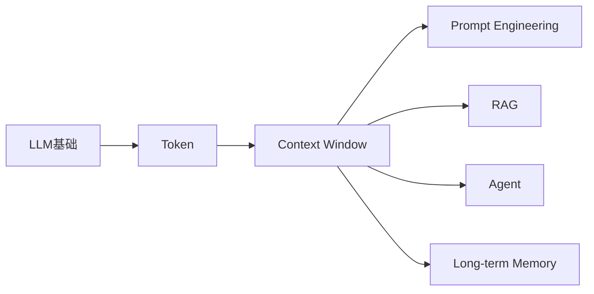
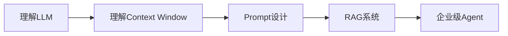
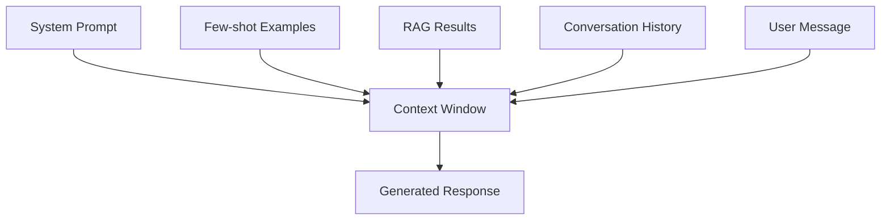
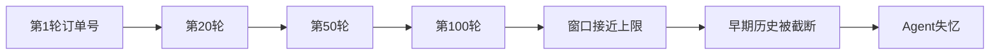
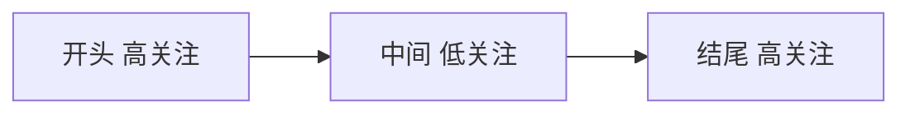
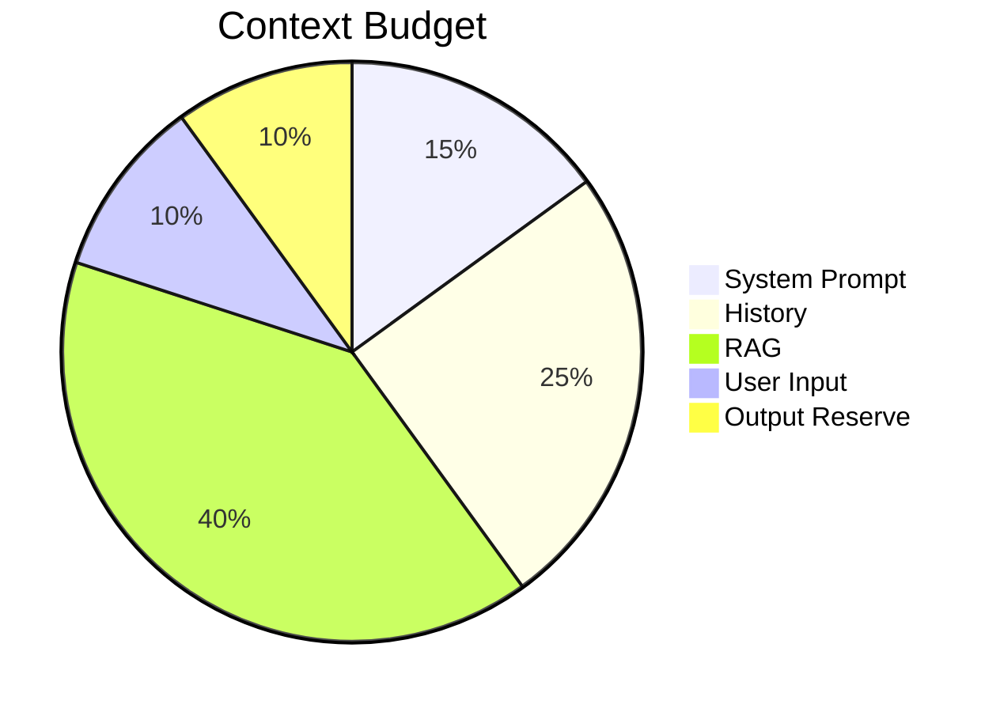
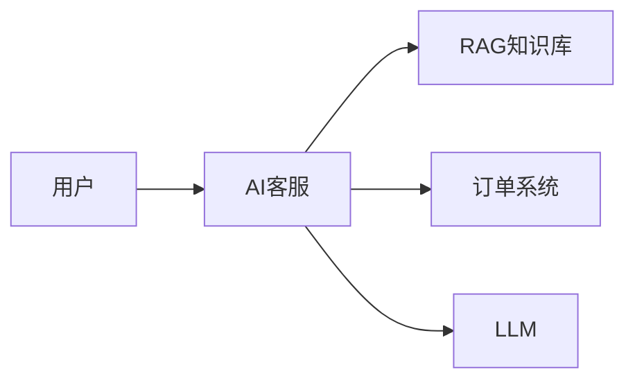
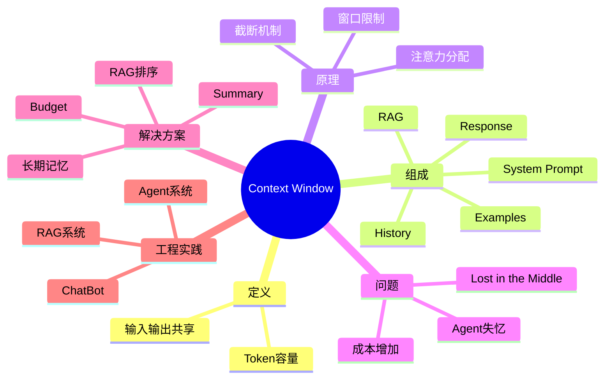

# 第3章：Context Window——大模型真正的“记忆边界” [L0-L1]

## Part 1：为什么要学这个？[认知冲突先行]

你花了一下午时间，把一个拥有200轮历史对话的客服Agent调通了。

测试环境里，它表现得近乎完美。

用户说：

> 我的订单号是 ORD-88421。

Agent记住了。

用户又说：

> 我要退货的是蓝牙耳机。

Agent也记住了。

接下来十几轮、几十轮对话，Agent都能准确引用前面的信息。

于是你信心满满上线。

第二天打开监控平台。

投诉暴涨。

用户评价：

* “AI失忆了”
* “前后矛盾”
* “刚说过的话又忘了”
* “像在和不同的人聊天”

你开始排查：

* API全部200
* 数据库正常
* 向量库正常
* Prompt没改
* 模型版本没变

没有任何异常日志。

但Agent就是突然变笨了。

问题出在哪？

很多人的潜意识里有一个错误假设：

> 对话一直持续，LLM就会一直记住。

事实恰恰相反。

LLM没有持久记忆。

它每次调用时看到的世界，只有当前请求里的内容。

如果某段信息没有进入当前Context Window，那么对于模型来说：

> 它从来没有存在过。

这也是AI系统最容易出现的“静默故障”。

系统不报错。

模型不崩溃。

它只是越来越傻。

本章要解决的问题：

* Context Window到底是什么？
* 为什么它决定了模型的记忆边界？
* 为什么大窗口不一定更好？
* 如何设计Context预算？
* 为什么Agent会“失忆”？

---

## Part 2：学习路径定位

Context Window位于Token与Prompt Engineering之间。

如果不知道Token是什么，就无法理解窗口大小。

如果不理解窗口大小，就无法理解：

* Prompt设计
* RAG设计
* Agent设计
* 长期记忆设计



### 你现在的位置



### 前置知识

* LLM是什么
* Token是什么
* Token如何计费

### 后续知识

学完本章后，你将理解：

* 为什么Prompt会失效
* 为什么RAG不能把所有文档都塞进去
* 为什么Agent会遗忘
* 为什么需要长期记忆系统

---

## Part 3：用生活理解它

把Context Window想象成考试时的桌面。

你可以带很多参考资料。

但考试开始后：

只有放在桌面上的资料能被看到。

桌面外的资料：

* 不可见
* 不可查阅
* 不参与答题

因此：

* 桌面 = Context Window
* 资料 = Prompt
* 历史聊天 = 对话记录
* 检索结果 = RAG内容

桌面越大，能摊开的资料越多。

但桌面太大也会产生新问题：

找关键资料变慢。

### 类比的边界

现实中的人：

* 可以记住过去看过的东西
* 可以主动翻找资料

LLM做不到。

对于LLM来说：

> 当前Context Window就是全部世界。

---

## Part 4：AI如何映射到传统概念

对于传统开发者而言，最容易理解的映射是RAM。

| 传统系统    | AI系统                 |
| ------- | -------------------- |
| SSD/HDD | 向量数据库                |
| RAM     | Context Window       |
| CPU     | LLM推理                |
| 读取文件    | RAG注入                |
| 缓存      | Conversation History |
| OOM     | Context溢出            |

### 为什么更像RAM

| 特性     | 数据库 | Context Window |
| ------ | --- | -------------- |
| 长期保存   | 是   | 否              |
| 跨请求存在  | 是   | 否              |
| 主动查询   | 是   | 否              |
| 需要重新加载 | 否   | 是              |
| 容量严格限制 | 否   | 是              |

因此：

> Context Window是运行内存，不是永久存储。

---

## Part 5：技术本质深讲

### Context Window是什么

Context Window表示：

> 模型单次推理能够处理的最大Token总量。

注意：

很多新人误以为它只计算输入。

实际上：

```text
Context Window
=
输入Token
+
输出Token
```

例如：

```text
模型窗口：128K

输入：100K

输出：20K

剩余预留：8K
```

如果总量超过限制：

模型无法继续生成。

### Context由哪些部分组成



### 一次请求的真实组成

```text
System Prompt      1000
Examples           1000
RAG Docs           3000
History            4000
User Input          500
-----------------------
Input Total        9500

Output             1500

Final Total       11000
```

### 常见窗口规模

截至2026年初，主流模型常见窗口如下。

注意：

模型厂商会持续升级产品。

窗口大小会随版本变化。

实际项目必须查阅官方文档。

| 模型         | 常见窗口 |
| ---------- | ---: |
| GPT-3.5    |  16K |
| GPT-4o     | 128K |
| Claude 3.5 | 200K |
| Gemini 1.5 |   1M |

### 为什么会失忆



系统通常采用：

* 滑动窗口
* 历史裁剪

因此最早的信息会被删除。

订单号没了。

用户身份没了。

Agent当然会忘记。

### Lost in the Middle

很多人认为：

窗口越大越好。

事实并不完全如此。

模型天然更关注：

* 开头
* 结尾

而对中间部分关注较弱。



这就是：

> Lost in the Middle

信息明明在上下文中。

模型却没有充分利用。

### Context Budget

优秀工程师不会无限堆Token。

而是做预算管理。



核心思想：

每个Token都占成本。

每个Token都应该创造价值。

---

## Part 6：动手Demo（可运行代码）

下面用一个简化版本模拟Context Window。

注意：

这里为了便于理解，使用空格分词近似模拟Token。

真实生产环境应使用模型官方Tokenizer，例如tiktoken或模型提供的Tokenizer进行准确统计。

```python
from collections import deque

MAX_TOKENS = 20

history = deque()

def token_count(text):
    # 简化模拟
    # 真实场景应使用官方tokenizer
    return len(text.split())

def current_tokens():
    return sum(token_count(msg) for msg in history)

def add_message(message):
    history.append(message)

    while current_tokens() > MAX_TOKENS:
        history.popleft()

messages = [
    "order ORD88421",
    "product bluetooth headset",
    "request refund",
    "device has noise",
    "customer service confirmed",
    "ask refund schedule",
    "ask logistics status",
    "ask compensation policy"
]

for msg in messages:
    add_message(msg)

print("Current Context:")
for item in history:
    print(item)

print("Token Count:", current_tokens())
```

### 关键代码说明

* MAX_TOKENS模拟窗口大小
* deque模拟历史消息
* token_count模拟Token统计
* popleft模拟历史裁剪

### 运行结果

你会发现：

最早进入窗口的信息会消失。

这就是Agent失忆的本质。

---

## Part 7：真实项目场景

### 背景

某头部电商平台上线AI客服。

负责：

* 退换货
* 优惠券补偿
* 物流查询
* 售后咨询

系统结构：



### 出现的问题

第1轮：

```text
我要退蓝牙耳机
订单号 ORD-88421
```

Agent正确响应。

第8轮：

```text
充电仓划痕算质量问题吗？
```

Agent回复：

```text
请提供订单号。
```

用户直接崩溃。

### 排查结果

窗口占用：

```text
7600 / 8000 Tokens
```

关键约束：

```text
禁止承诺现金补偿
```

距离当前问题超过5000 Token。

模型几乎无法有效关注。

### 解决方案

#### Token预算

```text
System Prompt   800
History        1500
RAG            2000
Output         1000
```

#### 历史摘要

```text
订单号：ORD-88421
商品：蓝牙耳机
诉求：退货
状态：审核中
```

1000 Token摘要替代5000 Token历史。

#### 规则前置

把最关键规则放在Prompt开头。

不要埋在中间。

### 最终效果

| 指标  |    优化前 |    优化后 |
| --- | -----: | -----: |
| 准确率 |    62% |    91% |
| 投诉率 |    基准值 |  下降54% |
| 成本  | 0.38美元 | 0.12美元 |

---

## Part 8：这里容易踩坑

### 坑1：无限追加历史

错误：

```python
history.append(user_message)
prompt = "\n".join(history)
```

问题：

历史无限增长。

最终窗口溢出。

正确：

```python
MAX_HISTORY = 10

history.append(user_message)

if len(history) > MAX_HISTORY:
    history = history[-MAX_HISTORY:]
```

---

### 坑2：把所有文档塞进去

错误：

```python
context = retrieved_docs
```

正确：

```python
context = sorted(
    retrieved_docs,
    key=lambda x: x["score"],
    reverse=True
)[:3]
```

保留最相关内容。

---

### 坑3：重要规则放在中间

错误：

```text
说明1
说明2
说明3
...
禁止现金补偿
...
说明100
```

正确：

```text
禁止现金补偿

说明1
说明2
说明3
```

原因：

模型首尾注意力更强。

---

## Part 9：面试怎么答

### L1：什么是Context Window？它和记忆有什么关系？

#### 回答框架

* 单次推理最大Token容量
* 输入输出共享窗口
* 不是持久记忆
* 超出窗口完全不可见
* 128K Token大约可容纳数万到十万级文本内容
* 中文通常约对应6万～10万汉字，但会因Tokenizer不同而变化

### L2：Agent跑几十轮后变傻怎么办？

#### 回答框架

排查：

1. Context使用率
2. 截断策略
3. Lost in the Middle

优化：

* Token预算
* 历史压缩
* RAG精简
* 重要信息前置

### L3：换200K窗口模型能解决吗？

#### 回答框架

不能从根本解决。

原因：

* 成本上涨
* 中间内容仍可能被忽略
* 窗口仍然有限
* 上下文治理问题依旧存在

正确思路：

```text
预算
+
压缩
+
检索
+
长期记忆
```

---

## Part 10：考点速查

**Context Window**

单次推理最大Token容量。

**输入输出共享**

输出越长，输入空间越少。

**LLM无持久记忆**

当前窗口外的信息不可见。

**Lost in the Middle**

中间内容容易被忽略。

**Context Budget**

为不同模块分配Token预算。

---

## Part 11：必背金句

* 【记忆边界】：Context Window决定模型能看到什么。
* 【窗口外不存在】：超出窗口的信息不可访问。
* 【输入输出共享】：输出占用窗口空间。
* 【大窗口非万能】：注意力依然有限。
* 【Token是预算】：每个Token都对应成本。

---

## Part 12：快速参考表

| 概念                 | 作用   | 示例值   |
| ------------------ | ---- | ----- |
| Context Window     | 推理容量 | 128K  |
| System Prompt      | 规则约束 | 800   |
| History            | 历史对话 | 1500  |
| RAG Results        | 知识注入 | 2000  |
| Output Reserve     | 输出预留 | 1000  |
| Lost in the Middle | 中间遗忘 | 常见问题  |
| History Summary    | 历史压缩 | 1000  |
| Long-term Memory   | 长期记忆 | 向量数据库 |

---

## Part 13：思维导图



---

## Part 14：本章小结

Context Window决定了模型单次推理能够看到多少信息。

LLM没有持久记忆，窗口之外的信息等于不存在。

成长路径：

```text
L0 认识窗口限制

↓

L1 理解输入输出共享

↓

L2 学会Token预算

↓

L3 设计长期记忆体系
```

牢记一句话：

> Context Window是桌面，不是硬盘。

---

## Part 15：下一章预告

本章你已经理解：

* Context Window是什么
* 为什么Agent会失忆
* Lost in the Middle是什么
* 如何做Context预算

但新的问题出现了。

窗口为什么按Token计算？

同样长度的文本为什么Token数量不同？

为什么优化Prompt经常从Token开始？

答案指向一个更底层的问题：

> 模型究竟是如何阅读文本的？

下一章：

# 第4章：Tokenizer——大模型的阅读器

当你真正理解Tokenizer之后，你会发现：

Prompt设计、成本优化、Context管理、RAG切块策略，全部建立在Tokenizer之上。