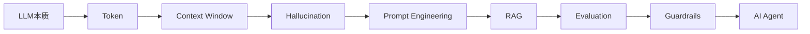
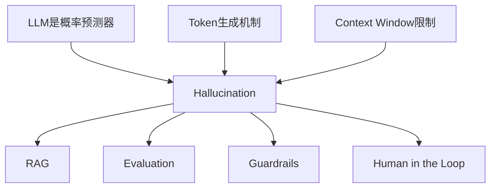
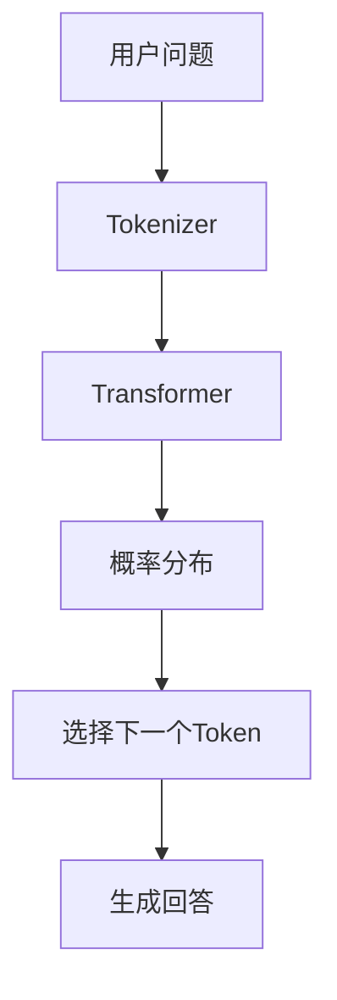
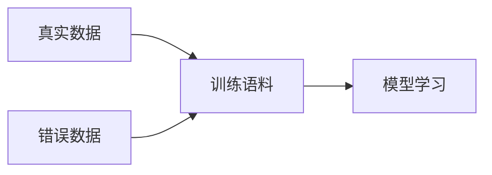
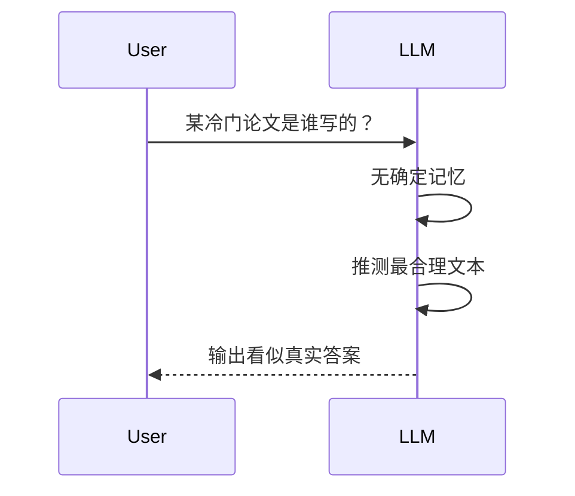
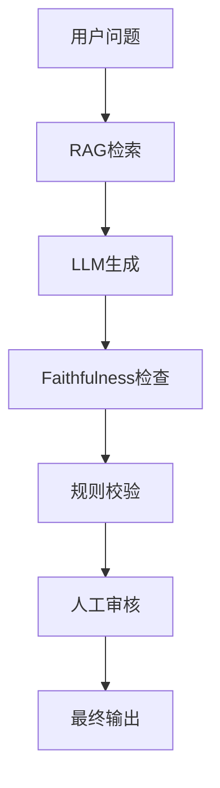
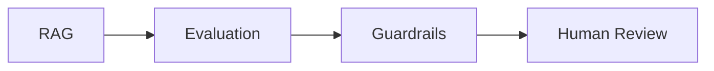
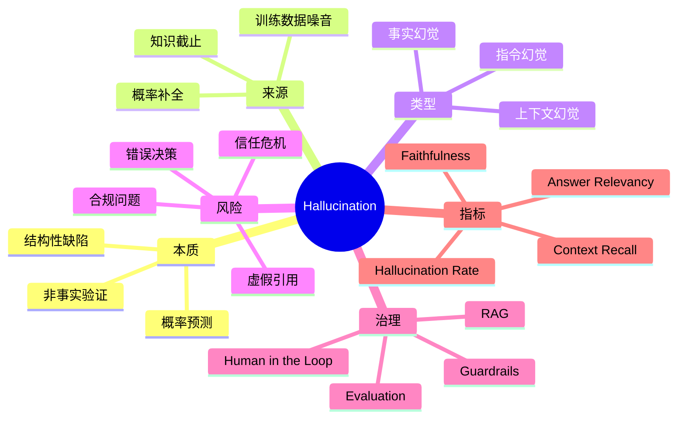

# 第4章：Hallucination（幻觉）[L0-L1]

## Part 1：为什么要学这个？[认知冲突先行]

你用LLM生成了一份技术周报。

周报里有这样一句话：

> 根据 Gartner 2025 年 Q3 报告，AI Native 工程效率提升 320%。

数字很漂亮。

论证很完整。

甚至还附带了报告编号。

于是你放心地发到了团队群。

半小时后，技术VP在群里@你：

> 这个数据来源是哪？发一下原始报告链接。

你打开Gartner官网开始搜索。

10分钟过去了。

30分钟过去了。

1小时过去了。

你突然发现一个恐怖的事实：

这份报告根本不存在。

标题是假的。

作者是假的。

数据是假的。

连报告编号都是假的。

全部都是LLM编出来的。

最让人不安的不是它编了。

而是：

**它编得太像真的了。**

很多初学者都有一个错误认知：

> 回答越详细，越可信。
> 回答越流畅，越准确。
> 回答越自信，越说明模型知道答案。

事实恰恰相反。

LLM根本不关心真假。

它只关心：

> 下一个Token出现什么最像人类写出来的文本。

这就是幻觉（Hallucination）。

本章要解决三个核心问题：

1. 幻觉到底是什么？
2. 为什么LLM一定会产生幻觉？
3. 工程师应该如何管理幻觉？

当你学完本章后，你会明白：

> 幻觉不是Bug。
>
> 幻觉是LLM与生俱来的结构性特征。

---

## Part 2：学习路径定位

### 你现在处于哪里

前面三章我们已经学习：

* LLM是什么
* Token是什么
* Context Window是什么

这一章开始进入：

> AI系统为什么不可靠

这是AI工程实践的起点。

因为所有后面的：

* Prompt Engineering
* RAG
* Evaluation
* Guardrails
* Agent

本质上都在解决同一个问题：

> 如何管理幻觉。

### 学习路径图



### 前置与后置知识



---

## Part 3：用生活理解它

想象一个学生。

他读过很多书。

历史、文学、科技、金融。

你问什么，他都能回答。

但有一个问题：

当他记不清某个细节时。

他不会说：

> 我不知道。

而会根据记忆碎片补全一个故事。

而且补得特别合理。

听起来像真的。

细节也很多。

情节还自洽。

这就是幻觉。

LLM也是如此。

它不会主动区分：

* 我知道
* 我猜测

它只会继续生成最合理的句子。

### 类比的边界

这个类比并不完全准确。

人类编故事时通常知道自己在猜。

LLM并不知道。

它没有“知道自己不知道”的能力。

它只是持续预测下一个Token。

所以幻觉并不是撒谎。

而是一种统计学副作用。

---

## Part 4：AI如何映射到传统概念

很多传统工程师会问：

> 幻觉在传统软件里对应什么？

答案是：

没有完全对应物。

因为传统程序不会“猜”。

### 对比表

| 传统软件      | AI系统       |
| --------- | ---------- |
| 确定性执行     | 概率性生成      |
| 输入相同输出固定  | 输入相同可能输出不同 |
| 找不到数据返回错误 | 找不到数据可能编造  |
| 异常可定位     | 幻觉难定位      |
| 逻辑错误      | 统计错误       |
| Bug修复后消失  | 幻觉无法彻底消失   |

### 一个典型例子

传统系统：

```python
user = db.find_user(100)

if user is None:
    print("Not Found")
```

数据库没数据。

返回空。

结束。

LLM：

```text
问题：
请介绍用户100的信息

真实情况：
没有数据

LLM：
用户100是一位资深工程师...
```

传统软件选择报错。

LLM选择补全。

这就是根本差异。

---

## Part 5：技术本质深讲

### 幻觉的本质

很多人以为：

> 幻觉是模型偶尔犯错。

实际上：

> 幻觉是模型正常工作时产生的副作用。

因为模型优化目标从来不是：

```text
事实正确率最大化
```

而是：

```text
下一个Token预测准确率最大化
```

### 工作过程



模型并不会执行：

```text
查询数据库
验证事实
检查引用
确认真实性
```

它只会执行：

```text
预测最可能出现的词
```

### 幻觉产生的三个来源

#### 来源1：训练数据噪音

训练数据本身就包含错误。

例如：

```text
论坛谣言
错误博客
过期内容
伪科学文章
```

模型会一起学习。



#### 来源2：知识截止

训练结束后。

世界还在变化。

例如：

```text
2026年的新法规
2026年的新论文
2026年的新产品
```

模型没有见过。

但仍然会回答。

于是开始猜。


#### 来源3：概率补全机制

最核心的原因。

当模型不确定时：

```text
不会停止
不会沉默
不会说不知道
```

而是继续生成。



### 幻觉三种类型

#### 1. 事实幻觉

编造不存在的信息。

例如：

```text
不存在的论文
不存在的作者
不存在的数据
不存在的公司
```

#### 2. 指令幻觉

忽略Prompt要求。

用户：

```text
只回答是或否
```

模型：

```text
好的，我来详细解释...
```

#### 3. 上下文幻觉

RAG场景最常见。

文档：

```text
退款周期为7天
```

模型回答：

```text
退款周期通常为15天
```

模型忽略了上下文。

使用了自己的“记忆”。

### 为什么自信不等于正确

很多人会被这种回答骗到：

```text
作者：
John Smith

期刊：
Nature AI

DOI：
10.xxxx/xxxx
```

因为细节很多。

但细节只是语言模式。

不是事实验证。

记住一句话：

> LLM输出概率高，不代表事实概率高。

---

## Part 6：动手Demo（可运行代码）

下面演示一个极简版“幻觉模拟器”。

```python
import random

knowledge_base = {
    "Python作者": "Guido van Rossum",
    "Linux作者": "Linus Torvalds",
    "Java作者": "James Gosling"
}

def llm_like_answer(question):
    if question in knowledge_base:
        return knowledge_base[question]

    fake_names = [
        "John Smith",
        "David Brown",
        "Michael Wilson",
        "Robert Taylor"
    ]

    fake_titles = [
        "高级计算理论研究",
        "现代AI系统设计",
        "下一代智能架构",
        "深度推理框架"
    ]

    name = random.choice(fake_names)
    title = random.choice(fake_titles)

    return (
        f"根据相关研究，"
        f"{title}由{name}提出。"
    )

questions = [
    "Python作者",
    "Linux作者",
    "量子AI作者"
]

for q in questions:
    print(f"问题: {q}")
    print(f"回答: {llm_like_answer(q)}")
    print("-" * 40)
```

### 关键代码解析

```python
if question in knowledge_base:
```

知识存在。

直接回答。

```python
return knowledge_base[question]
```

返回真实信息。

```python
name = random.choice(fake_names)
```

知识不存在。

开始随机补全。

```python
return f"根据相关研究..."
```

输出一个看起来合理的答案。

### 运行后你会看到什么

类似结果：

```text
问题: Python作者
回答: Guido van Rossum

问题: Linux作者
回答: Linus Torvalds

问题: 量子AI作者
回答: 根据相关研究，现代AI系统设计由David Brown提出。
```

最后一句就是幻觉。

它看起来合理。

实际上完全是编造。

---

## Part 7：真实项目场景

### 顶级学术会议里的幻觉

很多人以为：

> 幻觉只会骗普通用户。

现实比这更可怕。

2025年，全球顶级AI会议之一的论文审核过程中发现：

大量论文引用了不存在的参考文献。

这些虚假引用具备几个特点：

* 标题合理
* 作者合理
* 期刊合理
* 格式规范

甚至领域专家都没有第一时间发现。

### 为什么会发生

作者使用LLM辅助写作。

流程如下：


问题在于：

LLM生成的引用太像真的。

### 企业RAG系统案例

某金融客服系统上线RAG后：

```text
上线前：
幻觉率 27%

上线后：
幻觉率 4.2%
```

团队非常兴奋。

但后来发现：

剩余4.2%的错误回答依然涉及：

```text
利率说明
合规条款
产品规则
```

这些错误足以造成业务风险。

### 正确架构



这也是现代AI系统的标准思路：

> 不相信模型，而是验证模型。

---

## Part 8：这里容易踩坑

### 坑1：认为RAG能解决所有幻觉

错误代码：

```python
answer = rag_chain.invoke(question)

return answer
```

直接展示。

没有验证。

正确代码：

```python
answer = rag_chain.invoke(question)

score = faithfulness_check(answer)

if score < 0.8:
    return "需要人工审核"

return answer
```

为什么错？

因为RAG只能减少知识缺失问题。

不能解决推理错误。

---

### 坑2：相信Prompt万能

错误写法：

```text
请绝对不要产生幻觉。
请保证100%正确。
```

正确认知：

```text
Prompt减少风险
Evaluation发现风险
Guardrails拦截风险
```

为什么错？

因为模型架构没有改变。

只是提示变了。

---

### 坑3：把流畅度当准确度

错误逻辑：

```python
if len(answer) > 500:
    trust = True
```

正确逻辑：

```python
if has_reference(answer):
    verify_reference()
```

为什么错？

幻觉往往比真实答案更流畅。

因为编造不受事实约束。

---

## Part 9：面试怎么答

### L1问题

#### 什么是LLM幻觉？为什么会产生？

回答框架：

* 幻觉是事实错误但高置信度输出
* 本质是概率预测而非事实查询
* 来源包括：

  * 训练数据噪音
  * 知识截止
  * 概率补全机制

---

### L2问题

#### RAG能解决所有幻觉吗？

回答框架：

* 不能
* RAG减少知识型幻觉
* 无法解决推理型幻觉
* 无法解决指令型幻觉
* 必须结合Evaluation与Guardrails

---

### L3问题

#### 设计生产级RAG系统的幻觉监控方案

回答框架：

监控维度：

```text
Faithfulness
Answer Relevancy
Context Recall
Hallucination Rate
Human Review Rate
```

治理体系：



核心思想：

> 从“避免错误”转向“发现错误”。

---

## Part 10：考点速查

* **幻觉本质**

  预测最可能Token，不是预测真实事实。

* **事实幻觉**

  编造不存在的数据、人物、论文。

* **指令幻觉**

  忽略Prompt要求。

* **上下文幻觉**

  回答与提供资料矛盾。

* **Faithfulness**

  衡量回答是否忠实于上下文。

---

## Part 11：必背金句

* **结构性特征**：幻觉不是Bug，而是LLM的天然属性。
* **概率不等于事实**：最可能出现的Token不等于最真实的信息。
* **流畅不等于准确**：回答越像真话，越需要验证。
* **RAG不是银弹**：RAG减少幻觉，但无法消灭幻觉。
* **信流畅，验事实**：相信表达质量，验证事实内容。

---

## Part 12：快速参考表

| 概念                        | 作用      | 示例值         |
| ------------------------- | ------- | ----------- |
| Hallucination             | 事实错误输出  | 虚构论文        |
| Fact Hallucination        | 事实编造    | 不存在作者       |
| Instruction Hallucination | 忽略指令    | 要求JSON却输出文本 |
| Context Hallucination     | 违背上下文   | 文档写7天却回答15天 |
| RAG                       | 减少知识型幻觉 | 企业知识库问答     |
| Faithfulness              | 检测忠实度   | 0.92        |
| Human-in-the-Loop         | 人工复核    | 法律审核        |
| Guardrails                | 规则约束    | 敏感内容拦截      |
| Evaluation                | 持续评估    | 幻觉率监控       |

---

## Part 13：思维导图



---

## Part 14：本章小结

LLM并不追求真相，它追求的是生成最像人类文本的Token序列。

幻觉不是偶发错误，而是由训练数据、知识截止和概率补全机制共同决定的结构性特征。

从L0到L1的关键成长，不是学会让模型永不犯错，而是接受幻觉无法根治，并学会通过RAG、Evaluation、Guardrails和Human-in-the-Loop进行系统化管理。

---

## Part 15：下一章预告

这一章你理解了一个关键现实：

> LLM会编造内容，而且无法彻底消除。

问题来了。

如果模型不知道某个事实。

我们能不能不给它猜的机会？

能不能在回答前，先去查资料？

能不能把企业知识库实时接入模型？

这正是下一章要解决的问题。

下一章，我们将进入：

**Prompt Engineering（提示工程）**

你会看到：

为什么同一个模型，换一个Prompt，输出质量可能相差10倍以上；

为什么提示词能减少部分幻觉；

以及AI Native工程师如何通过结构化Prompt，把概率机器变成更可靠的生产工具。