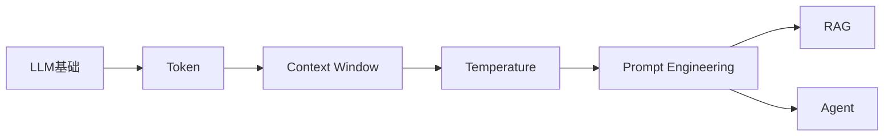
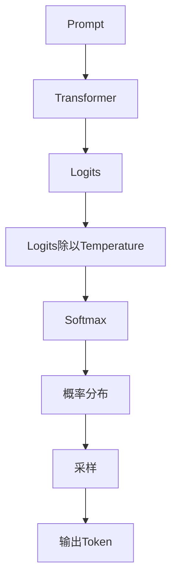
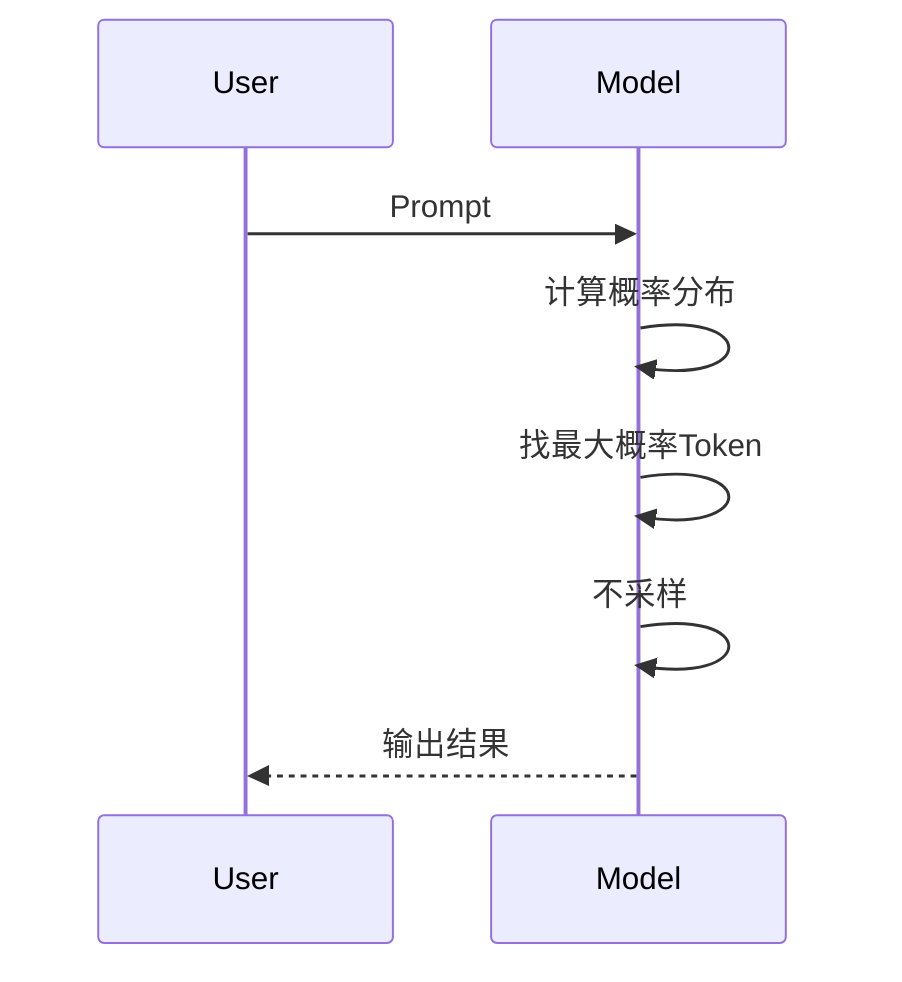
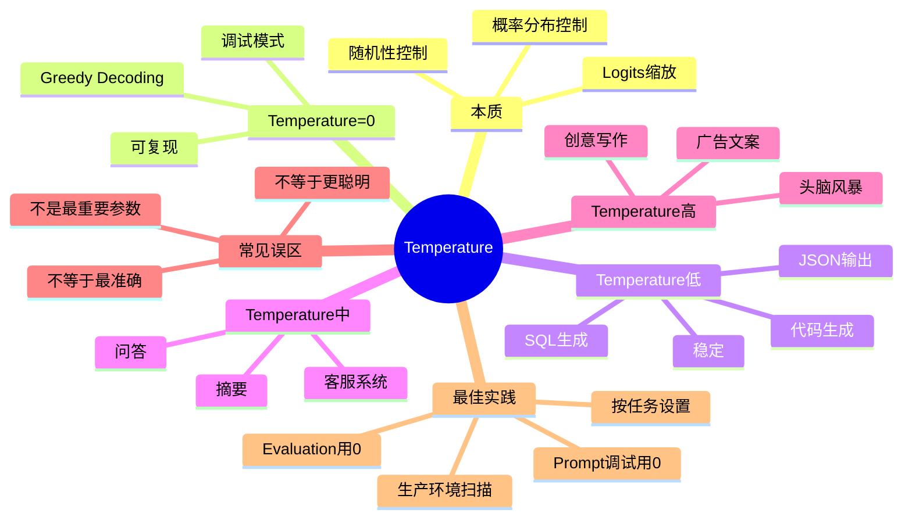

# 第5章：Temperature——为什么同一个问题，模型每次回答都不一样？ [L0-L1]

## Part 1：为什么要学这个？[认知冲突先行]

你正在调试一个用于生成 SQL 的 Prompt。

为了确保每次修改 Prompt 后都能准确对比效果，你把 Temperature 设置成了 0。

你心里想：

> Temperature=0，不就是确定性模式吗？
>
> 那我每次运行结果肯定完全一样。

结果很快让你傻眼了。

同一个 Prompt：

```text
根据订单表生成统计最近30天销售额的SQL
```

你连续运行 10 次。

得到的结果却出现了不同版本：

```sql
SELECT SUM(amount)
FROM orders
WHERE created_at >= NOW() - INTERVAL 30 DAY;
```

还有：

```sql
SELECT SUM(amount)
FROM orders
WHERE created_at > CURRENT_DATE - INTERVAL 30 DAY;
```

甚至：

```sql
SELECT SUM(amount)
FROM orders
WHERE created_at >= NOW() - INTERVAL 30 DAY
LIMIT 1;
```

于是很多人开始得出错误结论：

> Temperature=0 根本没用。

或者：

> Temperature=0 不保证正确。

甚至：

> Temperature 只是营销概念。

问题来了。

Temperature 到底控制什么？

为什么它能影响输出？

为什么 Temperature=0 不等于正确？

为什么代码生成要低温，而创意写作要高温？

这一章解决的就是：

**LLM 输出中的“随机性”到底来自哪里，以及 Temperature 如何控制这种随机性。**

---

## Part 2：学习路径定位

很多初学者学完 Token 和 Context Window 后，会立即进入 Prompt Engineering。

但实际上中间还缺一块重要拼图：

**模型是如何从概率分布中选出下一个 Token 的。**

Temperature 就是这块拼图。

学习路径如下：



前置知识：

* LLM是什么
* Token是什么
* 模型逐Token生成机制

后置知识：

* Top-p
* Top-k
* Prompt Engineering
* Evaluation
* RAG系统调优

你现在的位置：

```text
L0：知道模型会输出答案

↓

L1：理解模型如何决定输出哪个答案
```

---

## Part 3：用生活理解它

想象你每天中午点外卖。

附近有很多餐厅。

其中：

```text
老王牛肉面    50%
川味小炒      25%
日式拉面      15%
韩式拌饭      10%
```

这就是模型当前的概率分布。

如果：

```text
Temperature = 0
```

你永远选概率最高的：

```text
老王牛肉面
```

天天一样。

稳定。

可预测。

但有点无聊。

如果：

```text
Temperature = 0.7
```

你大多数时候选牛肉面。

偶尔尝试川菜。

变化开始出现。

如果：

```text
Temperature = 1.5
```

你闭着眼随机点。

有可能发现神店。

也有可能踩雷。

这就是 Temperature 的本质：

**控制你愿意冒多大风险去尝试低概率选项。**

### 类比的边界

现实中的人会主动思考。

而模型不会。

模型没有：

* 喜好
* 情绪
* 灵感

Temperature 并不是让模型更有创造力。

它只是：

**提高低概率 Token 被抽中的机会。**

---

## Part 4：AI如何映射到传统概念

如果你有传统软件开发经验，可以这样理解。

| 传统软件世界      | AI世界        |
| ----------- | ----------- |
| if/else固定逻辑 | 概率采样        |
| 确定性算法       | 随机生成        |
| 排序后取第一      | 按概率抽样       |
| 随机数种子       | Temperature |
| 配置参数        | 生成超参数       |
| 固定返回值       | 动态生成内容      |

传统程序：

```python
if score > 90:
    return "A"
```

永远一样。

而 LLM：

```text
Paris: 90%
London: 5%
Berlin: 5%
```

可能输出：

```text
Paris
```

也可能输出别的。

Temperature 决定：

**这个抽奖过程有多保守。**

---

## Part 5：技术本质深讲

很多人以为：

```text
Temperature改变Token排名
```

其实不是。

Temperature 改变的是：

```text
概率分布的陡峭程度
```

核心流程：



### 第一步：模型产生Logits

假设模型预测：

| Token  | Logit |
| ------ | ----- |
| Paris  | 10    |
| London | 8     |
| Berlin | 7     |

这里还不是概率。

只是原始分数。

---

### 第二步：Temperature缩放

公式：

```text
new_logit = logit / Temperature
```

假设：

```text
Temperature = 0.5
```

得到：

| Token  | 新Logit |
| ------ | ------ |
| Paris  | 20     |
| London | 16     |
| Berlin | 14     |

差距被放大。

---

假设：

```text
Temperature = 2
```

得到：

| Token  | 新Logit |
| ------ | ------ |
| Paris  | 5      |
| London | 4      |
| Berlin | 3.5    |

差距缩小。

---

### 第三步：Softmax转换概率

低温：

```text
Paris 95%
London 3%
Berlin 2%
```

高温：

```text
Paris 45%
London 30%
Berlin 25%
```

概率开始接近。

---

### 第四步：采样

此时模型开始抽奖。

低温：

```text
基本抽到Paris
```

高温：

```text
三个都有可能
```

---

### Temperature=0发生什么？

严格数学上：

```text
除以0
```

无法计算。

实际实现中：

```text
Temperature=0
```

通常表示：

```text
直接选择概率最高Token
```

即：

```text
Greedy Decoding
```

流程：



因此：

Temperature=0 本质上不是采样。

而是：

```text
永远选第一名
```

---

### 一个重要误区

很多人认为：

```text
Temperature=0 = 最准确
```

错。

正确理解：

```text
Temperature=0 = 最稳定
```

稳定 ≠ 正确

例如：

```text
法国首都是？

Paris 55%
London 30%
Berlin 15%
```

Temperature=0：

```text
Paris
```

正确。

但如果模型知识本身错了：

```text
Paris 40%
London 45%
Berlin 15%
```

Temperature=0：

```text
London
```

依然稳定输出错误答案。

---

## Part 6：动手Demo（可运行代码）

下面用 Python 模拟 Temperature 对概率分布的影响。

```python
import math
import random

logits = [10, 8, 7]
tokens = ["Paris", "London", "Berlin"]

def softmax(values):
    exps = [math.exp(v) for v in values]
    total = sum(exps)
    return [e / total for e in exps]

def apply_temperature(logits, temperature):
    scaled = [x / temperature for x in logits]
    return softmax(scaled)

for t in [0.5, 1.0, 2.0]:
    probs = apply_temperature(logits, t)

    print(f"\nTemperature={t}")

    for token, prob in zip(tokens, probs):
        print(f"{token}: {prob:.4f}")

    samples = [
        random.choices(tokens, weights=probs)[0]
        for _ in range(20)
    ]

    print("Sample:")
    print(samples)
```

### 关键代码说明

概率缩放：

```python
scaled = [x / temperature for x in logits]
```

实现 Temperature 公式。

---

Softmax：

```python
softmax(scaled)
```

转换成概率分布。

---

随机采样：

```python
random.choices(tokens, weights=probs)
```

模拟 LLM 的 Token 选择过程。

### 运行后你会看到什么

Temperature=0.5：

```text
Paris占绝对优势
```

Temperature=1.0：

```text
London出现次数增加
```

Temperature=2.0：

```text
Berlin也开始频繁出现
```

这就是随机性增强的过程。

---

## Part 7：真实项目场景

某金融机构开发：

```text
AI季度投资分析报告系统
```

自动生成：

* 市场分析
* 行业总结
* 财务指标解读
* 投资建议

### 初始方案

使用默认配置：

```text
Temperature = 1.0
```

团队认为：

```text
更灵活
更自然
更像分析师
```

上线后发现严重问题。

例如：

原始数据：

```text
同比增长率 12.3%
```

生成报告：

```text
同比增长率 21.3%
```

或者：

```text
遗漏关键同比数据
```

统计结果：

```text
数据错误率：12%
```

已经超过金融业务可接受范围。

---

### 优化方案

团队做 Temperature 扫描：

```text
0.1
0.3
0.5
0.7
1.0
```

同时记录：

* 数据准确率
* 报告可读性
* 人工修正时间

结果：

| Temperature | 效果     |
| ----------- | ------ |
| 0.1         | 准确但生硬  |
| 0.3         | 较稳定    |
| 0.5         | 最佳平衡   |
| 0.7         | 错误增加   |
| 1.0         | 错误明显增多 |

最终采用：

```text
Temperature=0.5
```

并增加：

```text
结构化数据约束
```

上线后：

| 指标     | 优化前  | 优化后  |
| ------ | ---- | ---- |
| 错误率    | 12%  | 7.5% |
| 可直出比例  | 68%  | 89%  |
| 人工修正时间 | 45分钟 | 12分钟 |

团队得到的重要经验：

> Temperature不是越低越好，也不是越高越好，而是要匹配任务目标。

---

## Part 8：这里容易踩坑

### 坑1：调试时使用随机Temperature

错误做法：

```python
temperature = 0.8
```

改 Prompt：

```text
版本A
版本B
```

结果发现输出变化。

你无法判断：

```text
是Prompt变好了？

还是随机性导致？
```

正确做法：

```python
temperature = 0
```

Prompt 定型后再调温度。

---

### 坑2：所有任务统一Temperature=1

错误做法：

```python
temperature = 1.0
```

应用到：

* SQL生成
* Python代码生成
* JSON输出

结果：

```text
随机性过高
```

容易产生：

* 格式错误
* 字段缺失
* 逻辑错误

正确做法：

```python
代码生成：0~0.2
```

---

### 坑3：认为高Temperature更聪明

错误认知：

```text
Temperature越高
模型越有创造力
```

实际情况：

```text
Temperature越高
随机性越高
```

高温可能带来：

```text
意外惊喜
```

也可能带来：

```text
严重幻觉
```

正确理解：

```text
Temperature控制多样性
不控制智商
```

---

## Part 9：面试怎么答

### L1题：Temperature参数的作用是什么？

#### 面试题

Temperature=0 和 Temperature=1 有什么区别？

#### 回答框架

* 控制概率分布锐利程度
* 不改变Token排序
* 改变采样概率

Temperature=0：

```text
Greedy Decoding
总选第一名
输出稳定
```

Temperature=1：

```text
按原始概率采样
输出具有随机性
```

---

### L2题：为什么排名不变，输出会变化？

#### 面试题

Temperature 不改变 Token 排名，为什么结果会变？

#### 回答框架

关键点：

```text
模型是在抽奖
不是在排序
```

Temperature影响：

```text
中奖概率
```

而不是：

```text
候选名单
```

排名不变：

```text
Paris第一
London第二
```

依然成立。

但概率差距改变了。

因此抽样结果改变。

---

### L3题：不同任务如何设置Temperature？

#### 面试题

翻译、代码生成、创意写作如何设置？

#### 回答框架

先看两个维度：

```text
错误成本高不高？
```

```text
是否需要多样性？
```

决策表：

| 任务   | Temperature |
| ---- | ----------- |
| 翻译   | 0~0.3       |
| 代码生成 | 0~0.2       |
| 问答   | 0.3~0.7     |
| 摘要   | 0.3~0.5     |
| 创意写作 | 0.7~1.0     |
| 头脑风暴 | 1.0~1.5     |

补充：

```text
通过Temperature扫描
0 / 0.3 / 0.7 / 1.0
找到最佳点
```

---

## Part 10：考点速查

* **Temperature控制概率分布锐利程度**

  影响随机性，不影响模型知识。

* **Temperature=0属于贪婪解码**

  每次选择最高概率 Token。

* **Temperature越高随机性越强**

  低概率 Token 更容易被选中。

* **Temperature=0不等于最准确**

  只代表最稳定、最可复现。

* **调试与评测固定Temperature=0**

  保证结果可比较。

---

## Part 11：必背金句

**[稳定不等于正确]：Temperature=0 保证可复现，不保证答案正确。**

**[高温不等于聪明]：Temperature增加的是多样性，不是智力。**

**[先调Prompt再调温度]：Prompt质量影响远大于Temperature。**

**[代码低温创意高温]：任务越严谨，Temperature越低。**

**[评测必须固定温度]：否则结果无法公平比较。**

---

## Part 12：快速参考表

| 概念              | 作用          | 示例值           |
| --------------- | ----------- | ------------- |
| Temperature     | 控制随机性       | 0~2           |
| Greedy Decoding | 总选最高概率Token | T=0           |
| 低温模式            | 稳定输出        | 0~0.3         |
| 中温模式            | 平衡稳定与自然     | 0.3~0.7       |
| 高温模式            | 增强多样性       | 0.7~1.5       |
| 代码生成            | 降低随机错误      | 0~0.2         |
| 问答系统            | 平衡准确率       | 0.3~0.7       |
| 创意写作            | 增加表达变化      | 0.7~1.0       |
| Evaluation      | 保证可复现       | 0             |
| Temperature扫描   | 寻找最优参数      | 0/0.3/0.7/1.0 |

---

## Part 13：思维导图



---

## Part 14：本章小结

Temperature 并不决定模型知道什么，它决定模型如何从已知候选答案中做选择。

Temperature=0 是确定性模式，适合调试、评测、代码生成等高稳定性场景；高 Temperature 提供更多样性，但同时增加随机性和幻觉风险。

从 L0 到 L1，你已经理解了：

```text
LLM不是固定程序

↓

LLM输出来自概率分布

↓

Temperature控制概率分布

↓

随机性可以被工程化管理
```

---

## Part 15：下一章预告

这一章我们解决了：

```text
模型为什么会随机
```

但还有一个更关键的问题：

```text
模型到底如何决定
哪些Token有资格参与抽奖？
```

Temperature 只是在调整概率。

可如果候选集合本身太大，随机性仍然很高。

下一章我们将学习：

# 第6章：Top-p（Nucleus Sampling）

你将理解：

* Top-p 如何裁剪候选Token集合
* Top-p 与 Temperature 的区别
* 为什么生产系统经常同时使用 Temperature + Top-p
* 如何构建稳定又自然的生成策略

学完下一章，你将真正掌握：

```text
LLM生成控制三件套：

Temperature
+
Top-p
+
Prompt
```

并开始具备调优生产级 AI 应用输出质量的能力。