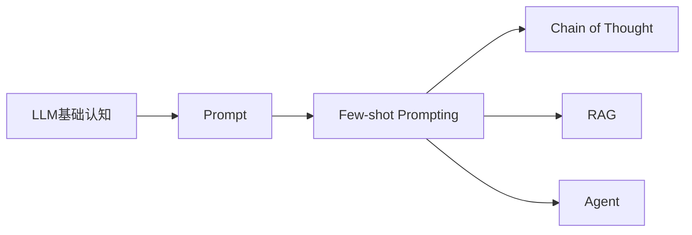
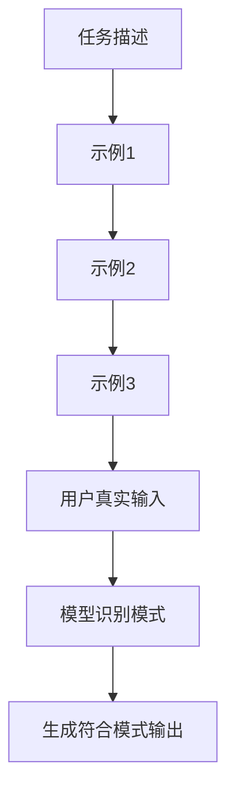
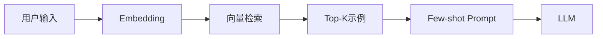
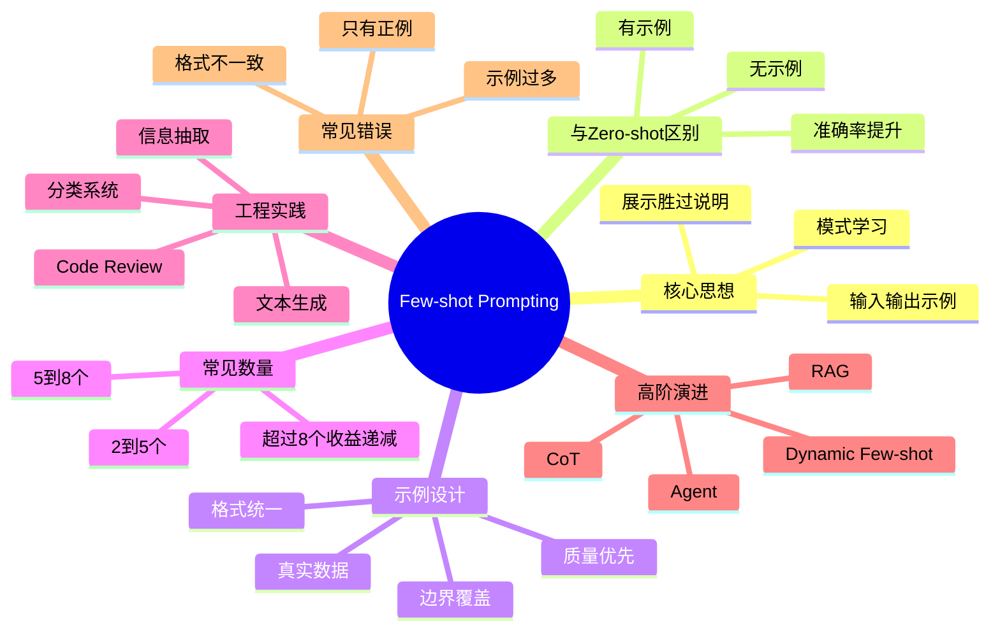

# 第8章：Few-shot Prompting [L0-L1]

## Part 1：为什么要学这个？[认知冲突先行]

你负责一个电商商品分类系统。

任务看起来很简单：

把商品标题：

> 2026新款夏季男士冰丝速干T恤短袖

分类到正确类目。

你花了两个小时，写出了一份长达1000多字的Prompt：

* 优先识别性别词
* 其次识别品类词
* 注意排除功能性描述
* 注意品牌词干扰
* 注意季节词影响
* 注意......

你觉得规则已经足够详细。

结果上线测试：

* 有时输出“男装”
* 有时输出“运动户外”
* 有时输出“功能服饰”

准确率只有65%。

旁边同事只写了几十行Prompt。

里面没有复杂规则。

只有3个示例：

```text
输入：男士纯棉短袖T恤
输出：男装

输入：女士雪纺连衣裙
输出：女装

输入：儿童运动套装
输出：童装
```

再次测试。

准确率直接飙升到92%。

此时很多人会产生一个巨大的认知冲击：

> 为什么1000字规则不如3个例子？

因为你一直把LLM当成一个“规则执行器”。

而实际上：

> LLM更像一个“模式学习器”。

它更擅长从示例中发现规律，而不是从抽象规则中推导规律。

这就是Few-shot Prompting诞生的原因。

本章将回答三个核心问题：

1. Few-shot到底是什么？
2. 为什么几个示例能产生巨大效果？
3. 如何设计高质量Few-shot示例？

---

## Part 2：学习路径定位

Few-shot是Prompt Engineering中最重要的基础技术之一。

学习路径如下：



### 当前所在位置

```text
L0：了解Prompt
 ↓
L1：掌握Few-shot
 ↓
L2：掌握CoT
 ↓
L3：掌握RAG与Agent
```

### 前置知识

* LLM基本工作原理
* Prompt概念
* Context Window概念

### 后置知识

* Chain-of-Thought
* Self-Consistency
* RAG
* Dynamic Few-shot
* Agent Workflow

Few-shot是Prompt Engineering真正开始进入工程实践的起点。

---

## Part 3：用生活理解它

想象你是新员工。

第一天入职。

领导发给你：

> 《周报撰写规范（20页）》。

你看了半天。

依然不知道真正该怎么写。

另一种情况。

领导直接发你3份优秀周报。

你看完后立刻明白：

* 标题怎么写
* 数据怎么展示
* 风险怎么描述
* 结论怎么总结

几分钟就学会了。

Few-shot本质上就是：

> 用案例教学代替说明书教学。

### 类比成立的部分

* 都是通过示例学习模式
* 都是观察输入和输出关系
* 都是从案例中总结规律

### 类比不成立的部分

人类真的会理解规则。

LLM并不真正理解。

它是在历史训练知识基础上，通过上下文中的示例进行模式匹配和概率预测。

因此：

> Few-shot不是让模型学会新知识，而是在激活模型已有能力。

---

## Part 4：AI如何映射到传统概念

对于传统软件工程师来说，可以这样理解。

| 传统开发世界         | AI世界            |
| -------------- | --------------- |
| 函数调用           | Prompt调用        |
| API文档          | Prompt说明        |
| 单元测试样例         | Few-shot示例      |
| 测试用例库          | 示例库             |
| 编码规范样例         | Few-shot Prompt |
| Design Pattern | Prompt Pattern  |
| 规则引擎           | Prompt约束        |
| 训练新员工          | Few-shot学习      |

传统程序：

```python
def classify(text):
    if "男士" in text:
        return "男装"
```

AI程序：

```text
输入：男士纯棉T恤
输出：男装

输入：女士连衣裙
输出：女装

现在处理：
输入：男士冰丝速干T恤
```

传统程序依赖显式规则。

Few-shot依赖隐式模式。

这是最大的思维转换。

---

## Part 5：技术本质深讲

### Few-shot的定义

Few-shot Prompting：

> 在Prompt中提供少量输入→输出示例，让模型推断任务模式，并应用到新输入。

通常示例数量：

```text
2 ~ 8个
```

最常见。

### 标准结构

```text
System:
你是商品分类专家

User:
男士纯棉短袖T恤

Assistant:
男装

User:
女士雪纺连衣裙

Assistant:
女装

User:
儿童运动套装

Assistant:
童装

User:
2026新款夏季男士冰丝速干T恤短袖
```

模型将自动预测：

```text
男装
```

### 工作机制



### 模型内部发生了什么

模型并不是执行：

```text
IF ...
ELSE ...
```

而是形成：

```text
输入特征
↓
观察示例
↓
推断映射关系
↓
预测最可能输出
```

### 为什么Few-shot有效

原因一：

### 示例比规则更具体

规则：

```text
识别情感倾向
```

示例：

```text
太棒了 → 积极
太差了 → 消极
一般般 → 中性
```

信息量远大于抽象描述。

---

原因二：

### 输出格式被锁定

描述：

```text
请输出JSON
```

模型可能：

```text
结果如下：
{
 ...
}
```

也可能：

```json
{
  "result":"积极"
}
```

格式不稳定。

Few-shot：

```text
输入：很好
输出：
{"label":"积极"}

输入：很差
输出：
{"label":"消极"}
```

模型会高度模仿格式。

---

原因三：

### 帮助模型找到决策边界

示例：

```text
非常满意 → 积极
非常失望 → 消极
一般般 → 中性
```

边界被明确展示。

模型行为更稳定。

### Few-shot数量是不是越多越好

不是。

经验规律：

| 示例数 | 效果        |
| --- | --------- |
| 0   | Zero-shot |
| 1   | One-shot  |
| 2-5 | 最常见       |
| 5-8 | 通常最佳      |
| >8  | 收益递减      |

原因：

* 占用Context Window
* 增加推理成本
* 引入噪声
* 可能让模型过拟合示例

核心原则：

> 示例质量 > 示例数量

---

## Part 6：动手Demo（可运行代码）

下面演示一个简单的Few-shot情感分类器。

```python
examples = [
    ("这部电影太棒了", "积极"),
    ("服务态度非常差", "消极"),
    ("电影还行吧", "中性")
]

new_text = "整体感觉不错"

prompt = "你是情感分类助手。\n\n"

for text, label in examples:
    prompt += f"输入：{text}\n"
    prompt += f"输出：{label}\n\n"

prompt += f"输入：{new_text}\n"
prompt += "输出："

print(prompt)
```

### 关键代码解析

```python
examples = [
    ("这部电影太棒了", "积极"),
    ("服务态度非常差", "消极"),
    ("电影还行吧", "中性")
]
```

定义Few-shot示例。

覆盖：

* 正面
* 负面
* 中性

三种情况。

```python
for text, label in examples:
```

循环构建示例对。

```python
prompt += f"输入：{text}\n"
prompt += f"输出：{label}\n\n"
```

形成标准Few-shot结构。

```python
prompt += f"输入：{new_text}\n"
prompt += "输出："
```

等待模型补全答案。

### 运行后你会看到什么

输出Prompt如下：

```text
你是情感分类助手。

输入：这部电影太棒了
输出：积极

输入：服务态度非常差
输出：消极

输入：电影还行吧
输出：中性

输入：整体感觉不错
输出：
```

把这段Prompt发送给LLM。

大概率得到：

```text
积极
```

这就是Few-shot最基本的工作方式。

---

## Part 7：真实项目场景

### 场景背景

某互联网公司使用大模型辅助Code Review。

采用的是：

* DeepSeek V3
* 自动审查平台
* Git提交触发审查

### 初始方案

Prompt只有一句话：

```text
请审查以下代码。
```

结果问题很多：

```text
代码可以进一步优化。
建议提升可读性。
可以增加异常处理。
```

这些建议虽然正确。

但几乎没有价值。

准确率约45%。

工程师根本不愿意看。

---

### 改进方案

团队引入Few-shot。

Prompt变成：

```text
示例1：

问题代码：
for i in range(len(users)):
    print(users[i])

问题描述：
索引遍历可读性较差

改进建议：
直接遍历对象

改进后代码：
for user in users:
    print(user)
```

再提供：

* 空指针案例
* SQL注入案例

总共3个高质量示例。

---

### 新效果

模型开始学习到审查风格：

```text
问题代码：
...

问题描述：
...

改进建议：
...

改进后代码：
...
```

输出结构完全统一。

审查建议准确率提升到92%。

### 工程经验总结

高质量Few-shot应满足：

```text
真实案例
+
统一格式
+
覆盖常见问题
```

而不是：

```text
大量抽象规则
```

这也是现代Prompt Engineering的重要实践。

---

## Part 8：这里容易踩坑

### 坑1：只有简单案例

错误示例：

```text
输入：电影太棒了
输出：积极

输入：服务很好
输出：积极
```

问题：

全是正面案例。

模型根本没见过：

```text
一般
还行
凑合
```

这种边界样本。

---

正确做法：

```text
输入：电影太棒了
输出：积极

输入：服务很差
输出：消极

输入：电影还行吧
输出：中性
```

覆盖完整决策边界。

---

### 坑2：示例格式不一致

错误示例：

```text
输入：很好
输出：积极

输入：很差
输出：
{
 "label":"消极"
}
```

输出结构不一致。

模型容易混乱。

---

正确示例：

```json
{
  "label":"积极"
}
```

```json
{
  "label":"消极"
}
```

统一格式。

---

### 坑3：示例过多

错误做法：

```text
50个示例
100个示例
200个示例
```

问题：

* Token暴涨
* 响应变慢
* 成本增加
* 边际收益下降

正确做法：

```text
2~8个高质量示例
```

足够。

---

## Part 9：面试怎么答

### L1：Zero-shot和Few-shot的区别是什么？

#### 回答框架

定义：

```text
Zero-shot：不给示例
Few-shot：给少量示例
```

适用场景：

```text
简单任务 → Zero-shot

复杂格式
模糊边界
结构化输出
→ Few-shot
```

核心差异：

```text
是否通过示例展示任务模式
```

---

### L2：如何选择Few-shot示例？是不是越多越好？

#### 回答框架

原则一：

```text
质量 > 数量
```

原则二：

```text
覆盖边界情况
```

原则三：

```text
真实数据优先
```

原则四：

```text
格式完全一致
```

示例数量：

```text
通常2~8个
```

原因：

```text
超过8个收益递减
占用Context Window
增加成本
```

---

### L3：什么是动态Few-shot？

#### 回答框架

定义：

```text
根据用户输入动态选择示例
```

解决的问题：

```text
示例库太大
无法全部放入Prompt
```

实现方式：

```text
示例库
↓
向量化
↓
向量数据库
↓
相似度检索
↓
Top-K示例
↓
拼接Prompt
```

架构图：



本质：

```text
RAG + Few-shot
```

---

## Part 10：考点速查

### **Few-shot Prompting**

通过少量示例让模型推断任务模式。

### **Zero-shot**

只有任务描述，没有示例。

### **示例质量大于数量**

3个好示例通常优于10个普通示例。

### **边界样本覆盖**

必须包含模糊、中性、异常案例。

### **动态Few-shot**

通过检索系统动态选择最相关示例。

---

## Part 11：必背金句

**[示例优于规则]：3个好示例胜过1000字规则说明。**

**[质量优于数量]：Few-shot效果主要取决于示例质量。**

**[覆盖决策边界]：边界案例比普通案例更重要。**

**[格式决定输出]：模型会模仿示例格式。**

**[动态优于静态]：大型系统最终会走向动态Few-shot。**

---

## Part 12：快速参考表

| 概念               | 作用      | 示例值     |
| ---------------- | ------- | ------- |
| Zero-shot        | 无示例任务执行 | 0个示例    |
| One-shot         | 单示例学习   | 1个示例    |
| Few-shot         | 少量示例学习  | 2-8个示例  |
| 示例质量             | 决定效果上限  | 高质量真实数据 |
| 边界样本             | 稳定模型行为  | 中性案例    |
| 输出格式对齐           | 保证系统解析  | JSON    |
| Dynamic Few-shot | 动态选例    | Top-K=3 |
| Context Window   | 存放示例空间  | 128K等   |

---

## Part 13：思维导图



---

## Part 14：本章小结

Few-shot不是让模型学习规则，而是让模型观察模式。

Few-shot最重要的原则是：

> 示例质量远比示例数量重要。

你已经完成从：

```text
L0：
只会写任务描述
```

成长到：

```text
L1：
能够利用示例稳定引导模型输出
```

继续向前。

你会发现：

```text
给示例
≠
让模型思考
```

Few-shot解决的是模式学习问题。

复杂推理问题还需要新的技术。

---

## Part 15：下一章预告

这一章我们解决了：

```text
如何让模型看懂任务模式
```

但新的问题出现了。

看下面的例子：

```text
小明有3个苹果。

他送给小红1个。

又买了5个。

现在有多少个？
```

Few-shot可以给出几个类似案例。

但复杂任务中，模型仍然可能直接答错。

原因是：

```text
模型知道模式
不代表模型会推理
```

下一章将学习：

# Chain-of-Thought（CoT）

你将看到一种改变行业的Prompt技术：

```text
不要直接给答案
而是一步一步思考
```

Few-shot教会模型：

```text
做什么
```

CoT将教会模型：

```text
怎么思考
```

这也是从Prompt基础技巧迈向推理增强技术的关键一步。