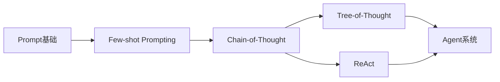
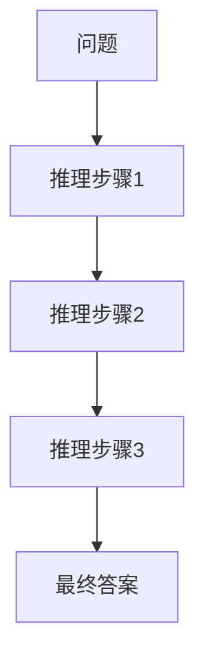
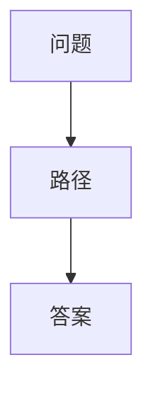
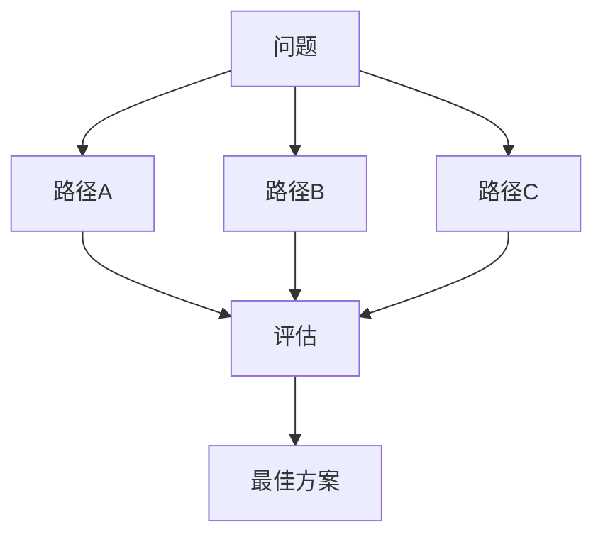
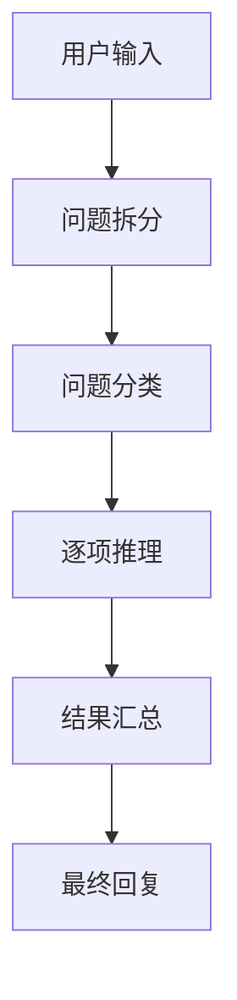
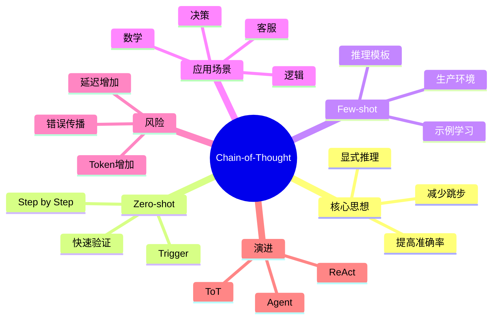
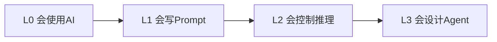

# 第9章：Chain-of-Thought（CoT）[L1-L2]

## Part 1：为什么要学这个？[认知冲突先行]

你正在开发一个智能客服系统。

用户问：

> 我的订单为什么被取消了？

你写下这样一个Prompt：

```text
用户订单被取消的可能原因是什么？
```

模型回答：

```text
1. 库存不足
2. 支付失败
3. 风控拦截
```

看起来没有任何问题。

甚至可以说回答得很专业。

于是你上线了。

结果用户并不满意。

因为用户真正想知道的是：

> 我的那个订单为什么被取消？

而不是：

> 一般情况下订单为什么会被取消？

模型跳过了整个排查过程：

```text
订单号
→ 查询订单状态
→ 查询支付记录
→ 查询库存状态
→ 查询风控结果
→ 定位原因
```

直接给出了结论。

问题就在这里。

很多人以为：

> Prompt写得足够清楚，模型自然会自己思考。

事实上，复杂任务中最容易出错的地方不是答案，而是推理过程。

模型经常：

* 跳步骤
* 跳验证
* 跳条件判断
* 直接生成结论

Chain-of-Thought（CoT）解决的正是这个问题。

它要求模型：

> 不要直接回答，先把思考过程写出来。

本章将回答三个关键问题：

1. CoT为什么能提升复杂推理准确率？
2. Zero-shot CoT与Few-shot CoT有什么区别？
3. 什么场景应该使用CoT，什么场景不应该使用？

---

## Part 2：学习路径定位

CoT是Prompt Engineering进入推理控制阶段的关键能力。



### 能力地图

| 层级 | 能力       |
| -- | -------- |
| L0 | 会使用AI    |
| L1 | 会写Prompt |
| L2 | 会控制推理    |
| L3 | 会设计Agent |
| L4 | 会设计AI系统  |

CoT正处于：

```text
Prompt
↓
Reasoning
↓
Agent
```

的中间位置。

它是从“提问者”变成“推理设计者”的第一步。

---

## Part 3：用生活理解它

假设老师出了一道数学题。

学生A：

```text
答案：42
```

学生B：

```text
已知条件A

推导步骤1

推导步骤2

推导步骤3

答案：42
```

哪一个更容易发现错误？

显然是第二个。

因为每一步都可检查。

CoT就是要求AI像第二个学生一样答题。

### 类比边界

这个类比并不意味着：

> LLM真的像人一样思考。

本质上它仍然是在预测下一个Token。

CoT并没有增加新的推理模块。

它只是通过生成中间步骤，让模型更容易沿正确路径继续生成内容。

---

## Part 4：AI如何映射到传统概念

| 传统软件工程   | AI世界            |
| -------- | --------------- |
| 函数调用     | Prompt          |
| 调试日志     | CoT             |
| Trace    | Reasoning Trace |
| 执行计划     | 推理链             |
| Pipeline | Agent Workflow  |
| 决策树      | ToT             |
| 工作流引擎    | ReAct           |

传统开发中：

```java
result = process();
```

如果没有日志，很难定位错误。

同样：

```text
Question
↓
Answer
```

也是一个黑盒。

而CoT变成：

```text
Question
↓
Step1
↓
Step2
↓
Step3
↓
Answer
```

这相当于给模型增加了可观察的执行日志。

---

## Part 5：技术本质深讲

### 为什么一句话就能提升准确率

很多人第一次看到：

```text
Let's think step by step.
```

都会觉得不可思议。

为什么加这一句就变强了？

原因不在这句话本身。

而在于：

> 它诱导模型生成中间推理Token。

这些Token又成为后续生成的新上下文。



每一步都会影响下一步。

因此模型更容易保持逻辑一致性。

### Zero-shot CoT

形式最简单。

```text
问题：
8 + 4 × 3 = ?

让我们一步一步思考。
```

模型通常会输出：

```text
4 × 3 = 12

8 + 12 = 20

答案：20
```

### Few-shot CoT

在Prompt中提供示例。

```text
Q: 5 + 3 × 2 = ?

A:
先算乘法：
3 × 2 = 6

再算加法：
5 + 6 = 11

答案：11
```

然后：

```text
Q: 8 + 4 × 3 = ?
```

模型会模仿推理格式。

### 为什么Few-shot更强

因为模型学到的不只是答案。

而是：

* 推理顺序
* 推理格式
* 推理风格
* 条件判断方式

### CoT成本

优势：

* 提高复杂推理准确率
* 可检查过程
* 方便评估

代价：

* Token增加
* 延迟增加
* 成本增加

### CoT局限

CoT只有一条推理路径。



如果中间错了：

```text
错误步骤
↓
错误传播
↓
错误答案
```

这就是Tree-of-Thought出现的原因。



---

## Part 6：动手Demo（可运行代码）

下面演示使用OpenAI兼容接口调用模型，对比Zero-shot与CoT输出。

```python
from openai import OpenAI

client = OpenAI(
    api_key="YOUR_API_KEY"
)

question = """
一个班有30人，
其中60%喜欢数学，
这些人中40%同时喜欢语文。

喜欢数学但不喜欢语文的人有多少？
"""

zero_shot_prompt = f"""
问题：

{question}

请直接给出答案。
"""

cot_prompt = f"""
问题：

{question}

请按步骤推理：

1. 计算喜欢数学的人数
2. 计算同时喜欢语文的人数
3. 计算只喜欢数学的人数
4. 给出最终答案

让我们一步一步思考。
"""

def ask(prompt):
    response = client.chat.completions.create(
        model="gpt-4o-mini",
        messages=[
            {
                "role": "user",
                "content": prompt
            }
        ],
        temperature=0
    )

    return response.choices[0].message.content

print("=== Zero-shot ===")
print(ask(zero_shot_prompt))

print()
print("=== Chain-of-Thought ===")
print(ask(cot_prompt))
```

### 关键代码说明

```python
temperature=0
```

保证结果稳定。

```python
ask(prompt)
```

统一封装模型调用逻辑。

```python
cot_prompt
```

加入显式推理步骤。

### 一次典型输出

Zero-shot：

```text
喜欢数学但不喜欢语文的人约11人。
```

CoT：

```text
喜欢数学人数：

30 × 60% = 18

同时喜欢语文人数：

18 × 40% = 7.2

只喜欢数学人数：

18 - 7.2 = 10.8

约11人
```

区别非常明显。

CoT不仅给出答案。

还暴露了推理过程。

---

## Part 7：真实项目场景

### 电商客服多问题处理

某电商团队内部测试项目。

实验条件：

* 模型：GPT-3.5 Turbo
* 测试集：1000条真实客服会话
* 场景：多商品、多问题咨询
* 时间周期：连续两周A/B测试

用户输入：

```text
我买了手机和耳机。

手机屏幕碎了。

耳机无法连接蓝牙。

另外地址需要修改。
```

传统Prompt：

```text
请回答用户问题。
```

经常出现：

* 漏答问题
* 回答顺序混乱
* 解决方案不完整

团队改为CoT Prompt：

```text
请按以下步骤处理：

Step1：
识别所有问题

Step2：
分类

Step3：
逐项处理

Step4：
汇总答复
```

推理过程：

```text
问题1：
手机屏幕损坏

问题2：
耳机连接失败

问题3：
修改地址
```

系统架构：



### 项目结果

以下数据来自该团队内部A/B测试：

| 指标    | 原方案 | CoT方案 |
| ----- | --- | ----- |
| 准确率   | 47% | 82%   |
| 用户满意度 | 61% | 79%   |
| 响应时间  | 基准  | -27%  |
| 漏答率   | 18% | 5%    |

团队最终发现：

不是Prompt模板不够多。

而是模型缺少明确的推理路径。

---

## Part 8：这里容易踩坑

### 错误一：所有任务都使用CoT

错误：

```text
判断下面邮件是否垃圾邮件。

让我们一步一步思考。
```

本质只是二分类。

没有复杂推理。

正确：

```text
输出：

Spam
或
Normal
```

### 为什么错

成本增加。

收益几乎没有。

---

### 错误二：只有触发词没有结构

错误：

```text
请一步一步思考。
```

模型可能产生看似合理的错误推理。

正确：

```text
请按以下步骤：

1. 提取条件
2. 建立关系
3. 推导结果
4. 输出答案
```

结构比口号重要。

---

### 错误三：复杂业务不用Few-shot

很多团队这样写：

```text
商品原价1000元。

会员等级Gold。

满500减50。

满1000减120。

会员额外95折。

计算最终价格。

让我们一步一步思考。
```

看起来已经用了CoT。

但问题在于：

模型可能：

* 先打折再满减
* 先满减再打折
* 忽略会员规则
* 错误选择满减档位

正确做法是提供示例：

```text
示例：

原价600元

满500减50

会员95折

步骤：

600 - 50 = 550

550 × 0.95 = 522.5

答案：522.5

现在开始计算新问题。
```

Few-shot会告诉模型：

* 运算顺序
* 规则优先级
* 输出格式

对于复杂业务场景效果远好于单纯一句：

```text
让我们一步一步思考
```

---

## Part 9：面试怎么答

### L1题

#### 什么是Chain-of-Thought（CoT）Prompting？

回答框架：

```text
定义
↓
原理
↓
案例
```

要点：

* 展示推理过程
* 不直接输出答案
* 提高复杂推理准确率
* 类似数学题写解题步骤

---

### L2题

#### Zero-shot CoT和Few-shot CoT有什么区别？

回答框架：

```text
触发方式
↓
示例数量
↓
稳定性
↓
使用场景
```

| 项目 | Zero-shot | Few-shot |
| -- | --------- | -------- |
| 示例 | 无         | 有        |
| 成本 | 低         | 高        |
| 效果 | 中等        | 更稳定      |
| 场景 | 快速验证      | 生产环境     |

---

### L3题

#### Tree-of-Thought解决了什么问题？

回答框架：

```text
CoT缺陷
↓
ToT机制
↓
适用场景
```

核心点：

CoT：

```text
单路径推理
```

ToT：

```text
多路径探索
```

适用于：

* 路径规划
* 策略优化
* 多方案搜索

---

## Part 10：考点速查

**CoT核心思想**

要求模型展示推理过程。

**Zero-shot CoT**

通过触发词激活推理链。

**Few-shot CoT**

通过示例学习推理模式。

**适用场景**

数学、逻辑、多步骤决策。

**ToT**

多路径推理，是CoT的升级版。

---

## Part 11：必背金句

**[推理显式化]：步骤透明比答案正确更重要。**

**[复杂任务优先]：任务越复杂，CoT收益越明显。**

**[Few-shot优先]：示例决定推理质量。**

**[过程可评估]：CoT不仅产生答案，也产生评估依据。**

**[避免滥用]：简单任务使用CoT只会浪费Token。**

---

## Part 12：快速参考表

| 概念             | 作用    | 示例值                      |
| -------------- | ----- | ------------------------ |
| CoT            | 显式推理  | Step-by-Step             |
| Zero-shot CoT  | 无示例推理 | Let's think step by step |
| Few-shot CoT   | 示例驱动  | 2~5个案例                   |
| Reasoning Step | 推理步骤  | Step1                    |
| ToT            | 多路径推理 | Branch Search            |
| Evaluation     | 推理评估  | Step Validation          |
| Final Answer   | 最终结果  | JSON                     |

---

## Part 13：思维导图



---

## Part 14：本章小结

CoT不是让模型拥有新的大脑，而是让模型暴露自己的推理路径。

复杂任务中，推理过程往往比最终答案更重要。

掌握CoT意味着你已经从“会提问”升级到“会设计推理过程”。



记住这一句：

> 复杂推理加CoT，一步一印错不了；简单任务别乱用，浪费Token没必要。

---

## Part 15：下一章预告

本章解决了：

```text
如何让模型思考
```

但现实世界的问题还有一个挑战：

```text
模型会想

却不会做
```

例如：

```text
查数据库

调用API

搜索网页

执行工具
```

这些都超出了单纯推理的范围。

下一章将进入Prompt Engineering的重要升级：

# ReAct（Reasoning + Acting）

你将学习：

```text
Thought

Action

Observation

Thought
```

这套循环机制，正是现代Agent系统的核心运行逻辑。