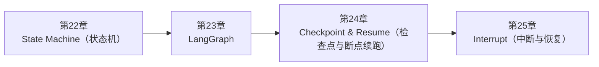

<!--
Chapter: 100
Node: SUMMARY-PART-05
Score: 100
Status: AUTO-GENERATED
Generated: summary
-->

# 第100章 【小结】第五部分：Workflow 与状态机 (ch22-ch25)

> **速读指南**：本章是「第五部分：Workflow 与状态机」的精华浓缩（共4个核心知识点）。
> 如果时间有限，只读本章即可掌握该部分所有核心概念。
> 重点看：**一、知识点精华一览**（速查表）和 **四、高频面试题精华**（备考必读）。

## 一、知识点精华一览

| 章节 | 概念 | 一句话掌握 |
|------|------|-----------|
| 第22章 | **State Machine（状态机）** | 状态机 = 用'状态+转换条件'描述系统行为，让复杂 Agent 工作流可视化、可维护。 |
| 第23章 | **LangGraph** | LangGraph = 用图建模 Agent 工作流，Node+Edge+State+Checkpoint，让复杂 Agent 可持久、可中断、可可视化。 |
| 第24章 | **Checkpoint & Resume（检查点与断点续跑）** | Checkpoint = 游戏存档机制，Agent 中断后从断点继续而不是从头来——生产可靠性的基础。 |
| 第25章 | **Interrupt（中断与恢复）** | Interrupt = 在关键节点设质检站，Agent 自动暂停等待人工确认，update_state 可修改参数后再继续。 |

## 二、核心原理速记

### 22. State Machine（状态机）  `[L2-L3]`

**心智模型**：状态机 = 交通信号灯 - 状态：红灯 / 黄灯 / 绿灯（系统在某时刻只能是一种状态） - 转换：红灯→绿灯（条件：倒计时结束），绿灯→黄灯（条件：即将变红） - 状态转换由条件触发，不能随意跳转 Agent 状态机类比： - 状态：research（检索中）/ generate（生成中）/ review（审核中）/ done（完成） - 转换：research→generate（条件：检索结果充足） generate→review（条件：内容生成完成） review→generate（条件：审核不通过，重新生成） review→done（条件：审核通过）

**考试要点**：
- 状态机 = 状态集合 + 转换条件 + 初始状态 + 终止状态
- 任何时刻系统只处于一个确定状态，转换由条件触发
- LangGraph StateGraph 是状态机的 Agent 实现
- 转换逻辑放在 Edge（边），不放在 Node（节点），保持单一职责

**核心原则**：
- 状态完备：State 包含任务执行所需的所有数据，节点只通过 State 交换信息
- 转换确定：每个状态在每种输入下的转换结果是确定的（可预测）

### 23. LangGraph  `[L2-L3]`

**心智模型**：把 LangGraph 想象成一个医院分诊系统：

**考试要点**：
- LangGraph 三要素：State（共享数据）+ Node（处理函数）+ Edge（控制流）
- Checkpointer：MemorySaver（开发）/ SqliteSaver（单机生产）/ PostgresSaver（分布式）
- HITL 实现：interrupt_before=['node_name']，人工审批后 invoke(None, config) 继续
- 条件边：根据 State 动态决定下一节点，实现分支逻辑

### 24. Checkpoint & Resume（检查点与断点续跑）  `[L2-L3]`

**心智模型**：Checkpoint = 游戏存档 - 没有存档：通关一半断电，从头开始 - 有存档：打完 Boss 存档，下次从这里继续，不用重打前面的关卡 生产 Agent 场景： - 任务：分析 100 份文档，生成报告（预计 30 分钟，100 次 LLM 调用） - 无 Checkpoint：第 80 份处理到一半崩溃 → 重来 30 分钟，再付 80 份的费用 - 有 Checkpoint：从第 80 份继续，只需 5 分钟，只付 20 份的费用

**考试要点**：
- Checkpoint = 持久化 Agent 执行状态，支持断点续跑
- Resume：用同一个 thread_id 重新 invoke，LangGraph 自动从最近 Checkpoint 恢复
- 生产存储：SqliteSaver（单机）/ PostgresSaver（分布式）
- thread_id 必须唯一标识一个任务，多用户场景必须隔离

### 25. Interrupt（中断与恢复）  `[L2-L3]`

**心智模型**：Interrupt = 自动化流水线上的质检站 - 无 Interrupt：产品在流水线上全自动生产，出了问题只能事后补救 - 有 Interrupt：在关键工序设置质检点，质检员检查后盖章才能继续，问题在线发现 类比：代码 CI/CD 流水线 - 自动测试通过 → 自动继续 - 部署到生产前 → 暂停，等待 Release Manager 人工批准 → 批准后继续部署

**考试要点**：
- Interrupt = 在指定节点前/后主动暂停，等待外部输入后 Resume
- interrupt_before：节点执行前暂停（用于操作前确认）
- interrupt_after：节点执行后暂停（用于计划审查）
- Resume 三种方式：invoke(None) 继续 / update_state + invoke 修改后继续 / 走终止分支

## 三、对比与选型速查

| 概念 | 解决的问题 | 最佳适用场景 | 不适合场景/反模式 |
|------|-----------|------------|-----------------|
| **State Machine（状态机）** | Agent 执行复杂任务时，需要在多个步骤之间有条件地跳转： | L2-L3 | 节点内部包含状态转换逻辑（if/else 决定下一步）（后果：控制流分散在各节点，图结构不清晰，难以可视化和调试） |
| **LangGraph** | 纯代码实现复杂 Agent 工作流的问题： | State 使用 TypedDict + Annotated，字段含义清晰，支持序列化 | State 中存储大型对象（完整文档、图片）（后果：Checkpoint 序列化失败或性能极差；应存 ID 或路径，大对 |
| **Checkpoint & Resume（检查点与断点续跑）** | Agent 任务通常耗时长（分钟级）、调用次数多（数十次 LLM 调用）： | 生产环境必须使用持久化 Checkpointer（Sqlite/Postgres），不用 MemorySaver | 生产使用 MemorySaver（后果：服务重启后所有任务状态丢失，必须从头重试，等同于无 Checkpoint） |
| **Interrupt（中断与恢复）** | 纯自动化 Agent 的问题： | Interrupt 点展示的信息要足够清晰，让人类能理解'将要发生什么' | 中断点展示原始 State 数据而非可读的操作描述（后果：人类看到一堆 JSON，无法理解要确认什么，点击批准相当于盲目 |

## 四、高频面试题精华

**Q: 状态机的组成要素是什么？**

> **答题要点**：状态机 = 交通信号灯 - 状态：红灯 / 黄灯 / 绿灯（系统在某时刻只能是一种状态） - 转换：红灯→绿灯（条件：倒计时结束），绿灯→黄灯（条件：即将变红） - 状态转换由条件触发，不能随意跳转  Agent 状态机类比： - 状态：research（检索中）/ generate（生成中）/ review（审核中）/ done（完成） - 转换：research→generate（条件：检索结

**Q: 为什么 Agent 工作流适合用状态机建模？**

> **答题要点**：状态机 = 交通信号灯 - 状态：红灯 / 黄灯 / 绿灯（系统在某时刻只能是一种状态） - 转换：红灯→绿灯（条件：倒计时结束），绿灯→黄灯（条件：即将变红） - 状态转换由条件触发，不能随意跳转  Agent 状态机类比： - 状态：research（检索中）/ generate（生成中）/ review（审核中）/ done（完成） - 转换：research→generate（条件：检索结

**Q: LangGraph 的三个核心概念（State/Node/Edge）分别是什么？**

> **答题要点**：LangGraph = 用图建模 Agent 工作流，Node+Edge+State+Checkpoint，让复杂 Agent 可持久、可中断、可可视化。
>
> **最佳实践**：State 使用 TypedDict + Annotated，字段含义清晰，支持序列化

**Q: LangGraph 和直接写 Python 控制流有什么本质区别？**

> **答题要点**：LangGraph = 用图建模 Agent 工作流，Node+Edge+State+Checkpoint，让复杂 Agent 可持久、可中断、可可视化。
>
> **最佳实践**：State 使用 TypedDict + Annotated，字段含义清晰，支持序列化

**Q: 为什么生产级 Agent 必须有 Checkpoint？不做会有什么后果？**

> **答题要点**：Checkpoint = 游戏存档 - 没有存档：通关一半断电，从头开始 - 有存档：打完 Boss 存档，下次从这里继续，不用重打前面的关卡  生产 Agent 场景： - 任务：分析 100 份文档，生成报告（预计 30 分钟，100 次 LLM 调用） - 无 Checkpoint：第 80 份处理到一半崩溃 → 重来 30 分钟，再付 80 份的费用 - 有 Checkpoint：从第 8
>
> **最佳实践**：生产环境必须使用持久化 Checkpointer（Sqlite/Postgres），不用 MemorySaver

**Q: LangGraph 的 Checkpoint 和 Resume 如何工作？thread_id 的作用是什么？**

> **答题要点**：Checkpoint = 游戏存档 - 没有存档：通关一半断电，从头开始 - 有存档：打完 Boss 存档，下次从这里继续，不用重打前面的关卡  生产 Agent 场景： - 任务：分析 100 份文档，生成报告（预计 30 分钟，100 次 LLM 调用） - 无 Checkpoint：第 80 份处理到一半崩溃 → 重来 30 分钟，再付 80 份的费用 - 有 Checkpoint：从第 8
>
> **最佳实践**：生产环境必须使用持久化 Checkpointer（Sqlite/Postgres），不用 MemorySaver

**Q: LangGraph 的 Interrupt 是什么？和 Checkpoint 有什么关系？**

> **答题要点**：Interrupt = 自动化流水线上的质检站 - 无 Interrupt：产品在流水线上全自动生产，出了问题只能事后补救 - 有 Interrupt：在关键工序设置质检点，质检员检查后盖章才能继续，问题在线发现  类比：代码 CI/CD 流水线 - 自动测试通过 → 自动继续 - 部署到生产前 → 暂停，等待 Release Manager 人工批准 → 批准后继续部署
>
> **最佳实践**：Interrupt 点展示的信息要足够清晰，让人类能理解'将要发生什么'

**Q: interrupt_before 和 interrupt_after 的区别？分别适合什么场景？**

> **答题要点**：Interrupt = 自动化流水线上的质检站 - 无 Interrupt：产品在流水线上全自动生产，出了问题只能事后补救 - 有 Interrupt：在关键工序设置质检点，质检员检查后盖章才能继续，问题在线发现  类比：代码 CI/CD 流水线 - 自动测试通过 → 自动继续 - 部署到生产前 → 暂停，等待 Release Manager 人工批准 → 批准后继续部署
>
> **最佳实践**：Interrupt 点展示的信息要足够清晰，让人类能理解'将要发生什么'

## 六、知识关联图

## 七、本章自测清单

完成本部分学习后，你应该能够：

- [ ] **State Machine（状态机）**：状态机 = 用'状态+转换条件'描述系统行为，让复杂 Agent 工作流可视化、可维护。
- [ ] **LangGraph**：LangGraph = 用图建模 Agent 工作流，Node+Edge+State+Checkpoint，让复杂 Ag
- [ ] **Checkpoint & Resume（检查点与断点续跑）**：Checkpoint = 游戏存档机制，Agent 中断后从断点继续而不是从头来——生产可靠性的基础。
- [ ] **Interrupt（中断与恢复）**：Interrupt = 在关键节点设质检站，Agent 自动暂停等待人工确认，update_state 可修改参数后再继

> 如果某项还不确定，回到对应章节复习后再打勾。
