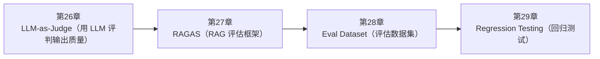

<!--
Chapter: 101
Node: SUMMARY-PART-06
Score: 100
Status: AUTO-GENERATED
Generated: summary
-->

# 第101章 【小结】第六部分：Evaluation 与测试 (ch26-ch29)

> **速读指南**：本章是「第六部分：Evaluation 与测试」的精华浓缩（共4个核心知识点）。
> 如果时间有限，只读本章即可掌握该部分所有核心概念。
> 重点看：**一、知识点精华一览**（速查表）和 **四、高频面试题精华**（备考必读）。

## 一、知识点精华一览

| 章节 | 概念 | 一句话掌握 |
|------|------|-----------|
| 第26章 | **LLM-as-Judge（用 LLM 评判输出质量）** | LLM-as-Judge = 用强 LLM 当主编审稿，秒级评估 AI 输出质量——AI 系统质量控制的核心手段。 |
| 第27章 | **RAGAS（RAG 评估框架）** | RAGAS = RAG 的体检报告，4 个指标分别衡量检索查全、查准、生成忠实、答案切题——无需人工标注答案。 |
| 第28章 | **Eval Dataset（评估数据集）** | Eval Dataset = AI 的单元测试集，没有它就没有可靠的质量保证——每次系统变更后都要跑一遍。 |
| 第29章 | **Regression Testing（回归测试）** | Regression Testing = AI 的 CI 质量门禁，每次变更后自动评估，指标下降超阈值就阻断——在上线前发现问题。 |

## 二、核心原理速记

### 26. LLM-as-Judge（用 LLM 评判输出质量）  `[L2-L3]`

**心智模型**：LLM-as-Judge = 经验丰富的主编审稿 - 被评估的 LLM = 实习编辑写的文章 - Judge LLM = 主编：根据标准（准确性/可读性/结构）给文章打分并批注 - 主编（Judge）比实习编辑（被评估 LLM）能力更强，才能准确评判 关键前提：Judge 能力 > 被评估系统能力 （用 GPT-3.5 评判 GPT-4 的输出是不可靠的）

**考试要点**：
- LLM-as-Judge = 用强 LLM 自动评判另一个 LLM 的输出质量
- 核心前提：Judge 能力 > 被评估系统
- 三大偏差：自我偏好 / 位置偏好 / 长度偏好
- Judge Prompt 必须：结构化输出 + 明确评分标准 + 要求评分理由

### 27. RAGAS（RAG 评估框架）  `[L2-L3]`

**心智模型**：RAGAS = RAG 系统的体检报告 4 个指标 = 4 项体检项目： - Context Recall = 检索有没有漏掉关键信息（查全率） - Context Precision = 检索到的信息有没有噪音（查准率） - Faithfulness = 答案是否诚实（有没有编造） - Answer Relevancy = 答案是否切题（有没有跑题） 四项全通过 → RAG 系统健康 某项低分 → 定位具体问题（是检索问题还是生成问题？）

**考试要点**：
- RAGAS 4 指标：Context Recall / Context Precision / Faithfulness / Answer Relevancy
- 唯一需要参考答案的指标：Context Recall（需要 ground_truth）
- 低分诊断：Recall低→检索漏信息；Precision低→检索有噪音；Faithfulness低→有幻觉；Relevancy低→答案跑题
- RAGAS 底层 = LLM-as-Judge，Judge 能力决定评估准确性

### 28. Eval Dataset（评估数据集）  `[L2-L3]`

**心智模型**：Eval Dataset = 软件工程中的单元测试套件 - 单元测试：每次代码改动后跑测试，确保功能没有退化 - Eval Dataset：每次 Prompt / 模型 / 系统改动后跑评估，确保质量没有退化 Golden Dataset（黄金数据集）： 包含人工精心审核过的参考答案，是最可信的评估基准

**考试要点**：
- Eval Dataset = AI 系统的单元测试套件，每次变更后运行，确保质量没有退化
- 构建策略：用户数据采样 / 场景驱动人工设计 / LLM 生成+人工校验
- 质量标准：代表性 / 多样性 / 挑战性 / 准确性 / 时效性
- 必须版本控制（存 Git），质量 > 数量

### 29. Regression Testing（回归测试）  `[L2-L3]`

**心智模型**：AI Regression Testing = 传统软件的 CI 单元测试 软件工程： git push → CI 跑单元测试 → 测试失败 → 阻止合并 PR AI 系统： Prompt 修改 → CI 跑 LLM-as-Judge 评估 → 质量指标下降 → 阻止部署 区别： - 软件测试：确定性（代码逻辑），pass/fail 二元 - AI 回归测试：统计性（LLM 有随机性），使用阈值（如 > 0.85）

**考试要点**：
- AI Regression Testing = 每次变更后自动跑 Eval，对比 Baseline，阻断质量回退
- Quality Gate：指标下降超阈值 → 阻止合并/上线
- 区别：软件测试是确定性 pass/fail；AI 回归测试是统计性阈值比较
- 结果必须存档（JSON/CSV），支持历史趋势分析

## 三、对比与选型速查

| 概念 | 解决的问题 | 最佳适用场景 | 不适合场景/反模式 |
|------|-----------|------------|-----------------|
| **LLM-as-Judge（用 LLM 评判输出质量）** | 传统评估方法的局限： | Judge Prompt 中要求输出结构化 JSON，避免解析失败 | 用能力弱的 LLM 评判能力强的 LLM（后果：Judge 无法识别被评估系统的错误，评分虚高，无法发现真正的质量问题） |
| **RAGAS（RAG 评估框架）** | 评估 RAG 系统的难点： | 建立固定的 RAGAS 评估集（100-500 个有代表性的问题），每次 Prompt 或系统变更后重新评估 | 只在上线前跑一次 RAGAS（后果：知识库更新、Prompt 修改、模型升级都可能引起质量波动，持续评估才能早发现） |
| **Eval Dataset（评估数据集）** | 没有 Eval Dataset 的 AI 开发： | 每次 Prompt 或系统变更后，在同一个 Eval Dataset 上运行评估并与历史结果对比 | Eval Dataset 和训练数据（Few-shot 示例）完全重叠（后果：评估结果虚高（模型记住了答案），无法反映真 |
| **Regression Testing（回归测试）** | AI 系统的特殊风险： | Baseline 在发布新版本时更新：不要一直用很久之前的 Baseline（期望标准应该随产品成熟提升） | 阈值设置过于宽松（如允许下降 20%）（后果：每次变更都能通过，回归测试形同虚设，无法发现真正的质量问题） |

## 四、高频面试题精华

**Q: 为什么要用 LLM 来评估 LLM 的输出？传统方法有什么局限？**

> **答题要点**：LLM-as-Judge = 经验丰富的主编审稿 - 被评估的 LLM = 实习编辑写的文章 - Judge LLM = 主编：根据标准（准确性/可读性/结构）给文章打分并批注 - 主编（Judge）比实习编辑（被评估 LLM）能力更强，才能准确评判  关键前提：Judge 能力 > 被评估系统能力 （用 GPT-3.5 评判 GPT-4 的输出是不可靠的）
>
> **最佳实践**：Judge Prompt 中要求输出结构化 JSON，避免解析失败

**Q: LLM-as-Judge 有哪些已知偏差？如何缓解？**

> **答题要点**：LLM-as-Judge = 经验丰富的主编审稿 - 被评估的 LLM = 实习编辑写的文章 - Judge LLM = 主编：根据标准（准确性/可读性/结构）给文章打分并批注 - 主编（Judge）比实习编辑（被评估 LLM）能力更强，才能准确评判  关键前提：Judge 能力 > 被评估系统能力 （用 GPT-3.5 评判 GPT-4 的输出是不可靠的）
>
> **最佳实践**：Judge Prompt 中要求输出结构化 JSON，避免解析失败

**Q: RAGAS 的 4 个核心指标是什么？各自衡量什么？**

> **答题要点**：RAGAS = RAG 系统的体检报告 4 个指标 = 4 项体检项目： - Context Recall = 检索有没有漏掉关键信息（查全率） - Context Precision = 检索到的信息有没有噪音（查准率） - Faithfulness = 答案是否诚实（有没有编造） - Answer Relevancy = 答案是否切题（有没有跑题）  四项全通过 → RAG 系统健康 某项低分
>
> **最佳实践**：建立固定的 RAGAS 评估集（100-500 个有代表性的问题），每次 Prompt 或系统变更后重新评估

**Q: RAGAS 的'无参考答案评估'是什么意思？哪个指标例外？**

> **答题要点**：RAGAS = RAG 系统的体检报告 4 个指标 = 4 项体检项目： - Context Recall = 检索有没有漏掉关键信息（查全率） - Context Precision = 检索到的信息有没有噪音（查准率） - Faithfulness = 答案是否诚实（有没有编造） - Answer Relevancy = 答案是否切题（有没有跑题）  四项全通过 → RAG 系统健康 某项低分
>
> **最佳实践**：建立固定的 RAGAS 评估集（100-500 个有代表性的问题），每次 Prompt 或系统变更后重新评估

**Q: 为什么 AI 系统需要 Eval Dataset？没有它会有什么问题？**

> **答题要点**：Eval Dataset = 软件工程中的单元测试套件 - 单元测试：每次代码改动后跑测试，确保功能没有退化 - Eval Dataset：每次 Prompt / 模型 / 系统改动后跑评估，确保质量没有退化  Golden Dataset（黄金数据集）： 包含人工精心审核过的参考答案，是最可信的评估基准
>
> **最佳实践**：每次 Prompt 或系统变更后，在同一个 Eval Dataset 上运行评估并与历史结果对比

**Q: Eval Dataset 的构建策略有哪些？各自有什么优劣？**

> **答题要点**：Eval Dataset = 软件工程中的单元测试套件 - 单元测试：每次代码改动后跑测试，确保功能没有退化 - Eval Dataset：每次 Prompt / 模型 / 系统改动后跑评估，确保质量没有退化  Golden Dataset（黄金数据集）： 包含人工精心审核过的参考答案，是最可信的评估基准
>
> **最佳实践**：每次 Prompt 或系统变更后，在同一个 Eval Dataset 上运行评估并与历史结果对比

**Q: 为什么 AI 系统需要 Regression Testing？和传统软件测试有什么相似之处？**

> **答题要点**：AI Regression Testing = 传统软件的 CI 单元测试  软件工程： git push → CI 跑单元测试 → 测试失败 → 阻止合并 PR  AI 系统： Prompt 修改 → CI 跑 LLM-as-Judge 评估 → 质量指标下降 → 阻止部署  区别： - 软件测试：确定性（代码逻辑），pass/fail 二元 - AI 回归测试：统计性（LLM 有随机性），使用
>
> **最佳实践**：Baseline 在发布新版本时更新：不要一直用很久之前的 Baseline（期望标准应该随产品成熟提升）

**Q: AI Regression Testing 和软件单元测试的核心区别是什么？**

> **答题要点**：AI Regression Testing = 传统软件的 CI 单元测试  软件工程： git push → CI 跑单元测试 → 测试失败 → 阻止合并 PR  AI 系统： Prompt 修改 → CI 跑 LLM-as-Judge 评估 → 质量指标下降 → 阻止部署  区别： - 软件测试：确定性（代码逻辑），pass/fail 二元 - AI 回归测试：统计性（LLM 有随机性），使用
>
> **最佳实践**：Baseline 在发布新版本时更新：不要一直用很久之前的 Baseline（期望标准应该随产品成熟提升）

## 六、知识关联图

## 七、本章自测清单

完成本部分学习后，你应该能够：

- [ ] **LLM-as-Judge（用 LLM 评判输出质量）**：LLM-as-Judge = 用强 LLM 当主编审稿，秒级评估 AI 输出质量——AI 系统质量控制的核心手段。
- [ ] **RAGAS（RAG 评估框架）**：RAGAS = RAG 的体检报告，4 个指标分别衡量检索查全、查准、生成忠实、答案切题——无需人工标注答案。
- [ ] **Eval Dataset（评估数据集）**：Eval Dataset = AI 的单元测试集，没有它就没有可靠的质量保证——每次系统变更后都要跑一遍。
- [ ] **Regression Testing（回归测试）**：Regression Testing = AI 的 CI 质量门禁，每次变更后自动评估，指标下降超阈值就阻断——在上线前

> 如果某项还不确定，回到对应章节复习后再打勾。
