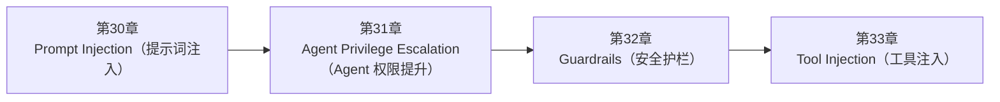

<!--
Chapter: 102
Node: SUMMARY-PART-07
Score: 100
Status: AUTO-GENERATED
Generated: summary
-->

# 第102章 【小结】第七部分：安全与防护 (ch30-ch33)

> **速读指南**：本章是「第七部分：安全与防护」的精华浓缩（共4个核心知识点）。
> 如果时间有限，只读本章即可掌握该部分所有核心概念。
> 重点看：**一、知识点精华一览**（速查表）和 **四、高频面试题精华**（备考必读）。

## 一、知识点精华一览

| 章节 | 概念 | 一句话掌握 |
|------|------|-----------|
| 第30章 | **Prompt Injection（提示词注入）** | Prompt Injection = SQL 注入的 AI 版，攻击者在输入中藏指令来绕过 System Prompt 的安全约束。 |
| 第31章 | **Agent Privilege Escalation（Agent 权限提升）** | Agent 权限提升 = Agent 能做的比它应该做的多——用最小权限原则和沙箱隔离把权限锁死。 |
| 第32章 | **Guardrails（安全护栏）** | Guardrails = AI 的安全气囊，在输入输出层各设一道独立于 LLM 的检查，System Prompt 被绕过后的最后防线。 |
| 第33章 | **Tool Injection（工具注入）** | Tool Injection = 把恶意指令藏进网页/文档，让 Agent 读完后当命令执行——比直接注入更难防。 |

## 二、核心原理速记

### 30. Prompt Injection（提示词注入）  `[L2-L3]`

**心智模型**：可以把 LLM 想象成一个“没有判断权的速记员”。

**考试要点**：
- Prompt Injection = 在用户输入中嵌入恶意指令，覆盖 System Prompt 的约束
- 两类：直接注入（用户直接输入）/ 间接注入（外部数据中隐藏）
- 基本防御：System Prompt 和 User Input 严格分离，不拼接
- 间接注入防御：外部数据标记为不可信，提醒 LLM 忽略指令性文字

### 31. Agent Privilege Escalation（Agent 权限提升）  `[L2-L3]`

**心智模型**：> “你只能整理文件柜，不要碰财务系统。”

**考试要点**：
- 两类权限提升：设计时过度授权 / 运行时通过注入触发权限滥用
- 最小权限原则：Agent 只拥有当前任务所需的最小工具和权限
- 文件工具防御：路径白名单 + 路径规范化（防 path traversal）
- 代码执行防御：Docker 沙箱 + 禁止网络 + 资源限制

### 32. Guardrails（安全护栏）  `[L2-L3]`

**心智模型**：* System Prompt = 小区围墙

**考试要点**：
- Guardrails = 输入层+输出层的自动化安全检查，独立于 LLM 执行
- 输入护栏：Prompt Injection / PII / 有害内容 / Topic 限制
- 输出护栏：系统提示泄露 / 幻觉 / PII泄露 / 格式验证
- 与 System Prompt 互补：SP 在 LLM 层，Guardrails 在应用层

### 33. Tool Injection（工具注入）  `[L2-L3]`

**心智模型**：可以把 Agent 想象成一个“自动研究助理”。

**考试要点**：
- Tool Injection = 恶意指令藏在外部数据中（网页/文档/DB），Agent 读取后当指令执行
- 比直接注入更难防：来自'可信'数据源，输入验证不起作用
- 防御核心：外部数据标记为<EXTERNAL_DATA>告知LLM是数据非指令 + 工具输出过滤
- 减小破坏半径：最小权限（不给不需要的工具）

## 三、对比与选型速查

| 概念 | 解决的问题 | 最佳适用场景 | 不适合场景/反模式 |
|------|-----------|------------|-----------------|
| **Prompt Injection（提示词注入）** | 攻击者通过在用户输入中嵌入恶意指令，覆盖或绕过 System Prompt 的安全约束，使 LLM 执行未授权操作 | L2-L3 | — |
| **Agent Privilege Escalation（Agent 权限提升）** | Agent 被赋予或通过漏洞获取了超出任务需要的权限，导致读取敏感文件、执行危险命令、访问未授权数据 | L2-L3 | — |
| **Guardrails（安全护栏）** | 在 LLM 输入/输出层设置的自动化安全检查机制，拦截有害内容、越权操作、敏感信息泄露——AI 系统的安全防线 | 输入护栏和输出护栏都要有——单层防御不够 | 只有 System Prompt 安全约束，没有 Guardrails（后果：Prompt Injection 成功绕过 |
| **Tool Injection（工具注入）** | 外部数据（网页、文档、API 响应）中嵌入恶意指令，Agent 处理这些数据时将指令当作合法任务执行——间接 Promp | L2-L3 | — |

## 四、高频面试题精华

**Q: Prompt Injection 是什么？和 SQL 注入有什么类比关系？**

> **答题要点**：Prompt Injection = SQL 注入的 AI 版，攻击者在输入中藏指令来绕过 System Prompt 的安全约束。

**Q: 直接注入和间接注入的区别？各举一个例子？**

> **答题要点**：Prompt Injection = SQL 注入的 AI 版，攻击者在输入中藏指令来绕过 System Prompt 的安全约束。

**Q: Agent Privilege Escalation（权限提升）有哪些常见场景？**

> **答题要点**：Agent 权限提升 = Agent 能做的比它应该做的多——用最小权限原则和沙箱隔离把权限锁死。

**Q: 如何用最小权限原则设计 Agent 的工具集？**

> **答题要点**：Agent 权限提升 = Agent 能做的比它应该做的多——用最小权限原则和沙箱隔离把权限锁死。

**Q: Guardrails 是什么？为什么 System Prompt 的安全约束不够？**

> **答题要点**：Guardrails = AI 的安全气囊，在输入输出层各设一道独立于 LLM 的检查，System Prompt 被绕过后的最后防线。
>
> **最佳实践**：输入护栏和输出护栏都要有——单层防御不够

**Q: 输入护栏和输出护栏分别检查什么？**

> **答题要点**：Guardrails = AI 的安全气囊，在输入输出层各设一道独立于 LLM 的检查，System Prompt 被绕过后的最后防线。
>
> **最佳实践**：输入护栏和输出护栏都要有——单层防御不够

**Q: Tool Injection 和直接 Prompt Injection 有什么区别？为什么更难防御？**

> **答题要点**：Tool Injection = 把恶意指令藏进网页/文档，让 Agent 读完后当命令执行——比直接注入更难防。

**Q: 如何防止 Agent 在读取网页时被 Tool Injection 攻击？**

> **答题要点**：Tool Injection = 把恶意指令藏进网页/文档，让 Agent 读完后当命令执行——比直接注入更难防。

## 六、知识关联图

## 七、本章自测清单

完成本部分学习后，你应该能够：

- [ ] **Prompt Injection（提示词注入）**：Prompt Injection = SQL 注入的 AI 版，攻击者在输入中藏指令来绕过 System Prompt 
- [ ] **Agent Privilege Escalation（Agent 权限提升）**：Agent 权限提升 = Agent 能做的比它应该做的多——用最小权限原则和沙箱隔离把权限锁死。
- [ ] **Guardrails（安全护栏）**：Guardrails = AI 的安全气囊，在输入输出层各设一道独立于 LLM 的检查，System Prompt 被绕
- [ ] **Tool Injection（工具注入）**：Tool Injection = 把恶意指令藏进网页/文档，让 Agent 读完后当命令执行——比直接注入更难防。

> 如果某项还不确定，回到对应章节复习后再打勾。
