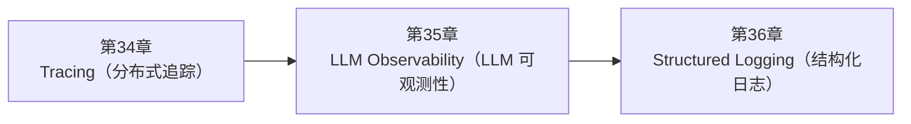

<!--
Chapter: 103
Node: SUMMARY-PART-08
Score: 100
Status: AUTO-GENERATED
Generated: summary
-->

# 第103章 【小结】第八部分：可观测性 (ch34-ch36)

> **速读指南**：本章是「第八部分：可观测性」的精华浓缩（共3个核心知识点）。
> 如果时间有限，只读本章即可掌握该部分所有核心概念。
> 重点看：**一、知识点精华一览**（速查表）和 **四、高频面试题精华**（备考必读）。

## 一、知识点精华一览

| 章节 | 概念 | 一句话掌握 |
|------|------|-----------|
| 第34章 | **Tracing（分布式追踪）** | Tracing = AI 的黑匣子，每一步 LLM 调用/检索/工具调用都有记录，出问题时精确定位原因。 |
| 第35章 | **LLM Observability（LLM 可观测性）** | LLM Observability = 给 AI 装监控摄像头，实时掌握质量/性能/成本，从'黑盒运行'到'透明可控'。 |
| 第36章 | **Structured Logging（结构化日志）** | 结构化日志 = 把日志写成 JSON 数据库记录，机器可查询可告警，是可观测性从'看日志'到'查数据'的关键一步。 |

## 二、核心原理速记

### 34. Tracing（分布式追踪）  `[L2-L3]`

**心智模型**：Tracing = 飞机黑匣子 - 黑匣子记录飞行过程中每个关键操作和状态变化 - 出事后通过黑匣子还原整个过程，精确定位问题 - AI Tracing：记录每次 LLM 调用的输入/输出/耗时，出问题时精确回放 Tracing = 餐厅订单追踪系统 - 顾客下单（Trace 开始） - 服务员记单（Span 1）→ 厨房收单（Span 2）→ 备菜（Span 3）→ 出菜（Span 4） - 每个步骤：负责人、开始时间、完成时间、状态 - 总耗时 = 所有步骤时间之和

**考试要点**：
- Tracing = 记录一次任务执行中所有操作的输入/输出/耗时，形成可追溯的链路
- Trace = 一次完整任务；Span = 其中一个操作步骤
- 必须追踪：LLM 调用 / 向量检索 / 工具调用 / 错误异常
- 主流工具：LangSmith（LangChain 生态）/ LangFuse（开源可部署）

### 35. LLM Observability（LLM 可观测性）  `[L2-L3]`

**心智模型**：但 LLM Observability 做的是更深一层的事情：

**考试要点**：
- 三大支柱：Tracing（追踪）/ Metrics（指标）/ Logging（日志）
- LLM 特有指标：输出质量（Faithfulness）/ Token 成本 / 幻觉率
- 告警必设：错误率 / 延迟 / 质量指标 / 成本超预算
- 工具：LangSmith / LangFuse / OpenTelemetry + Prometheus + Grafana

### 36. Structured Logging（结构化日志）  `[L1-L2]`

**心智模型**：Structured Logging = 数据库记录 vs 自由文字 自由文本日志（难以机器处理）： "[2026-06-19 10:23:45] INFO: GPT-4o 调用成功，耗时 2.3s，消耗 1234 个 Token，成本 $0.012" Structured Logging（机器友好）： { "timestamp": "2026-06-19T10:23:45.123Z", "level": "INFO", "event": "llm_call_success", "model": "gpt-4o", "duration_ms": 2300, "token_count": 123

**考试要点**：
- Structured Logging = JSON 格式的机器可读日志，与自由文本日志的核心区别
- 必须字段：timestamp / level / event / trace_id / status
- 不记录原始内容（Prompt/Response），只记录元数据
- LLM 专属字段：prompt_tokens / completion_tokens / cost_usd / model

## 三、对比与选型速查

| 概念 | 解决的问题 | 最佳适用场景 | 不适合场景/反模式 |
|------|-----------|------------|-----------------|
| **Tracing（分布式追踪）** | LLM 应用的调试困难： | 每个 Span 记录足够的上下文：不只是'调用了什么'，还要'用什么参数、返回了什么' | Span 只记录函数名，不记录输入输出（后果：看到'llm_call'执行了，但不知道用了什么 Prompt，无法调试质 |
| **LLM Observability（LLM 可观测性）** | 传统软件的可观测性关注：延迟、错误率、吞吐量 | L2-L3 | — |
| **Structured Logging（结构化日志）** | 自由文本日志（print/str format）的问题： | 每条日志必须包含 trace_id，用于关联同一次请求的所有日志 | print(f'LLM 调用成功，耗时 {duration}s')（后果：无法机器解析，无法聚合统计，无法触发告警） |

**层级与难度**：

- `L2-L3` **Tracing（分布式追踪）**：Tracing = AI 的黑匣子，每一步 LLM 调用/检索/工具调用都有记录，出问题时精确定位原
- `L2-L3` **LLM Observability（LLM 可观测性）**：LLM Observability = 给 AI 装监控摄像头，实时掌握质量/性能/成本，从'黑盒运
- `L1-L2` **Structured Logging（结构化日志）**：结构化日志 = 把日志写成 JSON 数据库记录，机器可查询可告警，是可观测性从'看日志'到'查数据

## 四、高频面试题精华

**Q: Tracing 解决了 LLM 系统什么问题？不做 Tracing 会有什么痛点？**

> **答题要点**：Tracing = 飞机黑匣子 - 黑匣子记录飞行过程中每个关键操作和状态变化 - 出事后通过黑匣子还原整个过程，精确定位问题 - AI Tracing：记录每次 LLM 调用的输入/输出/耗时，出问题时精确回放  Tracing = 餐厅订单追踪系统 - 顾客下单（Trace 开始） - 服务员记单（Span 1）→ 厨房收单（Span 2）→ 备菜（Span 3）→ 出菜（Span 4） - 
>
> **最佳实践**：每个 Span 记录足够的上下文：不只是'调用了什么'，还要'用什么参数、返回了什么'

**Q: Trace 和 Span 的关系是什么？Span 应该包含哪些字段？**

> **答题要点**：Tracing = 飞机黑匣子 - 黑匣子记录飞行过程中每个关键操作和状态变化 - 出事后通过黑匣子还原整个过程，精确定位问题 - AI Tracing：记录每次 LLM 调用的输入/输出/耗时，出问题时精确回放  Tracing = 餐厅订单追踪系统 - 顾客下单（Trace 开始） - 服务员记单（Span 1）→ 厨房收单（Span 2）→ 备菜（Span 3）→ 出菜（Span 4） - 
>
> **最佳实践**：每个 Span 记录足够的上下文：不只是'调用了什么'，还要'用什么参数、返回了什么'

**Q: LLM Observability 和传统软件可观测性有什么区别？**

> **答题要点**：LLM Observability = 给 AI 装监控摄像头，实时掌握质量/性能/成本，从'黑盒运行'到'透明可控'。

**Q: LLM 系统的三大观测支柱是什么？**

> **答题要点**：LLM Observability = 给 AI 装监控摄像头，实时掌握质量/性能/成本，从'黑盒运行'到'透明可控'。

**Q: Structured Logging 和普通 print 日志有什么区别？为什么重要？**

> **答题要点**：Structured Logging = 数据库记录 vs 自由文字  自由文本日志（难以机器处理）： "[2026-06-19 10:23:45] INFO: GPT-4o 调用成功，耗时 2.3s，消耗 1234 个 Token，成本 $0.012"  Structured Logging（机器友好）： {   "timestamp": "2026-06-19T10:23:45.123Z", 
>
> **最佳实践**：每条日志必须包含 trace_id，用于关联同一次请求的所有日志

**Q: LLM 应用的日志 Schema 应该包含哪些关键字段？**

> **答题要点**：Structured Logging = 数据库记录 vs 自由文字  自由文本日志（难以机器处理）： "[2026-06-19 10:23:45] INFO: GPT-4o 调用成功，耗时 2.3s，消耗 1234 个 Token，成本 $0.012"  Structured Logging（机器友好）： {   "timestamp": "2026-06-19T10:23:45.123Z", 
>
> **最佳实践**：每条日志必须包含 trace_id，用于关联同一次请求的所有日志

## 六、知识关联图

## 七、本章自测清单

完成本部分学习后，你应该能够：

- [ ] **Tracing（分布式追踪）**：Tracing = AI 的黑匣子，每一步 LLM 调用/检索/工具调用都有记录，出问题时精确定位原因。
- [ ] **LLM Observability（LLM 可观测性）**：LLM Observability = 给 AI 装监控摄像头，实时掌握质量/性能/成本，从'黑盒运行'到'透明可控'。
- [ ] **Structured Logging（结构化日志）**：结构化日志 = 把日志写成 JSON 数据库记录，机器可查询可告警，是可观测性从'看日志'到'查数据'的关键一步。

> 如果某项还不确定，回到对应章节复习后再打勾。
