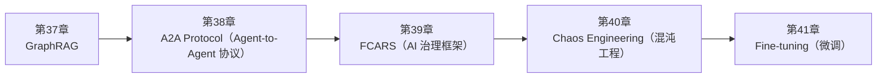

<!--
Chapter: 104
Node: SUMMARY-PART-09
Score: 100
Status: AUTO-GENERATED
Generated: summary
-->

# 第104章 【小结】第九部分：高级专题 (ch37-ch41)

> **速读指南**：本章是「第九部分：高级专题」的精华浓缩（共5个核心知识点）。
> 如果时间有限，只读本章即可掌握该部分所有核心概念。
> 重点看：**一、知识点精华一览**（速查表）和 **四、高频面试题精华**（备考必读）。

## 一、知识点精华一览

| 章节 | 概念 | 一句话掌握 |
|------|------|-----------|
| 第37章 | **GraphRAG** | GraphRAG = RAG + 知识图谱，通过实体关系网络让 AI 能跨文档推理——回答'A 的老板的合作方是谁'这类复杂问题。 |
| 第38章 | **A2A Protocol（Agent-to-Agent 协议）** | A2A = Agent 之间的 HTTP 协议，让不同公司的 AI Agent 能互相发现、委托任务、协同工作。 |
| 第39章 | **FCARS（AI 治理框架）** | FCARS = AI 系统的五维度治理框架，从公平合规到安全可靠，是 AI 平台架构师的必备设计语言。 |
| 第40章 | **Chaos Engineering（混沌工程）** | 混沌工程 = 主动打自己，在测试环境注入故障，验证 AI 系统在真实故障面前能否扛住——而不是等线上炸了再知道。 |
| 第41章 | **Fine-tuning（微调）** | Fine-tuning = 专项培训模型，让它记住特定格式/风格/知识——改变的是模型本身，不是每次对话的上下文。 |

## 二、核心原理速记

### 37. GraphRAG  `[L3-L4]`

**心智模型**：普通 RAG = 图书馆按主题检索 - 搜索"机器学习"→ 找到相关的书/章节 - 无法回答："哪些研究者在机器学习和量子计算都有贡献？" GraphRAG = 图书馆 + 学术关系图谱 - 不只找相关文档，还建立了"人物-机构-领域-论文"的关系网络 - 可以沿关系边遍历：A 认识 B，B 在 C 机构，C 机构研究 D 领域 - 能回答复杂的跨实体推理问题

**考试要点**：
- GraphRAG = 向量检索 + 知识图谱，解决跨文档推理和全局理解问题
- Local Search：从相关实体出发图遍历（具体问题）
- Global Search：Map-Reduce 遍历社区摘要（综合问题）
- 代价：索引成本高，适合静态知识库 + 复杂推理场景

### 38. A2A Protocol（Agent-to-Agent 协议）  `[L3-L4]`

**心智模型**：不是“发个消息问一下”，而是完整的项目协作体系：

**考试要点**：
- A2A = Google 提出的 Agent 间互操作协议，让不同框架/组织的 Agent 能协作
- Agent Card = Agent 的自我描述（能力/端点/Schema），类似 API 文档
- A2A 任务状态：submitted→working→input-required/completed/failed/cancelled
- A2A vs MCP：A2A 是 Agent-Agent，MCP 是 Model-Tool，两者互补

### 39. FCARS（AI 治理框架）  `[L3-L4]`

**心智模型**：FCARS更像“自动驾驶持续安全监控系统”，而不是一次性年检。

**考试要点**：
- FCARS = Fairness（公平）/ Compliance（合规）/ Accountability（问责）/ Reliability（可靠）/ Safety（安全）
- Fairness 关键指标：Disparate Impact（< 0.8 为显著不公平）
- Compliance 关键法规：GDPR（被遗忘权、知情同意）/ EU AI Act（高风险系统注册）
- Accountability = 决策可追溯 + 责任归属 + 审计日志

### 40. Chaos Engineering（混沌工程）  `[L3-L4]`

**心智模型**：> 飞机在出事的时候，能不能还活着把人带回来。

**考试要点**：
- Chaos Engineering = 主动注入故障验证系统韧性，先于用户发现故障
- 9个 AI 特有场景：API超时/限流/无效JSON/工具崩溃/DB连接耗尽/Token配额/用户断线/并发激增/Agent无限循环
- 流程：稳态 → 假设 → 注入 → 观察 → 验证 → 修复
- Agent 无限循环测试：验证 max_iterations 触发 + 部分结果返回 + 日志记录

### 41. Fine-tuning（微调）  `[L3-L4]`

**心智模型**：Fine-tuning vs RAG vs Prompt Engineering 三者类比： Prompt Engineering = 给员工详细工作指南 - 优点：灵活，随时可改 - 缺点：每次都要带着指南（Token 成本），员工可能理解偏差 RAG = 给员工一个可以随时查阅的知识库 - 优点：知识可以实时更新 - 缺点：需要检索过程，知识库质量决定上限 Fine-tuning = 专项培训员工 - 优点：技能内化，反应快，不用每次带教材 - 缺点：培训成本高，技能更新需要重新培训

**考试要点**：
- Fine-tuning = 在预训练模型上继续训练，更新模型参数（永久性学习）
- LoRA：只训练低秩适配矩阵，参数量 < 1%，生产微调首选
- 适用场景：格式一致性 / 特定风格 / 专业术语 / 小模型替代大模型
- 不适用：知识频繁更新（用RAG）/ 数据不足（< 200条）/ Prompt 能解决的问题

## 三、对比与选型速查

| 概念 | 解决的问题 | 最佳适用场景 | 不适合场景/反模式 |
|------|-----------|------------|-----------------|
| **GraphRAG** | 传统 RAG（向量检索）的局限： | L3-L4 | — |
| **A2A Protocol（Agent-to-Agent 协议）** | Multi-Agent 系统的碎片化问题： | L3-L4 | — |
| **FCARS（AI 治理框架）** | AI 系统与传统软件的关键区别： | L3-L4 | — |
| **Chaos Engineering（混沌工程）** | AI 系统面临独特的故障模式： | L3-L4 | — |
| **Fine-tuning（微调）** | Prompt Engineering + RAG 的局限： | L3-L4 | — |

## 四、高频面试题精华

**Q: GraphRAG 解决了传统 RAG 的什么问题？**

> **答题要点**：普通 RAG = 图书馆按主题检索 - 搜索"机器学习"→ 找到相关的书/章节 - 无法回答："哪些研究者在机器学习和量子计算都有贡献？"  GraphRAG = 图书馆 + 学术关系图谱 - 不只找相关文档，还建立了"人物-机构-领域-论文"的关系网络 - 可以沿关系边遍历：A 认识 B，B 在 C 机构，C 机构研究 D 领域 - 能回答复杂的跨实体推理问题

**Q: GraphRAG 的两种检索模式（Local/Global Search）分别适合什么场景？**

> **答题要点**：普通 RAG = 图书馆按主题检索 - 搜索"机器学习"→ 找到相关的书/章节 - 无法回答："哪些研究者在机器学习和量子计算都有贡献？"  GraphRAG = 图书馆 + 学术关系图谱 - 不只找相关文档，还建立了"人物-机构-领域-论文"的关系网络 - 可以沿关系边遍历：A 认识 B，B 在 C 机构，C 机构研究 D 领域 - 能回答复杂的跨实体推理问题

**Q: A2A Protocol 是什么？解决了什么问题？**

> **答题要点**：A2A = Agent 之间的 HTTP 协议，让不同公司的 AI Agent 能互相发现、委托任务、协同工作。

**Q: A2A 和 MCP 的区别是什么？两者是竞争还是互补关系？**

> **答题要点**：A2A = Agent 之间的 HTTP 协议，让不同公司的 AI Agent 能互相发现、委托任务、协同工作。

**Q: FCARS 是什么？为什么企业级 AI 平台需要 FCARS 框架？**

> **答题要点**：FCARS = AI 系统的五维度治理框架，从公平合规到安全可靠，是 AI 平台架构师的必备设计语言。

**Q: Fairness 维度如何量化评估？Disparate Impact 是什么？**

> **答题要点**：FCARS = AI 系统的五维度治理框架，从公平合规到安全可靠，是 AI 平台架构师的必备设计语言。

**Q: 为什么 AI 系统需要 Chaos Engineering？和传统软件有什么不同？**

> **答题要点**：混沌工程 = 主动打自己，在测试环境注入故障，验证 AI 系统在真实故障面前能否扛住——而不是等线上炸了再知道。

**Q: 列举3个 LLM/Agent 系统特有的故障场景，并描述期望的系统行为？**

> **答题要点**：混沌工程 = 主动打自己，在测试环境注入故障，验证 AI 系统在真实故障面前能否扛住——而不是等线上炸了再知道。

**Q: Fine-tuning 和 RAG 的区别是什么？什么场景下用哪个？**

> **答题要点**：Fine-tuning vs RAG vs Prompt Engineering 三者类比：  Prompt Engineering = 给员工详细工作指南 - 优点：灵活，随时可改 - 缺点：每次都要带着指南（Token 成本），员工可能理解偏差  RAG = 给员工一个可以随时查阅的知识库 - 优点：知识可以实时更新 - 缺点：需要检索过程，知识库质量决定上限  Fine-tuning = 专

**Q: LoRA 的原理是什么？为什么它比全量微调更实用？**

> **答题要点**：Fine-tuning vs RAG vs Prompt Engineering 三者类比：  Prompt Engineering = 给员工详细工作指南 - 优点：灵活，随时可改 - 缺点：每次都要带着指南（Token 成本），员工可能理解偏差  RAG = 给员工一个可以随时查阅的知识库 - 优点：知识可以实时更新 - 缺点：需要检索过程，知识库质量决定上限  Fine-tuning = 专

## 六、知识关联图

## 七、本章自测清单

完成本部分学习后，你应该能够：

- [ ] **GraphRAG**：GraphRAG = RAG + 知识图谱，通过实体关系网络让 AI 能跨文档推理——回答'A 的老板的合作方是谁'这类
- [ ] **A2A Protocol（Agent-to-Agent 协议）**：A2A = Agent 之间的 HTTP 协议，让不同公司的 AI Agent 能互相发现、委托任务、协同工作。
- [ ] **FCARS（AI 治理框架）**：FCARS = AI 系统的五维度治理框架，从公平合规到安全可靠，是 AI 平台架构师的必备设计语言。
- [ ] **Chaos Engineering（混沌工程）**：混沌工程 = 主动打自己，在测试环境注入故障，验证 AI 系统在真实故障面前能否扛住——而不是等线上炸了再知道。
- [ ] **Fine-tuning（微调）**：Fine-tuning = 专项培训模型，让它记住特定格式/风格/知识——改变的是模型本身，不是每次对话的上下文。

> 如果某项还不确定，回到对应章节复习后再打勾。
