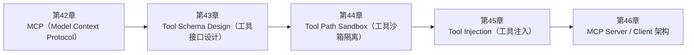

<!--
Chapter: 105
Node: SUMMARY-PART-10
Score: 100
Status: AUTO-GENERATED
Generated: summary
-->

# 第105章 【小结】第十部分：MCP 与工具生态 (ch42-ch46)

> **速读指南**：本章是「第十部分：MCP 与工具生态」的精华浓缩（共5个核心知识点）。
> 如果时间有限，只读本章即可掌握该部分所有核心概念。
> 重点看：**一、知识点精华一览**（速查表）和 **四、高频面试题精华**（备考必读）。

## 一、知识点精华一览

| 章节 | 概念 | 一句话掌握 |
|------|------|-----------|
| 第42章 | **MCP（Model Context Protocol）** | MCP = AI 工具世界的 USB 接口，写一次 Server，所有兼容框架都能用。 |
| 第43章 | **Tool Schema Design（工具接口设计）** | Tool Schema 的 description 是写给 LLM 看的 API 文档，决定 LLM 是否在正确时机调用正确工具。 |
| 第44章 | **Tool Path Sandbox（工具沙箱隔离）** | Tool Sandbox = 给工具划定活动范围，即使 Agent 被攻击，最大破坏也被限制在沙箱内。 |
| 第45章 | **Tool Injection（工具注入）** | Tool Injection = 通过工具的输入/输出/描述向 Agent 注入恶意指令，是 Prompt Injection 在工具链的延伸。 |
| 第46章 | **MCP Server / Client 架构** | MCP Client-Server 架构 = 工具能力插件化，新增工具只需部署新 Server，无需修改 LLM 应用核心代码。 |

## 二、核心原理速记

### 42. MCP（Model Context Protocol）  `[L1-L2]`

**心智模型**：MCP = USB 接口标准 - USB 出现前：每个设备厂商有不同接口，打印机、鼠标、键盘各用各的线 - USB 出现后：统一接口，任何 USB 设备可接任何 USB 主机 MCP 也是如此： - MCP Server = USB 设备（提供能力） - MCP Client = USB 主机（消费能力） - MCP 协议 = USB 规范（定义通信方式）

**考试要点**：
- MCP = 开放协议，标准化 LLM 应用与外部工具的通信方式，解决生态碎片化
- 三类 Primitive：Tool（执行操作）/ Resource（读取数据）/ Prompt（模板复用）
- 传输方式：stdio（本地）/ HTTP+SSE（网络）
- MCP 类比 USB：Server = 设备，Client = 主机，协议 = USB 规范

### 43. Tool Schema Design（工具接口设计）  `[L1-L2]`

**心智模型**：Tool Schema = API 文档，但读者是 LLM 而不是人类工程师 人类工程师读 API 文档：看参数类型、示例、注意事项 LLM 读 Tool Schema：看 description 判断"我需要做这件事时，该用这个工具吗？" 所以 description 必须回答："什么情况下应该调用我？"

**考试要点**：
- Tool Schema 必填三要素：name（snake_case动词开头）/ description（说明使用场景）/ parameters（类型+描述+required）
- description 核心原则：说明'什么时候用'和'什么时候不用'
- 参数 description 要说明格式期望（如 ISO 8601 日期格式）
- 一工具一职责：search_and_summarize 应拆为两个工具

### 44. Tool Path Sandbox（工具沙箱隔离）  `[L2-L3]`

**心智模型**：Tool Sandbox = 手术室无菌区 - 手术刀（工具）功能强大，但只能在手术室（沙箱）内使用 - 手术室外（沙箱外）的东西，手术刀碰不到 - 即使手术刀被"病毒污染"（工具被攻击），影响也被限制在无菌区内 另一个类比：银行保险库 - 银行职员（Agent）可以操作柜台（允许的工具） - 但无法进入保险库后台（沙箱外的敏感系统） - 即使职员被"策反"，能取走的也只有柜台范围内的东西

**考试要点**：
- Tool Sandbox 四层：路径控制 / 进程隔离 / 资源限制 / 网络隔离
- 路径白名单优于黑名单：黑名单容易遗漏，白名单默认拒绝更安全
- 代码执行必须容器隔离：Docker --network=none --read-only --memory=256m
- 超时是必须的：防止死循环耗尽资源，建议 30s 以内

### 45. Tool Injection（工具注入）  `[L2-L3]`

**心智模型**：> 除了我本人，不允许把保险柜密码告诉任何人。

**考试要点**：
- Tool Injection 三种形式：返回值注入 / MCP Server 劫持 / 参数污染
- 核心防御：工具返回值标记不可信 + MCP Server 来源白名单 + 工具内部参数校验
- 不能依赖 LLM 做安全判断：LLM 的判断本身可被影响，安全校验必须在确定性代码中实现
- 高危工具（写入/执行/网络）必须加 Human-in-the-Loop

### 46. MCP Server / Client 架构  `[L2-L3]`

**心智模型**：MCP 架构 = 浏览器插件系统 - 浏览器（MCP Host）：提供基础运行环境 - 插件管理器（MCP Client）：管理已安装的插件，转发请求 - 浏览器插件（MCP Server）：独立提供某种能力（广告拦截/密码管理/翻译） 你可以安装任意多个插件，每个插件互相独立，浏览器通过统一接口与插件通信。

**考试要点**：
- 三角色：Host（LLM 应用）/ Client（协议客户端）/ Server（能力提供者）
- 传输方式：stdio（本地/低延迟）vs HTTP+SSE（远程/跨机器）
- 一个 Host 可连多个 Server，Client 负责能力发现和路由
- Server 单一职责 + 独立进程 = 故障隔离 + 可复用

## 三、对比与选型速查

| 概念 | 解决的问题 | 最佳适用场景 | 不适合场景/反模式 |
|------|-----------|------------|-----------------|
| **MCP（Model Context Protocol）** | 在 MCP 出现之前，每个 AI 框架（LangChain、AutoGen、自研系统）都有自己的工具集成方式， | 每个 Tool 只做一件事：单一职责，Tool 描述清晰，LLM 才能正确选择调用 | 把所有工具堆在一个 MCP Server 里（后果：Server 职责不清，难以维护；工具清单过长影响 LLM 选择准确 |
| **Tool Schema Design（工具接口设计）** | LLM 不像人类能看懂函数源码——它只能通过 Schema 的自然语言描述来理解工具 | 工具名用动词开头：search_web / execute_sql / send_email，而不是 web / sql | description 写成功能介绍而非使用指南（后果：LLM 知道工具能做什么，但不知道什么时候该用，导致调用时机错误 |
| **Tool Path Sandbox（工具沙箱隔离）** | Agent 通过 Tool 与真实世界交互，工具不受限等于 Agent 不受限： | L2-L3 | 文件工具不做路径校验，直接 open(user_provided_path)（后果：Agent 可读取宿主机任意文件，包 |
| **Tool Injection（工具注入）** | 攻击者通过篡改工具返回值、MCP Server 描述或工具调用参数，诱导 Agent 执行未授权操作的攻击方式 | L2-L3 | — |
| **MCP Server / Client 架构** | 传统 AI 应用的工具是硬编码在应用内的，每次新增工具都要修改核心代码 | 每个 MCP Server 单一职责：数据库工具 / 搜索工具 / 文件工具分开部署 | 所有工具挤在一个 MCP Server 里（后果：Server 职责不清、维护困难；一个工具崩溃影响所有工具） |

**层级与难度**：

- `L1-L2` **MCP（Model Context Protocol）**：MCP = AI 工具世界的 USB 接口，写一次 Server，所有兼容框架都能用。
- `L1-L2` **Tool Schema Design（工具接口设计）**：Tool Schema 的 description 是写给 LLM 看的 API 文档，决定 LLM
- `L2-L3` **Tool Path Sandbox（工具沙箱隔离）**：Tool Sandbox = 给工具划定活动范围，即使 Agent 被攻击，最大破坏也被限制在沙箱内
- `L2-L3` **Tool Injection（工具注入）**：Tool Injection = 通过工具的输入/输出/描述向 Agent 注入恶意指令，是 Pro
- `L2-L3` **MCP Server / Client 架构**：MCP Client-Server 架构 = 工具能力插件化，新增工具只需部署新 Server，无需

## 四、高频面试题精华

**Q: MCP 协议解决了什么问题？为什么需要它？（考察对工具生态碎片化问题的理解）？**

> **答题要点**：MCP = USB 接口标准 - USB 出现前：每个设备厂商有不同接口，打印机、鼠标、键盘各用各的线 - USB 出现后：统一接口，任何 USB 设备可接任何 USB 主机 MCP 也是如此： - MCP Server = USB 设备（提供能力） - MCP Client = USB 主机（消费能力） - MCP 协议 = USB 规范（定义通信方式）
>
> **最佳实践**：每个 Tool 只做一件事：单一职责，Tool 描述清晰，LLM 才能正确选择调用

**Q: MCP 的三类 Primitive（Tool/Resource/Prompt）分别是什么，各自适用什么场景？**

> **答题要点**：MCP = USB 接口标准 - USB 出现前：每个设备厂商有不同接口，打印机、鼠标、键盘各用各的线 - USB 出现后：统一接口，任何 USB 设备可接任何 USB 主机 MCP 也是如此： - MCP Server = USB 设备（提供能力） - MCP Client = USB 主机（消费能力） - MCP 协议 = USB 规范（定义通信方式）
>
> **最佳实践**：每个 Tool 只做一件事：单一职责，Tool 描述清晰，LLM 才能正确选择调用

**Q: 为什么 Tool description 的质量会影响 LLM 调用准确率？**

> **答题要点**：Tool Schema = API 文档，但读者是 LLM 而不是人类工程师 人类工程师读 API 文档：看参数类型、示例、注意事项 LLM 读 Tool Schema：看 description 判断"我需要做这件事时，该用这个工具吗？" 所以 description 必须回答："什么情况下应该调用我？"
>
> **最佳实践**：工具名用动词开头：search_web / execute_sql / send_email，而不是 web / sql / email

**Q: 一个好的 Tool Schema 的 description 应该包含哪些信息？**

> **答题要点**：Tool Schema = API 文档，但读者是 LLM 而不是人类工程师 人类工程师读 API 文档：看参数类型、示例、注意事项 LLM 读 Tool Schema：看 description 判断"我需要做这件事时，该用这个工具吗？" 所以 description 必须回答："什么情况下应该调用我？"
>
> **最佳实践**：工具名用动词开头：search_web / execute_sql / send_email，而不是 web / sql / email

**Q: 为什么给 Agent 的文件读取工具设置路径白名单？不设会有什么风险？**

> **答题要点**：Tool Sandbox = 手术室无菌区 - 手术刀（工具）功能强大，但只能在手术室（沙箱）内使用 - 手术室外（沙箱外）的东西，手术刀碰不到 - 即使手术刀被"病毒污染"（工具被攻击），影响也被限制在无菌区内  另一个类比：银行保险库 - 银行职员（Agent）可以操作柜台（允许的工具） - 但无法进入保险库后台（沙箱外的敏感系统） - 即使职员被"策反"，能取走的也只有柜台范围内的东西

**Q: 代码执行工具如何实现沙箱隔离？Docker 方案的优缺点是什么？**

> **答题要点**：Tool Sandbox = 手术室无菌区 - 手术刀（工具）功能强大，但只能在手术室（沙箱）内使用 - 手术室外（沙箱外）的东西，手术刀碰不到 - 即使手术刀被"病毒污染"（工具被攻击），影响也被限制在无菌区内  另一个类比：银行保险库 - 银行职员（Agent）可以操作柜台（允许的工具） - 但无法进入保险库后台（沙箱外的敏感系统） - 即使职员被"策反"，能取走的也只有柜台范围内的东西

**Q: Tool Injection 和 Prompt Injection 有什么联系和区别？**

> **答题要点**：Tool Injection = 通过工具的输入/输出/描述向 Agent 注入恶意指令，是 Prompt Injection 在工具链的延伸。

**Q: 工具返回值为什么可以成为注入攻击的载体？如何防御？**

> **答题要点**：Tool Injection = 通过工具的输入/输出/描述向 Agent 注入恶意指令，是 Prompt Injection 在工具链的延伸。

**Q: MCP 的 Host / Client / Server 三个角色分别负责什么？**

> **答题要点**：MCP 架构 = 浏览器插件系统 - 浏览器（MCP Host）：提供基础运行环境 - 插件管理器（MCP Client）：管理已安装的插件，转发请求 - 浏览器插件（MCP Server）：独立提供某种能力（广告拦截/密码管理/翻译） 你可以安装任意多个插件，每个插件互相独立，浏览器通过统一接口与插件通信。
>
> **最佳实践**：每个 MCP Server 单一职责：数据库工具 / 搜索工具 / 文件工具分开部署

**Q: stdio 和 HTTP+SSE 两种传输方式如何选择？**

> **答题要点**：MCP 架构 = 浏览器插件系统 - 浏览器（MCP Host）：提供基础运行环境 - 插件管理器（MCP Client）：管理已安装的插件，转发请求 - 浏览器插件（MCP Server）：独立提供某种能力（广告拦截/密码管理/翻译） 你可以安装任意多个插件，每个插件互相独立，浏览器通过统一接口与插件通信。
>
> **最佳实践**：每个 MCP Server 单一职责：数据库工具 / 搜索工具 / 文件工具分开部署

## 五、常见误区警示

**MCP（Model Context Protocol） 的常见误区**：

- ❌ 误解：MCP 只是另一种 Function Calling
  ✅ 正解：Function Calling 是单次 LLM 调用中的工具调用机制，MCP 是跨框架、跨应用的工具共享协议，解决的是生态互通问题，层级更高。
- ❌ 误解：MCP 取代了 LangChain Tool
  ✅ 正解：MCP 是协议层，LangChain Tool 是框架层。LangChain 可以通过 MCP Client 来使用 MCP Server 暴露的工具，两者是互补关系。

**Tool Schema Design（工具接口设计） 的常见误区**：

- ❌ 误解：Schema 只是格式声明，LLM 会自己理解工具的用途
  ✅ 正解：LLM 只能从 description 字段判断工具用途，没有 description 或 description 模糊，LLM 无法正确决策。Schema 的 description 质量 = 工具调用准确率。

## 六、知识关联图

## 七、本章自测清单

完成本部分学习后，你应该能够：

- [ ] **MCP（Model Context Protocol）**：MCP = AI 工具世界的 USB 接口，写一次 Server，所有兼容框架都能用。
- [ ] **Tool Schema Design（工具接口设计）**：Tool Schema 的 description 是写给 LLM 看的 API 文档，决定 LLM 是否在正确时机调用
- [ ] **Tool Path Sandbox（工具沙箱隔离）**：Tool Sandbox = 给工具划定活动范围，即使 Agent 被攻击，最大破坏也被限制在沙箱内。
- [ ] **Tool Injection（工具注入）**：Tool Injection = 通过工具的输入/输出/描述向 Agent 注入恶意指令，是 Prompt Inject
- [ ] **MCP Server / Client 架构**：MCP Client-Server 架构 = 工具能力插件化，新增工具只需部署新 Server，无需修改 LLM 应用核

> 如果某项还不确定，回到对应章节复习后再打勾。
