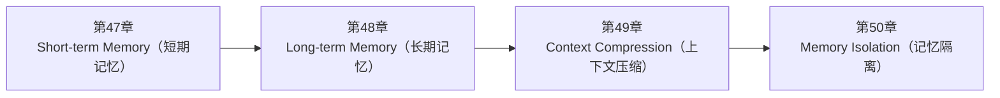

<!--
Chapter: 106
Node: SUMMARY-PART-11
Score: 100
Status: AUTO-GENERATED
Generated: summary
-->

# 第106章 【小结】第十一部分：记忆与上下文管理 (ch47-ch50)

> **速读指南**：本章是「第十一部分：记忆与上下文管理」的精华浓缩（共4个核心知识点）。
> 如果时间有限，只读本章即可掌握该部分所有核心概念。
> 重点看：**一、知识点精华一览**（速查表）和 **四、高频面试题精华**（备考必读）。

## 一、知识点精华一览

| 章节 | 概念 | 一句话掌握 |
|------|------|-----------|
| 第47章 | **Short-term Memory（短期记忆）** | 短期记忆 = 把对话历史拼进 Prompt，让无状态的 LLM 看起来'记住了'之前说的话。 |
| 第48章 | **Long-term Memory（长期记忆）** | 长期记忆 = 把重要信息写入外部存储，下次对话通过检索'想起来'，跨越 Context Window 的会话遗忘。 |
| 第49章 | **Context Compression（上下文压缩）** | Context Compression = 把长对话历史'浓缩成会议纪要'，在 token 预算内保留最多有效信息。 |
| 第50章 | **Memory Isolation（记忆隔离）** | 记忆隔离 = 每个用户的记忆空间严格按 user_id 分区，任何跨用户查询都是安全漏洞。 |

## 二、核心原理速记

### 47. Short-term Memory（短期记忆）  `[L1-L2]`

**心智模型**：短期记忆 = 便利贴（桌面上的临时笔记） - 开会时在便利贴上记关键点（上下文） - 会议结束扔掉（会话结束，记忆清空） - 便利贴空间有限（Context Window 有上限） - 便利贴太多就放不下了（Context Window 溢出） 对比：长期记忆 = 笔记本（持久化存储，会议结束后翻看）

**考试要点**：
- 短期记忆 = Context Window 内的消息历史，会话结束自动消失
- LLM 无状态：每次 API 调用独立，通过拼接历史消息模拟记忆
- 上下文管理三策略：滑动窗口 / 摘要压缩 / 重要性过滤
- 裁剪时必须保留 System Prompt，否则 LLM 失去约束

### 48. Long-term Memory（长期记忆）  `[L1-L2]`

**心智模型**：长期记忆 = 笔记本 vs 便利贴（短期记忆） - 便利贴（短期记忆）：开会时记临时内容，会后丢掉 - 笔记本（长期记忆）：重要内容整理后写进笔记本，下次翻阅 - 区别：笔记本的信息需要主动"查找"，不会自动出现在视野中 另一个类比：人类大脑 - 工作记忆（短期）：你现在脑子里想的事情 - 长期记忆：你记住的技能、知识、经历——需要"回忆"才能提取

**考试要点**：
- 长期记忆 = 外部持久化存储，跨会话保留，通过检索按需加载
- 三类长期记忆：情景记忆（具体事件）/ 语义记忆（抽象知识）/ 程序性记忆（操作步骤）
- 必须按 user_id 隔离：否则是 IDOR 漏洞
- 存储前提炼，检索时按需加载：不能全量存储，也不能全量注入

### 49. Context Compression（上下文压缩）  `[L2-L3]`

**心智模型**：Context Compression = 会议纪要 - 开会记录（原始消息）：几十页详细记录 - 会议纪要（压缩后）：一页纸列出关键决策和待办事项 - 下次开会前：看会议纪要而非翻几十页记录 信息量减少了，但关键内容都在。

**考试要点**：
- Context Compression 三策略：滑动窗口 / 摘要压缩 / 重要性过滤
- System Prompt 永远不压缩，它是 Agent 行为的基础
- 压缩触发点：Context Window 80% 时触发，而非等到溢出
- 摘要压缩需要额外一次 LLM 调用，会增加延迟和成本（但节省后续调用成本）

### 50. Memory Isolation（记忆隔离）  `[L2-L3]`

**心智模型**：记忆隔离 = 医院病历系统 - 每位病人（用户）有独立的病历本（记忆空间） - 医生（Agent）只能查看当前病人的病历，无法跨越访问 - 病历用病人ID严格分区，查询时必须携带正确ID - 即使两个病人症状相同，病历也不能混在一起 安全对比： - ✅ 正确：按 patient_id 查询 → SELECT * FROM memory WHERE user_id = ? - ❌ 错误：全局查询 → SELECT * FROM memory WHERE symptom LIKE '%头痛%'

**考试要点**：
- 三级隔离：会话级（thread_id）/ 用户级（user_id 过滤）/ 项目级（tenant_id）
- user_id 必须来自 JWT token，不能接受客户端传入（防 IDOR）
- 记忆搜索必须强制附带 user_id 过滤，禁止全局搜索
- IDOR 漏洞：越权访问其他用户数据，违反记忆隔离是典型场景

## 三、对比与选型速查

| 概念 | 解决的问题 | 最佳适用场景 | 不适合场景/反模式 |
|------|-----------|------------|-----------------|
| **Short-term Memory（短期记忆）** | 人类对话时，我们记住了前面说了什么，才能理解后面的问题 | L1-L2 | 不做任何上下文管理，历史无限增长（后果：Context Window 溢出报错；token 成本随对话长度爆炸式增长） |
| **Long-term Memory（长期记忆）** | 短期记忆的根本缺陷：会话结束即消失 | 记忆写入要做信息提炼：不要直接存储原始对话，提炼出关键事实和偏好 | 把整个对话历史存入长期记忆（后果：存储膨胀；大量噪音使检索质量下降；token 成本高） |
| **Context Compression（上下文压缩）** | 长对话或长任务中，Context Window 面临两个问题： | 压缩触发时机：不要等到 Context Window 快满才压缩，在 80% 时触发 | 不做任何压缩，等到超出 Context Window 再报错（后果：生产环境中长任务报错，用户体验差） |
| **Memory Isolation（记忆隔离）** | SaaS 平台上有数千名用户，他们的对话记忆是私密数据： | L2-L3 | — |

**层级与难度**：

- `L1-L2` **Short-term Memory（短期记忆）**：短期记忆 = 把对话历史拼进 Prompt，让无状态的 LLM 看起来'记住了'之前说的话。
- `L1-L2` **Long-term Memory（长期记忆）**：长期记忆 = 把重要信息写入外部存储，下次对话通过检索'想起来'，跨越 Context Window
- `L2-L3` **Context Compression（上下文压缩）**：Context Compression = 把长对话历史'浓缩成会议纪要'，在 token 预算内保
- `L2-L3` **Memory Isolation（记忆隔离）**：记忆隔离 = 每个用户的记忆空间严格按 user_id 分区，任何跨用户查询都是安全漏洞。

## 四、高频面试题精华

**Q: Agent 的短期记忆是如何实现的？为什么说 LLM 本身是无状态的？**

> **答题要点**：短期记忆 = 便利贴（桌面上的临时笔记） - 开会时在便利贴上记关键点（上下文） - 会议结束扔掉（会话结束，记忆清空） - 便利贴空间有限（Context Window 有上限） - 便利贴太多就放不下了（Context Window 溢出）  对比：长期记忆 = 笔记本（持久化存储，会议结束后翻看）

**Q: Context Window 满了怎么办？有哪些裁剪策略，各有什么 Trade-off？**

> **答题要点**：短期记忆 = 便利贴（桌面上的临时笔记） - 开会时在便利贴上记关键点（上下文） - 会议结束扔掉（会话结束，记忆清空） - 便利贴空间有限（Context Window 有上限） - 便利贴太多就放不下了（Context Window 溢出）  对比：长期记忆 = 笔记本（持久化存储，会议结束后翻看）

**Q: 短期记忆和长期记忆的根本区别是什么？分别存在哪里？**

> **答题要点**：长期记忆 = 笔记本 vs 便利贴（短期记忆） - 便利贴（短期记忆）：开会时记临时内容，会后丢掉 - 笔记本（长期记忆）：重要内容整理后写进笔记本，下次翻阅 - 区别：笔记本的信息需要主动"查找"，不会自动出现在视野中  另一个类比：人类大脑 - 工作记忆（短期）：你现在脑子里想的事情 - 长期记忆：你记住的技能、知识、经历——需要"回忆"才能提取
>
> **最佳实践**：记忆写入要做信息提炼：不要直接存储原始对话，提炼出关键事实和偏好

**Q: Agent 长期记忆的三种类型（情景/语义/程序性）分别适合存什么？**

> **答题要点**：长期记忆 = 笔记本 vs 便利贴（短期记忆） - 便利贴（短期记忆）：开会时记临时内容，会后丢掉 - 笔记本（长期记忆）：重要内容整理后写进笔记本，下次翻阅 - 区别：笔记本的信息需要主动"查找"，不会自动出现在视野中  另一个类比：人类大脑 - 工作记忆（短期）：你现在脑子里想的事情 - 长期记忆：你记住的技能、知识、经历——需要"回忆"才能提取
>
> **最佳实践**：记忆写入要做信息提炼：不要直接存储原始对话，提炼出关键事实和偏好

**Q: 当 Agent 的对话历史超出 Context Window 上限时，你会怎么处理？**

> **答题要点**：Context Compression = 会议纪要 - 开会记录（原始消息）：几十页详细记录 - 会议纪要（压缩后）：一页纸列出关键决策和待办事项 - 下次开会前：看会议纪要而非翻几十页记录 信息量减少了，但关键内容都在。
>
> **最佳实践**：压缩触发时机：不要等到 Context Window 快满才压缩，在 80% 时触发

**Q: 摘要压缩 vs 滑动窗口，各自的适用场景和缺点是什么？**

> **答题要点**：Context Compression = 会议纪要 - 开会记录（原始消息）：几十页详细记录 - 会议纪要（压缩后）：一页纸列出关键决策和待办事项 - 下次开会前：看会议纪要而非翻几十页记录 信息量减少了，但关键内容都在。
>
> **最佳实践**：压缩触发时机：不要等到 Context Window 快满才压缩，在 80% 时触发

**Q: 如何确保多用户 AI 应用中用户A无法读取用户B的记忆？**

> **答题要点**：记忆隔离 = 医院病历系统 - 每位病人（用户）有独立的病历本（记忆空间） - 医生（Agent）只能查看当前病人的病历，无法跨越访问 - 病历用病人ID严格分区，查询时必须携带正确ID - 即使两个病人症状相同，病历也不能混在一起  安全对比： - ✅ 正确：按 patient_id 查询 → SELECT * FROM memory WHERE user_id = ? - ❌ 错误：全局查询 

**Q: user_id 为什么必须来自认证系统，而不能来自用户请求参数？**

> **答题要点**：记忆隔离 = 医院病历系统 - 每位病人（用户）有独立的病历本（记忆空间） - 医生（Agent）只能查看当前病人的病历，无法跨越访问 - 病历用病人ID严格分区，查询时必须携带正确ID - 即使两个病人症状相同，病历也不能混在一起  安全对比： - ✅ 正确：按 patient_id 查询 → SELECT * FROM memory WHERE user_id = ? - ❌ 错误：全局查询 

## 六、知识关联图

## 七、本章自测清单

完成本部分学习后，你应该能够：

- [ ] **Short-term Memory（短期记忆）**：短期记忆 = 把对话历史拼进 Prompt，让无状态的 LLM 看起来'记住了'之前说的话。
- [ ] **Long-term Memory（长期记忆）**：长期记忆 = 把重要信息写入外部存储，下次对话通过检索'想起来'，跨越 Context Window 的会话遗忘。
- [ ] **Context Compression（上下文压缩）**：Context Compression = 把长对话历史'浓缩成会议纪要'，在 token 预算内保留最多有效信息。
- [ ] **Memory Isolation（记忆隔离）**：记忆隔离 = 每个用户的记忆空间严格按 user_id 分区，任何跨用户查询都是安全漏洞。

> 如果某项还不确定，回到对应章节复习后再打勾。
