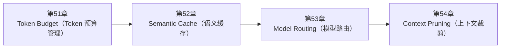

<!--
Chapter: 107
Node: SUMMARY-PART-12
Score: 100
Status: AUTO-GENERATED
Generated: summary
-->

# 第107章 【小结】第十二部分：成本优化 (ch51-ch54)

> **速读指南**：本章是「第十二部分：成本优化」的精华浓缩（共4个核心知识点）。
> 如果时间有限，只读本章即可掌握该部分所有核心概念。
> 重点看：**一、知识点精华一览**（速查表）和 **四、高频面试题精华**（备考必读）。

## 一、知识点精华一览

| 章节 | 概念 | 一句话掌握 |
|------|------|-----------|
| 第51章 | **Token Budget（Token 预算管理）** | Token Budget = 给 AI 调用设报销额度，超限触发降级而非报错，把成本从'事后算账'变成'事前管理'。 |
| 第52章 | **Semantic Cache（语义缓存）** | Semantic Cache = '这问题之前回答过'——用向量相似度找到语义相同的历史问题，直接复用答案，零 LLM 调用成本。 |
| 第53章 | **Model Routing（模型路由）** | Model Routing = 医院分诊，简单问题不占主任号——按任务复杂度自动选模型，成本降 40-60%。 |
| 第54章 | **Context Pruning（上下文裁剪）** | Context Pruning = 发给 LLM 之前先做'减法'，删掉 HTML 标签、低相关 RAG 块、无意义对话，让每个 token 都有用。 |

## 二、核心原理速记

### 51. Token Budget（Token 预算管理）  `[L2-L3]`

**心智模型**：Token Budget = 出差报销额度 - 每次出差（任务）有报销上限（Token 预算） - 超额需要申请特批（降级或拒绝） - 每个员工（用户）有月度报销总额（用户级预算） - 财务部（监控系统）实时追踪使用情况，接近上限发出提醒

**考试要点**：
- Token Budget 四级：调用级 / 任务级 / 用户级 / 全局级
- 超限降级策略：80% 时压缩上下文 → 100% 时切小模型 → 大幅超出时拒绝
- 不能直接报错：要降级而非中断，保障系统可用性
- 记录实际 Token 用量：用于持续优化预算配置

### 52. Semantic Cache（语义缓存）  `[L2-L3]`

**心智模型**：Semantic Cache = 智能搜索引擎的缓存 - 普通 HTTP 缓存：URL 完全一样才命中（精确匹配） - Semantic Cache：意思一样就命中（语义匹配） 类比图书馆： - 你问"有没有讲 AI 的书？" - 图书馆员（缓存系统）知道上次有人问"有什么人工智能书籍推荐？" - 两个问题意思一样，直接给同样的答案，不需要重新查目录（调用 LLM）

**考试要点**：
- Semantic Cache = 基于向量相似度的 LLM 响应缓存，意思相近的问题共享缓存
- 相似度阈值：0.92-0.97，太低错误命中，太高命中率极低
- 不适合缓存：实时数据 / 含个人信息 / 随机性答案
- 实际生产命中率 30-60%，大幅降低 LLM 调用次数

### 53. Model Routing（模型路由）  `[L2-L3]`

**心智模型**：Model Routing = 医院分诊台 - 轻症（简单任务）→ 全科门诊（小模型）：头痛发烧，普通医生能处理 - 中症（中等任务）→ 专科门诊（中型模型）：需要专科知识 - 重症（复杂任务）→ 主任医师（大模型）：复杂病情，需要最强专家 分诊台（Router）的职责：快速判断病情复杂度，路由到最合适的医生 不能所有人都去找主任医师——挤爆了且浪费资源。

**考试要点**：
- 三级路由：规则（$0）→ 小模型（分类/提取）→ 大模型（推理/代码）
- 路由分类器用小模型：分类任务本身简单，用大模型做路由成本反增
- 不确定时路由到大模型：质量优先，宁可多花钱也不输出错误答案
- 实际节省 40-60% 成本，且对复杂任务质量无影响

### 54. Context Pruning（上下文裁剪）  `[L2-L3]`

**心智模型**：Context Pruning = 简历优化 - 没有 Pruning：把 20 年所有工作经历全写上（10 页简历） - 有 Pruning：针对这个职位，只写相关经历（1 页简历） - 结果：招聘官（LLM）更容易找到关键信息，决策更准确 技术类比：数据库查询 - 差：SELECT * FROM users, orders, products, reviews  （全部塞进去） - 好：SELECT u.name, o.total FROM users u JOIN orders o ON ...（只取需要的）

**考试要点**：
- 五类常见 token 浪费：整页 HTML / RAG 全量放入 / 完整 Schema / 无信息量对话 / 无关系统提示
- HTML 裁剪：BeautifulSoup 提取纯文本，节省 80% token
- RAG 过滤：相关性分数 < 0.75 的结果不放入 Prompt
- Pruning（删除）vs Compression（压缩）：前者删除无用，后者浓缩有用

## 三、对比与选型速查

| 概念 | 解决的问题 | 最佳适用场景 | 不适合场景/反模式 |
|------|-----------|------------|-----------------|
| **Token Budget（Token 预算管理）** | LLM API 按 Token 计费，没有预算上限的 AI 系统面临： | 预算告警设在 70-80%，留出缓冲空间做压缩和降级 | 不设预算，等账单来了才发现超支（后果：一次测试或 bug 可能产生意外的高额费用，财务失控） |
| **Semantic Cache（语义缓存）** | 生产环境中，大量用户的问题存在高度重复： | 记录缓存命中率：命中率低于 20% 说明缓存策略需要调整 | 阈值设置过低（< 0.90），不相关的问题被错误命中（后果：用户收到错误答案，系统可靠性崩溃） |
| **Model Routing（模型路由）** | 不同任务的成本差异可以是 50-100 倍： | 路由本身用最便宜的模型：分类任务用小模型，分类结果准确率通常 > 95% | 复杂推理任务路由到小模型（为了省钱）（后果：质量明显下降，用户投诉，得不偿失） |
| **Context Pruning（上下文裁剪）** | AI 应用中五类常见的"token 浪费"： | Pruning 在 Prompt 构建时执行，而非发送后：越早裁剪越省钱 | 整个网页 HTML 直接塞进 Prompt（后果：90% 的 token 是标签噪音，LLM 处理效率低，成本高） |

## 四、高频面试题精华

**Q: 为什么生产级 AI 系统必须设置 Token 预算？不设有什么风险？**

> **答题要点**：Token Budget = 出差报销额度 - 每次出差（任务）有报销上限（Token 预算） - 超额需要申请特批（降级或拒绝） - 每个员工（用户）有月度报销总额（用户级预算） - 财务部（监控系统）实时追踪使用情况，接近上限发出提醒
>
> **最佳实践**：预算告警设在 70-80%，留出缓冲空间做压缩和降级

**Q: Token 预算的四个层级分别控制什么？**

> **答题要点**：Token Budget = 出差报销额度 - 每次出差（任务）有报销上限（Token 预算） - 超额需要申请特批（降级或拒绝） - 每个员工（用户）有月度报销总额（用户级预算） - 财务部（监控系统）实时追踪使用情况，接近上限发出提醒
>
> **最佳实践**：预算告警设在 70-80%，留出缓冲空间做压缩和降级

**Q: Semantic Cache 和传统 HTTP 缓存有什么本质区别？**

> **答题要点**：Semantic Cache = 智能搜索引擎的缓存 - 普通 HTTP 缓存：URL 完全一样才命中（精确匹配） - Semantic Cache：意思一样就命中（语义匹配） 类比图书馆： - 你问"有没有讲 AI 的书？" - 图书馆员（缓存系统）知道上次有人问"有什么人工智能书籍推荐？" - 两个问题意思一样，直接给同样的答案，不需要重新查目录（调用 LLM）
>
> **最佳实践**：记录缓存命中率：命中率低于 20% 说明缓存策略需要调整

**Q: 语义相似度阈值应该怎么设置？太高和太低各有什么问题？**

> **答题要点**：Semantic Cache = 智能搜索引擎的缓存 - 普通 HTTP 缓存：URL 完全一样才命中（精确匹配） - Semantic Cache：意思一样就命中（语义匹配） 类比图书馆： - 你问"有没有讲 AI 的书？" - 图书馆员（缓存系统）知道上次有人问"有什么人工智能书籍推荐？" - 两个问题意思一样，直接给同样的答案，不需要重新查目录（调用 LLM）
>
> **最佳实践**：记录缓存命中率：命中率低于 20% 说明缓存策略需要调整

**Q: 为什么不能所有任务都用最强的 LLM？给出具体的成本数字说明。？**

> **答题要点**：Model Routing = 医院分诊台 - 轻症（简单任务）→ 全科门诊（小模型）：头痛发烧，普通医生能处理 - 中症（中等任务）→ 专科门诊（中型模型）：需要专科知识 - 重症（复杂任务）→ 主任医师（大模型）：复杂病情，需要最强专家 分诊台（Router）的职责：快速判断病情复杂度，路由到最合适的医生 不能所有人都去找主任医师——挤爆了且浪费资源。
>
> **最佳实践**：路由本身用最便宜的模型：分类任务用小模型，分类结果准确率通常 > 95%

**Q: Model Routing 的路由决策本身应该用什么模型？为什么？**

> **答题要点**：Model Routing = 医院分诊台 - 轻症（简单任务）→ 全科门诊（小模型）：头痛发烧，普通医生能处理 - 中症（中等任务）→ 专科门诊（中型模型）：需要专科知识 - 重症（复杂任务）→ 主任医师（大模型）：复杂病情，需要最强专家 分诊台（Router）的职责：快速判断病情复杂度，路由到最合适的医生 不能所有人都去找主任医师——挤爆了且浪费资源。
>
> **最佳实践**：路由本身用最便宜的模型：分类任务用小模型，分类结果准确率通常 > 95%

**Q: 有哪些常见的 Prompt 中的 token 浪费来源？各举一个例子。？**

> **答题要点**：Context Pruning = 简历优化 - 没有 Pruning：把 20 年所有工作经历全写上（10 页简历） - 有 Pruning：针对这个职位，只写相关经历（1 页简历） - 结果：招聘官（LLM）更容易找到关键信息，决策更准确  技术类比：数据库查询 - 差：SELECT * FROM users, orders, products, reviews  （全部塞进去） - 好：SE
>
> **最佳实践**：Pruning 在 Prompt 构建时执行，而非发送后：越早裁剪越省钱

**Q: Context Pruning 和 Context Compression 有什么区别？各自适合什么场景？**

> **答题要点**：Context Pruning = 简历优化 - 没有 Pruning：把 20 年所有工作经历全写上（10 页简历） - 有 Pruning：针对这个职位，只写相关经历（1 页简历） - 结果：招聘官（LLM）更容易找到关键信息，决策更准确  技术类比：数据库查询 - 差：SELECT * FROM users, orders, products, reviews  （全部塞进去） - 好：SE
>
> **最佳实践**：Pruning 在 Prompt 构建时执行，而非发送后：越早裁剪越省钱

## 六、知识关联图

## 七、本章自测清单

完成本部分学习后，你应该能够：

- [ ] **Token Budget（Token 预算管理）**：Token Budget = 给 AI 调用设报销额度，超限触发降级而非报错，把成本从'事后算账'变成'事前管理'。
- [ ] **Semantic Cache（语义缓存）**：Semantic Cache = '这问题之前回答过'——用向量相似度找到语义相同的历史问题，直接复用答案，零 LLM 
- [ ] **Model Routing（模型路由）**：Model Routing = 医院分诊，简单问题不占主任号——按任务复杂度自动选模型，成本降 40-60%。
- [ ] **Context Pruning（上下文裁剪）**：Context Pruning = 发给 LLM 之前先做'减法'，删掉 HTML 标签、低相关 RAG 块、无意义对话

> 如果某项还不确定，回到对应章节复习后再打勾。
