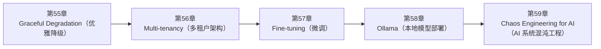

<!--
Chapter: 108
Node: SUMMARY-PART-13
Score: 100
Status: AUTO-GENERATED
Generated: summary
-->

# 第108章 【小结】第十三部分：部署与运维 (ch55-ch59)

> **速读指南**：本章是「第十三部分：部署与运维」的精华浓缩（共5个核心知识点）。
> 如果时间有限，只读本章即可掌握该部分所有核心概念。
> 重点看：**一、知识点精华一览**（速查表）和 **四、高频面试题精华**（备考必读）。

## 一、知识点精华一览

| 章节 | 概念 | 一句话掌握 |
|------|------|-----------|
| 第55章 | **Graceful Degradation（优雅降级）** | Graceful Degradation = AI 系统的'应急预案'，LLM 挂了有备用、超时了有降级、格式错了有兜底，系统永远不完全崩溃。 |
| 第56章 | **Multi-tenancy（多租户架构）** | 多租户 = 写字楼分层管理：同一套 AI 基础设施，多个客户完全隔离使用，数据不混、账单独立、资源公平。 |
| 第57章 | **Fine-tuning（微调）** | Fine-tuning = 岗前专项培训，让模型'本能'输出特定格式或风格，省掉每次带说明书（few-shot）的成本。 |
| 第58章 | **Ollama（本地模型部署）** | Ollama = 把 LLM 装进自家服务器，数据不离开，成本近零，一条命令 ollama run llama3.2 即可开始。 |
| 第59章 | **Chaos Engineering for AI（AI 系统混沌工程）** | Chaos Engineering = 主动给 AI 系统制造故障的消防演练，验证降级策略真正有效，而非'理论上应该能降级'。 |

## 二、核心原理速记

### 55. Graceful Degradation（优雅降级）  `[L2-L3]`

**心智模型**：Graceful Degradation = 飞机失去一个引擎 - 四引擎飞机失去一个引擎，不会坠机 - 飞行员切换到三引擎模式（降级），继续飞行（能力下降但仍可用） - 告知乘客（用户）当前状态，并寻找最近机场降落（恢复全功能） 对比暴力崩溃： - 四引擎飞机失去一个引擎 → 直接坠机（完全不可用） 这在航空中不可接受，在 AI 系统中同样不可接受。

**考试要点**：
- 四级降级：透明切换 → 有限功能 → 静态响应 → 服务通知
- 必须设置 timeout：LLM 调用建议 30s，工具调用建议 10s
- 降级要告知用户：沉默失败比显式降级更难排查
- 降级方案不能依赖故障组件：否则降级本身也会失败

### 56. Multi-tenancy（多租户架构）  `[L2-L3]`

**心智模型**：多租户 = 写字楼的分层管理 - 大楼（AI 平台）：一套基础设施，多家公司共用 - 每层/每个办公室（租户）：有独立门禁（权限）、独立租金（计费） - A 公司员工（用户）只能进 A 公司的办公室，看不到 B 公司的文件 - 大楼保安（认证系统）验证每个人的门卡（JWT），确保访问合法 关键：大楼共享（节省成本），但每个租户完全独立（安全合规）

**考试要点**：
- 四维隔离：数据（tenant_id 过滤）/ 权限（JWT role）/ 计费（独立统计）/ 资源（速率限制）
- tenant_id 必须来自 JWT，不接受客户端传入
- 向量检索也要附带 tenant_id 过滤，否则语义相似查询可能返回其他租户数据
- 权限判断必须在确定性代码中，不能依赖 LLM

### 57. Fine-tuning（微调）  `[L2-L3]`

**心智模型**：Fine-tuning = 岗前培训 vs 每次带说明书 - 没有 Fine-tuning（纯 Prompt）： 每次让实习生做任务，都要附上一本详细说明书（few-shot examples） 实习生看完说明书后才开始做，每次都要从头看 - 有 Fine-tuning： 提前对实习生进行专项培训（训练），让他"本能"掌握这种任务的做法 工作时不需要说明书，自动按培训的方式输出 结果：省掉了说明书（节省 token），做事更快（推理速度），格式更稳定

**考试要点**：
- Fine-tuning 适合：固定格式 / 特定风格 / 保密知识 / 高推理速度
- RAG 适合：频繁更新的知识 / 需要溯源 / 快速落地
- LoRA：冻结原始权重，插入低秩矩阵（A×B），参数量减少 100x+
- 数据质量第一：100 条精品 > 10000 条劣质

### 58. Ollama（本地模型部署）  `[L1-L2]`

**心智模型**：Ollama = 自建咖啡机 vs 去星巴克 去星巴克（云端 API）： - 方便，质量稳定（OpenAI/Claude 服务成熟） - 每杯要钱（Token 计费） - 需要出门（联网） - 你的配方可能被记录（数据发给第三方） 自建咖啡机（Ollama）： - 一次购买咖啡机和豆子（硬件+模型下载） - 每杯成本约等于零（电费可忽略） - 不需要出门（离线可用） - 配方完全保密（数据不离开） 代价：自建咖啡机质量不如专业咖啡师（开源模型弱于 GPT-4o）

**考试要点**：
- Ollama 三大优势：数据私有 / 成本近零 / 离线可用
- 量化：Q4 占 FP32 的 1/8 内存，质量略降但多数场景够用
- OpenAI 兼容接口：base_url=localhost:11434/v1，代码几乎不变
- 适合开发/隐私场景，生产高并发用 VLLM 或云端 API

### 59. Chaos Engineering for AI（AI 系统混沌工程）  `[L2-L3]`

**心智模型**：Chaos Engineering = 消防演练 - 不是等真正着火了才知道灭火器在哪 - 定期演练：拉响火警（注入故障）→ 看员工（系统）是否按预案行动 - 演练结果：发现"原来消防通道被堵了"（降级代码有 bug） - 修复后再演练，直到真正能应对真实火灾

**考试要点**：
- Chaos Engineering = 主动制造故障，在测试环境验证降级策略，而非等生产故障
- AI 特有故障场景：LLM 超时 / 429 限流 / 非法 JSON / Agent 循环 / Token 耗尽
- 演练五步：定义稳态 → 假设 → 注入故障 → 观察 → 修复并重复
- 必须输出演练报告：场景 × 预期 × 实际 × 差距

## 三、对比与选型速查

| 概念 | 解决的问题 | 最佳适用场景 | 不适合场景/反模式 |
|------|-----------|------------|-----------------|
| **Graceful Degradation（优雅降级）** | AI 系统依赖的外部服务（LLM API、向量数据库、搜索引擎）不是 100% 可用的： | 每个外部依赖都要有降级方案：LLM API / RAG / 工具调用全部覆盖 | 没有 timeout，等待 LLM 响应直到连接超时（默认几分钟）（后果：用户等待数分钟，连接池资源被占用，整个系统并发 |
| **Multi-tenancy（多租户架构）** | 企业 AI 平台必须支持多租户： | L2-L3 | 使用 LLM 决定是否有权限访问某个资源（后果：LLM 可被 Prompt Injection 欺骗绕过权限，权限控制必 |
| **Fine-tuning（微调）** | RAG 解决知识问题，Fine-tuning 解决行为问题： | 数据质量 > 数据量：100条高质量样本比 10000 条低质量样本效果更好 | 用脏数据微调（含错误、不一致的输出）（后果：模型学会了错误的行为模式，微调后质量反而下降） |
| **Ollama（本地模型部署）** | 云端 LLM API（OpenAI、Claude）的三个约束： | 开发测试用 Ollama，生产环境考虑云端 API：本地模型用于快速迭代，线上用更强模型 | 在生产环境部署 Ollama 处理高并发请求（后果：Ollama 单线程推理，并发能力有限，高并发时队列积压） |
| **Chaos Engineering for AI（AI 系统混沌工程）** | AI 系统的故障与传统软件不同： | 先在测试环境演练，再考虑生产灰度演练 | — |

**层级与难度**：

- `L2-L3` **Graceful Degradation（优雅降级）**：Graceful Degradation = AI 系统的'应急预案'，LLM 挂了有备用、超时了有
- `L2-L3` **Multi-tenancy（多租户架构）**：多租户 = 写字楼分层管理：同一套 AI 基础设施，多个客户完全隔离使用，数据不混、账单独立、资源公
- `L2-L3` **Fine-tuning（微调）**：Fine-tuning = 岗前专项培训，让模型'本能'输出特定格式或风格，省掉每次带说明书（few
- `L1-L2` **Ollama（本地模型部署）**：Ollama = 把 LLM 装进自家服务器，数据不离开，成本近零，一条命令 ollama run 
- `L2-L3` **Chaos Engineering for AI（AI 系统混沌工程）**：Chaos Engineering = 主动给 AI 系统制造故障的消防演练，验证降级策略真正有效，

## 四、高频面试题精华

**Q: LLM API 超时后你会怎么处理？描述完整的降级链路。？**

> **答题要点**：Graceful Degradation = 飞机失去一个引擎 - 四引擎飞机失去一个引擎，不会坠机 - 飞行员切换到三引擎模式（降级），继续飞行（能力下降但仍可用） - 告知乘客（用户）当前状态，并寻找最近机场降落（恢复全功能）  对比暴力崩溃： - 四引擎飞机失去一个引擎 → 直接坠机（完全不可用） 这在航空中不可接受，在 AI 系统中同样不可接受。
>
> **最佳实践**：每个外部依赖都要有降级方案：LLM API / RAG / 工具调用全部覆盖

**Q: 429 速率限制和 LLM 超时，降级策略有什么不同？**

> **答题要点**：Graceful Degradation = 飞机失去一个引擎 - 四引擎飞机失去一个引擎，不会坠机 - 飞行员切换到三引擎模式（降级），继续飞行（能力下降但仍可用） - 告知乘客（用户）当前状态，并寻找最近机场降落（恢复全功能）  对比暴力崩溃： - 四引擎飞机失去一个引擎 → 直接坠机（完全不可用） 这在航空中不可接受，在 AI 系统中同样不可接受。
>
> **最佳实践**：每个外部依赖都要有降级方案：LLM API / RAG / 工具调用全部覆盖

**Q: 多租户架构需要在哪些维度做隔离？（数据/权限/计费/资源各说一点）？**

> **答题要点**：多租户 = 写字楼的分层管理 - 大楼（AI 平台）：一套基础设施，多家公司共用 - 每层/每个办公室（租户）：有独立门禁（权限）、独立租金（计费） - A 公司员工（用户）只能进 A 公司的办公室，看不到 B 公司的文件 - 大楼保安（认证系统）验证每个人的门卡（JWT），确保访问合法  关键：大楼共享（节省成本），但每个租户完全独立（安全合规）

**Q: 为什么 tenant_id 不能从请求参数读取，必须从 JWT Token 提取？**

> **答题要点**：多租户 = 写字楼的分层管理 - 大楼（AI 平台）：一套基础设施，多家公司共用 - 每层/每个办公室（租户）：有独立门禁（权限）、独立租金（计费） - A 公司员工（用户）只能进 A 公司的办公室，看不到 B 公司的文件 - 大楼保安（认证系统）验证每个人的门卡（JWT），确保访问合法  关键：大楼共享（节省成本），但每个租户完全独立（安全合规）

**Q: Fine-tuning 和 RAG 的核心区别是什么？分别适合什么场景？**

> **答题要点**：Fine-tuning = 岗前培训 vs 每次带说明书  - 没有 Fine-tuning（纯 Prompt）：   每次让实习生做任务，都要附上一本详细说明书（few-shot examples）   实习生看完说明书后才开始做，每次都要从头看  - 有 Fine-tuning：   提前对实习生进行专项培训（训练），让他"本能"掌握这种任务的做法   工作时不需要说明书，自动按培训的方式输出
>
> **最佳实践**：数据质量 > 数据量：100条高质量样本比 10000 条低质量样本效果更好

**Q: LoRA 是什么？为什么它比全量微调更实用？**

> **答题要点**：Fine-tuning = 岗前培训 vs 每次带说明书  - 没有 Fine-tuning（纯 Prompt）：   每次让实习生做任务，都要附上一本详细说明书（few-shot examples）   实习生看完说明书后才开始做，每次都要从头看  - 有 Fine-tuning：   提前对实习生进行专项培训（训练），让他"本能"掌握这种任务的做法   工作时不需要说明书，自动按培训的方式输出
>
> **最佳实践**：数据质量 > 数据量：100条高质量样本比 10000 条低质量样本效果更好

**Q: 什么场景下应该用本地模型（Ollama）而非云端 API？**

> **答题要点**：Ollama = 自建咖啡机 vs 去星巴克  去星巴克（云端 API）： - 方便，质量稳定（OpenAI/Claude 服务成熟） - 每杯要钱（Token 计费） - 需要出门（联网） - 你的配方可能被记录（数据发给第三方）  自建咖啡机（Ollama）： - 一次购买咖啡机和豆子（硬件+模型下载） - 每杯成本约等于零（电费可忽略） - 不需要出门（离线可用） - 配方完全保密（数据不离
>
> **最佳实践**：开发测试用 Ollama，生产环境考虑云端 API：本地模型用于快速迭代，线上用更强模型

**Q: 模型量化（Q4/Q8）是什么？对模型能力有什么影响？**

> **答题要点**：Ollama = 自建咖啡机 vs 去星巴克  去星巴克（云端 API）： - 方便，质量稳定（OpenAI/Claude 服务成熟） - 每杯要钱（Token 计费） - 需要出门（联网） - 你的配方可能被记录（数据发给第三方）  自建咖啡机（Ollama）： - 一次购买咖啡机和豆子（硬件+模型下载） - 每杯成本约等于零（电费可忽略） - 不需要出门（离线可用） - 配方完全保密（数据不离
>
> **最佳实践**：开发测试用 Ollama，生产环境考虑云端 API：本地模型用于快速迭代，线上用更强模型

**Q: Chaos Engineering 在 AI 系统中为什么特别重要？和传统软件有什么不同？**

> **答题要点**：Chaos Engineering = 消防演练 - 不是等真正着火了才知道灭火器在哪 - 定期演练：拉响火警（注入故障）→ 看员工（系统）是否按预案行动 - 演练结果：发现"原来消防通道被堵了"（降级代码有 bug） - 修复后再演练，直到真正能应对真实火灾
>
> **最佳实践**：先在测试环境演练，再考虑生产灰度演练

**Q: 列举 5 个 AI 系统特有的混沌测试场景。？**

> **答题要点**：Chaos Engineering = 消防演练 - 不是等真正着火了才知道灭火器在哪 - 定期演练：拉响火警（注入故障）→ 看员工（系统）是否按预案行动 - 演练结果：发现"原来消防通道被堵了"（降级代码有 bug） - 修复后再演练，直到真正能应对真实火灾
>
> **最佳实践**：先在测试环境演练，再考虑生产灰度演练

## 六、知识关联图

## 七、本章自测清单

完成本部分学习后，你应该能够：

- [ ] **Graceful Degradation（优雅降级）**：Graceful Degradation = AI 系统的'应急预案'，LLM 挂了有备用、超时了有降级、格式错了有兜底
- [ ] **Multi-tenancy（多租户架构）**：多租户 = 写字楼分层管理：同一套 AI 基础设施，多个客户完全隔离使用，数据不混、账单独立、资源公平。
- [ ] **Fine-tuning（微调）**：Fine-tuning = 岗前专项培训，让模型'本能'输出特定格式或风格，省掉每次带说明书（few-shot）的成本。
- [ ] **Ollama（本地模型部署）**：Ollama = 把 LLM 装进自家服务器，数据不离开，成本近零，一条命令 ollama run llama3.2 即
- [ ] **Chaos Engineering for AI（AI 系统混沌工程）**：Chaos Engineering = 主动给 AI 系统制造故障的消防演练，验证降级策略真正有效，而非'理论上应该能降

> 如果某项还不确定，回到对应章节复习后再打勾。
