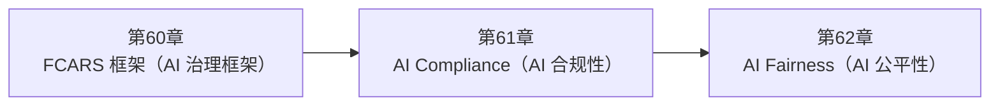

<!--
Chapter: 109
Node: SUMMARY-PART-14
Score: 100
Status: AUTO-GENERATED
Generated: summary
-->

# 第109章 【小结】第十四部分：治理与合规 (ch60-ch62)

> **速读指南**：本章是「第十四部分：治理与合规」的精华浓缩（共3个核心知识点）。
> 如果时间有限，只读本章即可掌握该部分所有核心概念。
> 重点看：**一、知识点精华一览**（速查表）和 **四、高频面试题精华**（备考必读）。

## 一、知识点精华一览

| 章节 | 概念 | 一句话掌握 |
|------|------|-----------|
| 第60章 | **FCARS 框架（AI 治理框架）** | FCARS = AI 系统的适航证检查清单：公平、合规、问责、可靠、安全五维度全过关，才能放心上线。 |
| 第61章 | **AI Compliance（AI 合规性）** | AI 合规 = 在系统设计阶段就把法律红线（GDPR/数据主权/被遗忘权/审计）做进去，而非上线后被罚款再补救。 |
| 第62章 | **AI Fairness（AI 公平性）** | AI 公平性 = 用数字证明不同群体被同等对待，定期运行偏见审计，而非靠'我们没有歧视的主观意图'来保证。 |

## 二、核心原理速记

### 60. FCARS 框架（AI 治理框架）  `[L3-L4]`

**心智模型**：FCARS = 飞机适航检查的 AI 版本 飞机上天前有适航证，检查 5 大系统： - 结构完整性（可靠性 R）：机体是否能承受极端情况？ - 导航系统（准确性）：能否到达目的地？ - 紧急系统（安全性 S）：出故障时能否保护乘客？ - 飞行记录仪（问责性 A）：出事故能否还原经过？ - 适航许可（合规性 C）：是否符合民航局要求？ AI 系统也需要类似的适航检查，FCARS 就是那个检查清单。

**考试要点**：
- FCARS = Fairness / Compliance / Accountability / Reliability / Safety
- Accountability 核心：决策链路可追溯 + Human-in-the-Loop 记录 + 模型版本记录
- Compliance 核心：数据主权 + 知情同意 + 被遗忘权 + 审计日志
- Safety 核心：输入过滤 + 输出过滤 + 最小权限 + 定期安全审计

### 61. AI Compliance（AI 合规性）  `[L3-L4]`

**心智模型**：AI 合规 = 餐厅食品安全证 - 餐厅要营业，必须有食品安全证（合规许可） - 检查项目：食材来源记录（数据来源）、冷链温度日志（审计日志）、 食品标签成分说明（透明度）、过期食材处理记录（数据删除） - 检查员随时可以来查（监管审计） - 通不过检查：停业整顿（业务中断） AI 系统同理：不是"功能好用就行"，监管机构随时可能来审查合规记录。

**考试要点**：
- GDPR 核心权利：访问权 / 更正权 / 删除权（被遗忘权）/ 携带权
- 删除权执行范围：对话历史 + 向量 Embedding + Long-term Memory + 日志中的 PII
- 审计日志必须：不可篡改 + 保留期符合要求（通常 5-7 年）
- 72小时通报义务：数据泄露后 72 小时内通知监管机构

### 62. AI Fairness（AI 公平性）  `[L3-L4]`

**心智模型**：AI 公平性 = 考试评分的公正性 如果一套数学考试的答题纸： - 对男生的评分标准严格一些（通过率 60%） - 对女生的评分标准宽松一些（通过率 80%） 这不是"公平"，这是偏见——即使平均分相同。 AI 公平性评估就是"审查评分标准"： 用数字证明不同群体在相同能力水平下，得到相同结果。

**考试要点**：
- AI 偏见四来源：训练数据偏见 / 特征选择偏见 / 模型放大偏见 / 评估偏见
- 三个公平性指标：Demographic Parity / Equal Opportunity / Calibration
- Equal Opportunity 优于 Demographic Parity：考虑了实际资质差异
- 去偏三层：数据层（重采样）/ Prompt 层（明确要求公平）/ 输出层（监控差异）

## 三、对比与选型速查

| 概念 | 解决的问题 | 最佳适用场景 | 不适合场景/反模式 |
|------|-----------|------------|-----------------|
| **FCARS 框架（AI 治理框架）** | AI 系统上线不只是"功能好用"那么简单，企业和监管机构有更高要求： | L3-L4 | — |
| **AI Compliance（AI 合规性）** | AI 合规不只是法律问题，也是商业问题： | L3-L4 | 把欧洲用户数据存在美国服务器（无数据主权控制）（后果：违反 GDPR 数据转移规定，可被处以高额罚款） |
| **AI Fairness（AI 公平性）** | AI 偏见不只是伦理问题，也是法律和商业问题： | 定期运行公平性审计（至少每季度一次），而非只在上线前做一次 | 认为'LLM 只是工具，偏见责任在用户'（后果：法律责任仍在 AI 系统提供商，无法以此为由免责） |

## 四、高频面试题精华

**Q: FCARS 五个维度分别是什么？各举一个工程实现的例子。？**

> **答题要点**：FCARS = 飞机适航检查的 AI 版本  飞机上天前有适航证，检查 5 大系统： - 结构完整性（可靠性 R）：机体是否能承受极端情况？ - 导航系统（准确性）：能否到达目的地？ - 紧急系统（安全性 S）：出故障时能否保护乘客？ - 飞行记录仪（问责性 A）：出事故能否还原经过？ - 适航许可（合规性 C）：是否符合民航局要求？  AI 系统也需要类似的适航检查，FCARS 就是那个检查清单

**Q: 为什么 AI 系统需要 Accountability？和传统软件系统有什么不同？**

> **答题要点**：FCARS = 飞机适航检查的 AI 版本  飞机上天前有适航证，检查 5 大系统： - 结构完整性（可靠性 R）：机体是否能承受极端情况？ - 导航系统（准确性）：能否到达目的地？ - 紧急系统（安全性 S）：出故障时能否保护乘客？ - 飞行记录仪（问责性 A）：出事故能否还原经过？ - 适航许可（合规性 C）：是否符合民航局要求？  AI 系统也需要类似的适航检查，FCARS 就是那个检查清单

**Q: GDPR 对 AI 系统有哪些特殊要求？（自动化决策、被遗忘权等）？**

> **答题要点**：AI 合规 = 餐厅食品安全证 - 餐厅要营业，必须有食品安全证（合规许可） - 检查项目：食材来源记录（数据来源）、冷链温度日志（审计日志）、   食品标签成分说明（透明度）、过期食材处理记录（数据删除） - 检查员随时可以来查（监管审计） - 通不过检查：停业整顿（业务中断）  AI 系统同理：不是"功能好用就行"，监管机构随时可能来审查合规记录。

**Q: 如果用户行使'被遗忘权'，AI 系统需要删除哪些数据？（考察全面性）？**

> **答题要点**：AI 合规 = 餐厅食品安全证 - 餐厅要营业，必须有食品安全证（合规许可） - 检查项目：食材来源记录（数据来源）、冷链温度日志（审计日志）、   食品标签成分说明（透明度）、过期食材处理记录（数据删除） - 检查员随时可以来查（监管审计） - 通不过检查：停业整顿（业务中断）  AI 系统同理：不是"功能好用就行"，监管机构随时可能来审查合规记录。

**Q: AI 偏见的四个主要来源是什么？各举一个例子。？**

> **答题要点**：AI 公平性 = 考试评分的公正性  如果一套数学考试的答题纸： - 对男生的评分标准严格一些（通过率 60%） - 对女生的评分标准宽松一些（通过率 80%） 这不是"公平"，这是偏见——即使平均分相同。  AI 公平性评估就是"审查评分标准"： 用数字证明不同群体在相同能力水平下，得到相同结果。
>
> **最佳实践**：定期运行公平性审计（至少每季度一次），而非只在上线前做一次

**Q: Demographic Parity 和 Equal Opportunity 有什么区别？各适合什么场景？**

> **答题要点**：AI 公平性 = 考试评分的公正性  如果一套数学考试的答题纸： - 对男生的评分标准严格一些（通过率 60%） - 对女生的评分标准宽松一些（通过率 80%） 这不是"公平"，这是偏见——即使平均分相同。  AI 公平性评估就是"审查评分标准"： 用数字证明不同群体在相同能力水平下，得到相同结果。
>
> **最佳实践**：定期运行公平性审计（至少每季度一次），而非只在上线前做一次

## 六、知识关联图

## 七、本章自测清单

完成本部分学习后，你应该能够：

- [ ] **FCARS 框架（AI 治理框架）**：FCARS = AI 系统的适航证检查清单：公平、合规、问责、可靠、安全五维度全过关，才能放心上线。
- [ ] **AI Compliance（AI 合规性）**：AI 合规 = 在系统设计阶段就把法律红线（GDPR/数据主权/被遗忘权/审计）做进去，而非上线后被罚款再补救。
- [ ] **AI Fairness（AI 公平性）**：AI 公平性 = 用数字证明不同群体被同等对待，定期运行偏见审计，而非靠'我们没有歧视的主观意图'来保证。

> 如果某项还不确定，回到对应章节复习后再打勾。
