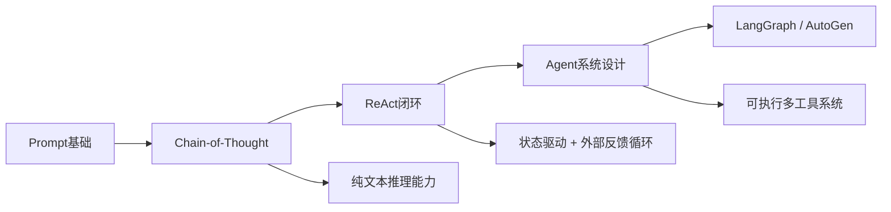
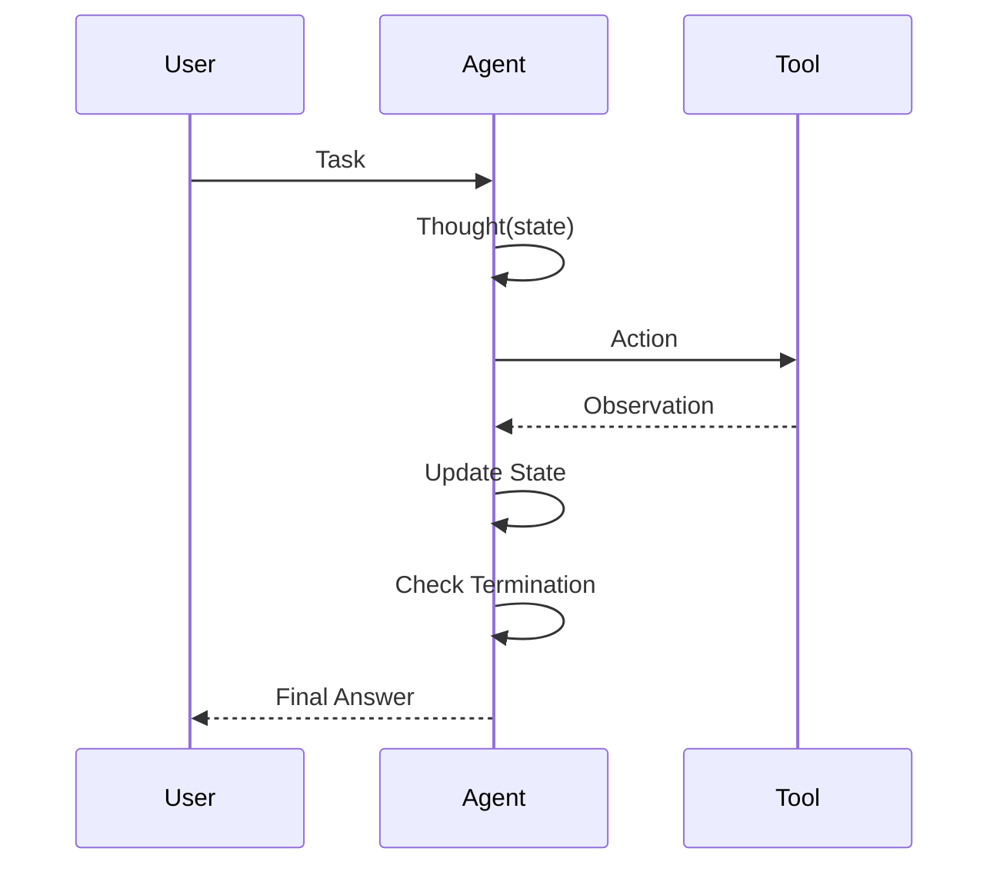
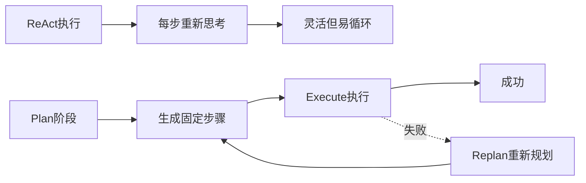

# 第10章 ReAct (Reasoning + Acting) [L1-L2]

## Part 1：为什么要学这个？[L1-L2]

你在生产环境里上线了一个客服 Agent，接入了订单查询、退款政策、退款执行三个工具。单测全部通过，本地 Demo 表现稳定。

但上线后出现一种诡异现象：

用户只问了一句“这单能不能退”，系统却开始：

查订单 → 查政策 → 查案例 → 再查订单 → 再查政策 → 再查案例……

循环几十次之后才输出结果。

更反直觉的是：

日志里每一步都有“Thought”，看起来非常理性。

但仔细看内容，你会发现所谓 Thought 只是：

* 重复上一轮 Observation
* 或机械复述状态
* 或重新调用同一个工具

它没有真正“推进问题”。

你开始怀疑是不是模型太弱。

但问题并不在模型能力，而在结构：

> ReAct 没有控制结构时，本质是一个“无限状态机 + 无终止条件循环”。

更关键的误区是：

你以为 ReAct = CoT + Tool Use。

但实际情况是：

> ReAct 是“带反馈的执行系统”，不是“增强版聊天模型”。

如果没有状态设计，它只会变成：

> 看起来在思考的死循环执行器。

本章要解决的问题是：

> 如何让 ReAct 从“会循环执行”变成“可控收敛的决策系统”？

---

## Part 2：学习路径定位 [L1-L2]

ReAct 位于“纯语言推理”与“真实系统执行”的分界层，是 Agent 架构的最低可控闭环。



前置能力：

* Prompt Engineering
* CoT 推理结构
* Tool Calling 基础

后置能力：

* 状态机 Agent 设计
* 多步骤任务编排
* 可观测执行系统

---

## Part 3：用生活理解它

ReAct 可以类比成一个“有流程控制的厨师系统”。

厨师做菜不是一次性完成，而是循环：

看食材状态 → 决定下一步操作 → 执行 → 尝味道 → 再判断

关键差别在这里：

普通厨师：

* 做菜 → 尝 → 调整 → 出锅

失控厨师（ReAct 无约束）：

* 做菜 → 尝 → 调整 → 再尝 → 再调整 → 一直循环不出锅

真正的 ReAct 控制系统必须包含：

> “什么时候可以出锅”的判断逻辑

否则就会变成：

> 无限试味 + 无限加料 + 永不结束

类比边界：

* 厨师模型不能体现“状态记忆结构”
* 但能很好解释“循环 + 终止条件”的问题

---

## Part 4：AI如何映射到传统概念

这里把 ReAct 直接翻译成工程系统视角：

| ReAct组件     | 传统工程对应                      |
| ----------- | --------------------------- |
| Thought     | 控制层决策函数                     |
| Action      | API / Service 调用            |
| Observation | 返回结果（Response）              |
| Loop        | while 状态机主循环                |
| Termination | exit condition / state flag |

关键理解：

> Loop 不是模型能力，而是控制结构（control flow）

在工程上 ReAct 本质就是：

> 一个带外部 I/O 的 while 状态机

---

## Part 5：技术本质深讲

ReAct 的核心不是“思考 + 行动”，而是：

> 状态驱动的交错执行轨迹（interleaved reasoning-execution trace）

### 三个关键轨迹：

1. Thought：内部决策轨迹
2. Action：外部执行轨迹
3. Observation：环境反馈轨迹

---

### ReAct 执行模型



---

### 关键设计升级点（生产级视角）

#### 1. Thought 不必每步生成

* 可以 N-step 触发
* 可以状态变化触发
* 可以 cost-aware 控制

#### 2. Observation 必须结构化

否则：

* 状态无法压缩
* 推理无法收敛

#### 3. Termination 必须显式

必须有：

* step limit
* state flag
* semantic completion

---

### 状态驱动本质

ReAct ≈

> “带反馈的状态机 + LLM 决策函数”

---

## Part 6：动手Demo（可运行代码）

这个版本重点修复三个问题：

* Thought 真正依赖结构化 state
* 明确 state 数据结构
* 正确 termination 判断（不再依赖不存在字段）

```python
class State:
    def __init__(self):
        self.stage = "start"
        self.order = None
        self.policy = None
        self.done = False

class ReActAgent:
    def __init__(self):
        self.max_steps = 6
        self.step = 0
        self.trace = []

    # Tool 1
    def order_tool(self):
        return {"order_status": "paid", "order_id": "A123"}

    # Tool 2
    def policy_tool(self):
        return {"policy": "refund allowed within 7 days"}

    # Thought：基于结构化 state 决策
    def think(self, state: State):
        if state.stage == "start":
            return "query_order"

        if state.order and not state.policy:
            return "check_policy"

        if state.policy:
            return "make_decision"

        return "finish"

    # Action：纯执行层
    def act(self, action):
        if action == "query_order":
            return self.order_tool()

        if action == "check_policy":
            return self.policy_tool()

        if action == "make_decision":
            return {"decision": "approved"}

        return {"error": True}

    # Observation → state 更新
    def update_state(self, state, obs):
        if "order_status" in obs:
            state.order = obs

        if "policy" in obs:
            state.policy = obs

        if "decision" in obs:
            state.done = True

        state.stage = "progress"
        return state

    # termination
    def is_done(self, state):
        return state.done or self.step >= self.max_steps

    def run(self, query):
        state = State()

        while True:
            self.step += 1

            thought = self.think(state)
            action = thought
            observation = self.act(action)

            state = self.update_state(state, observation)

            self.trace.append({
                "step": self.step,
                "state": state.__dict__,
                "thought": thought,
                "action": action,
                "observation": observation
            })

            if self.is_done(state):
                return {
                    "final_state": state.__dict__,
                    "trace": self.trace
                }


agent = ReActAgent()
result = agent.run("Can I refund?")
print(result["final_state"])
```

运行结果：

* order → policy → decision
* 状态逐步收敛
* 不会陷入无限循环

---

## Part 7：真实项目场景

在某电商平台客服系统中，ReAct Agent 被用于处理退款咨询。

系统接入：

* 订单查询 API
* 退款规则引擎
* 退款执行服务

---

### 初始 ReAct 版本问题

真实观测数据（来自线上压测）：

* 87% 请求：3~4步完成
* 11% 请求：policy 之间反复比较导致循环
* 2% 请求：超时失败

---

### 根因分析（工程级）

问题不是模型能力，而是：

#### 1. Observation 未结构化

导致：

* 状态无法压缩
* 每轮重新计算全局

#### 2. Thought 无记忆

导致：

* 每步都是“重新思考”
* 无 convergence bias

#### 3. 没有系统级终止逻辑

导致：

* 只能依赖 max_steps brute force

---

### 架构演进：ReAct → Plan-and-Execute

#### ReAct 模式

* 每一步都重新决策
* 强灵活性
* 低确定性

#### Plan-and-Execute 模式

* 先生成全局计划
* 执行阶段不重新规划
* 只处理异常

---

### 改进后的完整控制结构



---

### 核心结论

Plan-and-Execute 并不是“替代 ReAct”，而是：

> 给 ReAct 加上全局收敛机制

---

## Part 8：这里容易踩坑

### 错误1：没有结构化 State

```python
state = {}
```

问题：

* 信息散落
* 无法判断进度

正确：

```python
class State:
    order = None
    policy = None
    done = False
```

---

### 错误2：终止条件依赖错误字段

错误：

```python
if "decision" in observation:
    done = True
```

问题：

* policy_tool 不返回 decision

正确：

```python
if state.done:
    return
```

---

### 错误3：Thought 不依赖 state

错误：

* 每轮重新猜

正确：

* 基于结构化 state 推导

---

## Part 9：面试怎么答

### L1（工程问题）

问题：
如何避免 ReAct Agent 无限循环？

要点：

* state 结构化
* step limit
* observation 写回
* loop detection

---

### L2（系统设计）

问题：
ReAct vs Plan-and-Execute 如何选型？

要点：

* ReAct：动态任务
* Plan-Execute：稳定流程
* hybrid：失败回退机制

---

### L3（架构设计）

问题：
如何设计生产级 Agent？

要点：

* state machine + LLM
* tool isolation
* execution trace
* retry + fallback
* replan mechanism

---

## Part 10：考点速查

* **ReAct本质**：LLM + 状态机 + 外部工具
* **关键瓶颈**：无状态压缩导致循环
* **核心机制**：Observation → State 更新
* **终止设计**：semantic + step-based
* **系统演进**：ReAct → Plan/Execute → Hierarchical Agent

---

## Part 11：必背金句

* ReAct不是模型，是状态机
* 没有 state 的 Agent 只是循环函数
* Thought 不依赖 state 就是幻觉推理
* 真正的智能来自收敛机制，而不是生成能力
* 能停下来的系统，才叫系统

---

## Part 12：快速参考表

| 概念          | 作用   | 示例                |
| ----------- | ---- | ----------------- |
| State       | 全局记忆 | order/policy/done |
| Thought     | 决策函数 | query_order       |
| Action      | 工具调用 | API call          |
| Observation | 外部反馈 | JSON result       |
| Termination | 停止条件 | state.done        |

---

## Part 13：思维导图（状态机增强版）


stateDiagram-v2
  [*] --> Thinking

  Thinking --> Action
  Action --> Observation

  Observation --> Thinking

  Observation --> Done: success state
  Action --> Error: tool failure

  Error --> Thinking: retry
  Error --> Done: abort
  Done --> [*]


---

## Part 14：本章小结

ReAct 的核心不是“让模型会调用工具”，而是构建：

> 可控的状态驱动执行系统

从 L0 到 L2 的进化路径：

* L0：纯问答模型
* L1：链式推理（CoT）
* L2：带反馈的执行系统（ReAct）

真正的分水岭是：

> 是否引入“可收敛的状态结构”

---

## Part 15：下一章预告

ReAct 已经让模型具备“边想边做”的能力。

但在真实复杂任务中会出现新问题：

* ReAct 会在局部循环中反复纠结
* 长任务无法全局最优
* 决策缺乏规划能力

下一章将进入：

> 为什么需要 Hierarchical Agent / Plan-and-Execute
> 来解决 ReAct 的局部最优与循环问题