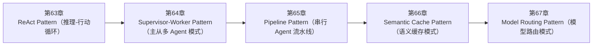

<!--
Chapter: 110
Node: SUMMARY-PART-15
Score: 100
Status: AUTO-GENERATED
Generated: summary
-->

# 第110章 【小结】第十五部分：Agent 设计模式 (ch63-ch67)

> **速读指南**：本章是「第十五部分：Agent 设计模式」的精华浓缩（共5个核心知识点）。
> 如果时间有限，只读本章即可掌握该部分所有核心概念。
> 重点看：**一、知识点精华一览**（速查表）和 **四、高频面试题精华**（备考必读）。

## 一、知识点精华一览

| 章节 | 概念 | 一句话掌握 |
|------|------|-----------|
| 第63章 | **ReAct Pattern（推理-行动循环）** | ReAct = 侦探破案：先推理（Thought）再行动（Action）再看证据（Observation），基于真实结果循环，而非凭感觉猜。 |
| 第64章 | **Supervisor-Worker Pattern（主从多 Agent 模式）** | Supervisor-Worker = 项目经理+专家团队：主控 Agent 分解任务派活，专业 Worker 各司其职并行执行，比单 Agent 更快更专。 |
| 第65章 | **Pipeline Pattern（串行 Agent 流水线）** | Pipeline = 工厂流水线：多个专职 Agent 按固定顺序依次处理，前步产出是后步原料，简单清晰，适合流程固定的任务。 |
| 第66章 | **Semantic Cache Pattern（语义缓存模式）** | 语义缓存 = 向量相似度版的 Redis：意思一样的问题复用缓存，不管措辞怎么变，命中率 30-60%，省一半 LLM 调用。 |
| 第67章 | **Model Routing Pattern（模型路由模式）** | Model Routing = 智能分诊：按任务复杂度自动选模型，简单问题不占大模型资源，成本降 40-60% 且质量不打折。 |

## 二、核心原理速记

### 63. ReAct Pattern（推理-行动循环）  `[L1-L2]`

**心智模型**：ReAct = 侦探破案 - 侦探（Agent）不会凭直觉下结论 - 每次推理（Thought）："凶手可能在现场留下了指纹" - 采取行动（Action）：去勘查现场，取指纹样本 - 观察结果（Observation）："发现了三枚指纹，其中一枚与嫌疑人匹配" - 基于证据再推理，直到得出结论 不是靠"感觉"，而是靠"证据循环"得出答案。

**考试要点**：
- ReAct = Thought（推理）→ Action（工具调用）→ Observation（观察结果）→ 循环
- 必须设置 max_iterations：防止无限循环，建议 10-20 次
- Thought 是可观测的推理链路，是调试 Agent 行为的核心
- Final Answer 出现即终止：不继续循环

### 64. Supervisor-Worker Pattern（主从多 Agent 模式）  `[L2-L3]`

**心智模型**：Supervisor-Worker = 项目经理 + 专家团队 - 项目经理（Supervisor）：不亲自写代码，但负责： 分解需求、分配任务给合适的专家、跟进进度、汇总交付 - 专家（Worker）：只做自己专业领域的事： 前端工程师只写 UI、后端工程师只写 API、DBA 只优化数据库 - 结果：比一个"全栈"员工（单 Agent）更快、更专业

**考试要点**：
- Supervisor：任务分解+调度+汇总；Worker：专注子任务执行
- vs Pipeline：Supervisor-Worker 动态调度，Pipeline 静态顺序
- Worker 最小权限：只给完成任务所需的工具，不多给
- Supervisor 不执行：只调度，保持全局视角

### 65. Pipeline Pattern（串行 Agent 流水线）  `[L1-L2]`

**心智模型**：Pipeline = 工厂流水线 - 汽车工厂：焊接 → 喷漆 → 组装 → 质检 - 每道工序专注一件事，按固定顺序进行 - 上一道工序的成品是下一道的原料 - 不需要"总工程师"实时调度，流程本身就是调度

**考试要点**：
- Pipeline = 固定顺序，单向流动，前步输出是后步输入
- 适合场景：步骤固定、不需要动态调度（文章生成、数据处理流程）
- 步骤间传结构化数据，不传完整历史：控制 Context 膨胀
- 配合 Checkpoint：中间步骤持久化，失败时从断点恢复而非重头

### 66. Semantic Cache Pattern（语义缓存模式）  `[L2-L3]`

**心智模型**：语义缓存 = 聪明的图书馆员 - 普通缓存（书名精确匹配）：只有书名完全一样才找到 - 语义缓存（主题匹配）：知道"人工智能"和"AI"是同一类书 读者（用户）问"有讲机器学习的书吗？" 图书馆员（缓存）想起上周有人问过"机器学习入门资料有哪些？" 给了同样的推荐，没有重新查目录（调用 LLM）。

**考试要点**：
- 语义缓存 = 向量相似度匹配，意思相近共享缓存，而非字符串精确匹配
- 阈值推荐：0.92-0.97，低了返回错误答案，高了命中率极低
- 不缓存：实时数据 / 个人数据 / 随机内容
- key 需要包含 System Prompt 哈希，不同 System Prompt 下隔离缓存

### 67. Model Routing Pattern（模型路由模式）  `[L2-L3]`

**心智模型**：Model Routing = 医院智能分诊 - 急诊室（大模型）：处理复杂、紧急、高难度案例 - 全科门诊（小模型）：处理常见病、简单症状 - 自助检查站（规则引擎）：体温、血压等简单测量 分诊台（Router）在 30 秒内判断病情复杂度， 把患者送到效率最高的处理点， 而不是让所有人都排队等主任医师。

**考试要点**：
- 三级路由：规则（$0）→ 小模型（分类/提取）→ 大模型（推理/代码）
- 路由器本身用最便宜方式：规则 > 小模型，不用大模型做路由
- 不确定时偏向大模型：质量优先，错误路由比超支更危险
- 成本节省 40-60%，配合语义缓存效果更佳

## 三、对比与选型速查

| 概念 | 解决的问题 | 最佳适用场景 | 不适合场景/反模式 |
|------|-----------|------------|-----------------|
| **ReAct Pattern（推理-行动循环）** | 纯 LLM 对话（无 ReAct）的两个致命缺陷： | 必须设置 max_iterations（建议 10-20）：防止 Agent 无限循环 | 不设 max_iterations，Agent 进入无限 Thought-Action 循环（后果：Token 耗尽或任 |
| **Supervisor-Worker Pattern（主从多 Agent 模式）** | 单 Agent 面对复杂任务的三个瓶颈： | 每个 Worker 只有完成自己任务所需的最小工具集（最小权限原则） | Supervisor 自己也参与执行任务（Supervisor 变成 Worker）（后果：Supervisor 的 C |
| **Pipeline Pattern（串行 Agent 流水线）** | 很多 AI 任务天然是顺序的： | 每个 Agent 的 System Prompt 只描述当前步骤的职责，不包含整体任务 | 把所有逻辑放进一个超大 Agent（单步 Pipeline）（后果：Context 过长，LLM 难以聚焦；无法分步调试 |
| **Semantic Cache Pattern（语义缓存模式）** | 生产 AI 系统中，大量请求是高度相似的重复性问题： | 为缓存条目设置 TTL：知识类 7 天，实时类不缓存，政策类按更新频率设 | 全局单一命名空间，不区分 System Prompt 或用户（后果：同一问题在不同角色/用户下的答案不同，缓存命中返回错 |
| **Model Routing Pattern（模型路由模式）** | LLM 的能力和成本是正相关的： | 路由决策本身用最便宜的方式：规则 > 小模型 embedding > 小模型分类器 | 用大模型做路由分类（本末倒置）（后果：路由本身的成本超过节省的成本） |

**层级与难度**：

- `L1-L2` **ReAct Pattern（推理-行动循环）**：ReAct = 侦探破案：先推理（Thought）再行动（Action）再看证据（Observati
- `L2-L3` **Supervisor-Worker Pattern（主从多 Agent 模式）**：Supervisor-Worker = 项目经理+专家团队：主控 Agent 分解任务派活，专业 W
- `L1-L2` **Pipeline Pattern（串行 Agent 流水线）**：Pipeline = 工厂流水线：多个专职 Agent 按固定顺序依次处理，前步产出是后步原料，简单
- `L2-L3` **Semantic Cache Pattern（语义缓存模式）**：语义缓存 = 向量相似度版的 Redis：意思一样的问题复用缓存，不管措辞怎么变，命中率 30-60
- `L2-L3` **Model Routing Pattern（模型路由模式）**：Model Routing = 智能分诊：按任务复杂度自动选模型，简单问题不占大模型资源，成本降 4

## 四、高频面试题精华

**Q: ReAct Pattern 的 Thought / Action / Observation 三步分别做什么？**

> **答题要点**：ReAct = 侦探破案 - 侦探（Agent）不会凭直觉下结论 - 每次推理（Thought）："凶手可能在现场留下了指纹" - 采取行动（Action）：去勘查现场，取指纹样本 - 观察结果（Observation）："发现了三枚指纹，其中一枚与嫌疑人匹配" - 基于证据再推理，直到得出结论 不是靠"感觉"，而是靠"证据循环"得出答案。
>
> **最佳实践**：必须设置 max_iterations（建议 10-20）：防止 Agent 无限循环

**Q: 为什么 ReAct 比纯 LLM 对话更适合 Agent 场景？**

> **答题要点**：ReAct = 侦探破案 - 侦探（Agent）不会凭直觉下结论 - 每次推理（Thought）："凶手可能在现场留下了指纹" - 采取行动（Action）：去勘查现场，取指纹样本 - 观察结果（Observation）："发现了三枚指纹，其中一枚与嫌疑人匹配" - 基于证据再推理，直到得出结论 不是靠"感觉"，而是靠"证据循环"得出答案。
>
> **最佳实践**：必须设置 max_iterations（建议 10-20）：防止 Agent 无限循环

**Q: Supervisor-Worker 模式中，Supervisor 和 Worker 各自的职责是什么？**

> **答题要点**：Supervisor-Worker = 项目经理 + 专家团队 - 项目经理（Supervisor）：不亲自写代码，但负责：   分解需求、分配任务给合适的专家、跟进进度、汇总交付 - 专家（Worker）：只做自己专业领域的事：   前端工程师只写 UI、后端工程师只写 API、DBA 只优化数据库 - 结果：比一个"全栈"员工（单 Agent）更快、更专业
>
> **最佳实践**：每个 Worker 只有完成自己任务所需的最小工具集（最小权限原则）

**Q: 与 Pipeline 模式相比，Supervisor-Worker 的优势和代价是什么？**

> **答题要点**：Supervisor-Worker = 项目经理 + 专家团队 - 项目经理（Supervisor）：不亲自写代码，但负责：   分解需求、分配任务给合适的专家、跟进进度、汇总交付 - 专家（Worker）：只做自己专业领域的事：   前端工程师只写 UI、后端工程师只写 API、DBA 只优化数据库 - 结果：比一个"全栈"员工（单 Agent）更快、更专业
>
> **最佳实践**：每个 Worker 只有完成自己任务所需的最小工具集（最小权限原则）

**Q: Pipeline Pattern 和 Supervisor-Worker 各自适合什么场景？**

> **答题要点**：Pipeline = 工厂流水线 - 汽车工厂：焊接 → 喷漆 → 组装 → 质检 - 每道工序专注一件事，按固定顺序进行 - 上一道工序的成品是下一道的原料 - 不需要"总工程师"实时调度，流程本身就是调度
>
> **最佳实践**：每个 Agent 的 System Prompt 只描述当前步骤的职责，不包含整体任务

**Q: 如何避免 Pipeline 中某一步的输出过大导致后续步骤 Context 溢出？**

> **答题要点**：Pipeline = 工厂流水线 - 汽车工厂：焊接 → 喷漆 → 组装 → 质检 - 每道工序专注一件事，按固定顺序进行 - 上一道工序的成品是下一道的原料 - 不需要"总工程师"实时调度，流程本身就是调度
>
> **最佳实践**：每个 Agent 的 System Prompt 只描述当前步骤的职责，不包含整体任务

**Q: 语义缓存和传统 HTTP 缓存的本质区别是什么？**

> **答题要点**：语义缓存 = 聪明的图书馆员 - 普通缓存（书名精确匹配）：只有书名完全一样才找到 - 语义缓存（主题匹配）：知道"人工智能"和"AI"是同一类书 读者（用户）问"有讲机器学习的书吗？" 图书馆员（缓存）想起上周有人问过"机器学习入门资料有哪些？" 给了同样的推荐，没有重新查目录（调用 LLM）。
>
> **最佳实践**：为缓存条目设置 TTL：知识类 7 天，实时类不缓存，政策类按更新频率设

**Q: 相似度阈值怎么调？太低和太高各有什么问题？**

> **答题要点**：语义缓存 = 聪明的图书馆员 - 普通缓存（书名精确匹配）：只有书名完全一样才找到 - 语义缓存（主题匹配）：知道"人工智能"和"AI"是同一类书 读者（用户）问"有讲机器学习的书吗？" 图书馆员（缓存）想起上周有人问过"机器学习入门资料有哪些？" 给了同样的推荐，没有重新查目录（调用 LLM）。
>
> **最佳实践**：为缓存条目设置 TTL：知识类 7 天，实时类不缓存，政策类按更新频率设

**Q: Model Routing 解决了什么问题？不做路由的成本代价是多少？**

> **答题要点**：Model Routing = 医院智能分诊 - 急诊室（大模型）：处理复杂、紧急、高难度案例 - 全科门诊（小模型）：处理常见病、简单症状 - 自助检查站（规则引擎）：体温、血压等简单测量  分诊台（Router）在 30 秒内判断病情复杂度， 把患者送到效率最高的处理点， 而不是让所有人都排队等主任医师。
>
> **最佳实践**：路由决策本身用最便宜的方式：规则 > 小模型 embedding > 小模型分类器

**Q: 路由决策本身应该用什么方式实现？为什么不能用大模型做路由？**

> **答题要点**：Model Routing = 医院智能分诊 - 急诊室（大模型）：处理复杂、紧急、高难度案例 - 全科门诊（小模型）：处理常见病、简单症状 - 自助检查站（规则引擎）：体温、血压等简单测量  分诊台（Router）在 30 秒内判断病情复杂度， 把患者送到效率最高的处理点， 而不是让所有人都排队等主任医师。
>
> **最佳实践**：路由决策本身用最便宜的方式：规则 > 小模型 embedding > 小模型分类器

## 六、知识关联图

## 七、本章自测清单

完成本部分学习后，你应该能够：

- [ ] **ReAct Pattern（推理-行动循环）**：ReAct = 侦探破案：先推理（Thought）再行动（Action）再看证据（Observation），基于真实结果
- [ ] **Supervisor-Worker Pattern（主从多 Agent 模式）**：Supervisor-Worker = 项目经理+专家团队：主控 Agent 分解任务派活，专业 Worker 各司其职
- [ ] **Pipeline Pattern（串行 Agent 流水线）**：Pipeline = 工厂流水线：多个专职 Agent 按固定顺序依次处理，前步产出是后步原料，简单清晰，适合流程固定的
- [ ] **Semantic Cache Pattern（语义缓存模式）**：语义缓存 = 向量相似度版的 Redis：意思一样的问题复用缓存，不管措辞怎么变，命中率 30-60%，省一半 LLM 
- [ ] **Model Routing Pattern（模型路由模式）**：Model Routing = 智能分诊：按任务复杂度自动选模型，简单问题不占大模型资源，成本降 40-60% 且质量不

> 如果某项还不确定，回到对应章节复习后再打勾。
