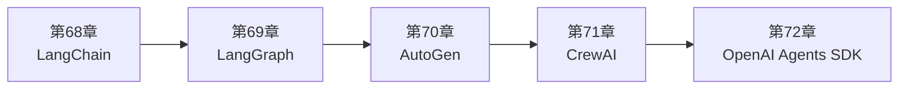

<!--
Chapter: 111
Node: SUMMARY-PART-16
Score: 100
Status: AUTO-GENERATED
Generated: summary
-->

# 第111章 【小结】第十六部分：主流框架 (ch68-ch72)

> **速读指南**：本章是「第十六部分：主流框架」的精华浓缩（共5个核心知识点）。
> 如果时间有限，只读本章即可掌握该部分所有核心概念。
> 重点看：**一、知识点精华一览**（速查表）和 **四、高频面试题精华**（备考必读）。

## 一、知识点精华一览

| 章节 | 概念 | 一句话掌握 |
|------|------|-----------|
| 第68章 | **LangChain** | LangChain = AI 应用的 Spring Framework，统一封装 LLM/RAG/Memory/Tool，换模型只改一行代码。 |
| 第69章 | **LangGraph** | LangGraph = 有状态的乐高积木：用图状态机编排 Agent 循环，Checkpoint 支持断点续跑，Human-in-the-Loop 支持人工介入。 |
| 第70章 | **AutoGen** | AutoGen = AI 版 Slack 群聊：多个 Agent 互相对话讨论，UserProxyAgent 负责真正执行代码，适合代码生成验证和多角色协商。 |
| 第71章 | **CrewAI** | CrewAI = 组建专业团队：给每个 Agent 写 JD（role+goal+backstory），分配 Task，团队 kick off，适合角色扮演式多 Agent 协作原型。 |
| 第72章 | **OpenAI Agents SDK** | OpenAI Agents SDK = 客服转接系统：Agent 把对话移交（Handoff）给专业同事，极简 API，适合 OpenAI 技术栈的多 Agent 分诊。 |

## 二、核心原理速记

### 68. LangChain  `[L1-L2]`

**心智模型**：LangChain = AI 应用的 Spring Framework - Spring（Java Web 开发）：统一封装了数据库、HTTP、缓存等基础设施 - LangChain（AI 应用开发）：统一封装了 LLM、RAG、Memory、Tool 等 AI 基础设施 有了 Spring，写 Web 应用不需要自己实现 JDBC、Servlet； 有了 LangChain，写 AI 应用不需要自己实现 Embedding、Retriever、Chain。

**考试要点**：
- LangChain 核心：LLM 统一接口 + RAG 组件 + LCEL 管道
- LCEL：prompt ｜ llm ｜ parser，管道符组合，支持流式输出
- LangChain vs LangGraph：前者线性无状态，后者图状态机有状态，配合使用
- 切换 LLM 供应商只改一行：from langchain_anthropic import ChatAnthropic

### 69. LangGraph  `[L2-L3]`

**心智模型**：LangGraph = 有状态的乐高积木 - 每个积木（节点）是一个功能模块（搜索、分析、写作） - 积木之间的连接（边）定义了执行顺序 - 状态盒子（State）在所有积木之间共享，记录当前进度 - 快照功能（Checkpoint）随时保存当前拼接进度 可以随时暂停、回溯、继续，而不是一条直线从头跑到尾。

**考试要点**：
- LangGraph = 图状态机：Node（函数）+ Edge（顺序）+ State（共享数据）
- Checkpoint：每步持久化，长任务断点续跑，生产用 PostgresSaver
- Human-in-the-Loop：interrupt_before=['node_name'] 在节点前暂停
- LangGraph vs LangChain：有状态循环用 LangGraph，线性无状态用 LangChain

### 70. AutoGen  `[L2-L3]`

**心智模型**：AutoGen = AI 版的 Slack 群聊 - 每个 Agent 是群里的一个成员（PM、工程师、测试） - 他们就一个任务展开讨论，互相提问和反驳 - UserProxyAgent 是那个真的去执行代码的人 - GroupChatManager 是群主，决定每次谁发言 - 讨论持续到问题解决或达到最大轮数

**考试要点**：
- AutoGen 核心：Agent 对话驱动，AssistantAgent（推理）+ UserProxyAgent（执行）
- 代码执行必须 Docker 隔离：use_docker=True
- vs LangGraph：AutoGen 对话驱动灵活但不可控；LangGraph 图结构可控但需要预设计
- max_consecutive_auto_reply：防止无限对话循环的关键参数

### 71. CrewAI  `[L2]`

**心智模型**：CrewAI = 组建一支专业团队 - 你是 CEO，需要完成一个项目 - 招聘过程：给每个职位写 JD（role + goal + backstory） - 任务分配：给每个职位分配具体工作（Task） - 团队作战：团队按顺序或主从方式完成所有任务（Crew） 不需要写代码逻辑，只需要"写 JD"和"分配任务"。

**考试要点**：
- CrewAI 三要素：Agent（role/goal/backstory）+ Task（description/expected_output）+ Crew（Process）
- Process：sequential（顺序）或 hierarchical（主从，有 Manager Agent）
- 适合：原型验证、内容生成；不适合：精确状态控制的生产系统
- context=[task] 表示任务依赖，后续任务能读前置任务输出

### 72. OpenAI Agents SDK  `[L1-L2]`

**心智模型**：OpenAI Agents SDK = 客服转接系统 - 前台客服（Triage Agent）：接听所有来电，判断类型 - 技术支持（Tech Agent）：处理技术问题 - 退款专员（Refund Agent）：处理退款问题 - 转接（Handoff）：前台说"我现在把你转接给技术支持" → 技术支持接管对话，前台退出 多 Agent 协作 = 客服系统的分机转接，而非复杂的图结构。

**考试要点**：
- OpenAI Agents SDK 核心：Agent（instructions+tools+handoffs）+ Runner
- Handoff：Agent 移交控制权，对话历史传递给新 Agent
- vs Tool Call：Handoff 改变活跃 Agent，Tool Call 调用后返回原 Agent
- 适合：OpenAI 技术栈、客服分诊；不适合：需要 Checkpoint 的复杂长任务

## 三、对比与选型速查

| 概念 | 解决的问题 | 最佳适用场景 | 不适合场景/反模式 |
|------|-----------|------------|-----------------|
| **LangChain** | 直接调用 LLM API 构建 AI 应用的痛点： | 用 LCEL 替代老版 Chain（LLMChain）：更简洁、支持流式、可并行 | 用 LangChain 实现复杂 Agent（需要循环和状态管理的场景）（后果：LangChain 的 AgentExe |
| **LangGraph** | 生产 Agent 的三个关键需求，LangChain 原生无法满足： | State 使用 TypedDict + Annotated：保证类型安全，明确消息累积策略 | 直接在节点里修改全局变量（而非返回新的 State 片段）（后果：并行节点时产生竞争条件，状态不可预测） |
| **AutoGen** | 某些复杂任务需要多角色协作和批判性讨论： | 代码执行必须用 Docker 隔离：use_docker=True，防止 Agent 生成的代码破坏宿主机 | 在生产环境用 AutoGen 不设 Docker 隔离直接执行代码（后果：Agent 生成的恶意或错误代码可能损坏系统） |
| **CrewAI** | 对于不熟悉图结构（LangGraph）或对话模型（AutoGen）的团队， | backstory 写得越具体，Agent 行为越可预测：加入具体技能、经验年限、工作方式描述 | 把 CrewAI 用于需要精确状态控制的生产场景（后果：CrewAI 的执行流程灵活但不精确，难以做到生产级可靠性和可观 |
| **OpenAI Agents SDK** | 其他框架（LangGraph/CrewAI）的学习曲线较陡峭， | instructions 要写清楚 Handoff 条件：'当用户问退款时，转接退款专员'（避免 LLM 猜测） | Handoff 链条过深（A→B→C→D→E）（后果：对话历史叠加导致 Context 膨胀，后面的 Agent 被前面 |

**层级与难度**：

- `L1-L2` **LangChain**：LangChain = AI 应用的 Spring Framework，统一封装 LLM/RAG/M
- `L2-L3` **LangGraph**：LangGraph = 有状态的乐高积木：用图状态机编排 Agent 循环，Checkpoint 支
- `L2-L3` **AutoGen**：AutoGen = AI 版 Slack 群聊：多个 Agent 互相对话讨论，UserProxyA
- `L2` **CrewAI**：CrewAI = 组建专业团队：给每个 Agent 写 JD（role+goal+backstory
- `L1-L2` **OpenAI Agents SDK**：OpenAI Agents SDK = 客服转接系统：Agent 把对话移交（Handoff）给专业

## 四、高频面试题精华

**Q: LangChain 解决了什么问题？为什么不直接调用 OpenAI API？**

> **答题要点**：LangChain = AI 应用的 Spring Framework - Spring（Java Web 开发）：统一封装了数据库、HTTP、缓存等基础设施 - LangChain（AI 应用开发）：统一封装了 LLM、RAG、Memory、Tool 等 AI 基础设施 有了 Spring，写 Web 应用不需要自己实现 JDBC、Servlet； 有了 LangChain，写 AI 应用不需要
>
> **最佳实践**：用 LCEL 替代老版 Chain（LLMChain）：更简洁、支持流式、可并行

**Q: LCEL（管道符 |）是什么？相比老版 Chain 有什么优势？**

> **答题要点**：LangChain = AI 应用的 Spring Framework - Spring（Java Web 开发）：统一封装了数据库、HTTP、缓存等基础设施 - LangChain（AI 应用开发）：统一封装了 LLM、RAG、Memory、Tool 等 AI 基础设施 有了 Spring，写 Web 应用不需要自己实现 JDBC、Servlet； 有了 LangChain，写 AI 应用不需要
>
> **最佳实践**：用 LCEL 替代老版 Chain（LLMChain）：更简洁、支持流式、可并行

**Q: LangGraph 中 Node、Edge、State 各是什么？它们如何协作？**

> **答题要点**：LangGraph = 有状态的乐高积木 - 每个积木（节点）是一个功能模块（搜索、分析、写作） - 积木之间的连接（边）定义了执行顺序 - 状态盒子（State）在所有积木之间共享，记录当前进度 - 快照功能（Checkpoint）随时保存当前拼接进度 可以随时暂停、回溯、继续，而不是一条直线从头跑到尾。
>
> **最佳实践**：State 使用 TypedDict + Annotated：保证类型安全，明确消息累积策略

**Q: LangGraph 的 Checkpoint 解决了什么问题？生产中用什么存储？**

> **答题要点**：LangGraph = 有状态的乐高积木 - 每个积木（节点）是一个功能模块（搜索、分析、写作） - 积木之间的连接（边）定义了执行顺序 - 状态盒子（State）在所有积木之间共享，记录当前进度 - 快照功能（Checkpoint）随时保存当前拼接进度 可以随时暂停、回溯、继续，而不是一条直线从头跑到尾。
>
> **最佳实践**：State 使用 TypedDict + Annotated：保证类型安全，明确消息累积策略

**Q: AutoGen 和 LangGraph 的核心区别是什么？各适合什么场景？**

> **答题要点**：AutoGen = AI 版的 Slack 群聊 - 每个 Agent 是群里的一个成员（PM、工程师、测试） - 他们就一个任务展开讨论，互相提问和反驳 - UserProxyAgent 是那个真的去执行代码的人 - GroupChatManager 是群主，决定每次谁发言 - 讨论持续到问题解决或达到最大轮数
>
> **最佳实践**：代码执行必须用 Docker 隔离：use_docker=True，防止 Agent 生成的代码破坏宿主机

**Q: UserProxyAgent 的作用是什么？为什么代码执行要用 Docker？**

> **答题要点**：AutoGen = AI 版的 Slack 群聊 - 每个 Agent 是群里的一个成员（PM、工程师、测试） - 他们就一个任务展开讨论，互相提问和反驳 - UserProxyAgent 是那个真的去执行代码的人 - GroupChatManager 是群主，决定每次谁发言 - 讨论持续到问题解决或达到最大轮数
>
> **最佳实践**：代码执行必须用 Docker 隔离：use_docker=True，防止 Agent 生成的代码破坏宿主机

**Q: CrewAI 的 Agent 三要素是什么？它们如何影响 Agent 的行为？**

> **答题要点**：CrewAI = 组建一支专业团队 - 你是 CEO，需要完成一个项目 - 招聘过程：给每个职位写 JD（role + goal + backstory） - 任务分配：给每个职位分配具体工作（Task） - 团队作战：团队按顺序或主从方式完成所有任务（Crew） 不需要写代码逻辑，只需要"写 JD"和"分配任务"。
>
> **最佳实践**：backstory 写得越具体，Agent 行为越可预测：加入具体技能、经验年限、工作方式描述

**Q: CrewAI 的 sequential 和 hierarchical Process 有什么区别？**

> **答题要点**：CrewAI = 组建一支专业团队 - 你是 CEO，需要完成一个项目 - 招聘过程：给每个职位写 JD（role + goal + backstory） - 任务分配：给每个职位分配具体工作（Task） - 团队作战：团队按顺序或主从方式完成所有任务（Crew） 不需要写代码逻辑，只需要"写 JD"和"分配任务"。
>
> **最佳实践**：backstory 写得越具体，Agent 行为越可预测：加入具体技能、经验年限、工作方式描述

**Q: OpenAI Agents SDK 中 Handoff 和普通 Tool Call 的区别是什么？**

> **答题要点**：OpenAI Agents SDK = 客服转接系统 - 前台客服（Triage Agent）：接听所有来电，判断类型 - 技术支持（Tech Agent）：处理技术问题 - 退款专员（Refund Agent）：处理退款问题 - 转接（Handoff）：前台说"我现在把你转接给技术支持"   → 技术支持接管对话，前台退出 多 Agent 协作 = 客服系统的分机转接，而非复杂的图结构。
>
> **最佳实践**：instructions 要写清楚 Handoff 条件：'当用户问退款时，转接退款专员'（避免 LLM 猜测）

**Q: Handoff 发生时，对话历史是如何传递给新 Agent 的？**

> **答题要点**：OpenAI Agents SDK = 客服转接系统 - 前台客服（Triage Agent）：接听所有来电，判断类型 - 技术支持（Tech Agent）：处理技术问题 - 退款专员（Refund Agent）：处理退款问题 - 转接（Handoff）：前台说"我现在把你转接给技术支持"   → 技术支持接管对话，前台退出 多 Agent 协作 = 客服系统的分机转接，而非复杂的图结构。
>
> **最佳实践**：instructions 要写清楚 Handoff 条件：'当用户问退款时，转接退款专员'（避免 LLM 猜测）

## 六、知识关联图

## 七、本章自测清单

完成本部分学习后，你应该能够：

- [ ] **LangChain**：LangChain = AI 应用的 Spring Framework，统一封装 LLM/RAG/Memory/Tool
- [ ] **LangGraph**：LangGraph = 有状态的乐高积木：用图状态机编排 Agent 循环，Checkpoint 支持断点续跑，Huma
- [ ] **AutoGen**：AutoGen = AI 版 Slack 群聊：多个 Agent 互相对话讨论，UserProxyAgent 负责真正执
- [ ] **CrewAI**：CrewAI = 组建专业团队：给每个 Agent 写 JD（role+goal+backstory），分配 Task，
- [ ] **OpenAI Agents SDK**：OpenAI Agents SDK = 客服转接系统：Agent 把对话移交（Handoff）给专业同事，极简 API，

> 如果某项还不确定，回到对应章节复习后再打勾。
