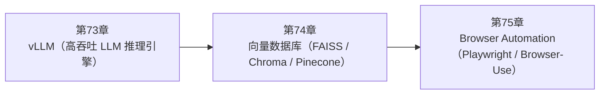

<!--
Chapter: 112
Node: SUMMARY-PART-17
Score: 100
Status: AUTO-GENERATED
Generated: summary
-->

# 第112章 【小结】第十七部分：工具与基础设施 (ch73-ch75)

> **速读指南**：本章是「第十七部分：工具与基础设施」的精华浓缩（共3个核心知识点）。
> 如果时间有限，只读本章即可掌握该部分所有核心概念。
> 重点看：**一、知识点精华一览**（速查表）和 **四、高频面试题精华**（备考必读）。

## 一、知识点精华一览

| 章节 | 概念 | 一句话掌握 |
|------|------|-----------|
| 第73章 | **vLLM（高吞吐 LLM 推理引擎）** | vLLM = 自托管 LLM 的高速引擎：PagedAttention 让 KV Cache 利用率 90%+，同等 GPU 服务 3-10x 更多并发请求，OpenAI API 完全兼容。 |
| 第74章 | **向量数据库（FAISS / Chroma / Pinecone）** | 向量数据库 = 语义地图：文档变坐标存起来，查询时找最近的坐标点，RAG 系统的检索引擎，FAISS/Chroma 本地开发，Pinecone 生产。 |
| 第75章 | **Browser Automation（Playwright / Browser-Use）** | Browser Automation = 给 AI 装眼睛和手：Agent 控制真实浏览器点击填表截图，把没有 API 的 Web 系统变成可编程工具。 |

## 二、核心原理速记

### 73. vLLM（高吞吐 LLM 推理引擎）  `[L3]`

**心智模型**：vLLM PagedAttention = 酒店动态分房间 传统方式（静态分配）： 预先锁定最大 2048 token 对应的内存给每个请求， 即使请求只用了 200 token，剩余的内存也被浪费 vLLM PagedAttention（动态分配）： 像酒店根据客人实际需要动态分配房间—— 客人来一个分一个房间，走了立刻收回再分配给下一个 同等资源，容纳 3-5 倍的并发"客人"（请求）

**考试要点**：
- PagedAttention：KV Cache 动态分页，利用率从 20% 升至 90%+，吞吐提升 3-10x
- 兼容 OpenAI API：只改 base_url，其余代码不变
- vs Ollama：vLLM 生产高并发，Ollama 本地开发
- 量化（AWQ/GPTQ）：显存减半，轻微质量损失，生产性价比高

### 74. 向量数据库（FAISS / Chroma / Pinecone）  `[L1-L2]`

**心智模型**：向量数据库 = 语义地图 - 文档向量化：把"什么是机器学习？"变成地图上的一个坐标点 - 存储：把所有文档的坐标点标在地图上 - 查询：用户问"AI 学习原理是什么？" → 转成坐标 → 找地图上最近的点 距离近的点 = 语义相近的文档，即使用词完全不同

**考试要点**：
- 向量数据库 = 语义搜索：余弦相似度找语义最近邻，而非字符串匹配
- 三选：FAISS（本地研究）/ Chroma（本地开发）/ Pinecone（生产云服务）
- Chunk 大小：300-500 tokens，overlap 10-20%
- 模型升级要重建索引：新旧 Embedding 不在同一向量空间

### 75. Browser Automation（Playwright / Browser-Use）  `[L2-L3]`

**心智模型**：Browser Automation = 给 AI 装了一双眼睛和一双手 - 眼睛（截图/DOM 提取）：Agent 可以"看"到当前页面 - 手（点击/输入）：Agent 可以操作页面 - 大脑（LLM）：理解"要做什么"，决定"点哪里/输入什么" 之前 AI 只能回答"你应该去政府网站填表"； 现在 AI 可以直接帮你打开网站、找到表单、填写提交。

**考试要点**：
- Browser Automation：让 Agent 控制真实浏览器，处理 JavaScript 渲染和复杂交互
- 安全要求：独立 Browser Profile，不用用户真实会话
- Human-in-the-Loop：删除/提交/支付等不可逆操作必须人工确认
- Browser-Use：LLM 友好的 Playwright 封装，直接描述任务，Agent 自动操作

## 三、对比与选型速查

| 概念 | 解决的问题 | 最佳适用场景 | 不适合场景/反模式 |
|------|-----------|------------|-----------------|
| **vLLM（高吞吐 LLM 推理引擎）** | 自托管 LLM 的两个核心痛点： | 生产部署用 Docker + K8s：vllm 官方提供 Docker 镜像 | 把 vLLM 用于本地开发调试（显卡资源要求高）（后果：开发环境用 Ollama 即可，vLLM 的优势在高并发生产场景 |
| **向量数据库（FAISS / Chroma / Pinecone）** | RAG 系统的核心挑战：从海量文档中快速找到与查询最相关的片段 | Chunk 大小选 300-500 tokens：太大检索精度低，太小上下文不足 | 把整篇文档作为一个 Chunk 向量化（后果：向量包含过多信息，检索精度极低（什么都沾边，什么都不精确）） |
| **Browser Automation（Playwright / Browser-Use）** | 很多实际任务需要操作有界面的系统，但这些系统没有 API： | 在独立 Browser Profile 中运行：不使用用户的已登录会话，使用专用账号 | 给 Agent 使用用户的真实浏览器会话（含个人登录状态）（后果：Agent 误操作可能删除真实数据；恶意页面可以通过  |

**层级与难度**：

- `L3` **vLLM（高吞吐 LLM 推理引擎）**：vLLM = 自托管 LLM 的高速引擎：PagedAttention 让 KV Cache 利用率
- `L1-L2` **向量数据库（FAISS / Chroma / Pinecone）**：向量数据库 = 语义地图：文档变坐标存起来，查询时找最近的坐标点，RAG 系统的检索引擎，FAISS
- `L2-L3` **Browser Automation（Playwright / Browser-Use）**：Browser Automation = 给 AI 装眼睛和手：Agent 控制真实浏览器点击填表截

## 四、高频面试题精华

**Q: vLLM 的 PagedAttention 解决了什么问题？原理是什么？**

> **答题要点**：vLLM PagedAttention = 酒店动态分房间 传统方式（静态分配）： 预先锁定最大 2048 token 对应的内存给每个请求， 即使请求只用了 200 token，剩余的内存也被浪费  vLLM PagedAttention（动态分配）： 像酒店根据客人实际需要动态分配房间—— 客人来一个分一个房间，走了立刻收回再分配给下一个 同等资源，容纳 3-5 倍的并发"客人"（请求）
>
> **最佳实践**：生产部署用 Docker + K8s：vllm 官方提供 Docker 镜像

**Q: Continuous Batching 和传统静态 Batching 的区别是什么？**

> **答题要点**：vLLM PagedAttention = 酒店动态分房间 传统方式（静态分配）： 预先锁定最大 2048 token 对应的内存给每个请求， 即使请求只用了 200 token，剩余的内存也被浪费  vLLM PagedAttention（动态分配）： 像酒店根据客人实际需要动态分配房间—— 客人来一个分一个房间，走了立刻收回再分配给下一个 同等资源，容纳 3-5 倍的并发"客人"（请求）
>
> **最佳实践**：生产部署用 Docker + K8s：vllm 官方提供 Docker 镜像

**Q: 向量数据库和传统数据库的本质区别是什么？**

> **答题要点**：向量数据库 = 语义地图 - 文档向量化：把"什么是机器学习？"变成地图上的一个坐标点 - 存储：把所有文档的坐标点标在地图上 - 查询：用户问"AI 学习原理是什么？" → 转成坐标 → 找地图上最近的点 距离近的点 = 语义相近的文档，即使用词完全不同
>
> **最佳实践**：Chunk 大小选 300-500 tokens：太大检索精度低，太小上下文不足

**Q: FAISS、Chroma、Pinecone 各适合什么场景？**

> **答题要点**：向量数据库 = 语义地图 - 文档向量化：把"什么是机器学习？"变成地图上的一个坐标点 - 存储：把所有文档的坐标点标在地图上 - 查询：用户问"AI 学习原理是什么？" → 转成坐标 → 找地图上最近的点 距离近的点 = 语义相近的文档，即使用词完全不同
>
> **最佳实践**：Chunk 大小选 300-500 tokens：太大检索精度低，太小上下文不足

**Q: Browser Automation 解决了什么传统爬虫无法解决的问题？**

> **答题要点**：Browser Automation = 给 AI 装了一双眼睛和一双手 - 眼睛（截图/DOM 提取）：Agent 可以"看"到当前页面 - 手（点击/输入）：Agent 可以操作页面 - 大脑（LLM）：理解"要做什么"，决定"点哪里/输入什么"  之前 AI 只能回答"你应该去政府网站填表"； 现在 AI 可以直接帮你打开网站、找到表单、填写提交。
>
> **最佳实践**：在独立 Browser Profile 中运行：不使用用户的已登录会话，使用专用账号

**Q: 给 AI Agent 使用用户真实浏览器会话的安全风险是什么？**

> **答题要点**：Browser Automation = 给 AI 装了一双眼睛和一双手 - 眼睛（截图/DOM 提取）：Agent 可以"看"到当前页面 - 手（点击/输入）：Agent 可以操作页面 - 大脑（LLM）：理解"要做什么"，决定"点哪里/输入什么"  之前 AI 只能回答"你应该去政府网站填表"； 现在 AI 可以直接帮你打开网站、找到表单、填写提交。
>
> **最佳实践**：在独立 Browser Profile 中运行：不使用用户的已登录会话，使用专用账号

## 六、知识关联图

## 七、本章自测清单

完成本部分学习后，你应该能够：

- [ ] **vLLM（高吞吐 LLM 推理引擎）**：vLLM = 自托管 LLM 的高速引擎：PagedAttention 让 KV Cache 利用率 90%+，同等 G
- [ ] **向量数据库（FAISS / Chroma / Pinecone）**：向量数据库 = 语义地图：文档变坐标存起来，查询时找最近的坐标点，RAG 系统的检索引擎，FAISS/Chroma 本地
- [ ] **Browser Automation（Playwright / Browser-Use）**：Browser Automation = 给 AI 装眼睛和手：Agent 控制真实浏览器点击填表截图，把没有 API 

> 如果某项还不确定，回到对应章节复习后再打勾。
