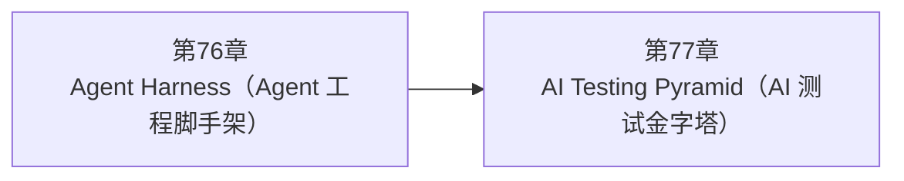

<!--
Chapter: 113
Node: SUMMARY-PART-18
Score: 100
Status: AUTO-GENERATED
Generated: summary
-->

# 第113章 【小结】第十八部分：系统架构 (ch76-ch77)

> **速读指南**：本章是「第十八部分：系统架构」的精华浓缩（共2个核心知识点）。
> 如果时间有限，只读本章即可掌握该部分所有核心概念。
> 重点看：**一、知识点精华一览**（速查表）和 **四、高频面试题精华**（备考必读）。

## 一、知识点精华一览

| 章节 | 概念 | 一句话掌握 |
|------|------|-----------|
| 第76章 | **Agent Harness（Agent 工程脚手架）** | Agent Harness = 飞机仪表板：限速/重试/追踪/日志/成本/超时六层工程基础设施包裹 Agent 核心逻辑，让业务逻辑只关注功能。 |
| 第77章 | **AI Testing Pyramid（AI 测试金字塔）** | AI Testing Pyramid = 建筑质检三关：单元测工具函数、集成测 Agent 行为、E2E + LLM-as-Judge 测输出质量，三层防线保障 AI 系统质量。 |

## 二、核心原理速记

### 76. Agent Harness（Agent 工程脚手架）  `[L2-L3]`

**心智模型**：Agent Harness = 飞机驾驶舱的仪表板 - 飞行员（Agent 业务逻辑）：决定去哪里、怎么飞 - 仪表板（Harness）：显示油量（成本）、高度（进度）、警报（错误） 飞行员不需要亲自去检查每个传感器； 仪表板把所有工程监控数据汇总展示， 飞行员只需要做飞行决策。

**考试要点**：
- Agent Harness 六层：限速、重试、追踪、日志、成本、超时
- 全局超时：asyncio.timeout(300)，防止 Agent 永久挂起
- 指数退避：Rate Limit 后等 2^n 秒再重试（1s, 2s, 4s）
- trace_id：每请求唯一，贯穿所有日志，是生产排查的关键

### 77. AI Testing Pyramid（AI 测试金字塔）  `[L2-L3]`

**心智模型**：AI Testing Pyramid = 建筑质检三关 - 第一关（地基检查）：每块砖（工具函数）质量合格？ - 第二关（施工检查）：各个构件（Agent + 工具）拼在一起能用？ - 第三关（验收检查）：整栋楼（完整 AI 系统）达到入住标准？ 三关都过才能上线，只做最后一关代价太高、发现问题太晚。

**考试要点**：
- 三层：单元（工具函数/Prompt）→ 集成（Agent+工具联动）→ E2E（LLM-as-Judge）
- LLM 输出概率性，不能用 assertEqual，要用 LLM-as-Judge 做语义评估
- E2E Judge 用更强模型：评判者 > 被评判者
- 黄金数据集 50-100 用例：回归测试基线，发现质量退化

## 三、对比与选型速查

| 概念 | 解决的问题 | 最佳适用场景 | 不适合场景/反模式 |
|------|-----------|------------|-----------------|
| **Agent Harness（Agent 工程脚手架）** | 直接运行 Agent 业务逻辑面临的生产问题： | Harness 代码与 Agent 业务代码分离：通过装饰器或中间件注入，不侵入业务代码 | 在每个 Agent 内部分散实现重试/日志/限速逻辑（后果：重复代码，行为不一致，更新困难） |
| **AI Testing Pyramid（AI 测试金字塔）** | 不测试 AI 系统的三个常见事故： | 黄金数据集：维护 50-100 个代表性测试用例，作为回归测试基线 | 只做 E2E 人工评估，不写单元测试（后果：工具函数 bug 要跑完整流程才能发现，调试成本极高） |

## 四、高频面试题精华

**Q: Agent Harness 包含哪些核心组件？各解决什么生产问题？**

> **答题要点**：Agent Harness = 飞机驾驶舱的仪表板 - 飞行员（Agent 业务逻辑）：决定去哪里、怎么飞 - 仪表板（Harness）：显示油量（成本）、高度（进度）、警报（错误） 飞行员不需要亲自去检查每个传感器； 仪表板把所有工程监控数据汇总展示， 飞行员只需要做飞行决策。
>
> **最佳实践**：Harness 代码与 Agent 业务代码分离：通过装饰器或中间件注入，不侵入业务代码

**Q: 为什么限速重试要用指数退避（Exponential Backoff）？**

> **答题要点**：Agent Harness = 飞机驾驶舱的仪表板 - 飞行员（Agent 业务逻辑）：决定去哪里、怎么飞 - 仪表板（Harness）：显示油量（成本）、高度（进度）、警报（错误） 飞行员不需要亲自去检查每个传感器； 仪表板把所有工程监控数据汇总展示， 飞行员只需要做飞行决策。
>
> **最佳实践**：Harness 代码与 Agent 业务代码分离：通过装饰器或中间件注入，不侵入业务代码

**Q: AI 测试金字塔的三层各测什么？为什么这样分层？**

> **答题要点**：AI Testing Pyramid = 建筑质检三关 - 第一关（地基检查）：每块砖（工具函数）质量合格？ - 第二关（施工检查）：各个构件（Agent + 工具）拼在一起能用？ - 第三关（验收检查）：整栋楼（完整 AI 系统）达到入住标准？  三关都过才能上线，只做最后一关代价太高、发现问题太晚。
>
> **最佳实践**：黄金数据集：维护 50-100 个代表性测试用例，作为回归测试基线

**Q: 为什么 AI 测试不能用传统的 assertEqual，要引入 LLM-as-Judge？**

> **答题要点**：AI Testing Pyramid = 建筑质检三关 - 第一关（地基检查）：每块砖（工具函数）质量合格？ - 第二关（施工检查）：各个构件（Agent + 工具）拼在一起能用？ - 第三关（验收检查）：整栋楼（完整 AI 系统）达到入住标准？  三关都过才能上线，只做最后一关代价太高、发现问题太晚。
>
> **最佳实践**：黄金数据集：维护 50-100 个代表性测试用例，作为回归测试基线

## 六、知识关联图

## 七、本章自测清单

完成本部分学习后，你应该能够：

- [ ] **Agent Harness（Agent 工程脚手架）**：Agent Harness = 飞机仪表板：限速/重试/追踪/日志/成本/超时六层工程基础设施包裹 Agent 核心逻辑
- [ ] **AI Testing Pyramid（AI 测试金字塔）**：AI Testing Pyramid = 建筑质检三关：单元测工具函数、集成测 Agent 行为、E2E + LLM-a

> 如果某项还不确定，回到对应章节复习后再打勾。
