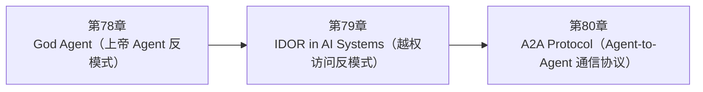

<!--
Chapter: 114
Node: SUMMARY-PART-19
Score: 100
Status: AUTO-GENERATED
Generated: summary
-->

# 第114章 【小结】第十九部分：反模式与协议 (ch78-ch80)

> **速读指南**：本章是「第十九部分：反模式与协议」的精华浓缩（共3个核心知识点）。
> 如果时间有限，只读本章即可掌握该部分所有核心概念。
> 重点看：**一、知识点精华一览**（速查表）和 **四、高频面试题精华**（备考必读）。

## 一、知识点精华一览

| 章节 | 概念 | 一句话掌握 |
|------|------|-----------|
| 第78章 | **God Agent（上帝 Agent 反模式）** | God Agent = 把所有功能塞一个 Agent 的反模式：工具太多 LLM 选错，权限太高注入即灾难，调试无从下手——用 Supervisor-Worker 专业化分工解决。 |
| 第79章 | **IDOR in AI Systems（越权访问反模式）** | IDOR = 拿别人 ID 访问别人数据的漏洞；防御三件套：数据库 WHERE 加 user_id、工具用工厂函数封装 user_id、无权访问统一返回 404。 |
| 第80章 | **A2A Protocol（Agent-to-Agent 通信协议）** | A2A = Agent 界的 HTTP：统一跨框架 Agent 通信标准，Agent Card 声明能力，Task 定义工作单元，SSE 推送长任务进度——MCP 的横向伴侣。 |

## 二、核心原理速记

### 78. God Agent（上帝 Agent 反模式）  `[L1-L2]`

**心智模型**：每次货车出发前，如果都安排总经理亲自跟车检查整个运输过程，当然能够发现问题，但成本极高。

**考试要点**：
- God Agent：所有工具/权限集中一个 Agent，职责不清、难调试、安全风险高
- 检测信号：工具 > 10 个、Prompt > 2000 tokens、同时有读写删权限
- 解决：Supervisor-Worker 专业化分工 + 最小权限原则
- 高权限操作（删除/支付）单独 Agent + Human-in-the-Loop

### 79. IDOR in AI Systems（越权访问反模式）  `[L2]`

**心智模型**：AI 系统中最常见的安全漏洞之一：用户通过修改请求参数（对话 ID、文档 ID）访问他人数据，根本原因是后端未验证所有权。

**考试要点**：
- IDOR = 按用户提供的 ID 查询，不验证所有权；防御：WHERE id=? AND user_id=?
- Agent 工具防 IDOR：工厂函数将 user_id 闭包进工具，不接受 LLM 传入
- 404 统一响应：不区分'不存在'和'无权限'，防止攻击者枚举 ID
- user_id 从 JWT 取，永远不从请求体取

### 80. A2A Protocol（Agent-to-Agent 通信协议）  `[L2-L3]`

**心智模型**：A2A Protocol = Agent 界的 HTTP 协议 - HTTP（Web）：无论服务器用 Java/Python/Go，客户端用浏览器/手机/脚本， 都通过 HTTP 协议通信，完全互操作 - A2A（Agent）：无论 Agent 用 LangGraph/AutoGen/CrewAI 实现， 都通过 A2A 协议通信，完全互操作 没有 A2A 的世界：每对 Agent 框架之间需要自定义适配层（N×N 问题） 有了 A2A 的世界：每个框架只需实现一个 A2A 接口（N×1 问题）

**考试要点**：
- A2A = Agent 间通信协议，解决不同框架 Agent 互操作问题
- A2A vs MCP：A2A 横向（Agent ↔ Agent），MCP 纵向（Agent → Tool）
- Agent Card：/.well-known/agent.json，声明能力，供其他 Agent 发现
- 长任务：异步 + SSE 流式进度，不阻塞等待

## 三、对比与选型速查

| 概念 | 解决的问题 | 最佳适用场景 | 不适合场景/反模式 |
|------|-----------|------------|-----------------|
| **God Agent（上帝 Agent 反模式）** | 把所有工具、逻辑、权限集中在一个超大 Agent 中的反模式，导致职责不清、难以调试、安全风险高、Context 溢出 | 单个 Agent 工具不超过 5-7 个：工具多了 LLM 选错工具的概率急剧上升 | — |
| **IDOR in AI Systems（越权访问反模式）** | AI 系统中最常见的安全漏洞之一：用户通过修改请求参数（对话 ID、文档 ID）访问他人数据，根本原因是后端未验证所有权 | 数据库查询永远带 user_id/tenant_id 条件：即使应用层已验证，数据库也加条件 | user_id 从请求体（Query 参数/Body）取，而非从 JWT 取（后果：用户可以伪造 user_id 参数， |
| **A2A Protocol（Agent-to-Agent 通信协议）** | 当前多 Agent 生态的碎片化问题： | Agent Card 保持最新：技能变更时同步更新 /.well-known/agent.json | A2A 任务在单一 HTTP 请求中同步完成（阻塞等待）（后果：长任务导致 HTTP 超时，客户端无法获知进度） |

**层级与难度**：

- `L1-L2` **God Agent（上帝 Agent 反模式）**：God Agent = 把所有功能塞一个 Agent 的反模式：工具太多 LLM 选错，权限太高注入
- `L2` **IDOR in AI Systems（越权访问反模式）**：IDOR = 拿别人 ID 访问别人数据的漏洞；防御三件套：数据库 WHERE 加 user_id、
- `L2-L3` **A2A Protocol（Agent-to-Agent 通信协议）**：A2A = Agent 界的 HTTP：统一跨框架 Agent 通信标准，Agent Card 声明

## 四、高频面试题精华

**Q: God Agent 反模式的四个核心问题是什么？**

> **答题要点**：God Agent = 把所有功能塞一个 Agent 的反模式：工具太多 LLM 选错，权限太高注入即灾难，调试无从下手——用 Supervisor-Worker 专业化分工解决。
>
> **最佳实践**：单个 Agent 工具不超过 5-7 个：工具多了 LLM 选错工具的概率急剧上升

**Q: 如何检测一个 Agent 是否陷入了 God Agent 反模式？**

> **答题要点**：God Agent = 把所有功能塞一个 Agent 的反模式：工具太多 LLM 选错，权限太高注入即灾难，调试无从下手——用 Supervisor-Worker 专业化分工解决。
>
> **最佳实践**：单个 Agent 工具不超过 5-7 个：工具多了 LLM 选错工具的概率急剧上升

**Q: 什么是 IDOR？在 AI 系统中为什么比传统 Web 更难防范？**

> **答题要点**：IDOR = 拿别人 ID 访问别人数据的漏洞；防御三件套：数据库 WHERE 加 user_id、工具用工厂函数封装 user_id、无权访问统一返回 404。
>
> **最佳实践**：数据库查询永远带 user_id/tenant_id 条件：即使应用层已验证，数据库也加条件

**Q: 如何在 Agent 工具中防止 IDOR？（工厂函数模式）？**

> **答题要点**：IDOR = 拿别人 ID 访问别人数据的漏洞；防御三件套：数据库 WHERE 加 user_id、工具用工厂函数封装 user_id、无权访问统一返回 404。
>
> **最佳实践**：数据库查询永远带 user_id/tenant_id 条件：即使应用层已验证，数据库也加条件

**Q: A2A Protocol 解决了什么问题？为什么需要这个协议？**

> **答题要点**：A2A Protocol = Agent 界的 HTTP 协议 - HTTP（Web）：无论服务器用 Java/Python/Go，客户端用浏览器/手机/脚本，   都通过 HTTP 协议通信，完全互操作 - A2A（Agent）：无论 Agent 用 LangGraph/AutoGen/CrewAI 实现，   都通过 A2A 协议通信，完全互操作  没有 A2A 的世界：每对 Agent 框架
>
> **最佳实践**：Agent Card 保持最新：技能变更时同步更新 /.well-known/agent.json

**Q: A2A 和 MCP 的区别是什么？各自用于什么场景？**

> **答题要点**：A2A Protocol = Agent 界的 HTTP 协议 - HTTP（Web）：无论服务器用 Java/Python/Go，客户端用浏览器/手机/脚本，   都通过 HTTP 协议通信，完全互操作 - A2A（Agent）：无论 Agent 用 LangGraph/AutoGen/CrewAI 实现，   都通过 A2A 协议通信，完全互操作  没有 A2A 的世界：每对 Agent 框架
>
> **最佳实践**：Agent Card 保持最新：技能变更时同步更新 /.well-known/agent.json

## 五、常见误区警示

**God Agent（上帝 Agent 反模式） 的常见误区**：

- ❌ 误解：工具越多，Agent 越强大
  ✅ 正解：
- ❌ 误解：一个 Agent 处理所有请求，系统更简单
  ✅ 正解：

## 六、知识关联图

## 七、本章自测清单

完成本部分学习后，你应该能够：

- [ ] **God Agent（上帝 Agent 反模式）**：God Agent = 把所有功能塞一个 Agent 的反模式：工具太多 LLM 选错，权限太高注入即灾难，调试无从下手
- [ ] **IDOR in AI Systems（越权访问反模式）**：IDOR = 拿别人 ID 访问别人数据的漏洞；防御三件套：数据库 WHERE 加 user_id、工具用工厂函数封装 
- [ ] **A2A Protocol（Agent-to-Agent 通信协议）**：A2A = Agent 界的 HTTP：统一跨框架 Agent 通信标准，Agent Card 声明能力，Task 定义

> 如果某项还不确定，回到对应章节复习后再打勾。
