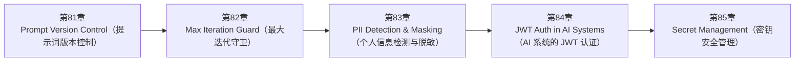

<!--
Chapter: 115
Node: SUMMARY-PART-20
Score: 100
Status: AUTO-GENERATED
Generated: summary
-->

# 第115章 【小结】第二十部分：工程实践 (ch81-ch85)

> **速读指南**：本章是「第二十部分：工程实践」的精华浓缩（共5个核心知识点）。
> 如果时间有限，只读本章即可掌握该部分所有核心概念。
> 重点看：**一、知识点精华一览**（速查表）和 **四、高频面试题精华**（备考必读）。

## 一、知识点精华一览

| 章节 | 概念 | 一句话掌握 |
|------|------|-----------|
| 第81章 | **Prompt Version Control（提示词版本控制）** | Prompt 版本控制 = 像 Schema Migration 一样管理 Prompt：版本号+CHANGELOG+测试结果，防止 Prompt 随意改动引发 AI 系统行为突变。 |
| 第82章 | **Max Iteration Guard（最大迭代守卫）** | Max Iteration Guard = 赛跑步数限制：Agent 最多跑 N 轮，超出就停止返回最佳中间结果，与 Timeout 共同防止 Agent 无限循环消耗资源。 |
| 第83章 | **PII Detection & Masking（个人信息检测与脱敏）** | PII 脱敏 = 文件打码：手机号/身份证/邮箱在进入 LLM 前替换为 [PHONE]/[ID]/[EMAIL]，原始信息留本地，AI 服务只看占位符。 |
| 第84章 | **JWT Auth in AI Systems（AI 系统的 JWT 认证）** | AI 系统的 JWT = 带门禁信息的工牌：user_id/tenant_id/quota 写在 Token 里，无状态验证，tenant_id 必须从 Token 取以防越权访问。 |
| 第85章 | **Secret Management（密钥安全管理）** | Secret Management = 银行保险柜：API Key 绝不硬编码，开发用 .env（不提交 Git），生产用 Vault/Secrets Manager，服务靠 IAM Role 自动取 |

## 二、核心原理速记

### 81. Prompt Version Control（提示词版本控制）  `[L1-L2]`

**心智模型**：Prompt 版本控制 = 数据库 Schema 管理 - 数据库 Schema 改动需要 Migration 文件，有版本记录，可回滚 - Prompt 改动同样：需要版本号，有变更日志，可回滚 任何一个没有记录的 Schema 改动都可能引发生产事故； 同理，任何没有记录的 Prompt 改动都可能引发 AI 系统行为异常。

**考试要点**：
- Prompt 版本控制：版本号 + Git 存储 + CHANGELOG + 测试结果
- 与代码分离：可独立部署，但放同一 Git 仓库保证 Code Review 覆盖
- 改动必须附带测试结果：改前/改后 LLM-as-Judge 评分对比
- 保留 3 个历史版本：快速回滚安全网

### 82. Max Iteration Guard（最大迭代守卫）  `[L1-L2]`

**心智模型**：Max Iteration Guard = 赛跑的步数限制 - 优秀的马拉松运动员自然会在终点停下 - 但如果运动员迷路（推理失误）或受伤（工具失败）， 没有限制他会一直跑，永远不停 - 裁判（Iteration Guard）规定：无论如何，最多跑 X 圈，必须停

**考试要点**：
- Max Iteration Guard：硬性循环次数上限，防止 Agent 无限运行
- 与 Timeout 互补：Iteration 限轮数，Timeout 限总时间，两者同时设置
- 达到上限：返回部分结果 + 警告，不要直接报错丢弃所有进度
- 推荐范围：简单任务 5-10，复杂任务 20-30，超过 30 需重新设计

### 83. PII Detection & Masking（个人信息检测与脱敏）  `[L2-L3]`

**心智模型**：PII 脱敏 = 文件打码 - 向法院提交文件前，律师用黑色墨水覆盖当事人地址和电话 - AI 处理用户数据前，脱敏层用 [ADDRESS] [PHONE] 覆盖真实信息 法院（AI）看到的是打码版本，原始信息留在律师处（本地系统）

**考试要点**：
- PII 脱敏 = 入口处替换为占位符，原始数据本地保留，LLM 只看占位符
- 工具选型：Presidio（英文/合规）；正则（轻量中文）
- 脱敏时机：最早入口，不让 PII 流入任何 AI 组件
- 合规对应：GDPR→最小化；HIPAA→PHI 脱敏；PIPL→出境限制

### 84. JWT Auth in AI Systems（AI 系统的 JWT 认证）  `[L2]`

**心智模型**：JWT = 带信息的门禁卡 - 传统 Session：门禁系统（服务器）记录每张卡的信息，每次刷卡查数据库 - JWT：卡本身写着"姓名:张三，部门:研发，权限:AI服务，过期:2026-12-31" 门禁（服务器）只需验证卡没被伪造（签名验证），直接读卡上信息 - 好处：不需要查数据库（无状态），水平扩展不需要共享会话

**考试要点**：
- JWT Payload：user_id + tenant_id + roles + ai_quota，无状态认证
- tenant_id 从 JWT 取，不从请求体取：防 IDOR
- 生产用 RS256：私钥签名，公钥验证，公钥可分发
- JWT 不存敏感信息：Payload 是 Base64 编码，不是加密

### 85. Secret Management（密钥安全管理）  `[L1-L2]`

**心智模型**：Secret Management = 银行保险柜 - 不把密码写在门口（不硬编码在代码里） - 不把保险柜密码写在便利贴上（不写在 .env.example 里） - 银行职员凭工牌才能取到保险柜（服务用 IAM 角色访问 Vault） - 不同职员只能打开自己权限内的柜子（最小权限原则）

**考试要点**：
- Secret 绝不出现在代码中：开发用 .env（.gitignore），生产用 Vault/Secrets Manager
- .env.example 提交 Git 展示变量名，.env 本身不提交
- IAM Role 自动认证：服务不需要硬编码 Vault 密码
- 配置 pre-commit 扫描：提交时阻止密钥进入 Git 历史

## 三、对比与选型速查

| 概念 | 解决的问题 | 最佳适用场景 | 不适合场景/反模式 |
|------|-----------|------------|-----------------|
| **Prompt Version Control（提示词版本控制）** | 未管理 Prompt 的典型事故： | Prompt 文件和代码放同一个 Git 仓库：确保 Code Review 覆盖 Prompt 变更 | 把 Prompt 硬编码在业务代码中（而不是独立文件）（后果：Prompt 改动需要发代码包，无法独立部署；Code R |
| **Max Iteration Guard（最大迭代守卫）** | Agent 进入无限循环的三种常见原因： | max_iterations 和 timeout 同时设置：两个维度共同保护 | max_iterations 设得极高（100+）以'确保任务完成'（后果：实际上是没有限制，Token 成本失控，出问 |
| **PII Detection & Masking（个人信息检测与脱敏）** | 将含 PII 的用户输入直接发送给 OpenAI/Anthropic 的三个风险： | 脱敏在数据进入 AI 系统的最早入口执行：不要让 PII 流入任何 AI 组件 | 用户输入直接拼接到 Prompt 不经 PII 检测（后果：用户无意中输入的手机号/身份证被发给 OpenAI 等第三方 |
| **JWT Auth in AI Systems（AI 系统的 JWT 认证）** | AI 系统不做认证或认证做错的三个后果： | 生产环境用 RS256（非对称）：私钥签名，公钥验证，公钥可分发给所有服务 | 从请求体的 user_id 字段做数据隔离（而非从 JWT 取）（后果：用户可以构造 user_id=other_use |
| **Secret Management（密钥安全管理）** | AI 系统比传统应用面临更高的 Secret 泄露风险： | 开发用 .env + dotenv，但 .env 必须在 .gitignore 中 | API Key 硬编码在代码文件中提交 Git（后果：公开仓库立即暴露；私有仓库也难以彻底清除（Git 历史）） |

**层级与难度**：

- `L1-L2` **Prompt Version Control（提示词版本控制）**：Prompt 版本控制 = 像 Schema Migration 一样管理 Prompt：版本号+C
- `L1-L2` **Max Iteration Guard（最大迭代守卫）**：Max Iteration Guard = 赛跑步数限制：Agent 最多跑 N 轮，超出就停止返回
- `L2-L3` **PII Detection & Masking（个人信息检测与脱敏）**：PII 脱敏 = 文件打码：手机号/身份证/邮箱在进入 LLM 前替换为 [PHONE]/[ID]/
- `L2` **JWT Auth in AI Systems（AI 系统的 JWT 认证）**：AI 系统的 JWT = 带门禁信息的工牌：user_id/tenant_id/quota 写在 T
- `L1-L2` **Secret Management（密钥安全管理）**：Secret Management = 银行保险柜：API Key 绝不硬编码，开发用 .env（不

## 四、高频面试题精华

**Q: 为什么 Prompt 需要版本控制？Prompt 随意改动会有什么风险？**

> **答题要点**：Prompt 版本控制 = 数据库 Schema 管理 - 数据库 Schema 改动需要 Migration 文件，有版本记录，可回滚 - Prompt 改动同样：需要版本号，有变更日志，可回滚 任何一个没有记录的 Schema 改动都可能引发生产事故； 同理，任何没有记录的 Prompt 改动都可能引发 AI 系统行为异常。
>
> **最佳实践**：Prompt 文件和代码放同一个 Git 仓库：确保 Code Review 覆盖 Prompt 变更

**Q: 如何设计一个支持 A/B 测试的 Prompt 管理系统？**

> **答题要点**：Prompt 版本控制 = 数据库 Schema 管理 - 数据库 Schema 改动需要 Migration 文件，有版本记录，可回滚 - Prompt 改动同样：需要版本号，有变更日志，可回滚 任何一个没有记录的 Schema 改动都可能引发生产事故； 同理，任何没有记录的 Prompt 改动都可能引发 AI 系统行为异常。
>
> **最佳实践**：Prompt 文件和代码放同一个 Git 仓库：确保 Code Review 覆盖 Prompt 变更

**Q: 为什么 Agent 必须设置 max_iterations？常见的无限循环原因是什么？**

> **答题要点**：Max Iteration Guard = 赛跑的步数限制 - 优秀的马拉松运动员自然会在终点停下 - 但如果运动员迷路（推理失误）或受伤（工具失败），   没有限制他会一直跑，永远不停 - 裁判（Iteration Guard）规定：无论如何，最多跑 X 圈，必须停
>
> **最佳实践**：max_iterations 和 timeout 同时设置：两个维度共同保护

**Q: max_iterations 和 timeout 的区别是什么？为什么两者都需要设置？**

> **答题要点**：Max Iteration Guard = 赛跑的步数限制 - 优秀的马拉松运动员自然会在终点停下 - 但如果运动员迷路（推理失误）或受伤（工具失败），   没有限制他会一直跑，永远不停 - 裁判（Iteration Guard）规定：无论如何，最多跑 X 圈，必须停
>
> **最佳实践**：max_iterations 和 timeout 同时设置：两个维度共同保护

**Q: PII 包含哪些类型的信息？为什么在 AI 系统中需要特别关注？**

> **答题要点**：PII 脱敏 = 文件打码 - 向法院提交文件前，律师用黑色墨水覆盖当事人地址和电话 - AI 处理用户数据前，脱敏层用 [ADDRESS] [PHONE] 覆盖真实信息 法院（AI）看到的是打码版本，原始信息留在律师处（本地系统）
>
> **最佳实践**：脱敏在数据进入 AI 系统的最早入口执行：不要让 PII 流入任何 AI 组件

**Q: PII 脱敏和 PII 加密的区别是什么？各适合什么场景？**

> **答题要点**：PII 脱敏 = 文件打码 - 向法院提交文件前，律师用黑色墨水覆盖当事人地址和电话 - AI 处理用户数据前，脱敏层用 [ADDRESS] [PHONE] 覆盖真实信息 法院（AI）看到的是打码版本，原始信息留在律师处（本地系统）
>
> **最佳实践**：脱敏在数据进入 AI 系统的最早入口执行：不要让 PII 流入任何 AI 组件

**Q: 为什么 AI 系统的 tenant_id 必须从 JWT 取，而不能从请求体取？**

> **答题要点**：JWT = 带信息的门禁卡 - 传统 Session：门禁系统（服务器）记录每张卡的信息，每次刷卡查数据库 - JWT：卡本身写着"姓名:张三，部门:研发，权限:AI服务，过期:2026-12-31"   门禁（服务器）只需验证卡没被伪造（签名验证），直接读卡上信息 - 好处：不需要查数据库（无状态），水平扩展不需要共享会话
>
> **最佳实践**：生产环境用 RS256（非对称）：私钥签名，公钥验证，公钥可分发给所有服务

**Q: JWT 的 HS256 和 RS256 各适合什么场景？**

> **答题要点**：JWT = 带信息的门禁卡 - 传统 Session：门禁系统（服务器）记录每张卡的信息，每次刷卡查数据库 - JWT：卡本身写着"姓名:张三，部门:研发，权限:AI服务，过期:2026-12-31"   门禁（服务器）只需验证卡没被伪造（签名验证），直接读卡上信息 - 好处：不需要查数据库（无状态），水平扩展不需要共享会话
>
> **最佳实践**：生产环境用 RS256（非对称）：私钥签名，公钥验证，公钥可分发给所有服务

**Q: API Key 硬编码在代码里并提交 Git 会有什么后果？如何防止？**

> **答题要点**：Secret Management = 银行保险柜 - 不把密码写在门口（不硬编码在代码里） - 不把保险柜密码写在便利贴上（不写在 .env.example 里） - 银行职员凭工牌才能取到保险柜（服务用 IAM 角色访问 Vault） - 不同职员只能打开自己权限内的柜子（最小权限原则）
>
> **最佳实践**：开发用 .env + dotenv，但 .env 必须在 .gitignore 中

**Q: 生产环境的 Secret 应该存在哪里？为什么不用环境变量？**

> **答题要点**：Secret Management = 银行保险柜 - 不把密码写在门口（不硬编码在代码里） - 不把保险柜密码写在便利贴上（不写在 .env.example 里） - 银行职员凭工牌才能取到保险柜（服务用 IAM 角色访问 Vault） - 不同职员只能打开自己权限内的柜子（最小权限原则）
>
> **最佳实践**：开发用 .env + dotenv，但 .env 必须在 .gitignore 中

## 六、知识关联图

## 七、本章自测清单

完成本部分学习后，你应该能够：

- [ ] **Prompt Version Control（提示词版本控制）**：Prompt 版本控制 = 像 Schema Migration 一样管理 Prompt：版本号+CHANGELOG+测
- [ ] **Max Iteration Guard（最大迭代守卫）**：Max Iteration Guard = 赛跑步数限制：Agent 最多跑 N 轮，超出就停止返回最佳中间结果，与 T
- [ ] **PII Detection & Masking（个人信息检测与脱敏）**：PII 脱敏 = 文件打码：手机号/身份证/邮箱在进入 LLM 前替换为 [PHONE]/[ID]/[EMAIL]，原始
- [ ] **JWT Auth in AI Systems（AI 系统的 JWT 认证）**：AI 系统的 JWT = 带门禁信息的工牌：user_id/tenant_id/quota 写在 Token 里，无状态
- [ ] **Secret Management（密钥安全管理）**：Secret Management = 银行保险柜：API Key 绝不硬编码，开发用 .env（不提交 Git），生产

> 如果某项还不确定，回到对应章节复习后再打勾。
