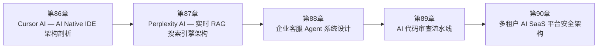

<!--
Chapter: 116
Node: SUMMARY-PART-21
Score: 100
Status: AUTO-GENERATED
Generated: summary
-->

# 第116章 【小结】第二十一部分：真实案例 (ch86-ch90)

> **速读指南**：本章是「第二十一部分：真实案例」的精华浓缩（共5个核心知识点）。
> 如果时间有限，只读本章即可掌握该部分所有核心概念。
> 重点看：**一、知识点精华一览**（速查表）和 **四、高频面试题精华**（备考必读）。

## 一、知识点精华一览

| 章节 | 概念 | 一句话掌握 |
|------|------|-----------|
| 第86章 | **Cursor AI — AI Native IDE 架构剖析** | Cursor = RAG 索引整个代码库 + ReAct Agent 跨文件编辑 + MCP 工具生态扩展，Human-in-the-Loop 的 Diff 确认是用户信任 AI 改代码的关键。 |
| 第87章 | **Perplexity AI — 实时 RAG 搜索引擎架构** | Perplexity = 实时 RAG 搜索引擎：每次查询实时爬网 + 引用标注，引用系统是信任基础，流式输出是体验关键，Pro Search 是多轮 Agent RAG。 |
| 第88章 | **企业客服 Agent 系统设计** | 企业客服 Agent = Triage Supervisor 分诊 + 专业 Worker 执行 + 三个 Human-in-the-Loop 节点，70% 自动化，退款/高情绪/低置信度三种情况必须 |
| 第89章 | **AI 代码审查流水线** | AI 代码审查 = 四个专业 Agent 并行审查（安全/质量/规范/测试）→ Report Agent 综合 → CRITICAL 自动阻塞 PR，Prompt 每次改动都要跑黄金数据集验证。 |
| 第90章 | **多租户 AI SaaS 平台安全架构** | 多租户 AI SaaS = 四层数据隔离（应用层+RLS+向量Namespace+S3路径）+ Redis 配额计数 + Append-Only 审计日志，GDPR 要求业务数据可删但审计记录不可删。 |

## 二、核心原理速记

### 86. Cursor AI — AI Native IDE 架构剖析  `[L2-L3]`

**心智模型**：Agent 则是帮你把找到的内容整理成解决方案的人。

**考试要点**：
- 三层架构：RAG（代码索引）+ Agent（跨文件编辑）+ MCP（工具扩展）
- 本地索引：不上传代码，保护隐私，Enterprise 采购关键因素
- Human-in-the-Loop：Diff 展示 + 用户确认，建立对 Agent 的信任
- Model Routing：Tab 补全用小模型（速度），Agent 编辑用大模型（质量）

### 87. Perplexity AI — 实时 RAG 搜索引擎架构  `[L2]`

**心智模型**：Perplexity 是第一个真正成功的 AI 搜索引擎，核心是实时 RAG：每次查询实时爬取网页、提取内容、生成带引用的回答，2025 年估值超 90 亿美元。

**考试要点**：
- 实时 RAG = 每次查询动态爬取，信息最新；静态 RAG = 离线索引，检索快但有时效性
- 引用系统：每个事实声明标注来源 [N]，用户可验证，是信任基础设施
- 流式输出：0.5 秒开始打字，比等待 5 秒看完整答案体验好得多
- Pro Search = Pipeline（预定义步骤）+ ReAct（知识空缺驱动追加搜索）

### 88. 企业客服 Agent 系统设计  `[L2-L3]`

**心智模型**：* 退款纠纷 → Refund Agent

**考试要点**：
- 架构：Triage（Supervisor）→ FAQ/Order/Escalation（Worker），各 Agent 最小权限
- Human-in-the-Loop 三点：高金额退款 + 高情绪用户 + 低置信度（三选一都对）
- FAQ Agent 用小模型（省成本）；Triage 用大模型（准确性最重要）
- 情绪检测升级优先于意图处理：愤怒用户直接给人工，不强行 AI 处理

### 89. AI 代码审查流水线  `[L2-L3]`

**心智模型**：安全检查、代码质量检查、规范检查、测试分析之间并不存在强依赖。

**考试要点**：
- 并行执行四个 Agent：30 秒 vs 串行 90+ 秒，Pipeline 设计关键
- CRITICAL 问题自动阻塞 PR：不只是建议，才能让 AI 成为真正的门禁
- 安全 Agent 用大模型：漏报一个安全漏洞进生产的代价 >> 多花的 LLM 费用
- 黄金数据集 100 个 PR：A/B 测试 Prompt 改动，防止性能退化

### 90. 多租户 AI SaaS 平台安全架构  `[L3]`

**心智模型**：可以把多租户 AI SaaS 想成一栋共享办公楼。

**考试要点**：
- 四层隔离：应用层 WHERE tenant_id + DB RLS + 向量 DB Namespace + S3 路径
- 配额计数：Redis INCR（高频原子操作），异步写入账单数据库
- GDPR 删除：业务数据删除，审计日志保留删除事件（不保留内容）
- 数据驻留：根据 tenant.data_residency 路由到对应区域的 LLM 服务

## 三、对比与选型速查

| 概念 | 解决的问题 | 最佳适用场景 | 不适合场景/反模式 |
|------|-----------|------------|-----------------|
| **Cursor AI — AI Native IDE 架构剖析** | Cursor 是最成功的 AI Native 开发工具，融合 RAG（代码库索引）、Agent（自主编辑）、MCP（工具 | L2-L3 | — |
| **Perplexity AI — 实时 RAG 搜索引擎架构** | Perplexity 是第一个真正成功的 AI 搜索引擎，核心是实时 RAG：每次查询实时爬取网页、提取内容、生成带引用 | L2 | — |
| **企业客服 Agent 系统设计** | 电商/SaaS 企业将 AI Agent 引入客服流程的架构方案：Supervisor-Worker 多 Agent 分 | L2-L3 | — |
| **AI 代码审查流水线** | 将 AI 集成进 GitHub PR 审查流程的 Pipeline 架构：安全扫描 → 代码质量 → 架构一致性 → 综 | L2-L3 | — |
| **多租户 AI SaaS 平台安全架构** | 面向企业客户的多租户 AI SaaS 平台完整安全架构：数据隔离、成本归因、配额管理、合规审计，支持 1000+ 企业租 | L3 | — |

**层级与难度**：

- `L2-L3` **Cursor AI — AI Native IDE 架构剖析**：Cursor = RAG 索引整个代码库 + ReAct Agent 跨文件编辑 + MCP 工具生
- `L2` **Perplexity AI — 实时 RAG 搜索引擎架构**：Perplexity = 实时 RAG 搜索引擎：每次查询实时爬网 + 引用标注，引用系统是信任基础
- `L2-L3` **企业客服 Agent 系统设计**：企业客服 Agent = Triage Supervisor 分诊 + 专业 Worker 执行 +
- `L2-L3` **AI 代码审查流水线**：AI 代码审查 = 四个专业 Agent 并行审查（安全/质量/规范/测试）→ Report Age
- `L3` **多租户 AI SaaS 平台安全架构**：多租户 AI SaaS = 四层数据隔离（应用层+RLS+向量Namespace+S3路径）+ Re

## 四、高频面试题精华

**Q: Cursor 的代码库 RAG 和普通文档 RAG 有什么不同？工程挑战在哪里？**

> **答题要点**：Cursor = RAG 索引整个代码库 + ReAct Agent 跨文件编辑 + MCP 工具生态扩展，Human-in-the-Loop 的 Diff 确认是用户信任 AI 改代码的关键。

**Q: Cursor Agent Mode 如何实现 Human-in-the-Loop？为什么这是信任的关键？**

> **答题要点**：Cursor = RAG 索引整个代码库 + ReAct Agent 跨文件编辑 + MCP 工具生态扩展，Human-in-the-Loop 的 Diff 确认是用户信任 AI 改代码的关键。

**Q: Perplexity 的实时 RAG 和企业静态 RAG 的核心区别是什么？**

> **答题要点**：Perplexity = 实时 RAG 搜索引擎：每次查询实时爬网 + 引用标注，引用系统是信任基础，流式输出是体验关键，Pro Search 是多轮 Agent RAG。

**Q: 引用系统如何帮助 Perplexity 建立用户信任？技术上如何实现？**

> **答题要点**：Perplexity = 实时 RAG 搜索引擎：每次查询实时爬网 + 引用标注，引用系统是信任基础，流式输出是体验关键，Pro Search 是多轮 Agent RAG。

**Q: 这个系统中 Human-in-the-Loop 有几个介入点？各自的触发条件是什么？**

> **答题要点**：企业客服 Agent = Triage Supervisor 分诊 + 专业 Worker 执行 + 三个 Human-in-the-Loop 节点，70% 自动化，退款/高情绪/低置信度三种情况必须人工介入。

**Q: 为什么 Triage Agent 要用大模型，而 FAQ Agent 可以用小模型？**

> **答题要点**：企业客服 Agent = Triage Supervisor 分诊 + 专业 Worker 执行 + 三个 Human-in-the-Loop 节点，70% 自动化，退款/高情绪/低置信度三种情况必须人工介入。

**Q: 为什么四个 Agent 要并行执行而不是串行？并行带来什么工程挑战？**

> **答题要点**：AI 代码审查 = 四个专业 Agent 并行审查（安全/质量/规范/测试）→ Report Agent 综合 → CRITICAL 自动阻塞 PR，Prompt 每次改动都要跑黄金数据集验证。

**Q: 安全 Agent 为什么不能用小模型？误报和漏报哪个更危险？**

> **答题要点**：AI 代码审查 = 四个专业 Agent 并行审查（安全/质量/规范/测试）→ Report Agent 综合 → CRITICAL 自动阻塞 PR，Prompt 每次改动都要跑黄金数据集验证。

**Q: 多租户 AI 系统的数据隔离如何实现？如果应用层漏掉 tenant_id 条件怎么办？**

> **答题要点**：多租户 AI SaaS = 四层数据隔离（应用层+RLS+向量Namespace+S3路径）+ Redis 配额计数 + Append-Only 审计日志，GDPR 要求业务数据可删但审计记录不可删。

**Q: Token 配额管理为什么用 Redis 而不用数据库？**

> **答题要点**：多租户 AI SaaS = 四层数据隔离（应用层+RLS+向量Namespace+S3路径）+ Redis 配额计数 + Append-Only 审计日志，GDPR 要求业务数据可删但审计记录不可删。

## 六、知识关联图

## 七、本章自测清单

完成本部分学习后，你应该能够：

- [ ] **Cursor AI — AI Native IDE 架构剖析**：Cursor = RAG 索引整个代码库 + ReAct Agent 跨文件编辑 + MCP 工具生态扩展，Human-
- [ ] **Perplexity AI — 实时 RAG 搜索引擎架构**：Perplexity = 实时 RAG 搜索引擎：每次查询实时爬网 + 引用标注，引用系统是信任基础，流式输出是体验关键
- [ ] **企业客服 Agent 系统设计**：企业客服 Agent = Triage Supervisor 分诊 + 专业 Worker 执行 + 三个 Human-
- [ ] **AI 代码审查流水线**：AI 代码审查 = 四个专业 Agent 并行审查（安全/质量/规范/测试）→ Report Agent 综合 → CR
- [ ] **多租户 AI SaaS 平台安全架构**：多租户 AI SaaS = 四层数据隔离（应用层+RLS+向量Namespace+S3路径）+ Redis 配额计数 +

> 如果某项还不确定，回到对应章节复习后再打勾。
