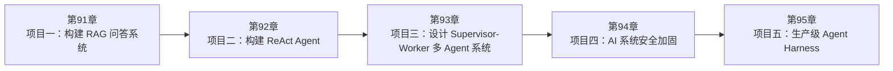

<!--
Chapter: 117
Node: SUMMARY-PART-22
Score: 100
Status: AUTO-GENERATED
Generated: summary
-->

# 第117章 【小结】第二十二部分：实战练习 (ch91-ch95)

> **速读指南**：本章是「第二十二部分：实战练习」的精华浓缩（共5个核心知识点）。
> 如果时间有限，只读本章即可掌握该部分所有核心概念。
> 重点看：**一、知识点精华一览**（速查表）和 **四、高频面试题精华**（备考必读）。

## 一、知识点精华一览

| 章节 | 概念 | 一句话掌握 |
|------|------|-----------|
| 第91章 | **项目一：构建 RAG 问答系统** | 从零实现 PDF RAG：Loader→Splitter→Embed→Chroma→RetrievalQA，Chunk 大小实验感受 Trade-off，RAGAS 量化质量。 |
| 第92章 | **项目二：构建 ReAct Agent** | LangGraph ReAct Agent：@tool 定义工具，create_react_agent 创建循环，stream 追踪每步，工具失败返回字符串让 Agent 自行决策。 |
| 第93章 | **项目三：设计 Supervisor-Worker 多 Agent 系统** | Supervisor-Worker：research_worker 搜集，writer_worker 整理，Supervisor 调度，interrupt_before 实现人工审核，三个 Agent |
| 第94章 | **项目四：AI 系统安全加固** | AI 安全四修：JWT 加认证门禁 + WHERE 双条件防 IDOR + 结构隔离防注入 + 入口脱敏防 PII 泄露，每个修复都要有安全测试用例覆盖。 |
| 第95章 | **项目五：生产级 Agent Harness** | 生产 Agent Harness = 六层工程包装：JSON 结构化日志 + Token 成本追踪 + 指数退避重试 + asyncio.timeout + FastAPI 封装 + /health  |

## 二、核心原理速记

### 91. 项目一：构建 RAG 问答系统  `[L1]`

**心智模型**：* chunk太大：给你整本教材，你找不到答案

**考试要点**：
- 能独立写出 RAG 的 5 步代码：Loader→Splitter→Embeddings→VectorStore→RetrievalQA
- chunk_size 的 Trade-off：小→精准但片段化；大→上下文完整但噪音多
- RAGAS 三指标：faithfulness（基于检索生成）/ relevancy（回答了问题）/ precision（检索无噪音）

### 92. 项目二：构建 ReAct Agent  `[L2]`

**心智模型**：可以把 ReAct Agent 想象成一个“会修路的导航系统”。

**考试要点**：
- create_react_agent(llm, tools)：LangGraph 封装的 ReAct 标准实现
- stream_mode='values'：逐步追踪 Agent 每一步的状态变化
- 工具失败 return 字符串，不 raise：让 Agent 通过 Observation 感知失败并调整
- recursion_limit：LangGraph 的 Max Iteration 控制参数

### 93. 项目三：设计 Supervisor-Worker 多 Agent 系统  `[L2-L3]`

**心智模型**：* 搜索工具 = 检查设备（CT / 血检）

**考试要点**：
- Supervisor 不执行，只调度：System Prompt 必须说明'不要自己做研究或写作'
- Worker 最小工具：Research Worker 只有搜索，Writer 只有格式化
- Human-in-the-Loop：interrupt_before=['node_name']，invoke(None) 继续
- Multi-Agent 适合：子任务明确可分、专业化能提升质量、需要并行加速

### 94. 项目四：AI 系统安全加固  `[L3]`

**心智模型**：可以把 AI 系统想成一个“智能写字楼”：

**考试要点**：
- IDOR 修复：user_id 从 JWT 取，WHERE id=? AND user_id=?，统一 404 响应
- Prompt Injection 防护：固定 system prompt，用户输入永远在 user message
- PII 脱敏：入口处检测替换为占位符，日志只记录类型不记录原始内容
- JWT 认证：Depends(verify_jwt) 依赖注入，所有受保护端点必须加

### 95. 项目五：生产级 Agent Harness  `[L3]`

**心智模型**：把 Agent Harness 想象成一家餐厅的“后厨系统”。

**考试要点**：
- 六组件：结构化日志 + Token 计数 + 指数退避重试 + 全局超时 + 健康检查 + FastAPI 封装
- 指数退避：1s, 2s, 4s + 随机抖动，防止多个请求同时重试（雷群效应）
- trace_id：每次 run() 生成 UUID，贯穿所有日志，是生产排查的关键索引
- /health 端点：监控系统探活，返回 agent_ready 状态

## 三、对比与选型速查

| 概念 | 解决的问题 | 最佳适用场景 | 不适合场景/反模式 |
|------|-----------|------------|-----------------|
| **项目一：构建 RAG 问答系统** | 从零开始构建一个基于 PDF 文档的 RAG 问答系统，涵盖文档加载、分块、向量化、检索、生成的完整流程 | L1 | — |
| **项目二：构建 ReAct Agent** | 用 LangGraph 构建一个能使用工具的 ReAct Agent：搜索+计算器+天气，理解 Thought-Acti | L2 | — |
| **项目三：设计 Supervisor-Worker 多 Agent 系统** | 构建一个研究+写作的双 Worker + Supervisor 多 Agent 系统，理解任务分解、专业化分工、结果汇总 | L2-L3 | — |
| **项目四：AI 系统安全加固** | 在一个存在漏洞的 AI API 系统上做安全加固：修复 Prompt Injection、IDOR、PII 泄露、未认证 | L3 | — |
| **项目五：生产级 Agent Harness** | 将一个简单的 Agent 包装成生产可用的服务：添加 Trace ID 追踪、结构化日志、限速重试、成本监控、健康检查， | L3 | — |

**层级与难度**：

- `L1` **项目一：构建 RAG 问答系统**：从零实现 PDF RAG：Loader→Splitter→Embed→Chroma→Retrieva
- `L2` **项目二：构建 ReAct Agent**：LangGraph ReAct Agent：@tool 定义工具，create_react_agen
- `L2-L3` **项目三：设计 Supervisor-Worker 多 Agent 系统**：Supervisor-Worker：research_worker 搜集，writer_worker
- `L3` **项目四：AI 系统安全加固**：AI 安全四修：JWT 加认证门禁 + WHERE 双条件防 IDOR + 结构隔离防注入 + 入口
- `L3` **项目五：生产级 Agent Harness**：生产 Agent Harness = 六层工程包装：JSON 结构化日志 + Token 成本追踪 

## 四、高频面试题精华

**Q: 完成本练习后，能解释 RAG 的每一步在代码中对应什么？**

> **答题要点**：从零实现 PDF RAG：Loader→Splitter→Embed→Chroma→RetrievalQA，Chunk 大小实验感受 Trade-off，RAGAS 量化质量。

**Q: chunk_size 实验的结果说明了什么？有没有'最好的'Chunk 大小？**

> **答题要点**：从零实现 PDF RAG：Loader→Splitter→Embed→Chroma→RetrievalQA，Chunk 大小实验感受 Trade-off，RAGAS 量化质量。

**Q: 能用代码演示 ReAct 的 Thought-Action-Observation 循环吗？**

> **答题要点**：LangGraph ReAct Agent：@tool 定义工具，create_react_agent 创建循环，stream 追踪每步，工具失败返回字符串让 Agent 自行决策。

**Q: @tool 的 docstring 为什么对 Agent 行为至关重要？**

> **答题要点**：LangGraph ReAct Agent：@tool 定义工具，create_react_agent 创建循环，stream 追踪每步，工具失败返回字符串让 Agent 自行决策。

**Q: 能描述 Supervisor 和 Worker 各自的 System Prompt 设计原则吗？**

> **答题要点**：Supervisor-Worker：research_worker 搜集，writer_worker 整理，Supervisor 调度，interrupt_before 实现人工审核，三个 Agent 各司其职，Prompt 是行为的边界。

**Q: 为什么 Writer Worker 不应该有搜索工具？**

> **答题要点**：Supervisor-Worker：research_worker 搜集，writer_worker 整理，Supervisor 调度，interrupt_before 实现人工审核，三个 Agent 各司其职，Prompt 是行为的边界。

**Q: IDOR 和 Broken Authentication 的区别是什么？**

> **答题要点**：AI 安全四修：JWT 加认证门禁 + WHERE 双条件防 IDOR + 结构隔离防注入 + 入口脱敏防 PII 泄露，每个修复都要有安全测试用例覆盖。

**Q: 为什么 Prompt Injection 的防护核心是'结构隔离'而非关键词过滤？**

> **答题要点**：AI 安全四修：JWT 加认证门禁 + WHERE 双条件防 IDOR + 结构隔离防注入 + 入口脱敏防 PII 泄露，每个修复都要有安全测试用例覆盖。

**Q: 生产 Agent Harness 需要哪六个核心组件？各解决什么问题？**

> **答题要点**：生产 Agent Harness = 六层工程包装：JSON 结构化日志 + Token 成本追踪 + 指数退避重试 + asyncio.timeout + FastAPI 封装 + /health 探活，让 Agent 从 Demo 变 Prod。

**Q: 为什么重试要用指数退避而不是固定间隔？什么是雷群效应？**

> **答题要点**：生产 Agent Harness = 六层工程包装：JSON 结构化日志 + Token 成本追踪 + 指数退避重试 + asyncio.timeout + FastAPI 封装 + /health 探活，让 Agent 从 Demo 变 Prod。

## 六、知识关联图

## 七、本章自测清单

完成本部分学习后，你应该能够：

- [ ] **项目一：构建 RAG 问答系统**：从零实现 PDF RAG：Loader→Splitter→Embed→Chroma→RetrievalQA，Chunk 
- [ ] **项目二：构建 ReAct Agent**：LangGraph ReAct Agent：@tool 定义工具，create_react_agent 创建循环，str
- [ ] **项目三：设计 Supervisor-Worker 多 Agent 系统**：Supervisor-Worker：research_worker 搜集，writer_worker 整理，Superv
- [ ] **项目四：AI 系统安全加固**：AI 安全四修：JWT 加认证门禁 + WHERE 双条件防 IDOR + 结构隔离防注入 + 入口脱敏防 PII 泄露
- [ ] **项目五：生产级 Agent Harness**：生产 Agent Harness = 六层工程包装：JSON 结构化日志 + Token 成本追踪 + 指数退避重试 +

> 如果某项还不确定，回到对应章节复习后再打勾。
