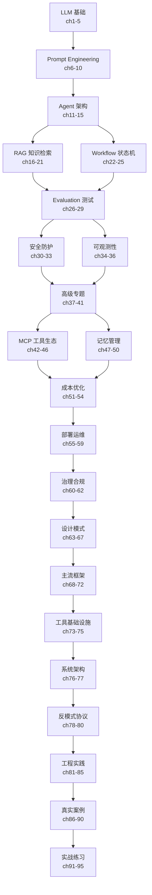

<!--
Chapter: 118
Node: SUMMARY-FINAL
Score: 100
Status: AUTO-GENERATED
Generated: summary
-->

# 第118章 【全书总结】AI Education OS 完全掌握指南

> 本章是全书95章的终极浓缩。读完本章，你将对 AI 工程师知识体系有完整的全局视野。

## 一、AI 工程师知识体系全景图

## 二、按时间预算的学习路径

### 30分钟速览（只看小结）

直接阅读 ch96-ch117（22章部分小结），每章约10分钟，重点看：
- 「知识点精华一览」表格
- 「高频面试题精华」

### 1周掌握（L0-L2 核心）

| 天 | 章节 | 内容 |
|---|------|------|
| Day 1 | ch1-ch10 | LLM基础 + Prompt Engineering |
| Day 2 | ch11-ch21 | Agent架构 + RAG |
| Day 3 | ch22-ch29 | Workflow + Evaluation |
| Day 4 | ch30-ch41 | 安全 + 可观测性 + 高级专题 |
| Day 5 | ch42-ch62 | MCP + 记忆 + 成本 + 部署 + 治理 |
| Day 6 | ch63-ch85 | 设计模式 + 框架 + 工程实践 |
| Day 7 | ch86-ch95 | 真实案例 + 实战练习 |

### 面试冲刺（3天）

| 天 | 重点 |
|---|------|
| Day 1 | ch96-ch103 小结（LLM基础到可观测性）+ 对应面试题 |
| Day 2 | ch104-ch111 小结（高级专题到主流框架）+ 对应面试题 |
| Day 3 | ch112-ch117 小结 + ch118全书总结 + 模拟面试 |

## 三、22个部分核心要点速查

### 第一部分：LLM 基础（ch1-5）

Token是计量单位，Context Window是记忆边界，Temperature控制随机性，Hallucination是LLM的原罪。**核心：LLM预测下一个token，不是真正理解。**

### 第二部分：Prompt Engineering（ch6-10）

Prompt是与LLM的接口，System Prompt设定角色，Few-shot给范例，CoT让模型思考，ReAct让模型边想边行动。**核心：输入质量决定输出质量。**

### 第三部分：Agent 架构（ch11-15）

Agent = LLM + 工具 + 循环。Agent Loop是感知-决策-行动的闭环，Tool Use通过Function Calling实现，Planning让Agent分解复杂任务，HITL在关键节点引入人工。**核心：Agent是有目标的自动化LLM。**

### 第四部分：RAG 与知识检索（ch16-21）

Embedding将文本变向量，Vector DB存储和检索向量，Chunking决定检索粒度，RAG = 检索+生成，Reranking提升精准度，Hybrid Search结合语义和关键词。**核心：RAG解决LLM知识截止问题。**

### 第五部分：Workflow 与状态机（ch22-25）

State Machine让Agent流程可控，LangGraph是状态机框架，Checkpoint实现断点续跑，Interrupt在关键节点暂停等待人工。**核心：状态机 = 可预测的Agent流程。**

### 第六部分：Evaluation 与测试（ch26-29）

LLM-as-Judge用AI评AI，RAGAS专门评估RAG质量，Eval Dataset是评估基础，Regression Testing防止退化。**核心：没有评估就没有迭代。**

### 第七部分：安全与防护（ch30-33）

Prompt Injection是最大威胁，Privilege Escalation防止权限滥用，Guardrails是安全护栏，Tool Injection防止工具被劫持。**核心：Agent权限越大，安全越重要。**

### 第八部分：可观测性（ch34-36）

Tracing追踪完整调用链，LLM Observability监控模型行为，Structured Logging让日志可被机器处理。**核心：生产系统必须可观测。**

### 第九部分：高级专题（ch37-41）

GraphRAG用知识图谱增强RAG，A2A Protocol让Agent互相通信，FCARS是AI治理体系，Chaos Engineering测试系统韧性，Fine-tuning让模型专业化。**核心：高级特性解决规模化问题。**

### 第十部分：MCP 与工具生态（ch42-46）

MCP是工具调用标准协议，Tool Schema定义工具接口，Sandbox隔离危险操作，Tool Injection是新型攻击向量，MCP Server/Client是架构分离模式。**核心：MCP = Agent工具的USB标准。**

### 第十一部分：记忆与上下文管理（ch47-50）

Short-term Memory是对话缓存，Long-term Memory跨会话持久化，Context Compression压缩长上下文，Memory Isolation保护用户隐私。**核心：记忆让Agent有连续性。**

### 第十二部分：成本优化（ch51-54）

Token Budget控制每次调用成本，Semantic Cache缓存相似请求，Model Routing用小模型处理简单任务，Context Pruning剪掉无用上下文。**核心：成本优化 = 钱和速度的双赢。**

### 第十三部分：部署与运维（ch55-59）

Graceful Degradation优雅降级保可用性，Multi-tenancy多租户隔离，Fine-tuning部署专属模型，Ollama本地部署，Chaos Engineering验证生产韧性。**核心：部署是Agent从Demo到Prod的关键。**

### 第十四部分：治理与合规（ch60-62）

FCARS框架覆盖公平性/合规/问责/可靠性/安全性，AI Compliance满足法规要求，AI Fairness防止歧视。**核心：治理是企业级AI的门票。**

### 第十五部分：Agent 设计模式（ch63-67）

ReAct是推理+行动循环，Supervisor-Worker是主从多Agent，Pipeline是顺序流水线，Semantic Cache缓存语义结果，Model Routing按复杂度分流。**核心：设计模式 = 前人踩坑总结的最优解。**

### 第十六部分：主流框架（ch68-72）

LangChain是工具链框架，LangGraph是状态机框架，AutoGen是多Agent对话框架，CrewAI是角色扮演多Agent，OpenAI Agents SDK是官方极简方案。**核心：框架选型看团队熟悉度和场景复杂度。**

### 第十七部分：工具与基础设施（ch73-75）

vLLM高效推理大模型，Vector DB存储和检索Embedding，Browser Automation让Agent操作网页。**核心：工具基础设施决定Agent能力上限。**

### 第十八部分：系统架构（ch76-77）

Agent Harness是生产级包装层，AI Testing Pyramid是测试分层体系。**核心：架构决定系统的可维护性和可扩展性。**

### 第十九部分：反模式与协议（ch78-80）

God Agent反模式（一个Agent做所有事），IDOR权限绕过漏洞，A2A Protocol标准化Agent间通信。**核心：知道不该做什么和该做什么同等重要。**

### 第二十部分：工程实践（ch81-85）

Prompt Version Control版本管理Prompt，Max Iteration Guard防止死循环，PII Detection保护隐私，JWT Auth实现认证，Secret Management安全存储密钥。**核心：工程实践是生产可用性的保障。**

### 第二十一部分：真实案例（ch86-90）

5个真实场景：客服Agent、代码审查Agent、RAG知识库、Multi-Agent研究助手、生产级部署。**核心：案例是最好的老师，看别人怎么踩坑再怎么解决的。**

### 第二十二部分：实战练习（ch91-95）

5个动手项目：基础Agent、RAG系统、Multi-Agent、安全加固、生产级Harness。**核心：只有写了代码，才算真正掌握。**

## 四、AI 工程师黄金法则

**评估优先**：没有评估就没有迭代。先建 Eval Dataset，再优化 Prompt/模型。

**安全默认**：Agent 拥有的权限越大，安全防护越不能妥协。Guardrails 必须在 Day 1 就部署。

**可观测性**：生产系统必须有 Tracing + Structured Logging。没有可观测性的 Agent 是黑盒。

**成本意识**：每次 LLM 调用都在烧钱。Token Budget + Semantic Cache + Model Routing 三件套必备。

**渐进式架构**：从单 Agent 开始，证明有效再加 Multi-Agent。过早的复杂性是万恶之源。

**人在回路**：高风险操作必须有 HITL。Agent 的自主性应该与任务风险成反比。

**版本控制一切**：Prompt、模型权重、Eval Dataset 都需要版本控制。可复现性是工程基础。

## 五、面试必背 Top 20 问题

**Q01. RAG vs Fine-tuning 如何选择？**
> 知识频繁更新→RAG；需要改变模型风格/能力→Fine-tuning；两者不互斥。

**Q02. Agent Loop 是什么？**
> 感知输入→LLM推理→选择工具→执行→观察结果→循环，直到任务完成或达到最大迭代次数。

**Q03. Prompt Injection 如何防御？**
> 输入验证+Guardrails+最小权限原则+Tool Sandbox隔离+输出过滤。

**Q04. 如何评估 RAG 质量？**
> RAGAS框架：Faithfulness（忠实度）+Answer Relevancy（相关性）+Context Recall（召回率）。

**Q05. Token Budget 如何管理？**
> 设置每次调用上限+累计成本追踪+超限报警+自动降级到小模型。

**Q06. LangGraph vs LangChain 区别？**
> LangChain是工具链（线性流程），LangGraph是状态机（循环/条件分支），复杂Agent用LangGraph。

**Q07. Multi-Agent 如何协调？**
> Supervisor-Worker模式：Supervisor分配任务，Worker专注执行，结果汇总到Supervisor。

**Q08. 如何防止 Agent 死循环？**
> Max Iteration Guard设置最大步数上限（通常15-20步），超限强制退出并告知用户。

**Q09. Semantic Cache 原理？**
> 将请求Embedding化，相似度>阈值（如0.95）时直接返回缓存结果，跳过LLM调用。

**Q10. 生产 Agent 必须有哪些组件？**
> Trace ID追踪+结构化日志+指数退避重试+全局超时+成本追踪+健康检查端点。

**Q11. Chunking 策略如何选？**
> 短文档→固定大小；长文档→语义分块；代码→按函数/类分块；表格→行级分块。

**Q12. Context Window 满了怎么办？**
> Context Compression摘要压缩+Context Pruning删除低相关内容+Long-term Memory持久化。

**Q13. HITL 在哪些场景必须用？**
> 高风险操作（删除/支付/发送）、低置信度输出、法规要求审计的场景。

**Q14. MCP 是什么？为什么重要？**
> Model Context Protocol，标准化LLM调用外部工具的协议，相当于Agent工具的USB接口。

**Q15. 如何做 Regression Testing？**
> 维护Golden Dataset，每次Prompt/模型变更后自动跑评估，分数下降则阻断部署。

**Q16. Fine-tuning 适合什么场景？**
> 需要特定输出格式、专业领域知识注入、减少Prompt长度、改变模型风格/语气。

**Q17. A2A Protocol 解决什么问题？**
> 标准化不同框架Agent之间的通信，让LangGraph Agent能调用AutoGen Agent，打破框架孤岛。

**Q18. God Agent 反模式是什么？**
> 一个Agent负责所有任务，导致Context过长、失败难定位、无法并行。应拆分为Supervisor+多个专责Worker。

**Q19. Memory Isolation 为什么重要？**
> 多租户系统中，用户A的记忆不能泄露给用户B，需要tenant_id隔离+访问控制。

**Q20. AI 工程师和 ML 工程师的区别？**
> ML工程师训练模型；AI工程师用API调用模型，重点在Prompt/Agent/RAG/安全/评估/部署工程。

## 六、写在最后

AI 工程是一个快速演进的领域。本书覆盖的95个知识节点，是2024-2026年间最核心的工程实践沉淀。

**最重要的三件事**：
1. **动手写代码**：读100遍不如写一次。从 ch91-ch95 的练习项目开始。
2. **建立评估体系**：没有Eval就没有迭代方向。
3. **保持学习**：MCP、A2A、新模型每月都在进化。关注变化，但抓住不变的工程原则。

---
*「不要等到完全掌握再开始，边做边学才是AI工程师的正确姿势。」*
