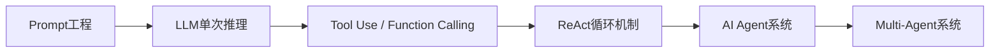
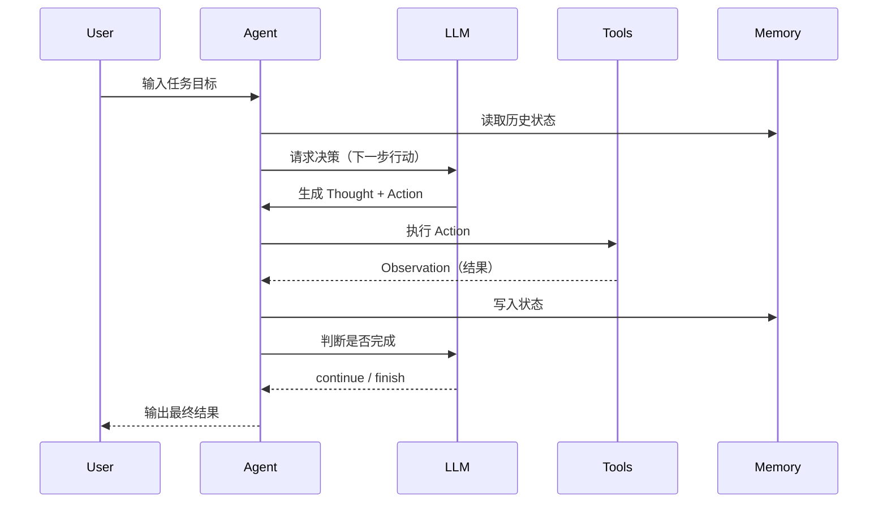
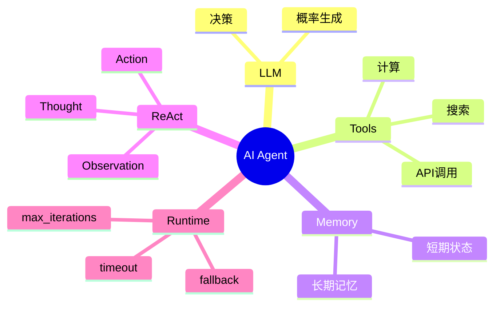

# 第11章 Agent (AI Agent) [L1-L2]

## Part 1：为什么要学这个？[L1-L2]

你可能见过一种“看起来很强”的系统：接入大模型、接入工具、再加一点记忆模块，然后包装成 Agent，对外宣称“可以自动完成复杂任务”。

在实验环境里，它确实表现不错：能查数据、能写分析、还能调用 API。

但一旦进入生产环境，它的行为开始变得不可预测——不是崩溃，而是“持续低效地运行正确逻辑”。

它会在工具选择上犹豫几秒，在多个 API 之间反复切换，在已经足够的信息下仍然继续搜索，最终悄悄消耗掉大量 Token 和 API 预算。

更隐蔽的问题是：它没有明显错误，但整体系统成本失控。

你在这里最常见的误解是：Agent = 更强的 LLM。

但现实完全相反。

你花了两周时间，用 LangChain 构建了一个“全能 Agent”，给它接了 15 个工具：搜索、代码执行、数据库查询、邮件发送、Jira 操作……上线第一天，它开始在每一步花 3–5 秒纠结“该用哪个工具”，工具选择错误率接近 40%，Token 消耗是单次 LLM 调用的 20 倍，并且因为 ReAct 循环没有终止条件直接烧光预算。

问题不在模型能力，而在系统设计。

Agent 不是“能力叠加”，而是“行为约束系统”。

本章要解决的核心问题是：

> 为什么“更多工具 + 更强模型”会导致系统更差？真正可用的 Agent 系统边界到底在哪里？

---

## Part 2：学习路径定位 [L1-L2]

Agent 位于 LLM 应用架构从“问答系统”走向“执行系统”的关键分水岭。



位置关系：

* 前置：Prompt / Token / Function Calling
* 当前：Agent（多步任务执行系统）
* 后置：Multi-Agent 协作系统

---

## Part 3：用生活理解它 [L1-L2]

Agent 更像一个“实习工程师”。

你给他的不是一个问题，而是一个目标：

“把这份数据分析完，并输出报告。”

他会自己拆解任务：

* 找数据
* 写脚本
* 跑分析
* 汇总结果

但关键问题在于：

如果你给他一台装了 100 个软件的电脑，他反而更慢，因为每一步都在纠结“该用哪个工具”。

### 类比边界

这个类比容易误导的地方在于：

* 实习生具备真实的语义理解与常识推理能力，但 Agent 本质是基于概率分布的 token 生成系统，不具备稳定的世界模型
* Agent 的“决策”不是理解后的推理，而是在上下文约束下的概率性路径选择，因此必须通过系统约束（工具限制、迭代上限、权限控制）来稳定行为

---

## Part 4：AI如何映射到传统概念 [L1-L2]

| 传统软件系统    | Agent系统                 |
| --------- | ----------------------- |
| 单次API调用   | ReAct循环                 |
| 后端服务      | LLM推理引擎                 |
| SDK函数库    | Tools（Function Calling） |
| Session状态 | Memory系统                |
| 工作流引擎     | Agent Runtime           |

核心变化：

传统系统是“流程预定义”，Agent 是“流程动态生成”。

---

## Part 5：技术本质深讲 [L1-L2]

Agent 的本质是一个“闭环控制系统”：

> 目标驱动 + 状态反馈 + 工具执行 + 循环优化

其运行机制如下：



### 四大核心组件

**1. LLM（决策层）**
负责选择下一步行动，本质是策略函数。

**2. Tools（执行层）**
外部能力扩展，包括搜索、计算、数据库、API。

**3. Memory（状态层）**

* 短期：上下文窗口
* 长期：外部存储（向量数据库）

**4. Runtime（控制层）**
负责：

* 循环调度
* max_iterations 控制
* timeout 控制
* 失败恢复

---

## Part 6：动手Demo（可运行代码）[L1-L2]

下面是一个安全版本的最小 Agent Loop（避免 eval 风险，使用安全计算方式）：

```python
import ast
import operator as op

# 安全算术操作映射（替代 eval）
SAFE_OPS = {
    ast.Add: op.add,
    ast.Sub: op.sub,
    ast.Mult: op.mul,
    ast.Div: op.truediv
}

def safe_eval(expr):
    """
    安全计算表达式，只支持基础四则运算
    """
    node = ast.parse(expr, mode='eval').body

    if isinstance(node, ast.BinOp):
        left = safe_eval(ast.unparse(node.left))
        right = safe_eval(ast.unparse(node.right))
        return SAFE_OPS[type(node.op)](left, right)

    if isinstance(node, ast.Constant):
        return node.value

    raise ValueError("Unsupported expression")


TOOLS = {
    "search": lambda x: f"搜索结果: {x}",
    "calc": safe_eval
}

class SimpleAgent:
    def __init__(self):
        self.memory = []
        self.max_iterations = 5

    def llm_decide(self, task):
        if "计算" in task:
            return ("calc", "2+2")
        return ("search", task)

    def run(self, task):
        for i in range(self.max_iterations):
            tool, arg = self.llm_decide(task)
            result = TOOLS[tool](arg)

            self.memory.append((tool, result))

            print(f"[Step {i}] tool={tool}, result={result}")

            if tool == "calc":
                return result

        return "未完成任务"

agent = SimpleAgent()
print(agent.run("帮我计算"))
```

运行结果：

* Agent 自动选择工具
* calc 使用安全解析执行
* memory 记录执行轨迹

---

## Part 7：真实项目场景 [L1-L2]

某大型电商平台在 2025 年上线客服 Agent，用于处理退货、物流查询和投诉。

该系统在测试环境表现稳定，但上线后出现明显问题：

凌晨流量高峰期间，Agent 在部分 API 超时情况下错误推断“流程已完成”，导致错误状态被提交，用户订单状态异常，客服投诉量短时间上升约 300%。

这里的“任务完成率”定义为：用户请求被正确解决并且无需人工二次介入的比例，从 60% 提升到 92%。

“API异常导致的客诉事件”指：由于工具调用失败或超时引发的用户投诉工单数量，该指标下降约 75%。

重构方案包括：

* 拆分为多个子 Agent（按业务域划分）
* 限制 max_iterations ≤ 10
* 增加工具调用超时 + 重试（指数退避策略）
* 引入降级策略：当工具不可用时回退到规则引擎或人工客服

结果：

* 任务完成率 60% → 92%
* API异常客诉下降 75%
* 平均响应时间降低约 40%

---

## Part 8：这里容易踩坑 [L1-L2]

### 错误1：工具过多

错误：

```text
Agent = 15~20 tools
```

正确：

```text
Agent = 3~8 高相关工具
```

原因：工具空间爆炸导致 LLM 决策复杂度上升。

---

### 错误2：无终止条件

错误：

```text
无限 ReAct loop
```

正确：

```text
max_iterations = 5~10
timeout = 30~300s
```

---

### 错误3：权限过大

错误：

* delete / write / approve 全开放

正确：

* 默认只读 + 精细授权写权限

---

## Part 9：面试怎么答 [L1-L2]

### L1问题

**Q：Agent 和普通 LLM 有什么区别？**

要点：

* LLM：单步输入输出
* Agent：多步循环 + 工具调用 + 状态管理

---

### L2问题

**Q：ReAct Loop 是什么？**

要点：

* Thought → Action → Observation 循环
* 直到满足终止条件

---

### L3问题（增强版）

**Q：如何设计生产级 Agent 系统？**

要点：

* 最小权限设计（Least Privilege）
* 可观测性（日志 + trace + token monitoring）
* max_iterations + timeout 硬限制
* 工具调用失败处理：

  * retry + exponential backoff
  * circuit breaker（熔断机制）
* 降级策略：

  * fallback 到规则引擎
  * fallback 到人工处理队列
* 子 Agent 拆分：

  * 按业务域隔离职责
  * 避免单一超级 Agent

---

## Part 10：考点速查 [L1-L2]

* **Agent三要素**：LLM + Tools + Memory
* **ReAct机制**：推理与执行交替循环
* **工具爆炸问题**：工具越多性能越差
* **终止条件设计**：防止无限循环
* **最小权限原则**：安全核心约束

---

## Part 11：必背金句 [L1-L2]

* Agent不是更强的模型，而是被约束的执行系统
* 工具越多，决策越慢
* 没有终止条件的Agent一定会失控
* ReAct是循环控制，不是思考
* 智能的上限由约束决定，而不是参数规模

---

## Part 12：快速参考表 [L1-L2]

| 概念             | 作用   | 示例             |
| -------------- | ---- | -------------- |
| LLM            | 决策引擎 | GPT-4          |
| Tools          | 执行能力 | API / DB       |
| Memory         | 状态存储 | Vector DB      |
| ReAct          | 循环机制 | Thought-Action |
| max_iterations | 安全控制 | 5~10           |

---

## Part 13：思维导图 [L1-L2]



---

## Part 14：本章小结 [L1-L2]

Agent 本质不是模型能力升级，而是一个受约束的多步执行系统。

它通过 LLM 决策、Tools 执行、Memory 记录状态，实现复杂任务自动化。

系统可靠性的关键不在能力，而在约束设计与失败控制机制。

---

## Part 15：下一章预告 [L1-L2]

当一个 Agent 已经可以执行任务时，新的问题出现了：

Agent 每次"思考-行动"的循环是如何驱动的？历史工具调用的结果存在哪里？遇到中断怎么恢复？

下一章将进入：

> **Agent Loop（Agent 执行循环）** — 把 ReAct 思想落地为可运行的工程执行框架