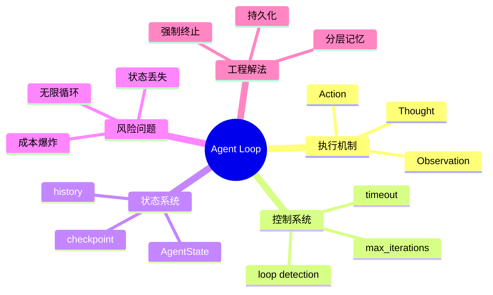

# 第12章 Agent Loop [L1-L2]

## Part 1：为什么要学这个？[L1-L2]

你花了一个周末写了一个Agent Demo，能联网搜索、能调用工具、能自主决策，跑起来行云流水。你自信满满地部署到生产环境，结果第二天一早收到云厂商的告警——账单从平时的几百块暴涨到两万多。查日志才发现，你的Agent在凌晨3点陷入死循环：不断用同一个关键词搜索、得到同样的空结果、然后继续搜索，整整跑了4个小时，直到max_iterations耗尽。

更麻烦的是，这种行为在逻辑上“完全合理”。LLM每一轮都在做局部最优决策：搜索没结果 → 换个表达再搜 → 还是没结果 → 再试一次。

从单步看没有错误，从整体看却在烧钱。

很多人会误判一个关键事实：Agent Loop只是“让LLM多跑几次while循环”。

但真实情况更接近反过来：

**Agent Loop不是让模型更聪明，而是防止它在不确定性里无限漂移。**

问题变成一个工程悖论：

* 让LLM自由 → 它可能无限循环
* 强行限制它 → 又破坏自主性

本章要解决的核心问题是：

**如何构建一个既能执行多步任务，又不会失控的Agent Loop工程系统。**

---

## Part 2：学习路径定位[L1-L2]

Agent Loop位于ReAct模式之上的工程控制层，是从“推理范式”走向“系统工程”的关键分界点。


前置依赖：

* Prompt结构化表达
* ReAct（Thought / Action / Observation）
* Tool Calling机制

后续演进：

* LangGraph工作流编排
* 多Agent协作系统
* AI自动化业务系统

---

## Part 3：用生活理解它[L1-L2]

把Agent Loop想象成你让一个实习生做调研。

你不会说：“查资料直到你觉得够了。”

你会说：

“最多查3轮，如果还没结果，就停止并汇报。”

实习生每一轮会：

* 思考下一步查什么
* 去执行查询
* 返回结果
* 决定是否继续

但如果你不设边界，他可能会：

* 一直重复同一个关键词
* 在错误路径上反复尝试
* 甚至查一整天都不停止

类比的边界在于：

* 人类可以“自觉停止”，LLM没有停止意图
* 人类有成本意识，LLM只有概率续写机制

---

## Part 4：AI如何映射到传统概念[L1-L2]

| 传统软件系统  | Agent系统                  |
| ------- | ------------------------ |
| while循环 | Agent Loop               |
| 状态机     | AgentState               |
| 函数调用    | Tool Calling             |
| 日志系统    | Observation history      |
| 重试机制    | iterative reasoning      |
| 任务调度    | max_iterations / timeout |

关键变化：

传统系统：确定性控制流
Agent系统：概率决策 + 外部约束控制

---

## Part 5：技术本质深讲[L1-L2]

Agent Loop本质是一个“带约束的状态转移系统”。

每一轮循环都包含：

1. 读取状态（State）
2. LLM推理（Thought）
3. 生成动作（Action）
4. 执行工具（Tool）
5. 写回观察结果（Observation）
6. 更新状态进入下一轮

```mermaid
sequenceDiagram
  participant User
  participant Loop
  participant LLM
  participant Tool

  User->>Loop: Task
  Loop->>LLM: Current State
  LLM->>Loop: Thought + Action(JSON)
  Loop->>Tool: Execute Action
  Tool-->>Loop: Observation Result
  Loop->>Loop: Update AgentState
  Loop->>LLM: Next Iteration Input
```

核心工程组件：

* **AgentState**

  * task：原始目标
  * history：完整轨迹（不可丢）
  * iteration：执行轮次
* **max_iterations**

  * 防止无限循环
* **timeout**

  * 防止单轮卡死
* **checkpoint**

  * 状态持久化

核心结论：

> Agent Loop = 概率模型 + 强约束执行器

---

## Part 6：动手Demo（可运行代码）[L1-L2]

这一版引入“真实LLM输出解析”，模拟工程中的 JSON Tool Calling 结构。

```python
from dataclasses import dataclass, field
from typing import List, Dict, Any
import json

# -----------------------------
# Agent状态定义
# -----------------------------
@dataclass
class AgentState:
    task: str
    history: List[Dict[str, Any]] = field(default_factory=list)
    iteration: int = 0


# -----------------------------
# Mock LLM：返回 JSON 字符串
# -----------------------------
def mock_llm(state: AgentState) -> str:
    """
    模拟真实LLM输出（字符串形式JSON）
    """
    if state.iteration >= 2:
        return json.dumps({
            "thought": "任务已完成",
            "action": {
                "type": "FINISH",
                "result": "OK"
            }
        })

    return json.dumps({
        "thought": "需要继续搜索信息",
        "action": {
            "type": "TOOL",
            "name": "search",
            "params": {"query": "agent loop"}
        }
    })


# -----------------------------
# Tool定义
# -----------------------------
def search_tool(params: Dict[str, Any]) -> str:
    return f"[search_result] {params['query']}"


TOOLS = {
    "search": search_tool
}


# -----------------------------
# 解析LLM输出
# -----------------------------
def parse_llm_output(output: str) -> Dict[str, Any]:
    """
    将LLM JSON字符串解析为Python对象
    """
    return json.loads(output)


# -----------------------------
# Agent Loop
# -----------------------------
def run_agent(task: str, max_iterations: int = 5):
    state = AgentState(task=task)

    while state.iteration < max_iterations:

        # 1. LLM生成JSON决策
        raw_output = mock_llm(state)

        # 2. 解析JSON
        parsed = parse_llm_output(raw_output)
        thought = parsed["thought"]
        action = parsed["action"]

        # 3. 记录思考过程
        state.history.append({
            "thought": thought,
            "action": action
        })

        # 4. FINISH判断
        if action["type"] == "FINISH":
            return action["result"]

        # 5. TOOL执行
        if action["type"] == "TOOL":
            tool_name = action["name"]
            params = action["params"]

            observation = TOOLS[tool_name](params)

            state.history.append({
                "observation": observation
            })

        # 6. 更新状态
        state.iteration += 1

        # 7. checkpoint（模拟持久化）
        print(f"[checkpoint] iter={state.iteration}")

    return "MAX_ITER_REACHED"


if __name__ == "__main__":
    result = run_agent("test task")
    print("FINAL RESULT:", result)
```

运行现象：

* LLM输出JSON字符串
* 系统解析 action
* TOOL执行并返回 observation
* iteration达到2后FINISH

关键工程点：

* LLM输出必须结构化（JSON）
* 必须解析 action，而不是字符串判断
* Loop完全控制执行流

---

## Part 7：真实项目场景[L1-L2]

某团队部署4个基于LangChain的Agent，通过A2A协议协作分析市场数据，本地测试正常。

上线后出现严重问题：

两个Agent陷入循环协作：

* Agent A请求Agent B补充信息
* B反问A定义不清
* A继续澄清
* B继续追问

本质问题：**没有任何Agent具备“终止协商”的能力**

系统持续运行11天。

成本结果：

* 第1周：43美元
* 第4周：18,240美元
* 总计接近5万美元

修复方案：

* max_iterations（硬终止）
* max_budget_usd（成本控制）
* loop detection（重复工具调用检测）
* checkpoint持久化（DynamoDB / S3）

修复后：

* 单任务成本：2–5美元
* 循环问题彻底消失

---

## Part 8：这里容易踩坑[L1-L2]

### 错误1：无限循环

```python
while True:
    llm.call()
```

问题：
LLM不会知道“该停了”。

正确方式：

```python
while i < max_iterations:
    llm.call()
```

---

### 错误2：不做checkpoint

```python
state = {}
```

问题：
进程崩溃 = 全部重跑

正确方式：

```python
save_to_db(state)
```

---

### 错误3：错误截断历史（关键问题强化版）

错误写法：

```python
history = history[-3:]
```

问题本质：

* Agent已经尝试过Tool A（搜索失败）
* 被截断后“忘记失败记录”
* 下一轮再次调用Tool A
* 导致无意义重复循环

更危险的是：

模型会“误判世界状态”为未探索过。

正确方案：

```text
保留：
- 最近完整轨迹
- 历史摘要（失败/成功归纳）
- 已尝试工具集合
```

工程正确做法是：

* 滑动窗口 + 结构化摘要 + 工具记忆三层结合
  而不是简单截断

---

## Part 9：面试怎么答[L1-L2]

### L1题：终止条件

核心要点：

* FINISH（模型主动结束）
* max_iterations（强制停止）
* timeout（时间兜底）
* 连续失败（避免死循环）
* 外部中断（系统级控制）

---

### L2题：AgentState设计

核心要点：

* task：原始目标
* history：完整执行轨迹
* iteration：控制循环
* tool_memory：已调用工具集合

设计原则：

* 只追加不修改
* 可回放
* 可审计

---

### L3题：Context Window超限策略（升级版）

#### 方案1：滑动窗口

* 优点：简单
* 缺点：丢失长期依赖

#### 方案2：摘要压缩

* 优点：节省token
* 缺点：信息损失不可逆

#### 方案3：Checkpoint恢复

* 优点：完整状态保存
* 缺点：存储成本高

#### 方案4：分层记忆（推荐）

工程最佳实践：

* Short-term memory：最近N轮完整history
* Mid-term memory：结构化摘要（成功/失败/工具记录）
* Long-term memory：checkpoint持久化状态

组合优势：

* 不丢关键决策
* 不爆context window
* 可恢复执行状态

---

## Part 10：考点速查[L1-L2]

* **Agent Loop是受控循环结构**：不是简单while
* **LLM不具备停止能力**：必须外部约束
* **checkpoint是生产必需品**：不是优化项
* **history不可丢失关键事件**：否则决策退化
* **Tool调用必须结构化**：否则无法控制执行流

---

## Part 11：必背金句[L1-L2]

* Agent Loop不是循环，是受控执行系统
* LLM负责思考，系统负责停止
* 没有max_iterations的Agent等于生产事故
* checkpoint不是优化，是恢复能力
* history丢失等于Agent失明

---

## Part 12：快速参考表[L1-L2]

| 概念             | 作用     | 示例           |
| -------------- | ------ | ------------ |
| max_iterations | 防止无限循环 | 10-50        |
| timeout        | 防止卡死   | 30s          |
| checkpoint     | 状态恢复   | DB/S3        |
| AgentState     | 任务上下文  | dict         |
| Observation    | 工具结果   | API response |

---

## Part 13：思维导图[L1-L2]



---

## Part 14：本章小结[L1-L2]

Agent Loop的本质不是循环，而是“带约束的智能执行系统”。

它解决的不是“如何让LLM更强”，而是：

* 如何让它不失控
* 如何让它可停止
* 如何让它可恢复

从L0到L2的演进是：

* 单次生成
* 多步推理
* 可控执行系统

---

## Part 15：下一章预告[L1-L2]

我们已经解决了“单Agent如何安全运行”的问题。

但现实系统更复杂：

多个Agent开始协作时，会出现新的问题——

循环调用、责任推诿、甚至成本指数级放大。

下一章将进入：
**Multi-Agent Coordination（多Agent协作控制与冲突消解机制）**