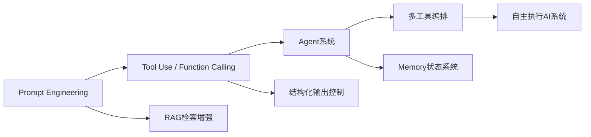
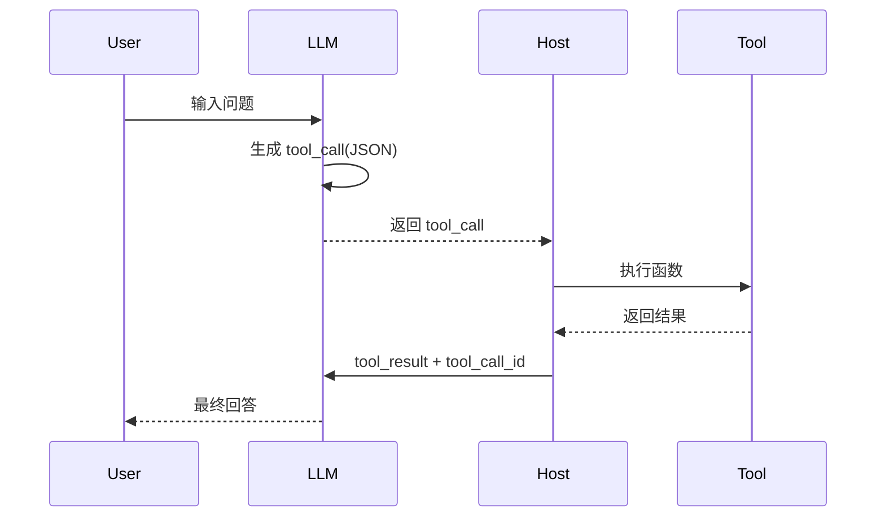
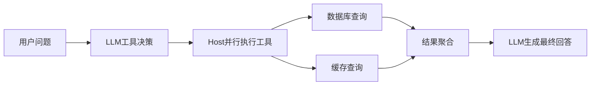
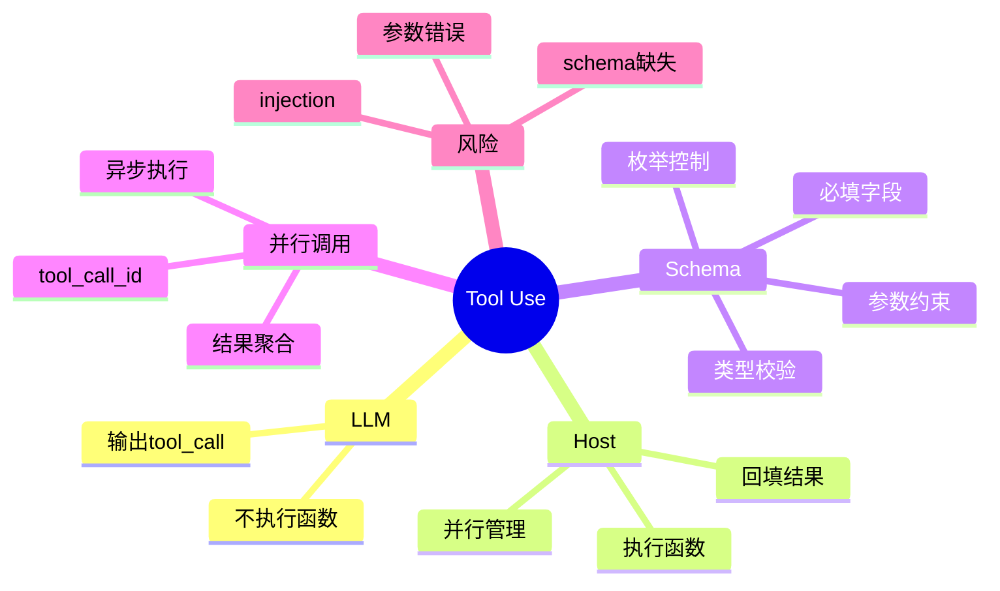

# 第13章 Tool Use (Function Calling) [L1-L2]

## Part 1：为什么要学这个？[L1-L2]

你接手了一个 AI Agent 客服系统升级任务，需求很简单：让模型“自动查订单”。

你顺手写了一个函数，接入 Function Calling，然后上线。

第二天日志里出现这样的请求：

```json
{"tool_name": "query_order", "arguments": {"order_id": null}}
```

系统直接报错。

你第一反应是：模型不够聪明。

但再看一遍链路才发现问题根本不在“聪明不聪明”，而在一个误解：

你以为模型在“调用函数”，实际上它只是在“写调用建议”。

---

更隐蔽的问题是：

你甚至没意识到——模型输出的 tool_call，本质只是 JSON 文本，而不是任何执行行为。

它不会触发函数，不会访问数据库，也不会“知道执行失败”。

---

核心冲突在这里：

你以为：

> LLM = 自动执行工具的智能体

真实情况是：

> LLM = 生成“执行指令草案”的文本模型

---

本章要解决的核心问题是：

> **LLM 如何通过结构化输出“指挥系统执行动作”，而自己完全不参与执行？**

---

## Part 2：学习路径定位 [L1-L2]

Tool Use 是 LLM 从“对话系统”走向“执行系统”的关键分界线。



前置能力：

* Prompt 结构控制
* JSON Schema 理解
* 基础后端 API 设计

后置能力：

* Agent 编排系统
* 多工具路由
* 自动化执行框架

---

## Part 3：用生活理解它

把 Tool Use 想成医院系统：

* LLM 是“分诊台护士”
* Tool 是“各科医生”
* Host 是“医院调度系统”

护士不会做手术，她只决定：

> “这个病人去外科”

医生才真正执行治疗。

类比边界：

* ❌ 护士不会开刀（LLM不会执行函数）
* ❌ 医生不会决定分诊规则（工具不会决策）
* ⚠️ 如果分诊写错（tool_call错），医生也会被带偏

---

## Part 4：AI如何映射到传统概念

| Tool Use       | 传统后端系统              |
| -------------- | ------------------- |
| LLM            | Controller / Router |
| tool_call JSON | RPC Request         |
| Tool Function  | Microservice API    |
| Host Executor  | API Gateway         |
| Tool Result    | Service Response    |

关键变化：

> 从“函数调用”变成“结构化远程调度协议”

---

## Part 5：技术本质深讲

Tool Use 的本质不是调用函数，而是：

> **LLM 生成结构化执行计划，宿主系统负责执行与反馈**

完整链路如下：



### 关键组件补全（工程级细节）

#### 1. tool_call_id（关键修正点）

每个 tool_call 都会带唯一 ID：

```json
{
  "id": "call_001",
  "name": "query_order",
  "arguments": {"order_id": "A123"}
}
```

Host 执行后必须回填：

```json
{
  "tool_call_id": "call_001",
  "result": {"status": "shipped"}
}
```

否则并行调用无法匹配结果。

---

#### 2. 多工具并发匹配机制

多个 tool_call 会并行执行：

* tool_call_1 → SQL 查询
* tool_call_2 → Web 搜索

必须依赖 tool_call_id 做结果归因。

---

### 常见误解修正

LLM 不存在：

* 不执行函数
* 不等待结果
* 不访问数据库

它只做一件事：

> 输出“结构化意图”

---

## Part 6：动手Demo（可运行代码）

加入了更真实的“输入驱动决策 + schema + 校验 + ID关联”。

```python
import json
import uuid

# 模拟数据库
ORDERS = {
    "A123": {"status": "shipped"},
    "B456": {"status": "processing"}
}

# 工具函数
def query_order(order_id):
    return ORDERS.get(order_id, {"error": "not found"})

# 模拟 LLM（加入 user_input 逻辑）
def mock_llm(user_input):
    # 简单关键词推断（替代真实 LLM）
    if "A123" in user_input:
        order_id = "A123"
    elif "B456" in user_input:
        order_id = "B456"
    else:
        order_id = "unknown"

    return {
        "id": str(uuid.uuid4()),
        "tool_name": "query_order",
        "arguments": {
            "order_id": order_id
        }
    }

# schema 校验（简化版）
def validate(tool_call):
    if tool_call["arguments"]["order_id"] == "unknown":
        return False
    return True

# 执行器
def executor(tool_call):
    if not validate(tool_call):
        return {"error": "invalid arguments"}

    return {
        "tool_call_id": tool_call["id"],
        "result": query_order(**tool_call["arguments"])
    }

def main():
    user_input = "帮我查一下订单 A123 到哪了"

    tool_call = mock_llm(user_input)
    execution_result = executor(tool_call)

    if "error" in execution_result:
        print("执行失败")
    else:
        print("订单状态:", execution_result["result"]["status"])

if __name__ == "__main__":
    main()
```

运行结果：

```python
订单状态: shipped
```

---

## Part 7：真实项目场景

某电商客服系统重构：

用户请求：

> “我的订单怎么还没到？”

---

### 原系统问题

* RAG + DB 查询 + prompt 拼接
* 多次 API roundtrip
* P50: 12.7s
* P95: 18.4s

瓶颈不是模型，而是“链路割裂”。

---

### Tool Use 改造

定义工具：

* query_order(order_id)

LLM 输出：

```json
{
  "id": "call_123",
  "name": "query_order",
  "arguments": {
    "order_id": "A123"
  }
}
```

---

### 执行链路



---

### 性能指标（修正版）

* P50：12.7s → 3.2s
* P95：18.4s → 5.1s
* DB 查询占比：72% → 81%（链路集中化）

结论不是“模型变快了”，而是：

> 计算路径被收敛到了 Host 层执行

---

## Part 8：这里容易踩坑

### 错误1：把 LLM 当函数执行器

❌ 错误：

```python
llm.execute(query_order("A123"))
```

问题：

* 模型不会执行代码
* tool_call 只是 JSON

✔ 正确：

```python
tool_call = llm_output()
result = query_order(**tool_call["arguments"])
```

---

### 错误2：忽略 Schema 约束

❌

```python
query_order(order_id=None)
```

✔ 正确（完整 schema）：

```json
{
  "type": "object",
  "properties": {
    "order_id": {
      "type": "string",
      "enum": ["A123", "B456"]
    }
  },
  "required": ["order_id"]
}
```

关键点：

* type
* required
* enum
* properties

---

### 错误3：description 写得太弱

❌

```json
"description": "查订单"
```

✔

```json
"description": "用于查询订单物流状态，仅在用户询问订单进度/物流/配送时调用，需要 order_id"
```

---

## Part 9：面试怎么答

### L1：Function Calling 工作流程

* 定义工具 schema
* LLM 输出 tool_call
* Host 执行函数
* 回传 tool_result
* LLM 生成最终答案

---

### L2：description 作用

* 决定工具是否被选择
* 决定调用边界
* 决定多工具竞争结果

优化：

* 明确触发条件
* 明确参数构造方式

---

### L3：并行工具调用（工程版）

核心问题不是“能不能并行”，而是：

> 如何保证异步结果一致性？

关键点：

* tool_call_id 必须唯一
* result 必须绑定 id
* Host 需做结果聚合
* LLM 输入必须排序或结构化映射

风险：

* 异步返回乱序
* 结果错配
* 上下文污染

---

## Part 10：考点速查

* **Tool Use 本质**：LLM 只输出结构化执行计划
* **Host 职责**：执行函数 + 回填结果
* **tool_call_id**：并行调用的核心索引
* **Schema 约束**：控制模型行为边界
* **执行链路**：LLM → JSON → Host → Tool → LLM

---

## Part 11：必背金句

* Tool Use 是“指令生成”，不是“函数执行”
* LLM 不做事，只做决策表达
* tool_call_id 是并行系统的核心锚点
* Schema 决定模型行为边界
* 工具描述质量直接决定调用准确率
* 工具描述是模型决策的唯⼀依据，描述不清则调用不准

---

## Part 12：快速参考表

| 概念           | 作用       | 示例               |
| ------------ | -------- | ---------------- |
| tool_call    | 模型输出执行指令 | {"name":"query"} |
| tool_call_id | 并行关联标识   | call_001         |
| schema       | 参数约束     | JSON Schema      |
| host         | 执行层      | backend          |
| tool_result  | 执行结果     | {"status":"ok"}  |

---

## Part 13：思维导图



---

## Part 14：本章小结

Tool Use 的本质是把“执行权”从模型剥离到系统层。

LLM 只负责生成结构化指令，不接触任何真实执行环境。

当 Host 接管执行之后，AI 才从对话模型变成行动系统。

---

## Part 15：下一章预告

你已经让模型学会“发指令 + 调工具”。

但现实问题来了：

当一个任务需要多个步骤、多次工具调用时——模型如何规划执行顺序？

下一章将进入：

> 多步决策与 Agent Planning 机制