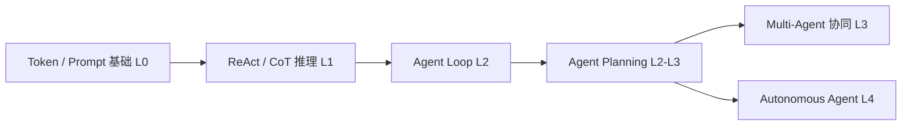
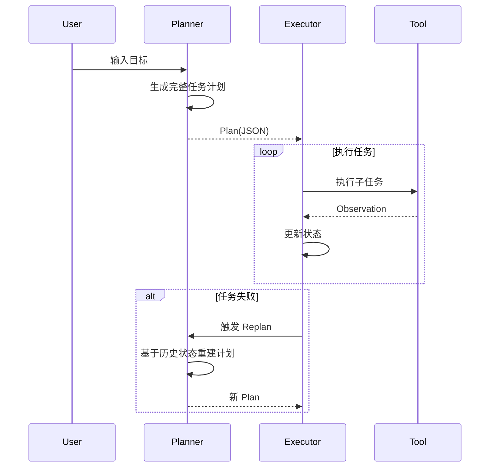
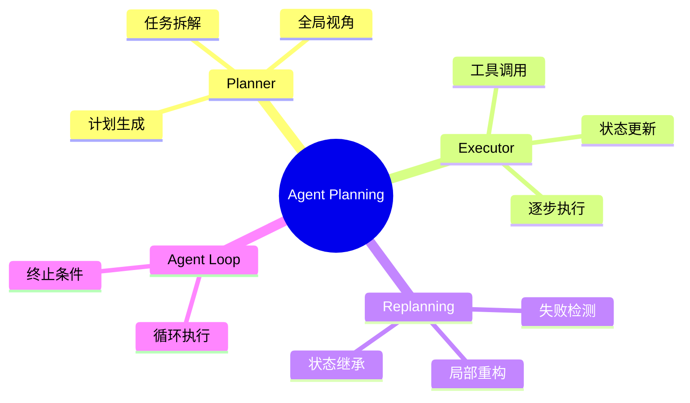

# 第14章 Agent Planning [L2-L3]

## Part 1：为什么要学这个？[L2-L3]

你在做一个多步数据分析 Agent：需要从数据库拉取 3 张表、做 join 聚合、计算指标、再生成可视化报表。

ReAct 模式跑起来时，看起来一切正常——直到任务长度超过 3～5 步之后开始崩坏。

它会出现一种非常“迷惑”的现象：

* 第 2 步选错 join key，但后面还继续算
* 第 4 步开始忘记最初目标
* 第 6 步输出看起来合理，但和业务问题完全无关

你第一反应通常是：
“是不是 Prompt 不够好？”
“是不是模型不够强？”

于是你开始：

* 加 few-shot
* 加思维链示例
* 换更强模型

但结果几乎没有本质改善。

真正的问题在于：你用错了系统结构。

ReAct 的本质是“局部决策循环”，每一步只看当前上下文。它没有全局施工图。任务一旦超过 10 步，就会像没有图纸的施工队一样：每一步都合理，但整体必然失败。

本章要解决的核心问题是：

如何让 Agent 在长链路任务中具备“先设计再施工”的能力，而不是边做边崩。

---

## Part 2：学习路径定位

Agent Planning 位于从“局部推理 Agent”走向“系统级 Agent”的关键跃迁点。



前置能力：

* ReAct（思考-行动循环）
* Agent Loop（执行机制）
* Tool Calling（工具调用）

后置能力：

* 多智能体协作系统
* 企业级自动化工作流
* 长链路任务编排系统

---

## Part 3：用生活理解它

Planning 就像装修房子。

你不会直接拿锤子进场，而是先做：

* 设计图
* 水电布局
* 材料清单
* 施工顺序

但关键点是：设计图不是一次性文件。

如果施工中发现：
“这面墙不能拆”
你必须改图纸，而不是继续硬拆。

Planning 的核心不是“提前想一次”，而是：
**持续维护一张可以更新的施工图。**

---

## Part 4：AI如何映射到传统概念

| 传统工程概念   | Agent Planning 对应  |
| -------- | ------------------ |
| WBS拆解    | Task Decomposition |
| 项目计划书    | Plan（JSON任务列表）     |
| 开发执行     | Executor           |
| Bug修复流程  | Replanning         |
| 项目经理     | Planner            |
| CI/CD流水线 | Agent Loop         |

本质上，Planning 是把“项目管理系统”嵌入 LLM 执行循环中。

---

## Part 5：技术本质深讲

Agent Planning = 三段式执行结构：

1. Planner：生成全局任务图
2. Executor：逐步执行任务
3. Replanner：失败时重建任务结构



关键组件：

* **Plan**：结构化任务列表
* **State**：执行历史 + 输出
* **Failure Signal**：工具失败 / 输出异常
* **Replan Trigger**：偏离目标或失败
* **Termination Condition**：任务完成

核心原则：

> Planning 不是一次性生成步骤，而是控制整个执行生命周期。

---

## Part 6：动手Demo（可运行代码）

这个版本修复了一个关键问题：
✔ 支持“真实失败触发 Replan”
✔ mock plan 与 goal 相关
✔ 可配置失败点
✔ 避免无限循环（加入最大轮次保护）

```python
import json
import random

# 根据 goal 动态生成计划
def mock_llm_plan(goal: str):
    if "报表" in goal:
        return json.dumps([
            "连接数据库",
            "提取表A数据",
            "提取表B数据",
            "提取表C数据",
            "数据清洗",
            "Join三表",
            "计算指标",
            "生成可视化报表"
        ])
    return json.dumps(["执行通用任务"])

# 模拟执行子任务（支持失败注入）
def execute_subtask(task, fail_step=None, step_idx=None):
    if fail_step is not None and step_idx == fail_step:
        return {"status": "FAILED", "output": None}
    return {"status": "SUCCESS", "output": f"done:{task}"}

# Replan：基于失败点重建后续任务
def replan(goal, plan, failed_index):
    remaining = plan[failed_index + 1:]
    fix = ["修复失败步骤并校验数据一致性"]
    return remaining + fix

def run_agent(goal, fail_step=None, max_rounds=3):
    plan = json.loads(mock_llm_plan(goal))
    state = []
    round_count = 0
    i = 0

    print("=== INITIAL PLAN ===")
    print(plan)

    while i < len(plan):
        if round_count > max_rounds:
            print("!! STOP: avoid infinite replanning loop !!")
            break

        task = plan[i]
        result = execute_subtask(task, fail_step, i)

        print(f"[Step {i}] {task} -> {result['status']}")

        state.append(result)

        if result["status"] == "FAILED":
            print(">>> TRIGGER REPLAN <<<")
            plan = replan(goal, plan, i)
            i = 0
            round_count += 1
            continue

        i += 1

    return state


if __name__ == "__main__":
    run_agent("生成月度数据分析报表", fail_step=2)
```

运行后你会看到：

* 初始 plan 被生成
* 执行到指定 step 失败
* 触发 replan
* 重新执行修复后的流程
* 最终完成任务或触发保护停止

---

## Part 7：真实项目场景

某金融企业月结报表系统（生产级 Agent）

任务链路：

* 15~20 个步骤
* 多数据源（交易 / 风控 / 用户）
* 多层聚合计算 + BI 可视化

### 原架构（ReAct）

问题：

* 每步都调用 LLM（成本爆炸）
* 长链路中途丢目标
* 无法回溯执行状态
* 完成率 < 60%
* 耗时：12 小时

---

### 改造后（Plan-and-Execute）

架构调整：

* Planner：生成完整任务图
* Executor：工具调用执行（小模型）
* Replanner：异常恢复

关键优化：

* Planner 用大模型（保证结构正确）
* Executor 用小模型（降低成本）
* State 持久化（checkpoint）

---

### 结果

* 耗时：12h → 3.2h（↓73%）
* 成功率：60% → 92%
* Token 成本：下降约 60%
* Replan 触发率：稳定 < 15%

---

## Part 8：这里容易踩坑

### 错误1：忽略任务依赖关系

错误：

```text
1. 优化查询
2. 重构服务
3. 添加缓存
```

问题：缓存依赖查询结构，但顺序错了

正确：

```text
1. 分析查询结构
2. 重构服务接口
3. 优化查询逻辑
4. 添加缓存层
```

---

### 错误2：Replan 退化成无限循环

错误模式：

* 失败 → 重跑整个 plan → 再失败 → 无限循环

解决：

* 加 max_rounds
* 保留 state
* 只重写“剩余任务”

---

### 错误3：Executor 没有全局目标

后果：

* 子任务成功
* 但整体任务失败

解决：

* Executor 必须持有 goal + history

---

## Part 9：面试怎么答

### L1：基础理解

**Q：ReAct vs Plan-and-Execute？**

要点：

* ReAct：边推理边执行
* Planning：先生成任务图
* ReAct适合短任务（<5步）
* Planning适合长链路任务（10+步）

---

### L2：工程实现

**Q：计划失效怎么办？**

参考答案结构：

* 设置 Replan 触发条件：

  * task failure
  * output异常
* 保存 state（已完成步骤 + 输出）
* 只重建 remaining plan
* 避免 full reset
* 加入最大重试次数（如 3 次）

---

### L3：系统设计

**Q：如何评估 Planning 系统？**

建议指标 + 方法：

* 计划合理性

  * 方法：人工抽样评审 + 规则校验依赖关系
* 任务完成率

  * 方法：end-to-end success rate（目标 >85%）
* Replan频率

  * 健康区间：10%~20%
  * > 30% 表示 plan 质量差
* P99 延迟

  * 可接受：< 10s（不含外部工具）
* Token成本

  * Planner占比应 < 30%

---

## Part 10：考点速查

* **Plan-and-Execute架构**
* **Replanning机制设计**
* **Task Dependency建模**
* **State持久化策略**
* **Agent Loop扩展结构**

---

## Part 11：必背金句

* 没有全局图的执行都是局部噪声
* Planning 是把不确定执行变成可控流程
* ReAct解决“怎么做”，Planning解决“做什么顺序”
* 失败不是错误，是重新规划的信号
* Agent系统稳定性来自结构，不来自模型能力

---

## Part 12：快速参考表

| 概念       | 作用   | 示例              |
| -------- | ---- | --------------- |
| Plan     | 任务结构 | JSON list       |
| Executor | 执行工具 | API call        |
| Replan   | 重构任务 | partial rewrite |
| State    | 执行记录 | history         |
| Goal     | 全局目标 | "生成报表"          |

---

## Part 13：思维导图



---

## Part 14：本章小结

Agent Planning 的本质是把 LLM 从“局部推理机器”升级为“任务级规划系统”。

通过 Planner + Executor + Replanner 三层结构，实现：

* 长任务拆解
* 稳定执行
* 动态纠错

从 L0→L3 的演进，本质是从“回答问题”走向“完成任务”。

---

## Part 15：下一章预告

当 Agent 已经能按计划完成复杂任务时，新的问题出现：

多个 Agent 同时执行不同 Plan 时，如何协同？

下一章将进入：
**Multi-Agent Coordination：冲突、协作与共享目标机制设计。**