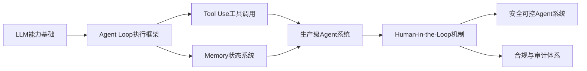
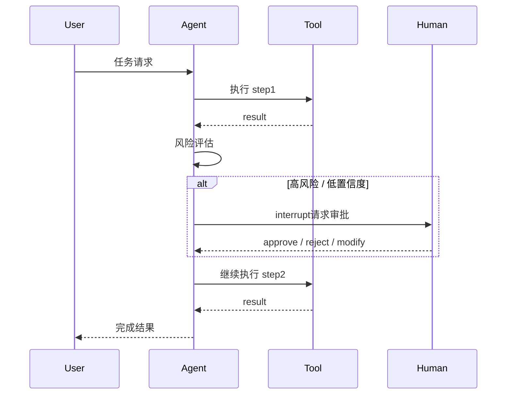
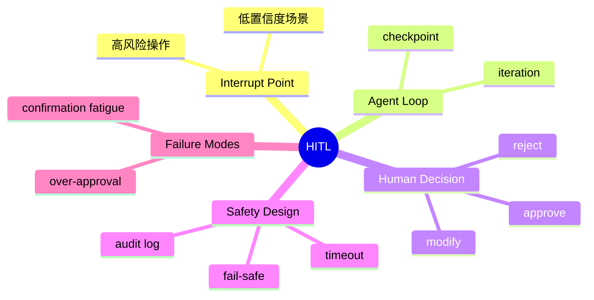

# 第15章 Human-in-the-Loop (HITL) [L2-L3]

## Part 1：为什么要学这个？[L2-L3]

你在做一个客服 Agent 系统，线上效果很好，自动化率不断提升，团队已经开始讨论“减少人工客服编制”。

直到有一天，系统自动执行了一次“退款 + 账户冻结 + 邮件通知”的组合动作，而触发条件只是模型对用户意图的一次误判。

用户投诉爆炸，业务方紧急回滚。

复盘会上有人问了一个非常尖锐的问题：
“我们到底是在提升效率，还是在把错误自动化放大？”

你开始意识到一个残酷现实：
LLM 的问题从来不是“不会做事”，而是“会做错事，并且还能连贯执行”。

于是真正的问题出现了：

如何在不牺牲自动化效率的前提下，把人类判断嵌入到系统最关键的决策点？

---

## Part 2：学习路径定位[L2-L3]

Human-in-the-Loop（HITL）处在 Agent 从“自主执行”走向“可控自治”的关键控制层，是 Agent Loop 的安全增强机制。



前置依赖：

* LLM Token 与推理机制
* Agent Loop（iteration + checkpoint）
* Tool Calling

后续扩展：

* Agent Governance（策略治理）
* Multi-Agent 协同控制
* Autonomous Workflow with Oversight

---

## Part 3：用生活理解它[L2-L3]

HITL 更像医院的分诊机制。

护士可以处理大多数轻症患者，但遇到以下情况必须叫医生：

* 生命体征异常
* 病因不明确

医生不会参与每个测量步骤，否则医疗系统会崩溃。
但也不会完全放权，否则风险不可控。

类比边界：

* 医生不是实时“插入每一步流程”，而是关键节点决策
* HITL 是工程化机制，不是人为随时介入

---

## Part 4：AI如何映射到传统概念[L2-L3]

| 传统系统    | AI Agent系统        |
| ------- | ----------------- |
| 工作流审批节点 | HITL interrupt    |
| 人工复核流程  | checkpoint恢复      |
| BPM引擎   | Agent Loop        |
| 风控规则系统  | LLM policy gating |
| 审计日志系统  | approval log      |

核心差异：
传统是规则驱动控制流，
AI 是概率驱动 + 人类校正控制流。

---

## Part 5：技术本质深讲[L2-L3]

HITL 的本质不是“加一个确认按钮”，而是：

> 在 Agent Loop 中引入可暂停、可恢复、可审计的执行断点

核心组件：

* Interrupt Point：触发人工介入的条件节点
* Checkpointer：保存执行状态
* Resume Engine：恢复执行上下文
* Risk Policy：决定是否触发 HITL



关键原则：

* HITL 不覆盖所有步骤
* HITL 只处理高风险或不确定性
* 默认 fail-safe（不响应 = 拒绝）

---

## Part 6：动手Demo（可运行代码）[L2-L3]

```python
import time
import threading

class SimpleHITLAgent:
    def __init__(self, timeout=10):
        self.timeout = timeout

    def risk_check(self, action):
        risky = ["delete", "transfer", "refund"]
        return action in risky

    def get_input_with_timeout(self, prompt):
        result = {"value": None}

        def ask():
            result["value"] = input(prompt)

        t = threading.Thread(target=ask)
        t.start()
        t.join(self.timeout)

        if t.is_alive():
            print("\n[HITL] 超时未响应，默认拒绝")
            return "n"

        return result["value"]

    def interrupt(self, action):
        print(f"\n[HITL] 高风险操作: {action}")
        return self.get_input_with_timeout("Approve? (y/n/m): ")

    def execute(self, task):
        steps = [s.strip() for s in task.split("->")]

        for step in steps:
            print(f"\n执行: {step}")

            if self.risk_check(step):
                decision = self.interrupt(step)

                if decision == "n":
                    print("终止执行")
                    return

                if decision == "m":
                    step = input("修改后的操作: ")

                    # 修改后重新进行风险检查（修正点）
                    if self.risk_check(step):
                        print("修改后仍为高风险操作，再次进入HITL")
                        decision = self.interrupt(step)
                        if decision == "n":
                            print("终止执行")
                            return

            time.sleep(1)
            print(f"完成: {step}")

        print("\n全部完成")

agent = SimpleHITLAgent(timeout=5)
agent.execute("query data -> refund -> notify user")
```

关键修正点：

* 修改后的操作重新进入 risk_check，避免绕过风险控制
* interrupt 使用 timeout 模拟生产级非阻塞机制
* 超时默认 reject，符合 fail-safe 原则

---

## Part 7：真实项目场景[L2-L3]

某支付平台构建反欺诈系统，每天处理约 3.2 万笔交易。

系统设计分层如下：

* 低风险（score < 0.7）：自动通过
* 中风险（0.7 - 0.85）：人工快速审核
* 高风险（> 0.85 或金额 > 10 万）：专家会审

人工审核分工：

* 快速审核员：人均每天处理约 180–220 笔交易（平均 2–3 分钟/笔）
* 专家组：每天处理约 40–60 个复杂案例（平均 10–15 分钟/笔）

所有审批记录包括：

* 审批人
* 时间戳
* 决策结果
* 修改建议
  全部写入审计日志系统，满足金融监管要求。

效果：

* 误拦截率下降 42%
* 85%交易完全自动化
* 高风险案件100%可追溯审计

---

## Part 8：这里容易踩坑[L2-L3]

### 错误1：HITL过密（每步确认）

```python
# ❌ 错误设计
for step in steps:
    input("approve?")
    execute(step)
```

问题：

* 审核疲劳
* 人类进入“默认批准模式”
* HITL失去意义

正确方式：

```python
if is_risky(step) or confidence < 0.7:
    hitl(step)
```

---

### 错误2：阻塞式输入无超时

```python
# ❌ 错误
decision = input("approve?")
```

问题：

* 系统永久挂起
* Agent Loop 被锁死

正确方式：

```python
decision = get_input_with_timeout(30, default="reject")
```

---

### 错误3：默认批准

风险：

* 人类未响应 → 自动执行危险操作

必须：

* 默认 reject（fail-safe）

---

## Part 9：面试怎么答[L2-L3]

### L1

HITL是什么？

要点：

* Agent执行中的人工介入机制
* 用于高风险或不确定决策
* 平衡自动化与安全

---

### L2

如何设计HITL？

要点：

* risk-based触发
* confidence threshold
* interrupt + resume
* checkpoint机制

---

### L3

如何解决确认疲劳？

要点：

* 降低触发频率
* 风险分层审批
* 批量review
* 默认reject + timeout
* 避免过度HITL设计

---

## Part 10：考点速查[L2-L3]

**HITL触发机制**

* 高风险操作触发

**置信度控制**

* 低置信度必须人工确认

**Fail-safe设计**

* 超时默认拒绝

**确认疲劳**

* HITL过密导致质量下降

---

## Part 11：必背金句[L2-L3]

* HITL不是按钮，是风险边界
* 每一步确认等于放弃自动化
* 人类负责边界，机器负责执行
* 没有fail-safe的系统是伪安全
* HITL只在关键节点有价值

---

## Part 12：快速参考表[L2-L3]

| 概念                   | 作用    | 示例               |
| -------------------- | ----- | ---------------- |
| Interrupt Point      | 人工介入点 | refund           |
| Confidence Threshold | 风险阈值  | 0.7              |
| Checkpoint           | 状态保存  | thread_id        |
| Fail-safe            | 默认策略  | reject           |
| Approval Log         | 审计记录  | user/time/action |

---

## Part 13：思维导图[L2-L3]



---

## Part 14：本章小结[L2-L3]

HITL的核心不是“人工参与”，而是“控制风险的断点机制”。

从L0到L3演进路径：

* L0：完全自动幻想
* L1：意识到需要人工兜底
* L2：引入interrupt机制
* L3：形成分层风险治理体系

本质是：在自动化与安全之间找到工程化平衡。

---

## Part 15：下一章预告[L2-L3]

本章解决了：Agent如何在关键节点引入人类判断。

但新的问题是：

当 Agent 需要检索外部知识时，如何把语义相似性转化为可计算的距离？为什么 RAG 系统需要先把文本"变成数字"？

下一章将进入：

**Embedding（向量嵌入）** — RAG 体系的起点，理解语义检索的底层机制