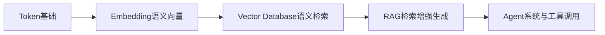
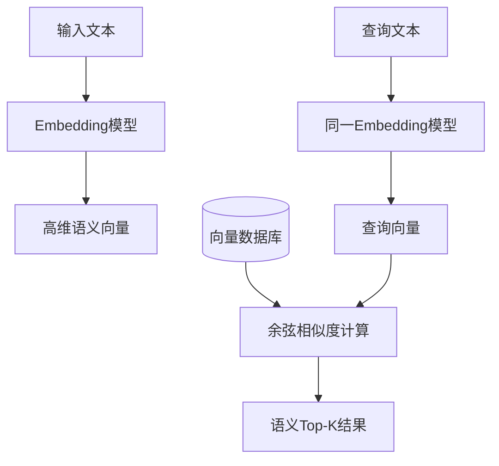
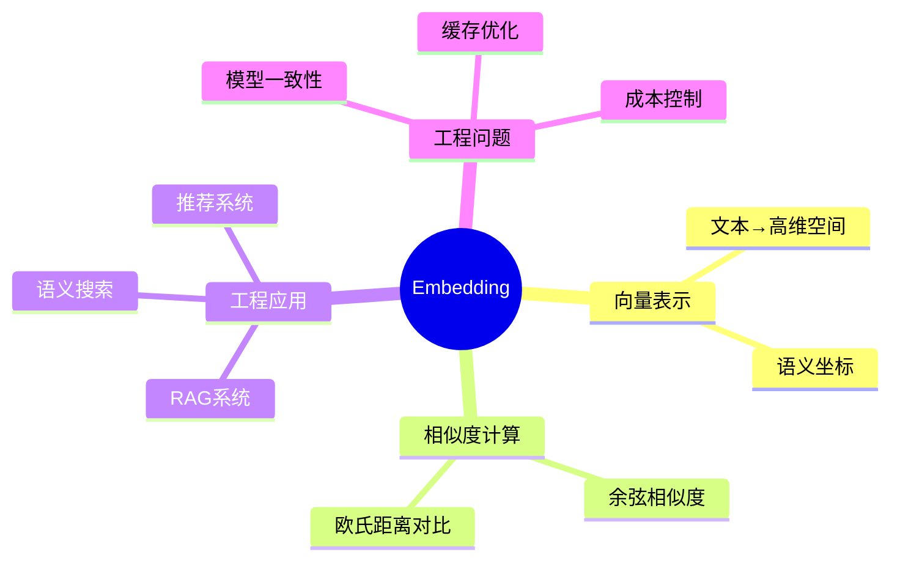

# 第16章 Embedding（向量嵌入） [L1-L2]

## Part 1：为什么要学这个？[L1-L2]

你正在做一个企业知识库搜索系统，产品经理给了一个看起来“很简单”的需求：

“用户搜‘怎么给公司省钱’，要把所有包含‘成本控制’、‘降本增效’的文档都找出来。”

你习惯性地选择了工程师最安全的方案：BM25 + 关键词扩展词典。

于是你加了同义词：

* 省钱 → 成本、降本、节约
* 优化 → 改善、调整
* 预算 → 费用、开支

你以为已经覆盖了“语义问题”。

结果上线后，真实用户输入：

“如何优化预算结构”

系统返回：空。

不是没有相关文档，而是文档里写的是“费用治理”“成本结构重构”，一个关键词都没命中。

问题开始变得刺眼：
你以为你在做“搜索”，实际上你在做“字符串交集运算”。

真正的冲突在这里：

> 人类在做语义匹配，机器在做字符匹配。

本章要解决的核心问题是：

**如何让机器从“词是否出现”升级为“意思是否接近”？**

答案的底层机制，就是 Embedding。

---

## Part 2：学习路径定位[L1-L2]

Embedding 位于“语言 → 数学空间”的转换层，是 RAG 的地基。



前置知识：

* Tokenization（文本切分）
* 基础向量与点积概念

后置能力：

* 向量数据库设计
* RAG系统实现
* 语义搜索与推荐系统

---

## Part 3：用生活理解它[L1-L2]

Embedding 就像给每一句话分配一个“语义坐标”。

类似地图定位：

* 北京：经纬度坐标
* 上海：另一个坐标点

如果两座城市距离近，说明它们在空间上接近。

Embedding 做的事情类似：

“iPhone”和“苹果手机” → 坐标很近
“iPhone”和“量子力学” → 距离很远

边界说明：
现实中这是一个上千维空间（例如1536维），不是二维地图，语义关系远比地理复杂。

---

## Part 4：AI如何映射到传统概念[L1-L2]

| 传统系统     | Embedding系统 |
| -------- | ----------- |
| LIKE模糊查询 | 余弦相似度       |
| 关键词索引    | 向量索引        |
| 手写同义词词典  | 自动语义空间      |
| SQL查询    | ANN向量检索     |

核心变化：

从“规则驱动匹配” → “几何空间计算”。

---

## Part 5：技术本质深讲[L1-L2]

Embedding 本质是一个函数：

> f(text) → ℝⁿ 向量空间

它把文本压缩成语义空间中的一个点。



关键组件：

* Embedding Model：语义压缩器
* Vector：语义坐标点
* Cosine Similarity：角度相似度
* Vector DB：存储与快速检索

余弦相似度公式：

cos(θ) = (A·B) / (||A||·||B||)

核心思想：
只看“方向”，不看“大小”。

---

## Part 6：动手Demo（可运行代码）[L1-L2]

```python
# Embedding语义相似度计算Demo
from openai import OpenAI
import numpy as np

client = OpenAI()

def cosine_similarity(a, b):
    a = np.array(a)
    b = np.array(b)
    return np.dot(a, b) / (np.linalg.norm(a) * np.linalg.norm(b))

texts = [
    "如何省钱",
    "成本控制方法",
    "今天天气很好"
]

vectors = []
for text in texts:
    res = client.embeddings.create(
        model="text-embedding-3-small",
        input=text
    )
    vectors.append(res.data[0].embedding)

query = "降本增效策略"

q_vec = client.embeddings.create(
    model="text-embedding-3-small",
    input=query
).data[0].embedding

scores = []
for v in vectors:
    scores.append(cosine_similarity(q_vec, v))

for t, s in sorted(zip(texts, scores), key=lambda x: x[1], reverse=True):
    print(t, "=>", round(s, 4))
```

运行现象说明：

语义相近的文本（例如“成本控制方法”“如何省钱”）通常会获得较高相似度分数，而“今天天气很好”会明显较低。

注意：
排序结果并不是固定的，它取决于模型版本与输入表达方式。

---

## Part 7：真实项目场景[L1-L2]

某大型互联网企业构建内部 RAG 知识库：

* 文档规模：10万 → chunk 后 50万~300万
* 应用：故障定位 + 技术方案检索

早期问题：

* “合同违约责任” → 返回招聘信息
* “服务降级” → 找不到“熔断限流”

检索失败率：17%

优化方案：

1. 更换 Embedding 模型

   * BGE-M3：中文长文本语义更强
2. 分层检索策略

   * 高频查询走轻量模型
3. Embedding Cache

   * 相同文本复用向量

最终结果：

* 失败率 < 3%
* 检索延迟降低 3x+

关键结论：
问题不在“模型不够强”，而在“语义空间不一致”。

---

## Part 8：这里容易踩坑[L1-L2]

### 错误1：混用Embedding模型

❌ 错误：

* 文档用A模型
* 查询用B模型

结果：

* 向量空间不一致 → 检索崩溃

✔ 正确：

* 全系统必须统一Embedding模型

---

### 错误2：用LLM当Embedding（关键误区修正）

❌ 错误：

```python
# 错误理解：让LLM“输出向量”
"请把这段文本转成向量"
```

问题本质：

LLM（如GPT）输出的是**自然语言 token 序列**，本质是文本生成模型，不会产生稳定维度的数值向量。

它无法提供：

* 固定维度
* 可用于点积计算
* 可用于空间距离比较

✔ 正确方式：

```python
client.embeddings.create(
    model="text-embedding-3-small",
    input="文本"
)
```

Embedding模型专门训练目标是：

> 让语义 → 数值向量空间

---

### 错误3：忽略缓存

❌ 每次都重新计算 embedding → 成本爆炸

✔ 正确：

* 文本 hash → cache key
* 命中直接复用向量

---

## Part 9：面试怎么答[L1-L2]

### L1题

**Embedding是什么？解决什么问题？**

要点：

* 文本 → 高维向量
* 语义相似 → 距离更近
* 解决关键词匹配无法处理同义表达问题

---

### L2题

**为什么用余弦相似度？**

要点：

* 只看方向，不看长度
* 避免文本长度影响
* 更稳定的语义度量

公式：
cos(θ) = A·B / (||A||·||B||)

---

### L3题

**Embedding模型迁移怎么做？**

要点：

* 不同模型 → 向量空间不兼容
* 必须重新计算所有 embedding
* 成本：百万级文档 → 高计算+API费用

补充关键工程点：

* 可采用小流量验证（A/B测试）
* 若维度不同：

  * 可评估 PCA 降维（会损失部分语义信息）
* 建议迁移策略：

  * 双写（旧+新模型）
  * 渐进切换流量
  * 观察召回率变化

风险点：

* 不重算 → 检索结果完全失真

---

## Part 10：考点速查[L1-L2]

* **Embedding向量化**：文本映射到高维空间
* **语义距离**：用余弦相似度衡量
* **模型一致性**：同系统必须统一模型
* **向量空间不可混用**：不同模型不可直接比较

---

## Part 11：必背金句[L1-L2]

* 语义不是词的集合，而是空间的距离
* Embedding不是翻译，是坐标映射
* 相似不是字符相同，而是向量接近
* RAG的核心不是生成，是检索
* 向量空间一旦混用，系统必然失真

---

## Part 12：快速参考表[L1-L2]

| 概念                | 作用    | 示例                 |
| ----------------- | ----- | ------------------ |
| Embedding         | 文本→向量 | 1536维数组            |
| Cosine Similarity | 相似度计算 | 0.82               |
| Vector DB         | 向量存储  | FAISS / Milvus     |
| Query Vector      | 查询表示  | [0.12, -0.33, ...] |

---

## Part 13：思维导图[L1-L2]



---

## Part 14：本章小结[L1-L2]

Embedding的本质，是把语言压缩进一个可计算的语义空间。

你从关键词匹配，走到了语义空间计算。

再进一步，你开始理解：搜索不是“找字”，而是“算距离”。

---

## Part 15：下一章预告[L1-L2]

你已经可以把文本变成向量，并计算语义相似度。

但新的问题出现了：

> 当向量规模达到百万甚至千万级时，如何在毫秒级完成最近邻搜索？

下一章将进入RAG系统的核心基础设施层：

**Vector Database：语义检索的执行引擎。**