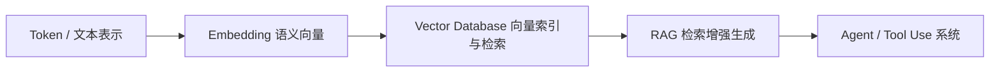
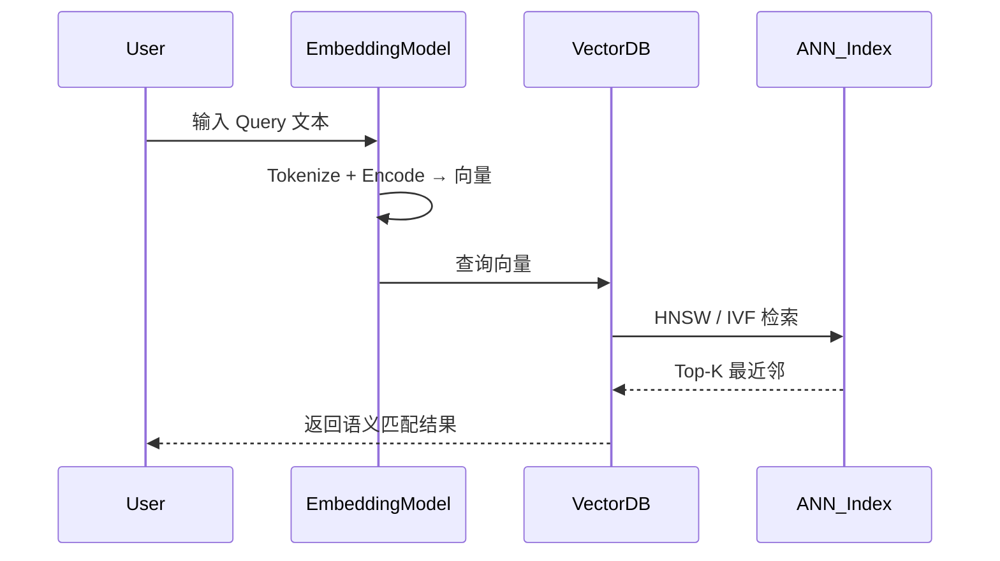
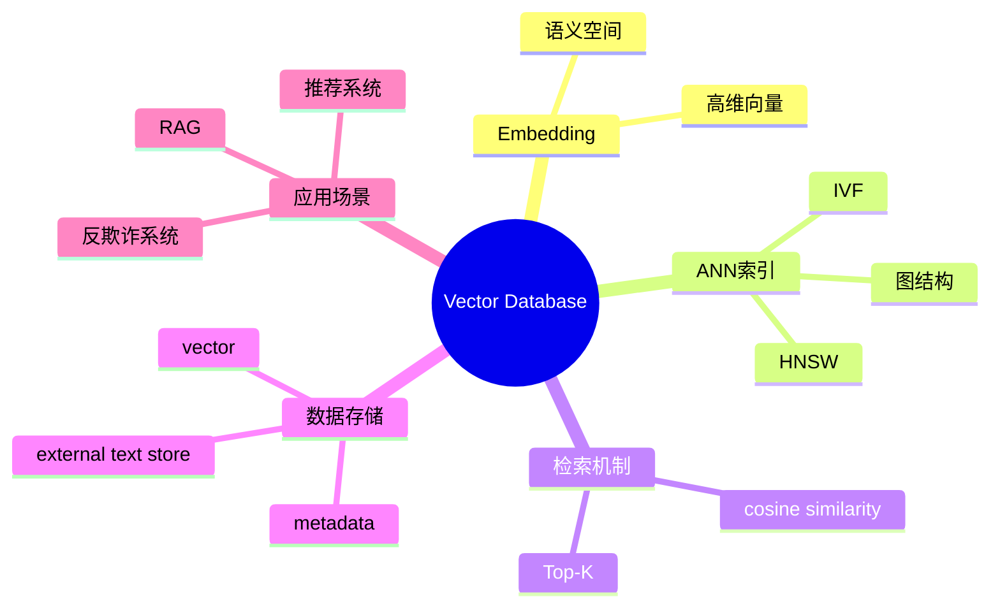

# 第17章 Vector Database（向量数据库） [L1-L2]

## Part 1：为什么要学这个？[L1-L2]

你在做一个医疗 RAG 系统，用户输入：“糖尿病酮症酸中毒怎么处理”。

系统返回了一堆“看起来相关”的内容：

* 包含“糖尿病”的文档
* 包含“中毒”的文档
* 包含“处理”的文档

甚至一篇讲“食物中毒急救”的文章排在第二位。

但真正关键的诊疗指南——原文写的是“DKA（Diabetic Ketoacidosis）”——因为没有出现“中毒”这个词，被排到了第 47 位。

用户没有看到正确答案。

问题不在模型，也不在数据，而在你对“搜索”的理解。

你以为：搜索 = 找包含关键词的内容。
但现实是：搜索的本质 = 找语义相近的内容。

“DKA”和“糖尿病酮症酸中毒”没有任何字面重合，但语义完全一致。传统搜索系统无法跨越这个鸿沟。

而向量数据库做的事情是：
把“DKA”和“糖尿病酮症酸中毒”映射到高维语义空间中，让它们的几何距离极小。

换句话说：
搜索不再是“词的匹配”，而是“语义坐标的距离计算”。

---

## Part 2：学习路径定位 [L1-L2]

向量数据库处在“语义表示 → 可计算检索系统”的中间层，是 RAG 的核心基础设施之一。



学习路径：

* L0：关键词匹配思维（WHERE LIKE）
* L1：Embedding 语义空间（向量表示）
* L1-L2：Vector Database（语义检索系统）
* L2：RAG 架构设计
* L3+：多租户 / ANN 优化 / 分布式索引系统

---

## Part 3：用生活理解它

向量数据库像一位读过整座图书馆所有书的管理员。

你问：“有没有讲失落和重生的书？”

他不会去翻书名，而是凭借对内容的理解，把《活着》《肖申克的救赎》《老人与海》递给你。

这里的关键不是“猜”，而是他脑中有一张“知识图谱 + 语义经验”。

而向量数据库的不同在于：
它不靠经验，而是依赖 Embedding 模型把语义压缩成高维空间中的坐标——相似语义在这个空间中天然靠近。

所以“相似”，不是主观判断，而是几何距离。

---

## Part 4：AI如何映射到传统概念

| 传统系统                | 向量数据库系统          |
| ------------------- | ---------------- |
| MySQL / PostgreSQL  | 结构化精确查询          |
| Elasticsearch       | 关键词检索            |
| 图书馆按书号查找            | ID 精确匹配          |
| 推荐系统（规则）            | 语义相似推荐           |
| B-Tree / Hash Index | HNSW / ANN Graph |

核心变化：

* 传统：WHERE id = X
* 向量：find top-K nearest vectors

---

## Part 5：技术本质深讲

向量数据库的核心问题不是“存数据”，而是：

> 在高维空间中进行近似最近邻搜索（ANN），在毫秒级返回最相似的 Top-K 向量。



### 核心组件

**1. Embedding 向量**

* 高维语义坐标（384~3072维）
* 语义相似 → 距离更近

**2. ANN 索引（HNSW）**

* 多层图结构
* 上层快速跳跃定位
* 下层精细搜索

**3. 距离函数（关键）**

* cosine similarity：适用于**已归一化向量**
* inner product：适用于**未归一化且关注强度/权重**
* L2 distance：对尺度敏感，需要谨慎使用

选型原则：

* 向量已归一化 → cosine
* 关注向量强度 → inner product
* 需要严格几何距离 → L2（需标准化）

**4. 查询流程**

1. Query → Embedding
2. 进入 ANN 图结构
3. 分层跳转搜索
4. 返回 Top-K

---

## Part 6：动手Demo（可运行代码）

```python
import numpy as np
from sklearn.neighbors import NearestNeighbors

# 模拟语义知识库（真实场景来自 embedding model）
documents = [
    "糖尿病酮症酸中毒（DKA）治疗指南",
    "食物中毒急救处理方法",
    "机器学习基础入门教程",
    "Python 数据分析实战",
    "DKA 临床紧急处理方案"
]

# 固定随机种子保证可复现
np.random.seed(42)

# 模拟 embedding（真实为模型输出）
embeddings = np.random.rand(len(documents), 16)

# 构建 ANN 索引（这里用 sklearn 模拟）
model = NearestNeighbors(n_neighbors=3, metric="cosine")
model.fit(embeddings)

# 构造“语义查询向量”（不是随机，而是可控模拟）
# 让 query 更接近医疗类向量（前两个文档）
query_vec = embeddings[0] * 0.6 + embeddings[4] * 0.4

distances, indices = model.kneighbors(query_vec.reshape(1, -1))

print("查询：糖尿病酮症酸中毒怎么处理")
print("最相关结果：\n")

for idx in indices[0]:
    print("-", documents[idx])
```

### 逐行说明

* `documents`：模拟医疗 + 非医疗混合知识库
* `embeddings`：模拟语义空间（固定 seed 保证稳定）
* `query_vec`：人为构造“医疗语义偏置”，模拟真实 query embedding
* `NearestNeighbors`：模拟 ANN 检索（生产用 HNSW）

### 运行结果

你会看到：

* 医疗相关文档排名靠前
* 非医疗内容被自然过滤
* 结果稳定（不是随机噪声）

---

## Part 7：真实项目场景

某金融科技公司构建实时反欺诈系统：

背景：

* 每笔交易需 200ms 内判断风险
* 历史交易向量规模：1,200,000 条
* embedding 维度：768

问题：

* 暴力 KNN（CPU brute force）
* 单次查询耗时：2.3 秒（p95）

瓶颈拆解：

* 距离计算 O(N × d)
* N = 1.2M → 无法实时

解决方案：

* 引入 HNSW 向量数据库
* 构建多层图索引
* 启用量化（FP32 → FP16）

```text
交易向量 → Vector DB (HNSW) → Top-K 相似欺诈模式
```

### 性能对比（真实工程配置）

| 项目      | 暴力KNN | HNSW Vector DB |
| ------- | ----- | -------------- |
| 数据量     | 1.2M  | 1.2M           |
| 延迟（p95） | 2.3s  | 180ms          |
| CPU占用   | 高     | 中              |
| 内存占用    | 低     | +40%           |
| 召回率     | 100%  | 96%            |

关键理解：

* HNSW 不是免费优化
* 是“精度换速度”的结构性 trade-off
* 内存换时间

---

## Part 8：这里容易踩坑

### 坑1：只存向量，不存原文 + metadata

错误：

```text
vector_db.add([embedding])
```

问题：

* 查到 ID 后必须二次查询
* 增加 50~200ms 网络延迟
* 无法追溯语义上下文

正确：

```text
vector + lightweight metadata + id 一起存
```

补充关键点：

* metadata 不能太大（否则索引膨胀）
* 原文建议放：

  * object storage（S3 / OSS）
  * cache layer（Redis）

---

### 坑2：忽略 metadata 过滤

错误：

* 全量语义搜索

结果：

* 多租户数据泄漏
* 时间范围污染

正确：

* 先 metadata filter
* 再 vector search

---

### 坑3：误以为 ANN 是“无损优化”

错误认知：

* HNSW = 完全等价 KNN

现实：

* recall < 100%
* 是概率近似结构
* 依赖 efConstruction / efSearch 参数

---

## Part 9：面试怎么答

### L1题

**Q：向量数据库 vs MySQL？**

要点：

* MySQL：精确查询
* Vector DB：语义相似查询
* 核心能力：ANN Top-K

---

### L2题

**Q：ANN vs KNN？**

要点：

* KNN：O(Nd)
* ANN：O(log N) 近似
* HNSW：图结构加速

---

### L3题（增强版）

**Q：设计多租户向量数据库？**

要点拆解：

**方案1：Collection 隔离**

* 每租户独立 index
* ✔ 强隔离
* ✘ 内存 × N（线性增长）

**方案2：Partition Key**

* 同一索引 + filter
* ✔ 成本低
* ✘ 查询时 filter 影响 ANN pruning

**方案3：Shard Key（Qdrant / Milvus）**

* 按 tenant shard
* 大租户独占 shard，小租户共享
* ✔ 平衡性能与成本
* ✔ 支持动态迁移热点租户

权衡核心：

* 隔离性 vs 内存成本 vs 查询延迟

---

## Part 10：考点速查

* **向量数据库本质是 ANN 检索系统**
* **HNSW 是工业主流索引结构**
* **cosine similarity 是默认选择**
* **metadata filter 必须先于 vector search**
* **RAG 的核心是 Vector DB + Embedding**

---

## Part 11：必背金句

* 相似不是匹配，是空间距离
* 向量数据库解决的是语义，而不是文本
* ANN 是用概率换时间的工程折中
* 没有索引的向量系统是不可用的
* RAG 的上限由检索系统决定

---

## Part 12：快速参考表

| 概念        | 作用    | 示例        |
| --------- | ----- | --------- |
| Embedding | 语义表示  | 768维向量    |
| HNSW      | ANN索引 | 图结构       |
| cosine    | 相似度   | 0.93      |
| Top-K     | 返回结果  | 5         |
| metadata  | 过滤    | tenant_id |

---

## Part 13：思维导图



---

## Part 14：本章小结

向量数据库不是数据库，而是语义检索引擎。
它通过 ANN 将高维向量检索从 O(N) 优化到近似 O(log N)，实现语义搜索工程化。
从 L0 到 L2 的本质跃迁，是从“关键词思维”进入“向量空间思维”。

---

## Part 15：下一章预告

你已经能把文本映射到向量，并在大规模空间中做语义检索。

但新的问题出现了：

* Embedding 为什么会“表达语义”？
* 为什么不同模型的语义空间结构完全不同？
* 什么决定了“语义距离”的质量？

下一章：Embedding 模型与语义空间的生成机制