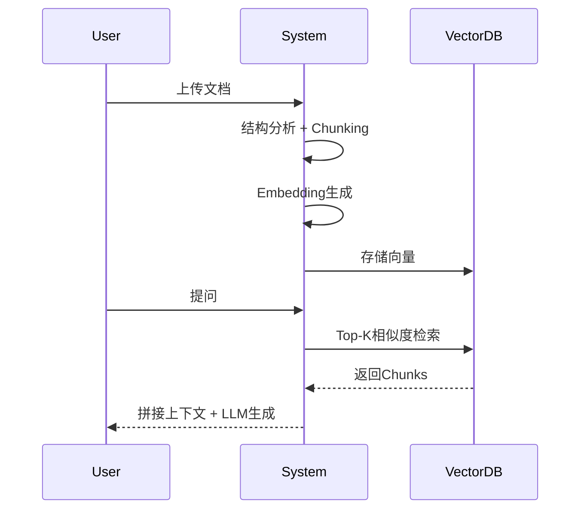
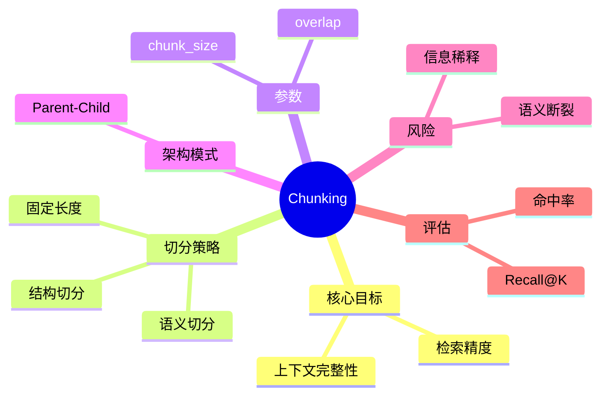

# 第18章 Chunking（文档分块） [L1-L2]

## Part 1：为什么要学这个？[L1-L2]

你做了一套 RAG 系统，用来回答客服问题。知识库里塞了 500 篇产品文档，你信心满满上线。

用户问：“这个功能怎么配置？”

系统返回了一段“看起来相关”的内容：

> 配置前请确认权限……
> 步骤见下一页……

你以为问题在模型太弱。

但你点开检索日志发现：Chunk 命中了“配置”关键词，而且相似度还排第一。

真正的问题是——**信息在切分时已经断了**。

“配置步骤”跨越了 Chunk 边界，被一刀切成两半。

模型看到的是：

* 上半句：提醒
* 下半句：引用指向下一页

于是它只能“补全逻辑”，开始编。

很多人会下意识得出一个结论：

> Chunk 切得越小越精准。

但上线系统会告诉你完全相反的事实：

* 太大：语义混杂
* 太小：上下文缺失

问题的本质不是“切不切”，而是：

> **检索命中 ≠ 可用信息完整**

本章要解决的问题是：

> 如何设计 Chunking，使检索结果既“精准命中”，又“可用于生成”。

---

## Part 2：学习路径定位[L1-L2]

Chunking 是 RAG 数据流的第一刀，它决定后续所有语义质量上限。


前置知识：

* 文档结构基础
* Embedding 原理

后置知识：

* RAG 优化
* Hybrid Retrieval
* Agent Memory 设计

---

## Part 3：用生活理解它[L1-L2]

Chunking 就像整理一本厚工具书。

你不是在“撕书”，而是在做分类卡片：

* 每张卡片一个知识点
* 每张卡片能独立回答问题
* 卡片之间还能拼回完整逻辑

但边界很关键：

* 卡片太大 → 一张卡塞三件事，找不到重点
* 卡片太小 → 一句话被拆成三张卡，看不懂

Chunking 的目标不是“切碎”，而是：

> 让每一块信息都“刚好能独立被理解”。

---

## Part 4：AI如何映射到传统概念[L1-L2]

| 传统系统设计 | RAG/AI系统        |
| ------ | --------------- |
| 文档拆章节  | Chunking        |
| 索引页设计  | Embedding Index |
| API分页  | Chunk返回         |
| 服务模块拆分 | 知识单元化           |

Chunking 本质是：

> 信息架构，而不是文本处理

---

## Part 5：技术本质深讲[L1-L2]

Chunking 的流程本质是一个“语义压缩前处理”：

1. 原始文档被结构化扫描
2. 按策略切成多个 Chunk
3. 每个 Chunk 独立 Embedding
4. 向量进入数据库
5. 查询时只返回局部语义窗口



关键参数：

* chunk_size：信息粒度（不是“越小越好”）
* chunk_overlap：边界保护机制
* split_strategy：结构 vs 语义 vs token

核心矛盾：

* 检索希望“专注”
* 生成需要“完整”

---

## Part 6：动手Demo（可运行代码）[L1-L2]

```python
from sklearn.feature_extraction.text import TfidfVectorizer

# 模拟文档（中文配置说明）
doc = """
配置步骤如下：
1. 登录系统并进入控制台
2. 找到功能开关并启用
3. 保存配置

注意：配置前请确认权限，否则无法生效。
"""

# 按“逻辑段落”切分（不是token）
def chunk_text(text, max_len=60):
    paragraphs = [p.strip() for p in text.split("\n") if p.strip()]
    chunks = []
    current = ""

    for p in paragraphs:
        # 模拟 chunk 容量限制（非token，仅示意）
        if len(current) + len(p) <= max_len:
            current += p + " "
        else:
            chunks.append(current.strip())
            current = p + " "

    if current:
        chunks.append(current.strip())

    return chunks

chunks = chunk_text(doc)

# 向量化（TF-IDF示意）
vectorizer = TfidfVectorizer()
vectors = vectorizer.fit_transform(chunks)

print("=== Chunks ===")
for i, c in enumerate(chunks):
    print(f"[{i}] {c}")

print("\n=== Vector Shape ===")
print(vectors.shape)
```

运行后你会看到：

* 配置步骤可能被拆分
* “注意事项”可能单独成块
* 检索时容易只命中“提醒”，而丢失“步骤”

---

## Part 7：真实项目场景[L1-L2]

Adobe 内部开发者支持系统是一个典型 RAG 工程场景：

### 背景

开发者每天查询：

* API 使用方式
* Bug 排查
* 内部工具配置

文档来源复杂：

* Wiki
* 技术指南
* 排障手册

---

### 实验对比（关键改进点）

团队测试了三种策略：

#### 方案A：固定 512 Token

* 检索准确率：71%
* 问题：代码块被截断、步骤断裂

#### 方案B：语义切分

* 检索准确率：78%
* 问题：粒度不稳定，长文档过碎

#### 方案C：400 Token + 20% overlap（最终方案）

* 检索准确率：86%
* 稳定性最高

---

### 为什么没有选 Parent-Child？

团队其实测试过：

* Parent 1500 / Child 300
* 优点：上下文完整
* 缺点：检索延迟上升 + 存储成本高
* 对短查询收益不明显

---

### 评估方式（关键补充）

不是“感觉更好”，而是：

* 构造 300 条真实查询
* 人工标注标准答案 Chunk
* 计算 Recall@K + Exact Match
* 对比不同策略

最终结论：

> Chunking 不是经验参数，而是可测系统设计变量

---

## Part 8：这里容易踩坑[L1-L2]

### 错误1：过度固定 chunk_size

```python
# 错误示例
chunk_size = 512
chunks = [text[i:i+512] for i in range(0, len(text), 512)]
```

问题：

* 强行切断语义
* 表格/步骤直接崩坏

---

### 错误2：完全无 overlap

```text
Chunk A: "登录系统后进入配置页面"
Chunk B: "点击启用按钮保存"
```

问题：

* 关键动作跨块丢失

---

### 错误3：没有结构意识

```python
# 错误：纯字符切分
split_every_n_chars(text)
```

结果：

* API说明被拆
* 条件与结论分离

---

### 正确方式（结构切分）

```python
# 正确：按段落 + 标题
split_by_heading(text)
split_by_paragraph(text)
```

---

## Part 9：面试怎么答[L1-L2]

### L1

Chunking 为什么重要？

* 控制 RAG 信息粒度
* 避免 embedding 语义混杂
* 保证检索可用性

---

### L2

chunk_size 怎么选？

* 不存在固定最优值
* 取决于：

  * 文档长度分布
  * 查询粒度
  * LLM context window
* 常见起点 300–800 token（需实验验证）

---

### L3

Parent-Child Chunking 怎么理解？

* Child：用于精准检索
* Parent：用于完整上下文生成
* 解决“精度 vs 信息完整性”冲突

---

## Part 10：考点速查[L1-L2]

**Chunking本质**

* 信息结构化，而不是切文本

**chunk_size**

* 控制语义粒度

**overlap**

* 防止信息断裂

**结构切分**

* 比 token 切分更重要

---

## Part 11：必背金句[L1-L2]

* Chunking 决定 RAG 上限
* 切得小不等于更准
* 切得大不等于更聪明
* overlap 是语义保险带
* 没结构的切分等于随机破坏

---

## Part 12：快速参考表[L1-L2]

| 概念           | 作用      | 示例                 |
| ------------ | ------- | ------------------ |
| chunk_size   | 控制语义粒度  | 400–800 tokens     |
| overlap      | 防止信息断裂  | 10%–20% chunk_size |
| Parent Chunk | 提供完整上下文 | 1000–1500 tokens   |
| Child Chunk  | 精确检索单位  | 200–400 tokens     |

---

## Part 13：思维导图[L1-L2]



---

## Part 14：本章小结[L1-L2]

Chunking 是 RAG 的第一道语义边界，它决定了后续所有检索质量。

核心矛盾是：
信息要“完整”，但检索要“局部”。

理解这一点，才能从“调参数”走向“设计系统”。

---

## Part 15：下一章预告[L1-L2]

本章解决了“如何切知识”。

但新的问题是：

> 即使 Chunk 切得很好，为什么相似度仍然找不到正确答案？

下一章将进入：
**Embedding 语义空间的失真与相似度崩塌问题**