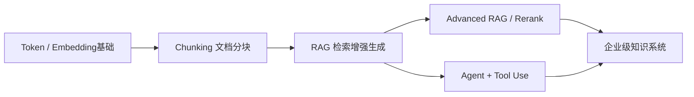
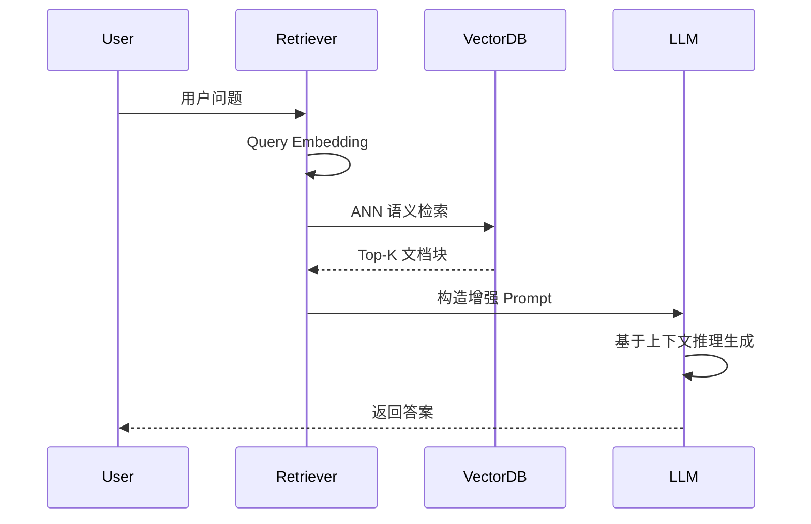
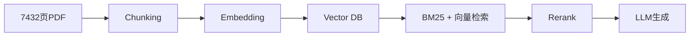
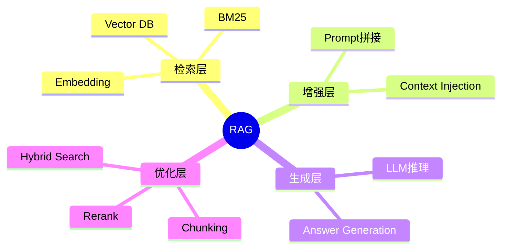

# 第19章 RAG（检索增强生成） [L1-L2]

## Part 1：为什么要学这个？[L1-L2]

你负责一个智能客服系统，最初的直觉非常工程化：模型不准 → 换更大的 LLM；回答不稳定 → 重写 Prompt；上下文太短 → 增加 token window；效果波动 → 调 temperature。

于是你把 7B 换成 70B，把 Prompt 从结构化模板扩展到“长上下文说明书”，甚至引入多轮对话记忆。但上线之后，用户反馈依然只有一句话：**“答非所问”**。

你开始怀疑模型能力，于是继续升级参数、调整采样策略。

直到某一天你打开检索日志，才发现一个被忽略的事实：模型每次“答错”，不是因为不会，而是因为它看到的上下文本身就是错的——甚至是无关噪声。

它被迫在错误信息上做推理，这在逻辑上必然导向“高质量幻觉”。

这就是关键认知冲突：

你以为问题是“生成能力不够”，实际上问题是“输入信息不对”。

RAG要解决的不是让模型更聪明，而是一个更底层的问题：

**如何在生成之前，把正确的知识喂给模型。**

---

## Part 2：学习路径定位[L1-L2]

RAG 位于 LLM 系统从“封闭记忆”走向“外部知识系统”的关键转折点，是连接检索系统与生成模型的桥梁层。



前置知识：

* Embedding 向量语义空间表示
* 文档 Chunking 切分策略
* LLM Prompt 基础结构

后置知识：

* ReRank 重排序模型
* Agent 工具调用系统
* 企业级知识库架构设计

---

## Part 3：用生活理解它[L1-L2]

RAG 就像考试制度的变化。

闭卷考试：你只能依赖记忆，记错就全错。

开卷考试：你可以带书进考场，但关键不是“随便翻”，而是老师帮你**定位到正确章节页码**。

区别在于：

* 闭卷：答案完全来自脑子
* 开卷：答案来自“资料 + 理解”

但有一个隐含限制：
如果老师给你翻错书页，或者翻到无关章节，即使允许开卷，你依然会写错答案。

---

## Part 4：AI如何映射到传统概念[L1-L2]

| 传统系统        | RAG系统           |
| ----------- | --------------- |
| SQL 数据查询    | 向量语义检索          |
| 搜索引擎关键词匹配   | ANN 语义相似度检索     |
| 文档管理系统      | Chunking 文档分块   |
| 客服人工应答      | LLM 生成回答        |
| 精确查询（WHERE） | Embedding 相似度查询 |

核心变化不是“生成”，而是“检索范式从关键词 → 语义”。

---

## Part 5：技术本质深讲[L1-L2]

RAG 本质是一个“双阶段信息系统”：

* 离线：构建语义索引
* 在线：语义检索 + 上下文增强 + 生成



关键组件解析：

**1. Embedding**
把文本映射到高维语义空间，使“语义相似”变成“距离相近”。

**2. Vector Database**
支持百万级向量的近似最近邻搜索（ANN），例如 HNSW。

**3. Chunking**
将长文档拆分为语义单元，否则检索粒度过大或过碎。

**4. Prompt Augmentation**
将检索结果拼接进 Prompt，使 LLM 具备“外部记忆”。

---

## Part 6：动手Demo（可运行代码）[L1-L2]

修复关键问题：**使用余弦相似度（避免点积偏差）**

```python
from sentence_transformers import SentenceTransformer
import numpy as np

# 初始化 embedding 模型
model = SentenceTransformer('all-MiniLM-L6-v2')

# 模拟知识库
docs = [
    "RAG是一种结合检索与生成的架构",
    "向量数据库用于存储语义向量",
    "Chunking是将文档切分为小片段"
]

# Step 1: 向量化知识库
doc_embeddings = model.encode(docs)

# 关键修复：L2归一化（避免点积偏差）
doc_embeddings = doc_embeddings / np.linalg.norm(doc_embeddings, axis=1, keepdims=True)

def rag(query: str):
    # Step 2: 向量化查询
    q_emb = model.encode([query])[0]

    # 关键修复：查询向量归一化
    q_emb = q_emb / np.linalg.norm(q_emb)

    # Step 3: 余弦相似度（等价于归一化后的点积）
    scores = np.dot(doc_embeddings, q_emb)

    # Step 4: 找最相似文档
    top_idx = np.argmax(scores)
    context = docs[top_idx]

    # Step 5: 模拟LLM生成
    return f"基于资料回答：{context}，问题：{query}"

print(rag("什么是RAG"))
```

运行结果：
系统返回最语义相近的知识片段，而不是被向量长度误导的错误结果。

---

## Part 7：真实项目场景[L1-L2]

某制造企业拥有 7432 页历史技术文档，工程师查一次资料平均耗时 25 分钟。

问题结构：

* PDF 分散
* 关键词搜索不稳定
* 新员工无法理解系统结构

解决方案是构建 RAG 知识系统：

* PDF → Chunking（语义切分）
* Embedding → 向量化表示
* Vector DB → 语义存储
* Hybrid Search → BM25 + 向量检索
* Rerank → 精排模型优化
* LLM → 最终生成答案

其中 Hybrid Search 非常关键：

* BM25：处理**关键词匹配（型号、编号、错误码）**
* 向量检索：处理**语义匹配（“怎么修这个问题”）**

两者互补，否则系统会出现两类失败：

* 只用 BM25：语义问题找不到
* 只用向量：精确编号匹配失败



结果：

* 查询时间：25分钟 → 3-5秒
* ROI：1天级别回报

---

## Part 8：这里容易踩坑[L1-L2]

**错误1：TopK越大越好**

```python
# 错误：TopK过大
results = vector_db.search(query, top_k=20)
```

问题：噪声上下文稀释语义信号

正确：

```python
results = vector_db.search(query, top_k=5)
results = rerank(results)
```

---

**错误2：固定长度切分**

错误：

```text
直接按1000字符切
```

问题：语义断裂（一个概念被切碎）

正确：

```text
按语义段落 / 章节切分
```

---

## Part 9：面试怎么答[L1-L2]

**L1：什么是RAG？**

* Retrieval + Augmented + Generation
* 解决：知识截止 / 私有数据 / 幻觉问题

---

**L2：完整流程**

* 离线：Chunking → Embedding → Vector DB
* 在线：Query → 检索 → Prompt增强 → LLM

---

**L3：RAG vs Fine-tuning（重点修正）**

RAG 与 Fine-tuning 不是对立关系，而是工程权衡问题：

选择标准：

* 数据动态性高（文档频繁更新、政策变化）→ 选 RAG
* 数据稳定且查询频繁（固定知识库、高吞吐推理）→ 选 Fine-tuning
* 强实时 + 可解释性需求 → RAG 更优
* 低延迟 + 固定行为模式 → Fine-tuning 更优
* 工业实践中常见组合：**Fine-tune 学行为 + RAG 提供知识**

---

## Part 10：考点速查[L1-L2]

* **RAG三阶段结构**：检索 + 增强 + 生成
* **瓶颈在检索系统**，不是LLM能力
* **TopK不是越大越好**
* **Chunking决定语义粒度**
* **RAG只减少知识型幻觉**

---

## Part 11：必背金句[L1-L2]

* 检索错了，生成一定错
* RAG的上限由检索系统决定
* 模型不是知识库，是推理器
* Chunking决定语义结构
* BM25解决“是什么”，向量解决“像什么”

---

## Part 12：快速参考表[L1-L2]

| 概念        | 作用    | 示例值            |
| --------- | ----- | -------------- |
| Chunking  | 文档切分  | 300–800 tokens |
| Embedding | 语义向量  | 384维           |
| TopK      | 检索数量  | 3–10           |
| Vector DB | 向量存储  | FAISS          |
| BM25      | 关键词检索 | TF-IDF变体       |
| Rerank    | 精排优化  | Cross-Encoder  |

---

## Part 13：思维导图[L1-L2]



---

## Part 14：本章小结[L1-L2]

RAG 的本质是“让模型在生成之前先看到正确知识”。

关键变化在三点：

* 从参数记忆 → 外部知识检索
* 从闭卷推理 → 开卷推理
* 从单模型 → 检索 + 生成系统

决定系统上限的，不是 LLM，而是检索质量。

---

## Part 15：下一章预告[L1-L2]

RAG 解决了“让模型看到正确资料”的问题。

但新的问题出现了：

当检索结果本身不可靠、排序错误、或者混入噪声时，系统该如何自动修正？

下一章将进入核心优化层：
**Rerank 与检索质量优化系统设计**