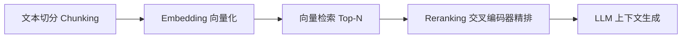
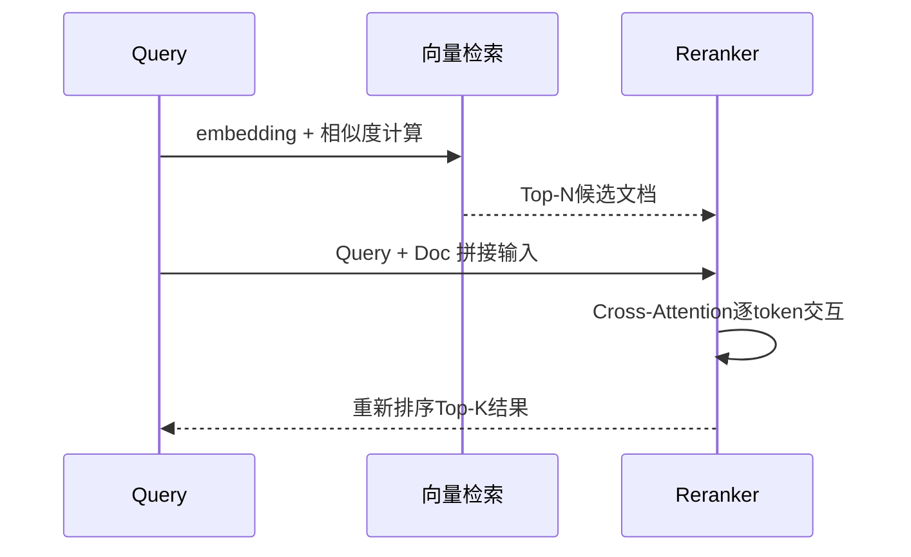
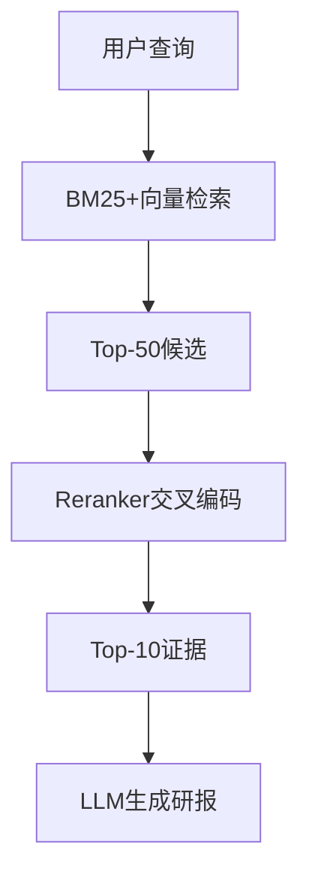
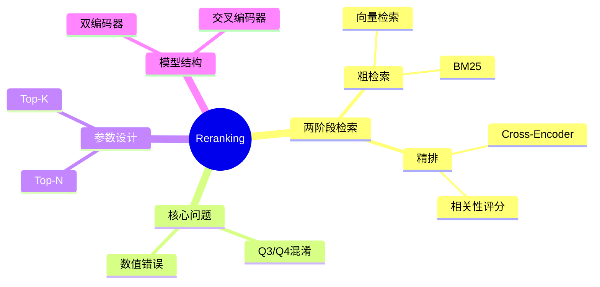

# 第20章 Reranking（重排序） [L2-L3]

## Part 1：为什么要学这个？[L2-L3]

你在做一个企业级 RAG 系统，用户输入：“公司2024年Q3的营收是多少？”

系统返回的 Top-3 文档看起来完全合理：

* 第1名：2024年Q4营收预测分析
* 第2名：2023年年报
* 第3名：2024年Q3财报原文

你没有任何警觉，直接把 Top-3 喂给 LLM。

模型输出：“根据2024年Q4预测，公司营收将增长至XX亿元……”

问题很隐蔽：答案错了，但错得非常“合理”。

当你回溯检索链路时，会发现一个更深层的问题：

模型并不是理解错了内容，而是**检索阶段就已经把关键证据排错了顺序**。

更致命的是：

向量检索并没有“犯错”，它只是做了它被设计去做的事情——语义相似度排序。

在它的世界里：

* Q3 和 Q4 都属于 “2024 + 财报 + 营收”
* 它无法理解“季度数字差异”这种结构化语义

你原本的假设是：

> embedding 既然能理解语义，那排序结果就已经足够可靠。

但现实是：

**语义相似 ≠ 事实相关**

本章要解决的问题非常具体：

> 如何在不牺牲检索速度的前提下，让系统具备“事实级排序能力”？

---

## Part 2：学习路径定位[L2-L3]

Reranking 位于 RAG 的第二阶段精排环节。



前置知识：

* Embedding 向量检索
* RAG 基础流程

后置知识：

* Hybrid Retrieval（BM25 + Vector + Rerank）
* Agentic RAG 优化策略
* Retrieval Evaluation（召回率/精度）

---

## Part 3：用生活理解它

可以把整个流程理解为“考试录取”：

* 初试：机器阅卷（看关键词、整体匹配）
* 复试：导师面试（逐个判断真实能力）

初试只解决一个问题：

> “谁看起来还不错？”

复试才解决真正问题：

> “谁真的符合要求？”

但这个类比有边界：

* 初试（向量检索）无法理解细节，只能做整体相似度判断
* 复试（Reranker）只在候选范围内工作，不能扩大搜索空间

---

## Part 4：AI如何映射到传统概念

| AI概念     | 传统系统               | 本质          |
| -------- | ------------------ | ----------- |
| 向量检索     | Elasticsearch BM25 | 快速候选召回      |
| Reranker | 人工精排/规则排序          | 精细相关性判断     |
| RAG      | 搜索增强问答系统           | 检索+生成       |
| Top-N    | 候选池大小              | recall控制    |
| Top-K    | 最终上下文              | precision控制 |

---

## Part 5：技术本质深讲

Reranking 的核心思想只有一句话：

> 把“相似度排序”升级为“联合语义判断”。

### 双编码器 vs 交叉编码器

* 双编码器：Query 和 Document 分开编码 → 向量距离
* 交叉编码器：Query + Document 一起输入 → 全局注意力交互



关键差异：

* 向量检索：一次性压缩语义
* Reranker：逐对“重新阅读”

代价：

* 精度显著提升
* 计算成本从 O(1) → O(N)

---

## Part 6：动手Demo（可运行代码）

```python
import numpy as np
from sklearn.metrics.pairwise import cosine_similarity

# 模拟文档库
documents = [
    "2024年Q4营收预测报告",
    "2023年年度财报总结",
    "2024年Q3财报详细数据",
    "宏观经济分析报告",
    "公司战略规划2025"
]

query = "2024年Q3营收是多少"

# -------- Phase 1: 向量粗检索 --------
np.random.seed(42)

def fake_embedding(text):
    # 模拟embedding（真实系统中应使用一致模型）
    return np.random.rand(1, 8)

query_vec = fake_embedding(query)
doc_vecs = np.vstack([fake_embedding(d) for d in documents])

scores = cosine_similarity(query_vec, doc_vecs)[0]

top_n_idx = np.argsort(scores)[-3:][::-1]
candidates = [documents[i] for i in top_n_idx]

print("粗检索结果:", candidates)

# -------- Phase 2: Reranking --------
def rerank(query, docs):
    scores = []
    for d in docs:
        score = 0

        # 模拟精确匹配能力
        if "Q3" in query and "Q3" in d:
            score += 3
        if "Q4" in query and "Q4" in d:
            score -= 2  # 纠偏：错误季度降权
        if "财报" in d:
            score += 1
        if "营收" in query and "财报" in d:
            score += 1

        scores.append(score)

    return np.argsort(scores)[::-1]

reranked_idx = rerank(query, candidates)
final_docs = [candidates[i] for i in reranked_idx]

print("Rerank后结果:", final_docs)
```

运行现象：

* 粗检索：可能混入 Q4 或无关报告
* Rerank后：Q3财报稳定排第一

---

## Part 7：真实项目场景

某头部券商构建“实时研报生成系统”，需要从百万级金融文档中提取证据。

### 基线系统（无 Reranker）

* 架构：BM25 + 向量检索 Top-10
* 延迟：约 **150ms**
* 问题：

  * Q3/Q4混淆
  * 数字错误率高
  * 召回率：68%

---

### 引入 Reranker 后

* 架构：Top-50候选 → Cross-Encoder → Top-10
* 延迟变化：

  * 向量检索：150ms
  * Reranker：+180ms
  * 总延迟：约 **330ms**

---

### 结构流程



---

### 结果对比

| 指标   | 无Reranker | 加Reranker |
| ---- | --------- | --------- |
| 召回率  | 68%       | 89%       |
| 错误率  | ~8%       | <2%       |
| 延迟   | 150ms     | 330ms     |
| 业务收益 | 基线        | +40%效率    |

---

## Part 8：这里容易踩坑

### 错误1：Top-N过小

```python
top_n = 5
```

问题：

* Reranker只能在5个里选
* 真正答案可能在第6名直接丢失

正确做法：

```python
top_n = 50
```

---

### 错误2：模型不匹配语言

错误：

* 中文语料 + 英文 reranker

结果：

* 分数无意义
* 排序随机

正确：

* 中文：bge-reranker
* 英文：cohere rerank

---

## Part 9：面试怎么答

### L1

Q：双编码器 vs 交叉编码器？

要点：

* 是否联合输入 Query+Doc
* 是否有 token-level 交互
* 复杂度差异

---

### L2

Q：Top-N 和 Top-K 如何设计？

要点：

* N 控制 recall
* K 控制上下文长度
* 常见配置：N=50, K=5

---

### L3

Q：如何优化 Reranker 延迟？

要点：

* 降低 Top-N
* 轻量模型
* batch 推理
* INT8量化
* cache 热点 query

---

### L2+ 实战追问（新增）

Q：你的系统在财报问答中，总是把 Q4 误判为 Q3，即使用 Reranker 后仍然有 20% 错误，你会怎么排查？

参考思路：

* 检查 chunk 是否混合多个季度信息（chunk污染）
* 检查 reranker 是否过度依赖关键词（Q3/Q4 token稀疏）
* 检查 Top-N 是否不足导致 Q3未进入候选
* 检查 embedding 是否弱化数字 token（Q3/Q4 embedding collapse）
* 检查 prompt 是否让 LLM override rerank结果
* 做 ablation：only reranker vs no reranker vs hybrid

---

## Part 10：考点速查

**Reranker = 精细排序模型**
**Cross-Encoder = token级交互**
**Top-N = recall控制**
**Top-K = context控制**
**两阶段检索 = 速度与精度折中**

---

## Part 11：必背金句

* 向量检索解决“找得到”
* Reranker解决“找得准”
* Top-N决定上限
* Cross-Encoder决定排序质量
* 检索错误比生成错误更致命

---

## Part 12：快速参考表

| 概念            | 作用    | 示例值          |
| ------------- | ----- | ------------ |
| Top-N         | 候选集合  | 50           |
| Top-K         | 最终上下文 | 5            |
| Reranker      | 精排模型  | bge-reranker |
| Cross-Encoder | 联合编码  | Query+Doc    |

---

## Part 13：思维导图



---

## Part 14：本章小结

Reranking 的本质，是让检索系统从“语义相似排序”升级为“事实相关判断”。

它补上了向量检索的最后一公里问题。

系统能力演进：

* L0：关键词匹配
* L1：语义检索
* L2：相关信息召回
* L3：事实级排序判断

---

## Part 15：下一章预告

你已经拥有：

* 向量检索（快速召回）
* Reranker（精确排序）

但新的问题出现了：

当知识库规模继续扩大时，**单一向量 + rerank 已经不够快也不够准**。

下一章：

**Hybrid Retrieval（混合检索架构设计）**