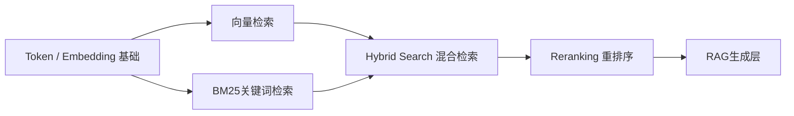
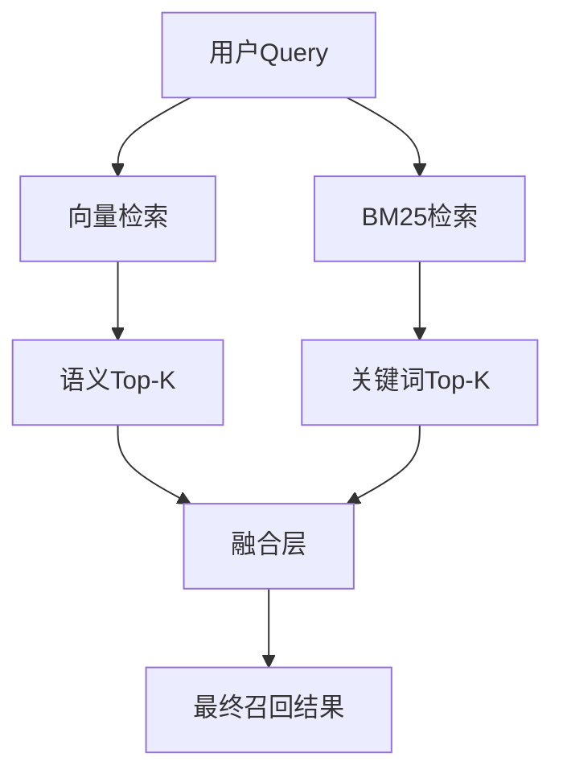
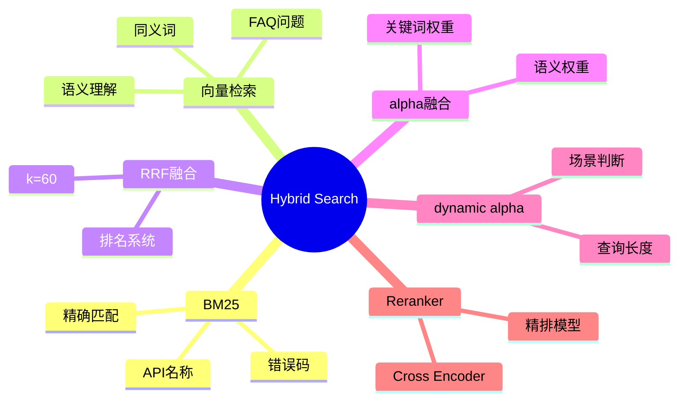

# 第21章 Hybrid Search（混合搜索） [L2-L3]

## Part 1：为什么要学这个？[L2-L3]

你为公司上线了一套 RAG 知识库系统，架构设计很标准：向量数据库 + Embedding + LLM，一切看起来都“现代化且正确”。

系统稳定运行了几周，直到一次看似普通的查询：

“生产环境启用 `payment_v2_enforce` 功能标志的运维手册”

系统返回了一条非常“自信”的答案：

> “建议禁用该功能以避免风险。”

值班工程师没有质疑，直接执行。

生产环境立刻出现异常。

复盘时才发现一个关键问题：系统并没有真正理解“启用 vs 禁用”，它只是认为这两份文档在语义空间中“非常接近”。

更危险的是，嵌入模型对“启用 payment_v2_enforce”和“禁用 payment_v2_enforce”会生成几乎相同的向量表示。在模型眼里，这只是“同一个主题的两种表达”。

问题不在模型能力，而在一个工程假设：

> 只靠语义相似度，就能完成可靠检索。

但现实系统里，真正致命的不是“语义不相似”，而是：

* 错误码必须精确命中（429 ≠ 200）
* 配置开关必须区分启用/禁用
* 产品型号必须严格匹配（SKU-8843 ≠ SKU-8848）

本章要解决的问题是：

如何构建一个检索系统，让“语义理解”和“词面精确”同时成立，并在高风险生产场景中不出错。

答案就是：Hybrid Search（混合搜索）。

---

## Part 2：学习路径定位

Hybrid Search 位于 RAG 检索层的核心增强模块，是语义检索与重排序之间的关键桥梁。



前置知识：

* Embedding 向量表示
* BM25 关键词检索原理
* RAG 基本流程

后置知识：

* Reranking（Cross-Encoder 精排）
* 多路检索系统设计
* 检索评估体系（MRR / Recall@K）

---

## Part 3：用生活理解它

去图书馆查资料，你通常不会只用一种方式。

一种方式是问管理员：“有没有讲减肥的书？”——这是语义搜索。

另一种方式是翻目录系统查关键词：“减肥 / 体重管理 / BMI”——这是关键词搜索。

最后你会得到两份书单，把重合的书优先阅读。

但这个类比的边界在于：

现实系统中，这两种方式的“排序逻辑”完全不同，它们不会自动对齐，也不会天然去重。工程问题在于如何融合两个排序体系，而不是简单“合并结果”。

---

## Part 4：AI如何映射到传统概念

| 传统检索系统          | AI 检索系统     |
| --------------- | ----------- |
| SQL LIKE / 全文索引 | BM25 关键词检索  |
| 分类标签检索          | 向量语义检索      |
| 人工合并结果          | RRF 融合算法    |
| 人工排序            | Reranker 模型 |

本质变化是：

传统系统依赖结构化字段，而 AI 检索必须处理非结构化语义空间。

---

## Part 5：技术本质深讲

Hybrid Search 的本质不是“加法”，而是一个双通路召回 + 排名融合系统。

### 双通路召回结构



---

### RRF（Reciprocal Rank Fusion）

核心思想：不看分数，只看“排名位置”。

公式：

```text
score(doc) = Σ 1 / (k + rank_i)
```

其中：

* rank_i：该文档在第 i 个检索系统中的排名
* k：平滑系数（通常取 60）

#### 为什么 k=60 是经验值？

k 的作用是“拉平排名差距影响”，避免 Top1 和 Top10 差距过大。

经验上：

* k 太小（如 5）→ 过度偏向 Top1
* k 太大（如 200）→ 排名差异被稀释

60 是工业界长期 A/B 测试后的稳定折中值，在 BM25 和向量检索混合场景中表现稳定。

---

### 为什么不用原始分数？

因为分数体系不可比：

* BM25：无界（0 → ∞）
* 向量相似度：通常 0~1
* Cross encoder：可能是 logits

因此只能用“排名”作为统一语言。

---

### alpha 的真实工程含义（重要修正）

在实际系统（如 Weaviate）中：

alpha 并不是简单权重，而是：

> 向量相似度分数 与 BM25 归一化分数的线性插值

简化表达：

```text
final_score = alpha * vector_score + (1 - alpha) * bm25_score
```

因此：

* alpha=0 → 纯 BM25
* alpha=1 → 纯向量
* alpha=0.5 → 两者归一化融合

这与 RRF 是两种不同策略：

* RRF：基于“排名”
* alpha fusion：基于“分数归一化”

---

### Weaviate Hybrid 示例

```python
results = collection.query.hybrid(
    query="GPT-4 最大 Context Window",
    alpha=0.5,
    limit=20
)
```

---

## Part 6：动手Demo（可运行代码）

```python
from collections import defaultdict

# 模拟向量检索结果（按相关性排序）
vector_results = ["A", "C", "D"]

# 模拟BM25检索结果
bm25_results = ["B", "A", "E"]

def rrf(rankings, k=60):
    scores = defaultdict(float)

    # 遍历每个检索系统结果
    for result_list in rankings:
        for rank, doc in enumerate(result_list, start=1):
            # RRF核心：只用排名，不用原始分数
            scores[doc] += 1 / (k + rank)

    # 按融合分数排序
    return sorted(scores.items(), key=lambda x: x[1], reverse=True)

# 执行混合检索融合
final_results = rrf([vector_results, bm25_results])

print("Hybrid Search Result:")
for doc, score in final_results:
    print(doc, round(score, 6))
```

运行结果逻辑：

* A：同时出现在两路 → 分数最高
* B / C：单路高排名 → 中间
* D / E：低排名 → 最后

---

## Part 7：真实项目场景

某大型企业 IT 团队维护 7432 页跨 20 年技术文档。

工程师的排障流程：

* 打开 PDF（10 分钟）
* Ctrl+F 搜索（可能返回数百结果）
* 人工阅读筛选（15 分钟）

单次问题处理：25 分钟中位数。

问题根源：

* BM25 无法理解“语义表达”

  * 例如：“体重管理方法” ≠ “减肥指南”
* 向量检索无法处理精确匹配

  * 例如：“Error 429”可能被忽略
  * “SKU-8843”无法可靠召回

解决方案：

构建 Hybrid RAG：

* BM25：负责错误码 / API / 配置项
* 向量：负责自然语言语义问题
* RRF：融合两路排序
* Reranker：最终精排 Top-K

结果：

* 查询时间：25 分钟 → 3~5 秒
* 召回率：72% → 94%
* 幻觉率下降：>80%

---

## Part 8：这里容易踩坑

### 错误1：alpha 固定不调

错误代码：

```python
alpha = 0.5
```

问题：

不同场景语义/关键词权重完全不同。

正确策略：

* 技术文档（API / 错误码）：alpha ↓（0.1~0.4）
* FAQ / 问答：alpha ↑（0.6~0.8）

---

### 错误2：忽略动态 alpha 策略

更高级问题是：查询类型不同，alpha 应该不同。

实用策略：

```python
def dynamic_alpha(query: str) -> float:
    length = len(query.split())

    if length < 3:
        return 0.1   # 短查询 → 关键词优先
    elif length > 10:
        return 0.7   # 长语句 → 语义优先
    else:
        return 0.5
```

---

### 错误3：忽略 Reranking

错误认知：

> Hybrid 已经够了，不需要再排序

现实问题：

Hybrid 解决的是“召回”，不是“精度”。

正确架构：

> Hybrid → Reranker → LLM

---

## Part 9：面试怎么答

### L1

问题：Hybrid Search解决什么问题？

要点：

* 向量检索：语义强但不精确
* BM25：精确但不理解语义
* Hybrid：覆盖两者盲区

---

### L2

问题：RRF是什么？

要点：

* 基于排名，不使用原始分数
* score = Σ 1/(k + rank)
* k≈60 是工业经验值
* 解决不同分数体系不可比问题

---

### L3

问题：alpha怎么调？给一个实际案例

要点：

真实案例：

* 技术文档系统：

  * 最优 alpha ≈ 0.3（偏BM25）
  * 因为错误码 / API / 配置项占比高
* FAQ系统：

  * 最优 alpha ≈ 0.7（偏向量）
  * 因为自然语言问题占主导

调优方法：

* 离线评估：

  * MRR@10
  * Recall@50
* 在线 A/B test：

  * 点击率
  * 命中率
* 最终选择最优 alpha 区间，而不是固定值

---

## Part 10：考点速查

* **Hybrid Search本质**：双路召回 + 融合排序
* **RRF机制**：基于排名的统一融合函数
* **alpha机制**：语义 vs 关键词的权重控制
* **k=60经验值**：平滑排名差异影响
* **动态alpha策略**：根据查询长度调整检索行为

---

## Part 11：必背金句

* 检索系统的核心不是“相似”，而是“正确命中”
* 向量负责理解，BM25负责精确
* RRF统一了两个不可比的世界
* Hybrid 解决召回，Reranker 决定质量
* 没有关键词兜底的语义检索一定会漏关键事实

---

## Part 12：快速参考表

| 概念            | 作用      | 示例           |
| ------------- | ------- | ------------ |
| BM25          | 精确关键词匹配 | Error 429    |
| 向量检索          | 语义相似匹配  | 如何减肥         |
| RRF           | 排名融合    | k=60         |
| alpha         | 权重融合    | 0.3 / 0.7    |
| dynamic alpha | 查询适配策略  | length-based |

---

## Part 13：思维导图



---

## Part 14：本章小结

Hybrid Search 的核心在于解决语义检索与关键词检索之间的结构性冲突，通过 BM25 与向量检索双通路召回，再通过 RRF 或 alpha 融合统一排序。

从能力成长路径来看：

* L0：只能关键词搜索
* L1：理解向量语义检索
* L2：理解 Hybrid 双通路结构
* L3：掌握 alpha / RRF / 动态策略优化

---

## Part 15：下一章预告

你已经解决了“找得到”的问题：Hybrid Search 让系统既懂语义，又懂精确匹配。

但新的问题出现了：

为什么已经检索到正确文档，LLM 仍然会答错？

下一章将进入 RAG 的第二个关键瓶颈：

Reranking（重排序）如何决定“最后一公里”的答案质量。