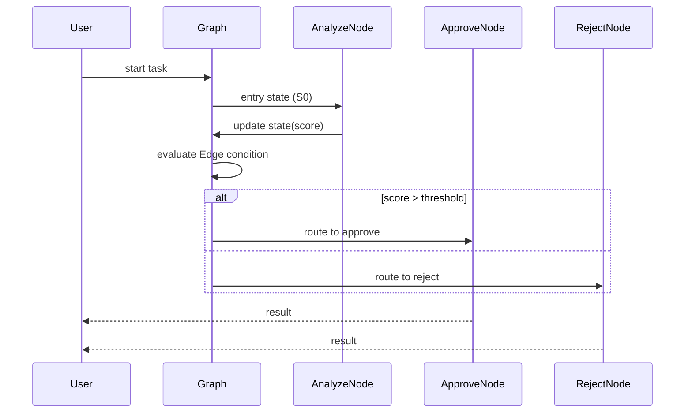
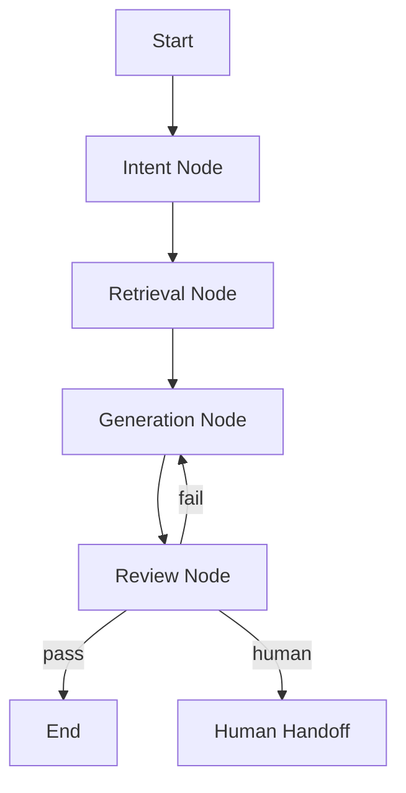
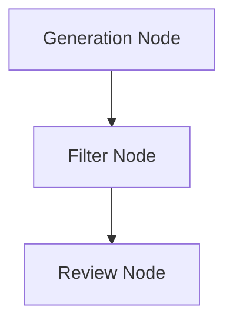
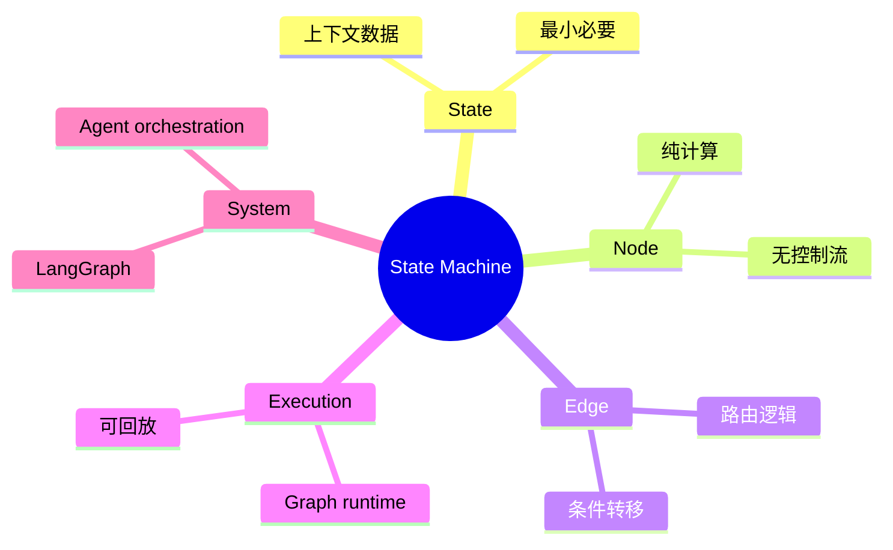

# 第22章 State Machine（状态机） [L2-L3]

## Part 1：为什么要学这个？[L2-L3]

你在排查一个线上 Agent 问题时，很可能会遇到这种情况：流程图看起来是清晰的，但实际执行路径完全对不上图。

表面结构是：

* Intent → Retrieval → Generation → Review → Output

但一旦进入真实代码，你会发现：

review_node 里面不仅在做审核，还在决定：

* 是否重试生成
* 是否直接结束
* 是否转人工
* 是否触发 fallback
* 是否进入异常恢复路径

更麻烦的是，这些逻辑不是集中写的，而是散落在 if/else 和异常分支里。

结果就是：

你画出来的“状态图”，只是理想模型；
系统真实行为，是隐藏在函数内部的“隐式状态机”。

这里的认知冲突是：

> 很多人以为状态机是“把流程拆成节点”，但实际上他们只是把 if/else 换了个地方写。

真正的问题不是拆不拆函数，而是：

> 控制流是否显式存在于结构中，而不是隐藏在代码逻辑里。

本章要解决的核心问题是：

如何把 Agent 系统中“分散在代码里的控制决策”，重构为“由状态与边共同定义的显式执行图”。

---

## Part 2：学习路径定位 [L2-L3]

状态机处于 Agent 控制系统的结构中枢。


前置能力：

* LLM调用与上下文管理
* 基础Agent loop（思考-执行循环）
* 简单条件分支逻辑

后置能力：

* 可恢复执行（Checkpoint/Resume）
* 企业级工作流编排
* 多Agent协同系统设计

---

## Part 3：用生活理解它

更精确的类比不是“餐厅”，而是“服务调度系统”。

在这个系统里：

* 厨师（Node）：只负责执行任务（做菜）
* 服务员（Edge）：决定任务流向（上菜/退回/转交）
* 桌面状态（State）：当前顾客所处阶段

关键点：

> 决定“这道菜去哪”的，不是厨师，而是服务员。

例如：

* 菜做好了
* 服务员检查桌面状态

  * 等待 → 上菜
  * 投诉 → 重做
  * VIP → 加急处理

类比边界：

* 现实服务员有经验决策，但状态机要求规则确定
* 状态机强调“单状态”，现实系统是并行的

---

## Part 4：AI如何映射到传统概念

| 传统系统        | Agent状态机      |
| ----------- | ------------- |
| if/else 控制流 | Edge 路由函数     |
| 函数调用链       | Node执行单元      |
| 全局变量        | State上下文      |
| while循环     | Graph runtime |
| 服务层编排       | StateGraph    |

核心变化：

传统是“代码定义流程”，
状态机是“结构定义流程”。

---

## Part 5：技术本质深讲

状态机本质是：

* S：状态集合
* E：事件集合
* T：状态转移函数
* S0：初始状态

映射到 Agent：

* S → State（上下文）
* E → Node输出
* T → Edge路由函数
* S0 → entry node

关键原则：

> Node 不参与决策，Edge 决定流向。



映射关系：

* S：State对象
* T：route函数（Edge）
* E：Node输出
* S0：entry point

---

## Part 6：动手Demo（真正状态机实现）

这个版本修复三个关键问题：

* 状态类型一致（status显式约束）
* Edge与Node职责清晰分离
* 支持条件边 + 固定边
* 修复路由冲突结构

```python
from typing import TypedDict, Callable, Dict, Literal


# ======================
# S: 状态定义（四元结构中的 S）
# ======================
class State(TypedDict):
    text: str
    score: int
    status: Literal["start", "analyzed", "approved", "rejected"]


# ======================
# Node: 只负责计算，不做决策
# ======================
def analyze_node(state: State) -> State:
    score = len(state["text"]) % 10
    return {
        "text": state["text"],
        "score": score,
        "status": "analyzed"
    }


def approve_node(state: State) -> State:
    return {
        "text": state["text"],
        "score": state["score"],
        "status": "approved"
    }


def reject_node(state: State) -> State:
    return {
        "text": state["text"],
        "score": state["score"],
        "status": "rejected"
    }


# ======================
# Edge: 控制流（T）
# ======================
def route_after_analysis(state: State) -> str:
    return "approve" if state["score"] > 5 else "reject"


def to_end(state: State) -> str:
    return "END"


# ======================
# Graph Runtime（执行引擎）
# ======================
class SimpleStateGraph:

    def __init__(self):
        self.nodes: Dict[str, Callable] = {}

        # 固定边：无条件跳转
        self.fixed_edges: Dict[str, str] = {}

        # 条件边：由函数决定
        self.conditional_edges: Dict[str, Callable] = {}

        self.entry = None

    def add_node(self, name: str, func: Callable):
        self.nodes[name] = func

    def set_entry(self, name: str):
        self.entry = name

    def add_edge(self, source: str, target: str):
        # 固定边（无条件）
        self.fixed_edges[source] = target

    def add_conditional_edge(self, source: str, router: Callable):
        # 条件边（动态路由）
        self.conditional_edges[source] = router

    def run(self, state: State) -> State:
        current = self.entry

        while current != "END":

            node_fn = self.nodes[current]
            state = node_fn(state)

            # 优先条件边
            if current in self.conditional_edges:
                next_node = self.conditional_edges[current](state)

            # 其次固定边
            elif current in self.fixed_edges:
                next_node = self.fixed_edges[current]

            else:
                next_node = "END"

            current = next_node

        return state


# ======================
# 构建状态机（S0 + T）
# ======================
graph = SimpleStateGraph()

graph.add_node("analyze", analyze_node)
graph.add_node("approve", approve_node)
graph.add_node("reject", reject_node)

graph.set_entry("analyze")

# Edge（T）
graph.add_conditional_edge("analyze", route_after_analysis)
graph.add_edge("approve", "END")
graph.add_edge("reject", "END")


# ======================
# 执行
# ======================
if __name__ == "__main__":
    input_state: State = {
        "text": "hello state machine system",
        "score": 0,
        "status": "start"
    }

    result = graph.run(input_state)
    print(result)
```

运行结果特征：

* score 决定路径
* Node 不参与任何路由
* Edge 完全控制执行流
* State始终保持一致结构

---

## Part 7：真实项目场景

在企业级智能客服系统中，典型链路如下：

* 意图识别
* 知识检索
* 回复生成
* 审核
* 人工介入

早期问题：

* 控制流散落在多个函数
* fallback逻辑嵌套在异常处理
* 无法复现执行路径

重构后状态机结构如下：



新增需求示例（关键改进点）：

新增“敏感词过滤”节点：

* 不修改已有Node
* 只增加一个Node
* 只新增Edge连接



效果：

* 无需修改旧逻辑
* 无需修改已有if/else
* 只扩展图结构（Node + Edge）

这就是状态机的工程优势：

> 系统演进通过“加结构”完成，而不是“改逻辑”。

---

## Part 8：这里容易踩坑

### 错误1：Node做决策

❌ 错误：

```python
def node(state):
    if state["score"] > 5:
        return "approve"
```

✔ 正确：

```python
def node(state):
    return {"score": state["score"]}


def edge(state):
    return "approve"
```

---

### 错误2：Edge与Node混用职责

❌ 错误：Node返回路径
✔ 正确：Edge返回路径

---

### 错误3：State污染

❌ 包含临时变量
✔ 只保留跨节点字段

---

## Part 9：面试怎么答（实战版）

### L1（项目经验）

问题：你如何在项目中设计状态机？

要点：

* 拆 Node 表示业务步骤
* Edge 控制流转逻辑
* State承载上下文

---

### L2（工程取舍）

问题：为什么不用 if/else？

要点：

* if/else 分散控制流
* 状态机结构化执行路径
* 更易调试和扩展

---

### L3（系统设计进阶）

问题：如何设计可回放状态机？

要点：

* 使用不可变 State snapshot
* 每次状态变更记录 diff
* 引入 execution_id 追踪路径
* 使用 checkpoint 持久化状态（如 LangGraph机制）
* 支持完整 execution replay

---

## Part 10：考点速查

**状态机四元结构**
**Edge主导控制流**
**Node纯计算原则**
**State最小化设计**
**执行路径可回放**

---

## Part 11：必背金句

* 控制流必须显式，而不是隐藏在代码中
* Node做计算，Edge做决策
* 状态机的本质是结构化执行
* State不是容器，是契约
* 没有可视化的流程不是状态机

---

## Part 12：快速参考表

| 概念    | 职责   | 示例              |
| ----- | ---- | --------------- |
| State | 上下文  | {"text": "..."} |
| Node  | 计算逻辑 | analyze         |
| Edge  | 路由决策 | score > 5       |
| Graph | 执行引擎 | runtime loop    |

---

## Part 13：思维导图



---

## Part 14：本章小结

状态机的本质不是拆流程，而是拆职责边界。
Node负责执行，Edge负责决策，State负责承载。
当控制流结构化之后，系统才具备可维护性与可扩展性。

从 L2 到 L3 的核心跃迁，是从“写逻辑”转向“设计执行图”。

---

## Part 15：下一章预告

你已经掌握了状态机如何结构化 Agent 控制流。

但新的问题出现：

* 多 Agent 如何共享 State？
* 并发执行如何避免冲突？
* 分布式状态如何一致性维护？

下一章将进入：

> LangGraph 分布式状态与执行一致性机制