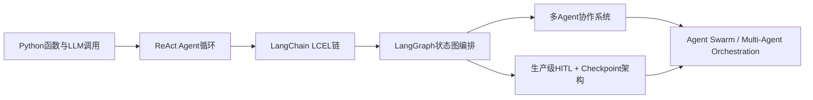
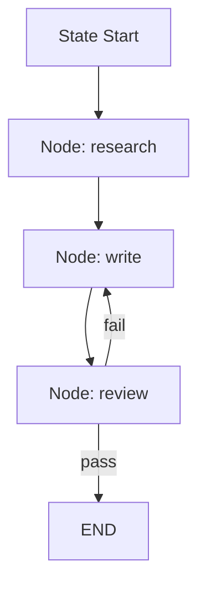
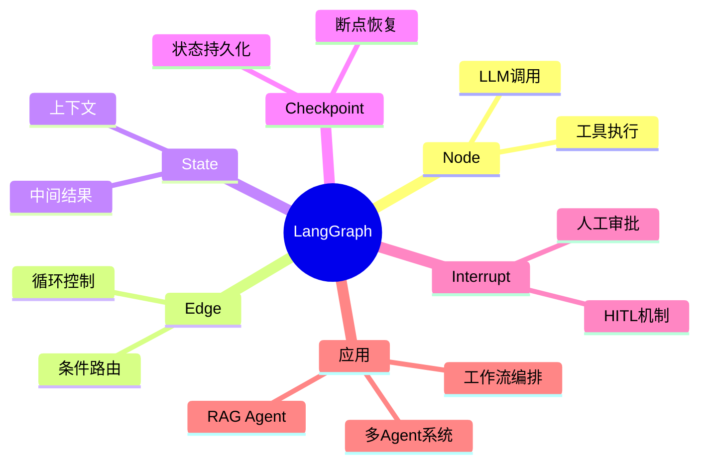

# 第23章 LangGraph [L2-L3]

## Part 1：为什么要学这个？[L2-L3]

一个典型的线上事故往往不是“代码写错”，而是“架构选错”。

团队用 LangChain 的 LCEL 链实现了一个多轮 ReAct Agent：用户提问 → LLM 思考 → 调用工具 → 再思考 → 再调用工具…… 用 while 循环 + if/else 硬编码了 200 多行控制逻辑。上线后产品要求“在调用删除接口前人工确认一下”，你在代码里插了一个 `input()` 暂停，结果部署到生产环境直接卡死——因为没人会在服务器终端输入“y”。

更糟糕的是，这种问题不是 bug，而是结构性失败：

* 控制流散落在业务代码中
* 状态靠全局变量或函数参数传递
* 人工介入靠“临时 hack”（sleep/input/webhook）
* 一旦流程复杂，代码无法演化

你以为自己在写 Agent，本质上是在“手工搭建一个不可控的执行引擎”。

真正的分界点在这里：

* 小型 Agent：函数 + while loop 足够
* 中型 Agent：开始出现状态管理问题
* 复杂 Agent：必须引入**显式执行图（Execution Graph）**

LangGraph 解决的不是“怎么调用 LLM”，而是：

> 如何把一个不断变化、可中断、可恢复、可分叉的 Agent 系统，变成一个可工程化维护的执行结构。

它要解决的核心问题是：

* 如何让 Agent 可暂停
* 如何让 Agent 可恢复
* 如何让 Agent 可追踪
* 如何让 Agent 不再依赖 if/else 地狱

---

## Part 2：学习路径定位



LangGraph 位于 L2-L3 的关键拐点：

* L2：你能写 Agent loop，但结构是“代码驱动”
* L3：你开始设计“图驱动系统”

前置知识：

* ReAct Agent（思考 + 行动循环）
* Python函数式结构
* 基本 LLM 调用与工具调用

后置知识：

* 多 Agent 协作系统
* 生产级工作流引擎设计
* 可恢复分布式 Agent 架构

---

## Part 3：用生活理解它

把 LangGraph 想象成一个医院分诊系统：

* 每个科室 = Node
* 转诊规则 = Edge
* 病人信息 = State
* 病历系统 = Checkpoint
* 急诊插队处理 = Interrupt

病人不会“重走流程”，而是从当前状态继续：

* 看完内科 → 转外科
* 中途检查暂停 → 记录状态
* 医生插入人工判断 → Interrupt
* 出院后可追溯全部记录 → Checkpoint

类比边界：

* 医院不会“自动生成流程逻辑”，规则仍需定义
* 病人路径不是随机的，而是结构化调度结果

---

## Part 4：AI如何映射到传统概念

| 传统系统        | LangGraph   |
| ----------- | ----------- |
| 函数调用链       | Node        |
| if/else流程   | Edge（条件路由）  |
| session变量   | State       |
| 断点调试        | Checkpoint  |
| 人工审批流程      | Interrupt   |
| Airflow DAG | Agent Graph |

关键差异：

传统系统：

> 控制流写在代码里

LangGraph：

> 控制流显式成为“图结构”

---

## Part 5：技术本质深讲

LangGraph 本质是一个：

> **Stateful Directed Execution Graph Runtime**

核心结构：

* Node：执行函数（LLM / tool / transform）
* Edge：状态转移逻辑
* State：贯穿全图的数据容器
* Checkpoint：状态快照系统

执行过程：



Checkpoint 机制：

* 每个 Node 执行后自动持久化 State
* thread_id 用于区分会话
* 支持断点恢复与时间回溯

Interrupt：

* 在 Node 执行前/后挂载暂停点
* 等待外部人工输入或系统信号
* 再恢复执行流

---

## Part 6：动手Demo（可运行代码）

### 安装依赖

```bash
pip install langgraph==0.2.0
```

### 可运行示例

```python
from typing import TypedDict
from langgraph.graph import StateGraph, END

class State(TypedDict):
    text: str
    score: int
    iteration: int

def generate(state):
    return {
        "text": state["text"] + " -> step",
        "iteration": state["iteration"] + 1
    }

def evaluate(state):
    return {
        "score": len(state["text"])
    }

def route(state):
    if state["score"] > 40 or state["iteration"] >= 3:
        return END
    return "generate"

graph = StateGraph(State)

graph.add_node("generate", generate)
graph.add_node("evaluate", evaluate)

graph.set_entry_point("generate")

graph.add_edge("generate", "evaluate")
graph.add_conditional_edges("evaluate", route)

app = graph.compile()

result = app.invoke({
    "text": "start",
    "score": 0,
    "iteration": 0
})

print("最终结果:", result)
```

### 运行输出示例

```text
最终结果: {'text': 'start -> step -> step -> step', 'score': 32, 'iteration': 3}
```

---

## Part 7：真实项目场景

Trellix 是一家拥有 40,000+ 客户的网络安全公司。

现实问题：

* 每天大量安全日志分析请求
* 每个请求需 2–3 天人工处理
* 工程师被重复流程淹没

他们用 LangGraph 构建 Sidekick 系统：

核心设计：

* Node：

  * log parsing
  * threat analysis
  * plugin generation
* Edge：

  * 风险分级路由
  * 并行/串行决策
* State：

  * 客户请求上下文
  * 日志数据
  * 中间分析结果
* Checkpoint：

  * 每一步分析都可恢复
* Interrupt：

  * 高风险操作必须人工确认

关键架构能力：

* Map-Reduce 并行日志分析
* 子图复用（模块化 Agent）
* 人工审批嵌入执行流

结果：

* 日志分析：2–3 天 → 分钟级
* 插件开发：数天 → 半天
* 工程师从“写流程代码”转为“设计 Agent 图结构”

---

## Part 8：这里容易踩坑

### 错误1：MemorySaver 用于生产

```python
from langgraph.checkpoint.memory import MemorySaver
checkpointer = MemorySaver()
```

问题场景：

* 服务重启后任务“失忆”
* 多实例部署状态不同步
* 用户任务随机丢失

生产事故表现：

* A用户任务跑到一半消失
* B用户恢复到了错误状态
* debug 无法复现

正确做法：

```python
from langgraph.checkpoint.sqlite import SqliteSaver

checkpointer = SqliteSaver.from_conn_string("agent_state.db")
```

影响：

* 状态持久化
* 支持恢复执行
* 多进程一致性

---

### 错误2：在 Node 里写控制流

```python
def evaluate(state):
    if state["score"] > 10:
        return "next_node"
```

问题：

* 图结构失效
* 执行路径不可视化
* LangSmith 无法追踪分支

正确方式：

```python
def route(state):
    if state["score"] > 10:
        return "good_path"
    return "retry"
```

Node 只负责计算，Edge 决定流向。

---

### 错误3：忘记 thread_id

```python
app.invoke(state)
```

生产问题：

* 多用户状态串线
* A用户看到B用户结果
* Checkpoint 覆盖

正确方式：

```python
app.invoke(
    state,
    config={"configurable": {"thread_id": "user-123"}}
)
```

---

## Part 9：面试怎么答

### L1：LangGraph 是什么？

结构化回答：

* 定义：Agent 图编排框架
* 三要素：Node / Edge / State
* 作用：替代 if/else 控制流

追问：

* 为什么不能用 while loop？
* LCEL 和 LangGraph 区别？

---

### L2：Checkpoint 如何设计？

结构化回答：

* 本质：State 快照机制
* 标识：thread_id
* 存储：SQLite / Postgres

追问：

* 如何做分布式 checkpoint？
* 如何处理状态冲突？

---

### L3：如何实现 HITL？

结构化回答：

* interrupt_before/after
* checkpoint 暂停状态
* 外部 resume 机制

追问：

* 如何设计审批队列？
* 如何避免阻塞系统吞吐？

---

## Part 10：常见面试题与关键词映射

* LangGraph 三要素是什么 → Node / Edge / State
* 如何实现 Agent 可恢复 → Checkpoint
* 如何支持人工干预 → Interrupt
* 如何避免死循环 → recursion_limit
* 如何支持多用户 → thread_id

---

## Part 11：必背金句

* Agent 的复杂度不在模型，在控制流
* Node 是计算单元，Edge 是决策单元
* State 决定系统是否具备记忆
* Checkpoint 是生产系统的生命线
* 图结构让 Agent 从“代码”变成“系统”

---

## Part 12：快速参考表

| 概念         | 作用   | 示例                |
| ---------- | ---- | ----------------- |
| Node       | 执行逻辑 | LLM调用 / tool      |
| Edge       | 路由规则 | conditional route |
| State      | 全局数据 | dict              |
| Checkpoint | 状态存储 | SQLite/Postgres   |
| Interrupt  | 人工暂停 | approval step     |

---

## Part 13：思维导图



---

## Part 14：本章小结

LangGraph 的本质不是“更强的 Agent”，而是“可控的 Agent 系统”。

它用三件事重构了 Agent 开发：

* State：让系统有记忆
* Node：让计算模块化
* Edge：让控制流显式化

从 L0 到 L3，你的认知升级是：

* 写函数 → 写流程 → 设计图 → 设计系统

---

## Part 15：下一章预告

本章解决了：

* Agent 如何结构化
* 如何支持中断与恢复
* 如何从代码转向图建模

但问题进一步升级：

当多个 Agent 同时运行、互相调用、共享状态时——

单一 Graph 已经不够。

下一章：**Multi-Agent System（多智能体协作架构）**