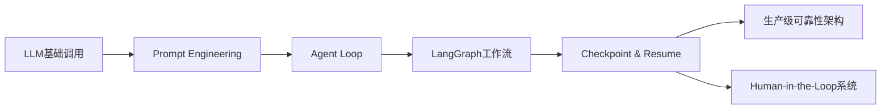
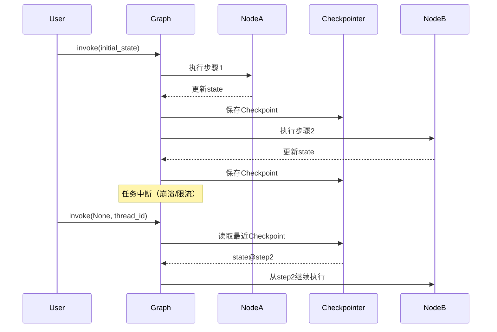
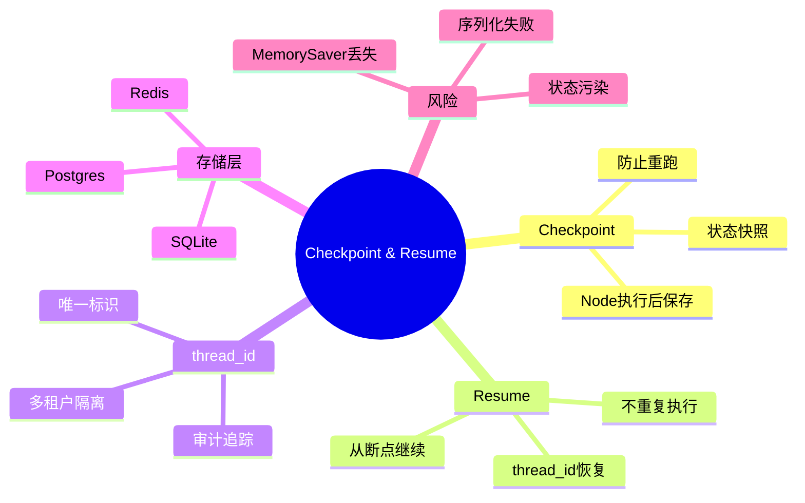

# 第24章 Checkpoint & Resume（检查点与断点续跑） [L2-L3]

## Part 1：为什么要学这个？[认知冲突先行][L2-L3]

你写了一个行业调研报告生成 Agent，需要调用3次搜索工具、2次大模型整理、1次格式校验，跑一次要10分钟、消耗5美元 Token。结果跑到第9分钟时因为 OpenAI 限流触发异常——前面的所有调用全部白费，钱花了、时间也浪费了。你心想：“不就是加个 try-catch 重试吗？”于是你包了一层 retry，结果重试还是从第一步开始，又花了10分钟和5美元。

这个时候大多数人的直觉是：既然失败了，那就再跑一遍。

但问题恰恰出在这里——**你在用“函数调用思维”解决“流程系统问题”。**

很多人以为 Agent 的可靠性问题靠「重试」就能解决——出错了重新调用一次就行。但重试是从头开始，已完成的步骤（已付的 Token 费用、已调用的工具）全部作废。

真正的问题是：Agent 的执行不是一次函数调用，而是一个**长链路状态机执行过程**。你需要保存“执行到哪一步了”。

Agent 需要的是 Checkpoint——在每一步执行后把状态存下来，中断后从断点继续，而不是从头重试。重试解决的是「调用失败」，Checkpoint 解决的是「任务中断后如何不重复劳动」。两者是不同层次的问题。

本章要解决的核心问题是：

> 如何让一个可能运行 10~30 分钟的 Agent，在任何中断情况下都能从“上次做到一半的位置”继续执行，而不是重来一遍？

---

## Part 2：学习路径定位[L2-L3]

Checkpoint 机制处于 Agent 工程化可靠性的核心层，是从“能跑”走向“可生产”的关键跃迁点。



前置知识：

* LLM 调用基础
* Agent Loop（ReAct / Tool Calling）
* LangGraph 基础状态流

后置能力：

* 生产级任务恢复
* 长流程任务编排
* 人工介入系统设计
* 容错型 AI 系统架构

---

## Part 3：用生活理解它[L2-L3]

你可以把 Checkpoint 理解成 Word 的“自动保存”。

写论文时如果没有保存，电脑死机意味着全部重写；但如果有自动保存，你只需要重新打开文档，从上次光标位置继续写。

Checkpoint 就是 Agent 的“自动保存系统”。

但这个类比有边界：

* Word 是线性编辑，Agent 是分支执行图
* Word 保存的是文本，Checkpoint 保存的是“执行状态 + 中间变量 + 任务进度”
* Agent 还要恢复工具调用状态，而不是只恢复内容

---

## Part 4：AI如何映射到传统概念[L2-L3]

| 传统软件系统             | Agent系统                |
| ------------------ | ---------------------- |
| 数据库事务日志（WAL）       | Checkpoint             |
| 进程断点调试             | Resume                 |
| ETL任务中断恢复          | Agent任务恢复              |
| 工作流引擎（Airflow DAG） | LangGraph + Checkpoint |
| 游戏存档系统             | 状态持久化                  |

核心差异：
传统系统恢复的是“数据状态”，Agent恢复的是“执行状态 + 思考路径 + 工具调用进度”。

---

## Part 5：技术本质深讲[L2-L3]

Checkpoint 的本质不是“存数据”，而是**存执行图的快照状态（Execution Snapshot）**。

LangGraph 中，每个 Node 执行后都会更新 State，并触发 Checkpoint 写入。



关键组件：

* **State**：任务上下文（输入、输出、中间结果）
* **Checkpoint**：某一时刻 state 的持久化快照
* **thread_id**：任务唯一标识（Checkpoint 主键）
* **Resume机制**：基于 thread_id 回溯 state

本质抽象：

> Checkpoint = f(State, Execution Step Index, Tool History)

---

## Part 6：动手Demo（可运行代码）[L2-L3]

```python
import sqlite3
import json
import time

# 模拟 Checkpointer（简化版）
class SimpleCheckpointer:
    def __init__(self, db="checkpoint.db"):
        self.conn = sqlite3.connect(db)
        self.conn.execute("""
        CREATE TABLE IF NOT EXISTS checkpoints (
            thread_id TEXT,
            step INTEGER,
            state TEXT
        )
        """)

    def save(self, thread_id, step, state):
        self.conn.execute(
            "INSERT INTO checkpoints VALUES (?, ?, ?)",
            (thread_id, step, json.dumps(state))
        )
        self.conn.commit()

    def load_latest(self, thread_id):
        cursor = self.conn.execute(
            "SELECT step, state FROM checkpoints WHERE thread_id=? ORDER BY step DESC LIMIT 1",
            (thread_id,)
        )
        row = cursor.fetchone()
        return row if row else (0, {})

# 模拟 Agent
class FakeAgent:
    def __init__(self, checkpointer):
        self.cp = checkpointer

    def run(self, thread_id, resume=False):
        step, state = self.cp.load_latest(thread_id) if resume else (0, {})

        for i in range(step, 5):
            print(f"执行 step {i}")

            # 模拟中断
            if i == 2 and not resume:
                print("⚠️ 任务中断")
                self.cp.save(thread_id, i, {"last_step": i})
                return

            time.sleep(0.5)
            state["last_step"] = i
            self.cp.save(thread_id, i + 1, state)

        print("任务完成")

cp = SimpleCheckpointer()
agent = FakeAgent(cp)

thread_id = "task-001"

# 第一次执行（会中断）
agent.run(thread_id, resume=False)

print("\n--- 恢复执行 ---\n")

# 恢复执行
agent.run(thread_id, resume=True)
```

关键点：

* 每一步都保存 checkpoint
* thread_id 决定恢复哪个任务
* resume=True 从断点继续

运行结果：

* 第一次执行到 step2 中断
* 第二次直接从 step2+继续执行
* 不重复已完成步骤

---

## Part 7：真实项目场景[L2-L3]

某 SaaS 公司上线了一个合同审核 Agent，用户上传几十页合同，Agent 需要逐页审核条款、调用法律知识库、生成报告，耗时约15分钟。

上线第一周问题频发：

* 服务器凌晨重启导致任务中断
* OpenAI 限流导致调用失败
* 工具调用超时

结果：

* 用户必须重新上传合同
* 每次失败都浪费 15 分钟
* 每天约 2000 次冗余 LLM 调用
* 用户投诉激增

解决方案：

* 引入 LangGraph SqliteSaver
* thread_id 设计：contract-review-{user_id}-{uuid}
* 每个 Node 自动写 Checkpoint
* 7天 TTL 清理历史状态

效果：

* 恢复时间：15分钟 → 2-5分钟
* Token浪费降低70%
* 用户投诉归零
* 运维负担显著下降

---

## Part 8：这里容易踩坑[L2-L3]

### 错误1：用 MemorySaver 生产环境

```python
# 错误
checkpointer = MemorySaver()
```

问题：

* Pod 重启 → 状态全丢
* 等同没有 Checkpoint

正确：

```python
checkpointer = SqliteSaver.from_conn_string("state.db")
```

---

### 错误2：thread_id 设计错误

```python
thread_id = "1"
```

问题：

* 多用户冲突
* 状态污染

正确：

```python
thread_id = f"{tenant_id}-{user_id}-{task_type}-{uuid}"
```

---

### 错误3：State 不可序列化

```python
state = {"file": open("a.txt")}  # ❌
```

问题：

* Checkpoint 写入失败

正确：

```python
state = {"file_content": "..." }
```

---

## Part 9：面试怎么答[L2-L3]

### L1题

Checkpoint 是什么？为什么需要？

要点：

* Node 执行后的状态快照
* 防止中断导致重跑
* 节省 Token 和时间

---

### L2题

Resume 如何工作？

要点：

* 使用同一个 thread_id
* 自动加载最近 checkpoint
* 从断点继续执行 graph

---

### L3题

多租户如何设计 thread_id？

要点：

* 包含 tenant_id / user_id / task_type / uuid
* 防止状态污染
* 支持审计与排查
* 结合 TTL 做生命周期管理

---

## Part 10：考点速查[L2-L3]

* **Checkpoint本质**：执行状态的持久化快照
* **Resume机制**：基于 thread_id 恢复执行图
* **thread_id作用**：唯一任务键
* **生产存储方案**：SQLite / Postgres
* **核心价值**：避免重复执行浪费 Token

---

## Part 11：必背金句[L2-L3]

* Checkpoint 不是存数据，是存“执行进度”
* 重试是重新开始，Checkpoint 是继续完成
* thread_id 是 Agent 的身份证
* 没有 Checkpoint 的 Agent 是一次性程序
* 生产系统的可靠性来自“可恢复性”

---

## Part 12：快速参考表[L2-L3]

| 概念           | 作用     | 示例值                |
| ------------ | ------ | ------------------ |
| Checkpoint   | 保存执行状态 | step=3 state       |
| Resume       | 从断点继续  | invoke(None)       |
| thread_id    | 任务唯一标识 | user-123-task-uuid |
| State        | 执行上下文  | JSON dict          |
| Checkpointer | 持久化存储  | SQLite/Postgres    |

---

## Part 13：思维导图[L2-L3]



---

## Part 14：本章小结[L2-L3]

Checkpoint 的核心不是“保存数据”，而是保存 Agent 的执行进度与上下文。

从 L0 到 L3 的成长路径是：

* L0：只会调用 LLM
* L1：能构建 Agent Loop
* L2：能理解状态流转
* L3：能设计可恢复的生产系统

---

## Part 15：下一章预告[L2-L3]

本章解决的是“任务中断后如何继续”。

但现实问题更复杂：如果任务在中间需要人类审批怎么办？

下一章将进入：

> Human-in-the-Loop（HITL）与 Agent 暂停机制

你会看到：Checkpoint 解决“恢复”，HITL 解决“等待”。