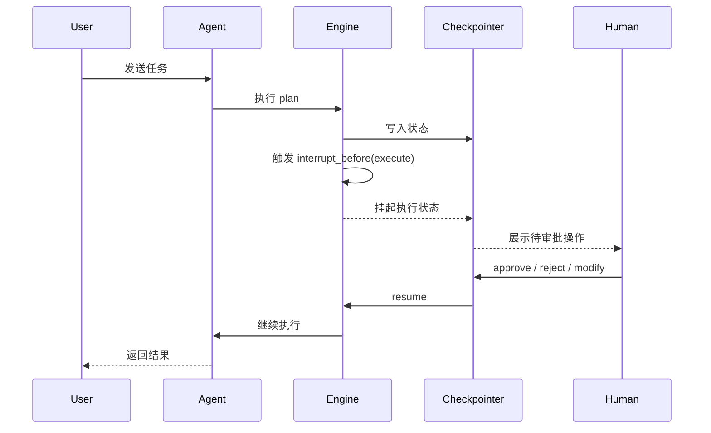
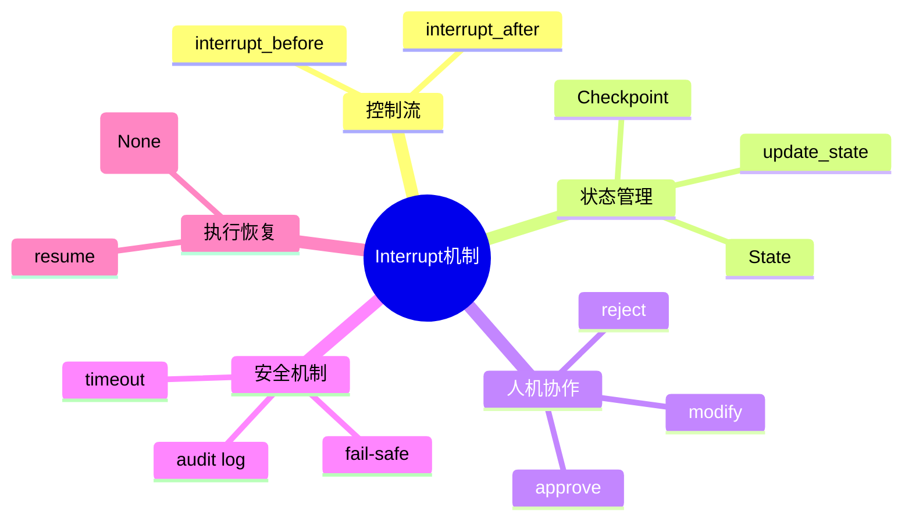

# 第25章 Interrupt（中断与恢复） [L2-L3]

## Part 1：为什么要学这个？[认知冲突先行] [L2-L3]

你给 Agent 下达指令：“清理 2023 年以前的所有订单数据”。

它在后台安静执行，没有弹窗，没有确认，没有警告，直接开始 DELETE 操作。

几分钟后，284 万条记录消失。

你这才反应过来：你说的“清理”，在业务语义里是“归档 + 备份 + 删除旧数据”，但 Agent 执行的是数据库层面的“物理删除”。

更严重的是，这类操作在任何生产系统里都应该走审批流程，但 Agent 根本没有停下来问任何人。

问题的核心不在“模型理解错了”，而在一个更隐蔽的事实：

Agent 默认优化的是“完成任务”，而不是“遵守流程”。

当流程约束缺失时，模型会把所有中间步骤压缩成一条不可逆执行路径。

Interrupt 要解决的就是这个断裂点：

在关键执行路径上强行插入“暂停与人类决策”，让系统从“自动执行器”变成“可治理执行系统”。

---

## Part 2：学习路径定位 [L2-L3]

Interrupt 位于 Agent 执行控制链路的中后段，是从“可执行”走向“可控执行”的关键分界层。


前置知识：

* Agent 执行循环
* LangGraph State / Node / Edge
* Checkpoint 持久化机制

后置知识：

* 审批流系统设计
* 多阶段人类干预系统
* 生产级安全Agent架构

---

## Part 3：用生活理解它 [L2-L3]

把 Agent 想象成一条自动化工厂流水线。

普通产品可以自动加工、检测、包装、出库。

但当产品进入“高风险工序”（比如高压测试），系统会强制停下：

必须由质检员确认参数、确认环境、确认风险后，才能继续。

Interrupt 就是这个“质检暂停机制”。

边界说明：

* 工厂质检是固定规则
* Agent 是否触发 Interrupt 是动态逻辑（由代码/策略决定）

---

## Part 4：AI如何映射到传统概念 [L2-L3]

| AI 概念            | 传统系统                |
| ---------------- | ------------------- |
| Interrupt        | 人工审批节点              |
| State            | 请求上下文               |
| Resume           | 流程继续执行              |
| Checkpoint       | 事务日志                |
| update_state     | 参数更新                |
| interrupt_before | pre-execution hook  |
| interrupt_after  | post-execution hook |

本质：从函数调用模型升级为“可暂停工作流系统”。

---

## Part 5：技术本质深讲 [L2-L3]

Interrupt 的系统结构由三层构成：

1. 控制流中断（Execution Pause）
2. 状态持久化（Checkpoint Storage）
3. 外部触发恢复（Resume Trigger）



关键机制：

* interrupt_before：执行前阻断（适合高风险操作）
* interrupt_after：执行后阻断（适合结果审计）
* Checkpointer：保存执行状态
* update_state：动态修改执行参数

Interrupt 本质：

> 在确定性执行流中引入人类决策点。

---

## Part 6：动手Demo（可运行代码）[L2-L3]

（已修复：审批闭环 + 类型安全 + 输入异常处理 + 拒绝路径清理 + checkpoint提示）

```python
from typing import TypedDict
from langgraph.graph import StateGraph, END
from langgraph.checkpoint.memory import MemorySaver


# ---------------------------
# 状态定义（TypedDict）
# ---------------------------
class AgentState(TypedDict, total=False):
    task: str
    plan: str
    action: str
    delete_before_year: int
    approved: bool
    report: str


# ---------------------------
# 计划节点
# ---------------------------
def plan_task(state: AgentState) -> AgentState:
    state["plan"] = "准备执行订单清理任务"
    return state


# ---------------------------
# 危险执行节点（必须检查审批状态）
# ---------------------------
def execute_action(state: AgentState) -> AgentState:
    if not state.get("approved", False):
        state["action"] = "执行被阻止：未获得审批"
        return state

    year = state.get("delete_before_year", 2023)
    state["action"] = f"删除 {year} 年以前订单数据"
    return state


# ---------------------------
# 报告节点
# ---------------------------
def generate_report(state: AgentState) -> AgentState:
    state["report"] = f"最终结果：{state.get('action')}"
    return state


# ---------------------------
# 构建 Graph
# ---------------------------
graph = StateGraph(AgentState)

graph.add_node("plan", plan_task)
graph.add_node("execute", execute_action)
graph.add_node("report", generate_report)

graph.add_edge("plan", "execute")
graph.add_edge("execute", "report")
graph.add_edge("report", END)


# ---------------------------
# Interrupt + Checkpoint
# ---------------------------
app = graph.compile(
    checkpointer=MemorySaver(),
    interrupt_before=["execute"]
)

config = {"configurable": {"thread_id": "order-job-001"}}


# ---------------------------
# Step 1：执行到断点
# ---------------------------
state = app.invoke({"task": "清理订单"}, config)

pending = app.get_state(config)
print("\n=== 待审批内容 ===")
print(pending.values)


# ---------------------------
# Step 2：人工输入
# ---------------------------
print("\n操作选项：")
print("y = 批准执行")
print("n = 拒绝执行")
print("m = 修改年份")

user_input = input("请输入 y/n/m: ").strip().lower()


# ---------------------------
# Step 3：控制流（修复关键逻辑）
# ---------------------------
result = None

if user_input == "y":
    app.update_state(config, {"approved": True})
    result = app.invoke(None, config)
    print("\n已批准执行")

elif user_input == "m":
    try:
        new_year = int(input("请输入新的年份: "))
    except ValueError:
        print("输入非法年份，任务终止")
        new_year = None

    if new_year:
        app.update_state(config, {
            "approved": True,
            "delete_before_year": new_year
        })
        result = app.invoke(None, config)
        print("\n已修改参数并执行")

elif user_input == "n":
    app.update_state(config, {"approved": False})
    print("\n任务已拒绝（已终止，不会执行 execute）")

    # MemorySaver 局限说明：
    print("提示：如需彻底隔离，请使用新的 thread_id 或持久化 Checkpointer")
    print("否则旧 checkpoint 可能仍可被恢复")

else:
    print("输入无效，任务终止")


# ---------------------------
# Step 4：输出结果
# ---------------------------
if result:
    print("\n=== 执行结果 ===")
    print(result)
```

运行逻辑：

* y → 正常执行危险操作
* m → 修改参数后执行
* n → 直接终止（不会进入 execute）
* 非法输入 → 安全退出
* execute 永远依赖 approved 状态

---

## Part 7：真实项目场景 [L2-L3]

某电商订单系统引入 Agent 自动清理历史数据。

事故发生：

* 删除 1206 条高管订单
* 误操作生产库
* 自动生成补偿数据污染系统

根因：

* 没有 interrupt_before
* 没有审批节点
* 没有状态校验
* Agent 直接执行 DELETE

修复方式：

在 execute 前增加 Interrupt：

* 暂停执行
* 展示：

  * 数据规模
  * 金额风险
  * 影响范围
* 人工选择：

  * approve
  * reject
  * modify

结果：

* 高危误删 → 0
* 自动化率 → 92%
* 审批仅覆盖高风险路径

---

## Part 8：这里容易踩坑 [L2-L3]

### 错误1：忽略审批状态

```python
def execute_action(state):
    return {"action": "delete all"}
```

问题：无条件执行危险操作

正确：

```python
if not state.get("approved"):
    return {"action": "blocked"}
```

---

### 错误2：拒绝仍然 resume

错误逻辑：

* n 仍调用 invoke(None)

问题：
拒绝 ≠ 继续流程

正确：
拒绝必须终止执行链

---

## Part 9：面试怎么答 [L2-L3]

### L1

Interrupt 是在执行节点前后暂停 Agent，等待外部输入再继续执行。

---

### L2

interrupt_before 用于执行前审批（删除、支付），interrupt_after 用于执行后审计（报告、结果验证）。

---

### L3（已增强）

超时机制设计：

* 后台 worker 轮询 checkpoint 时间戳
* 超过 TTL：

  * update_state({"approved": False})
  * 标记失败状态
  * 不 resume，进入 fail-safe 分支
* 清理 checkpoint：

  * 使用 list_checkpoints()
  * 删除过期 thread
  * 或使用 TTL 策略（生产推荐 PostgresSaver / RedisSaver）
* 同时通知用户（邮件/消息队列）

---

## Part 10：考点速查 [L2-L3]

* **Interrupt = 控制流断点**
* **Checkpoint = 状态持久化**
* **interrupt_before = 风险拦截**
* **interrupt_after = 结果审计**
* **update_state = 动态修改执行参数**

---

## Part 11：必背金句 [L2-L3]

* Interrupt 是系统的安全刹车
* 没有审批的自动化是风险放大器
* Checkpoint 是存档，Interrupt 是暂停
* before 控风险，after 控结果
* 人类是流程节点，而不是观察者

---

## Part 12：快速参考表 [L2-L3]

| 概念               | 作用    | 示例           |
| ---------------- | ----- | ------------ |
| interrupt_before | 执行前暂停 | delete node  |
| interrupt_after  | 执行后暂停 | report node  |
| Checkpoint       | 状态存储  | MemorySaver  |
| update_state     | 修改参数  | year=2020    |
| Resume           | 继续执行  | invoke(None) |

---

## Part 13：思维导图 [L2-L3]



---

## Part 14：本章小结 [L2-L3]

Interrupt 将 Agent 从“自动执行器”升级为“可控工作流系统”。

它通过插入人工决策点，让高风险操作不再不可逆。

从 L2 到 L3，本质是从“能执行任务”走向“可治理系统”。

---

## Part 15：下一章预告 [L2-L3]

本章解决的是“如何暂停 Agent 执行并引入人类决策”。

但当多个 Interrupt 同时出现时，新的问题出现：

如何排序审批？如何分级控制？如何构建企业级审批链？

下一章将进入：

**多级审批流与复杂 Agent 工作流编排机制**