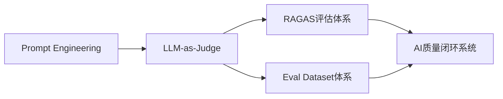
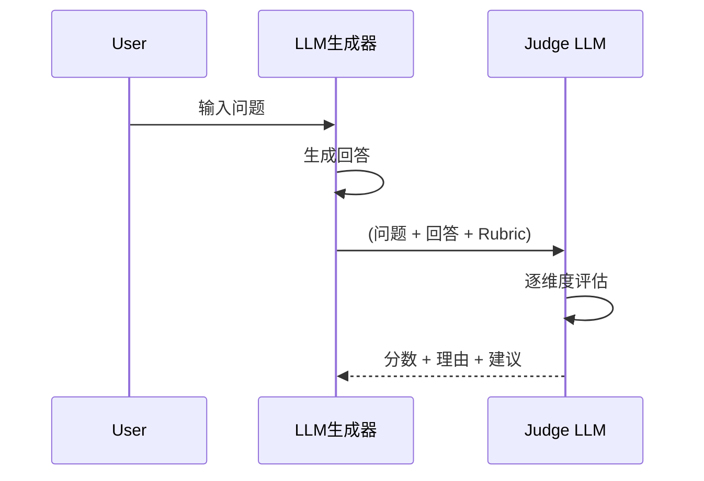
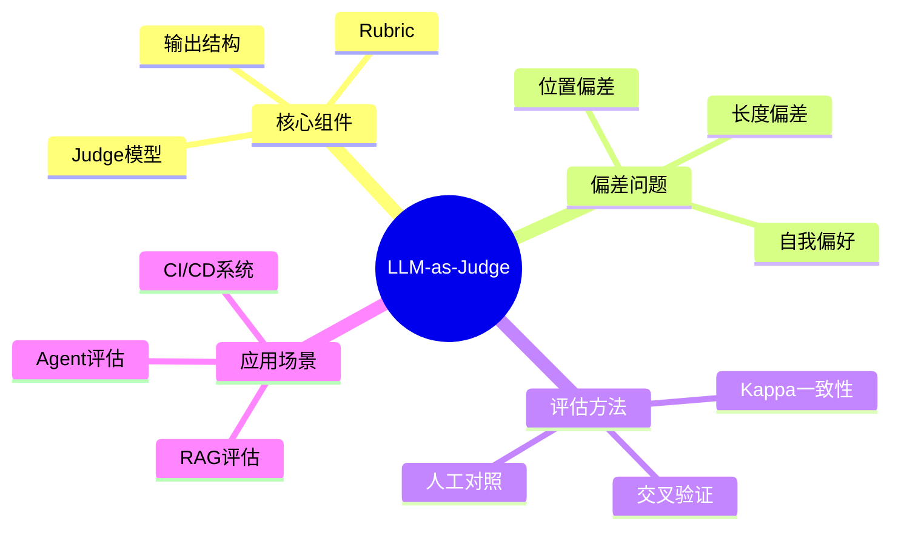

# 第26章 LLM-as-Judge（用 LLM 评判输出质量） [L2-L3]

## Part 1：为什么要学这个？[L2-L3]

你可能见过一种“看起来完全合理”的系统评估方式。

AI客服上线后，系统自动收集用户反馈：点赞、点踩、五星评分。数据面板显示好评率92%。团队信心满满，认为系统已经稳定可用。

直到业务方丢出一条真实对话：

用户问：“我的保单还有效吗？”
AI回答：“您的保单有效期至2026年12月31日。”
用户点击👍。

从用户视角，这条回答是“正确且有帮助”的。

但后台一查，这位用户的保单早在2025年就已经失效。

问题没有出现在用户反馈里，而是隐藏在一个更深层的误区：

**我们用“满意度”替代了“正确性”。**

更麻烦的是，这种错误在规模化系统里几乎无法靠人工发现。

核心矛盾变成：

**如何在不依赖人工逐条审核的情况下，判断AI输出是否真正正确？**

---

## Part 2：学习路径定位[L2-L3]

LLM-as-Judge处在“AI质量工程体系”的中间层，是连接生成与评估的关键节点。



前置能力：

* Prompt Engineering（控制生成行为）
* LLM基础生成与概率机制理解

后置能力：

* RAGAS（检索增强评估）
* Eval Dataset体系（系统测试集）
* AI CI/CD质量工程体系

---

## Part 3：用生活理解它[L2-L3]

可以把整个流程想象成一家新闻编辑部。

记者（LLM）写稿，读者（用户）投票点赞，但点赞只代表“读起来舒服”，不代表“事实正确”。

LLM-as-Judge扮演的是主编角色。

主编不会看“读者喜不喜欢”，而是对照事实核查清单逐条审稿：

* 数据是否真实
* 逻辑是否成立
* 是否存在编造

但关键限制在于：
如果主编本身专业能力不足，就可能把错误稿件也放行。

---

## Part 4：AI如何映射到传统概念[L2-L3]

| 传统软件工程      | AI系统              |
| ----------- | ----------------- |
| 单元测试        | Eval Dataset      |
| QA测试工程师     | LLM-as-Judge      |
| Bug         | 幻觉（Hallucination） |
| CI/CD流水线    | 自动评估系统            |
| Code Review | 输出质量评审            |

本质变化：
从“规则检查代码” → “语义理解评审自然语言输出”

---

## Part 5：技术本质深讲[L2-L3]

LLM-as-Judge的核心不是打分，而是“结构化语义审稿系统”。



### 1. Judge模型选择策略

选择Judge模型不是“越强越好”这么简单，而是一个工程权衡：

* 能力要求：必须 ≥ 被评估模型（否则无法识别错误）
* 任务匹配：如果评估代码质量，用代码能力强的模型更合适
* 稳定性：比绝对能力更重要的是评分一致性
* 成本：大规模评估时需要控制推理成本

工程上常见策略：

* GPT-4 / Claude 3.5 用作主Judge
* 小模型用于预筛选（cheap filter）

---

### 2. Rubric设计（降低主观性关键）

Rubric不是提示词，而是“评分协议”。

一个标准Rubric必须包含：

* 维度定义（accuracy / completeness）
* 锚点描述（0/5/10分别代表什么）
* 排除项（比如长度不影响评分）

示例锚点：

* 10分：完全正确，无事实错误
* 5分：部分正确，但存在关键缺失
* 0分：严重错误或幻觉

---

### 3. 评估一致性（Cohen’s Kappa）

仅有评分不够，还需要衡量Judge是否稳定。

Cohen’s Kappa用于衡量两个评估者的一致性：

* 1.0：完全一致
* 0.8以上：良好一致性
* 0.6以下：评估系统不可靠

简化计算思想：

```text
Kappa = (实际一致 - 随机一致) / (1 - 随机一致)
```

工程实践：

* 人工 vs LLM Judge
* LLM A vs LLM B Judge
* 不同版本Judge对比

---

## Part 6：动手Demo（可运行代码）[L2-L3]

下面是一个“真实API + 批量评估 + 统计分析”的最小工程实现。

```python
import os
import json
import time
import statistics
from openai import OpenAI

client = OpenAI(api_key=os.getenv("OPENAI_API_KEY"))

JUDGE_PROMPT = """
你是严格的AI评审专家。

评分标准：
1. accuracy（0-10）
2. completeness（0-10）
3. clarity（0-10）

请输出JSON：
{
  "accuracy": int,
  "completeness": int,
  "clarity": int,
  "reason": str
}

问题：{question}
回答：{answer}
"""

def call_judge_llm(prompt, retry=3):
    for i in range(retry):
        try:
            resp = client.chat.completions.create(
                model="gpt-4o-mini",
                messages=[{"role": "user", "content": prompt}],
                temperature=0
            )
            return resp.choices[0].message.content
        except Exception as e:
            time.sleep(1)
    raise RuntimeError("Judge API failed")

def evaluate_one(question, answer):
    prompt = JUDGE_PROMPT.format(question=question, answer=answer)
    raw = call_judge_llm(prompt)
    return json.loads(raw)

def batch_evaluate(dataset):
    results = []
    for item in dataset:
        score = evaluate_one(item["q"], item["a"])
        score["total"] = sum([
            score["accuracy"],
            score["completeness"],
            score["clarity"]
        ])
        results.append(score)
    return results

def analyze(results):
    totals = [r["total"] for r in results]
    return {
        "avg": statistics.mean(totals),
        "std": statistics.stdev(totals) if len(totals) > 1 else 0
    }

# demo dataset
dataset = [
    {"q": "什么是RAG？", "a": "RAG是检索增强生成模型"},
    {"q": "什么是LLM？", "a": "LLM是大语言模型"},
    {"q": "Transformer作用？", "a": "用于序列建模"}
]

results = batch_evaluate(dataset)
print(results)
print(analyze(results))
```

运行结果：

* 每条样本结构化评分
* 输出平均分与标准差
* 可用于CI/CD质量监控

---

## Part 7：真实项目场景[L2-L3]

在某新闻AI生成系统中：

问题：
AI生成播客脚本时出现大量事实错误：

* 数据错误
* 案例误引
* 时间线错乱

每月错误量：
15~20起人工可见事故

人工审核成本：
无法覆盖全部内容

---

### 解决方案：LLM-as-Judge审稿系统

流程：

1. AI生成播客脚本
2. Judge模型对照原文评估
3. 输出可信度评分 + 错误类型

---

### 系统上线结果：

* 事实错误下降95%
* 人工审核减少90%
* 质量问题提前在生成阶段被拦截

核心变化：

从“事后人工审查” → “实时机器审稿”

---

## Part 8：这里容易踩坑[L2-L3]

### 错误1：Judge偏差无法验证

**实验验证方法：位置偏差测试**

步骤：

1. 准备A/B两个等价答案
2. 交换顺序
3. 运行Judge两次
4. 计算评分差值

如果平均差值 > 0.5 → 存在位置偏差

---

### 错误2：长度偏差未控制

实验方法：

* 构造短答案 vs 长答案（语义相同）
* 统计评分随长度变化曲线

理想情况：
评分应与长度无关

---

### 错误3：忽略自我偏好

实验：

* GPT生成答案
* Claude Judge vs GPT Judge交叉评估

观察：
同家族模型评分偏高 → 自我偏好存在

---

## Part 9：面试怎么答[L2-L3]

### L1题

**LLM-as-Judge是什么？**

要点：

* 用强LLM评估另一个LLM输出
* 替代人工评估
* 支持语义级判断

---

### L2题

**如何验证评估系统可靠性？**

实验设计：

* 人工标注对照
* Cohen’s Kappa ≥ 0.8为可用
* 多模型交叉验证
* 稳定性测试（多次运行方差）

---

### L3题

**如何设计偏差验证实验？**

完整方案：

样本设计：

* 100组Q/A对
* 每组2个等价答案

方法：

* 交换顺序测试位置偏差
* 长度控制测试verbosity bias
* 不同Judge模型对比

统计方法：

* t-test（均值差异显著性）
* Cohen’s Kappa（一致性）
* p < 0.05 判定显著偏差

---

## Part 10：考点速查[L2-L3]

**Judge模型选择**

* 必须强于被评估模型

**Rubric设计**

* 必须结构化 + 有锚点

**一致性评估**

* Cohen’s Kappa ≥ 0.8

**三大偏差**

* 位置偏差
* 长度偏差
* 自我偏好

---

## Part 11：必背金句[L2-L3]

* Judge不是答案生成器，而是评审系统
* 没有Rubric的评分等于随机投票
* 强模型才能审强模型
* 分数必须可解释，否则不可用
* 一致性比准确性更重要

---

## Part 12：快速参考表[L2-L3]

| 概念          | 作用    | 示例          |
| ----------- | ----- | ----------- |
| Judge Model | 输出评估  | GPT-4       |
| Rubric      | 评分规则  | accuracy    |
| Kappa       | 一致性指标 | ≥0.8        |
| Bias        | 评估偏差  | length bias |

---

## Part 13：思维导图[L2-L3]



---

## Part 14：本章小结[L2-L3]

LLM-as-Judge的本质是构建一个“可扩展的机器审稿系统”，用于替代不可规模化的人类评估。

它解决的不是生成问题，而是质量判断问题。

成长路径：

* L0：用户点赞
* L1：人工评估
* L2：规则指标
* L3：LLM自动审稿 + 统计校准

---

## Part 15：下一章预告[L2-L3]

当你拥有Judge系统后，你会遇到新问题：

不同Judge结果不一致怎么办？
评分稳定但不一定正确怎么办？

下一章进入：
**RAGAS评估体系——把LLM-as-Judge升级为可量化、可对比、可追踪的系统级评估框架。**