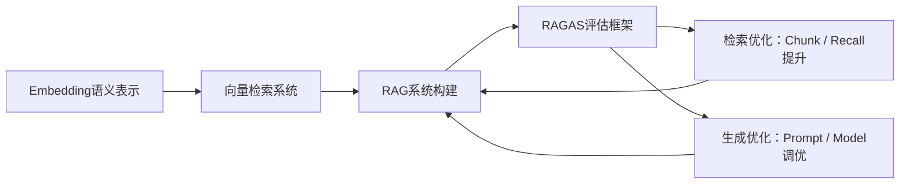
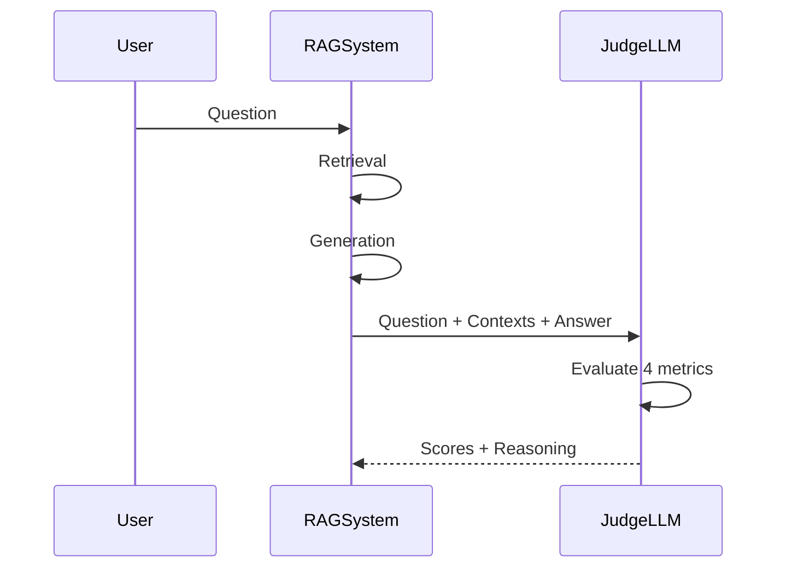
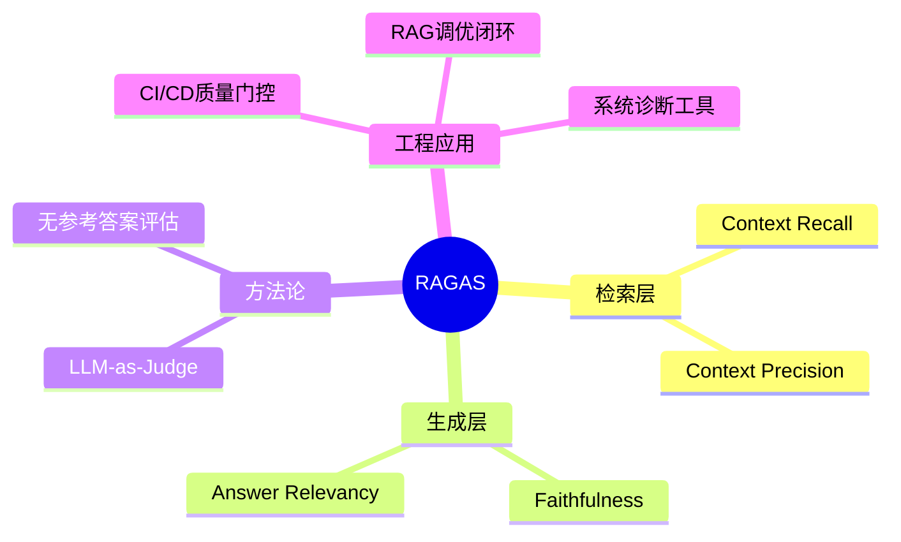

# 第27章 RAGAS（RAG 评估框架） [L2-L3]

## Part 1：为什么要学这个？[认知冲突先行] [L2-L3]

你花了两周时间优化RAG系统的Prompt和检索策略，上线后用户反馈“感觉变好了”。老板问“好在哪里？提升了多少？”你只能拿出几个截图的对比案例。于是你决定引入RAGAS跑一轮评估——结果傻眼了：这是一个真实RAG系统在300条测试集上的实测结果，Context Recall只有0.50，意味着用户问的10个问题里，有5个的关键信息压根没被检索回来。

更关键的是，这个系统在人工体验上“看起来不错”。

认知冲突在这里出现：**你以为“答案合理 = 系统正确”，但真实情况是“答案合理 ≠ 检索正确 ≠ 系统健康”。**

RAGAS揭示的问题不是局部错误，而是结构性盲区：

* 检索漏了信息，你不知道
* 生成编得合理，你看不出
* 用户觉得可以用，你误以为成功

本章要解决的问题非常直接：**如何把RAG系统从“感觉评估”升级为“可量化诊断”？**

---

## Part 2：学习路径定位 [L2-L3]

RAGAS位于RAG工程链路的“评估与反馈层”，是连接系统构建与优化闭环的关键节点。



前置知识：

* 向量数据库与语义检索机制
* RAG基础架构（Retrieve-Augment-Generate）
* LLM生成原理与Prompt控制

后置能力：

* AI系统评估体系设计
* 自动化CI/CD质量门控
* LLM-as-Judge工程化应用

---

## Part 3：用生活理解它 [L2-L3]

RAGAS像一家餐厅的“四维体检系统”。

* Recall：后厨有没有把该准备的食材都备齐
* Precision：备菜有没有混入不相关食材
* Faithfulness：厨师有没有偷偷加“自己发挥的料”
* Relevancy：端上来的菜是不是客人点的那道

但这里有一个关键升级理解：

如果出现组合情况：

* Recall低 + Faithfulness高 → 食材没拿全，但厨师很诚实（问题在后厨采购/检索）
* Recall高 + Faithfulness低 → 食材齐全，但厨师乱加工（问题在生成模型）
* Precision低 + Faithfulness高 → 食材混入污染，但厨师仍照单做（检索噪声问题）
* 全高但Relevancy低 → 做得很好，但做错菜（意图理解问题）

这意味着RAGAS不是评分，而是**定位系统故障来源的诊断仪**。

---

## Part 4：AI如何映射到传统概念 [L2-L3]

| RAGAS指标           | 传统工程类比          |
| ----------------- | --------------- |
| Context Recall    | 数据库查询是否遗漏关键记录   |
| Context Precision | SQL结果是否包含冗余数据   |
| Faithfulness      | 后端是否篡改或虚构返回值    |
| Answer Relevancy  | API返回是否符合接口语义契约 |

本质上，RAGAS是在做工程化拆解：

> 把“AI系统好不好”拆成“可定位、可修复的子系统问题”。

---

## Part 5：技术本质深讲 [L2-L3]

RAGAS的核心不是“打分”，而是一个结构化评估协议：**用LLM模拟审稿人，对RAG链路逐段审查**。



### 四个指标本质拆解

* Context Recall：应该出现的信息有没有被检索到
* Context Precision：检索内容是否包含噪声
* Faithfulness：回答是否严格来自上下文
* Answer Relevancy：是否真正回答问题

### 关键机制

RAGAS本质是：

> 用一个强LLM充当“审稿人”，对RAG系统的每个环节做结构化判定。

它不关心“语言是否流畅”，只关心三件事：

* 信息有没有漏
* 信息有没有脏
* 模型有没有编

---

## Part 6：动手Demo（可运行代码）[L2-L3]

```python
from ragas import evaluate
from ragas.metrics import (
    faithfulness,
    answer_relevancy,
    context_recall,
    context_precision,
)
from datasets import Dataset

# 注意：每条样本结构必须严格对应 RAGAS 要求
data = {
    "question": [
        "什么是RAG？",
        "LLM-as-Judge是什么？"
    ],
    "answer": [
        "RAG是检索增强生成，通过外部知识库增强LLM输出。",
        "LLM-as-Judge是用大模型来评估另一个模型的输出质量。"
    ],

    # contexts: List[List[str]] 每个样本是“多个检索片段”
    "contexts": [
        [
            "RAG是一种结合检索与生成的架构，用于增强LLM知识能力。",
            "RAG通过外部知识库补充模型上下文。"
        ],
        [
            "LLM-as-Judge使用强模型对输出进行评分和解释。",
            "该方法常用于自动化评估AI系统质量。"
        ]
    ],

    # ground_truth: List[List[str]]（用于 recall 计算）
    "ground_truth": [
        [
            "RAG是结合检索和生成的架构",
            "RAG用于解决LLM知识局限问题"
        ],
        [
            "LLM用于评估AI输出质量",
            "通过模型作为评审进行自动打分"
        ]
    ]
}

dataset = Dataset.from_dict(data)

results = evaluate(
    dataset=dataset,
    metrics=[
        faithfulness,
        answer_relevancy,
        context_recall,
        context_precision
    ],
    raise_exceptions=True
)

print(results)
```

运行后你会看到：

* 四个维度分数
* 每个指标对应不同问题域
* 系统瓶颈被拆解，而不是被平均

---

## Part 7：真实项目场景 [L2-L3]

Tealium构建RAG QA系统时遇到的核心问题是：系统“看起来对”，但无法证明“真的对”。

在引入RAGAS之前：

* Recall ≈ 0.52
* Precision ≈ 0.60
* Faithfulness ≈ 0.75
* 迭代周期：约2周一次

系统最大问题不是错误，而是**无法定位错误来源**。

引入RAGAS后：

* Recall：0.52 → 0.78
* Precision：0.60 → 0.81
* Faithfulness：0.75 → 0.90+
* Relevancy：稳定在0.85+

工程变化：

* 每次PR自动触发评估
* 指标低于阈值禁止上线
* 每个指标对应不同负责人（检索/生成/Prompt）

结果：

迭代周期从2周缩短到3天，原因很简单：

> 问题从“系统不好”变成“具体模块不好”。

---

## Part 8：这里容易踩坑 [L2-L3]

### 坑1：样本太少导致误判

错误：

```text
10条测试集 → 结论：系统很好
```

正确：

* 100~500条固定评估集
* 覆盖多query类型（事实 / 推理 / 长尾）

---

### 坑2：生成模型与Judge模型同源

错误：

```text
GPT-4生成 + GPT-4评分
```

问题：自我偏好偏差

正确策略：

* GPT-4生成 + Claude-3 Opus作为Judge（推荐）
* 或多Judge投票机制（降低单模型偏差）

Judge模型选择标准：

* 更强推理能力（优先）
* 不参与生成链路（避免偏置）
* 可控成本与延迟（工程约束）

---

### 坑3：只看平均分

错误：

```text
0.82 = 系统很好
```

正确分析：

* Recall低 → 检索问题
* Precision低 → 噪声问题
* Faithfulness低 → 幻觉问题
* Relevancy低 → 意图理解问题

---

## Part 9：面试怎么答 [L2-L3]

### L1问题

RAGAS四个指标是什么？

* Context Recall：是否漏检索信息
* Context Precision：是否引入噪声
* Faithfulness：是否编造内容
* Answer Relevancy：是否回答正确问题

---

### L2问题

无参考答案评估是什么意思？

* 不依赖人工标准答案
* 输入：question + contexts + answer
* 输出：自动评分
* 唯一例外：Context Recall需要ground truth

---

### L3问题

Faithfulness 0.62，但 Recall 0.88，怎么分析？

思路：

* 检索是好的（Recall高）

* 问题在生成阶段：

  * Prompt没有强约束“必须基于上下文”
  * 上下文过长导致注意力稀释
  * 模型存在幻觉倾向

* 或 Judge模型偏差导致低估

---

## Part 10：考点速查 [L2-L3]

* **RAGAS四指标拆解RAG双阶段问题**
* **Context Recall唯一依赖ground truth**
* **Faithfulness用于检测幻觉**
* **Precision用于检测检索噪声**
* **LLM-as-Judge决定评估上限**

---

## Part 11：必背金句 [L2-L3]

* Recall低不是模型问题，是系统漏信息
* Precision低不是生成问题，是输入污染
* Faithfulness低说明模型在“编”
* Relevancy低说明模型答非所问
* RAGAS不是评分器，是诊断仪

---

## Part 12：快速参考表 [L2-L3]

| 指标                | 含义     | 诊断方向      |
| ----------------- | ------ | --------- |
| Context Recall    | 是否检索完整 | 检索系统      |
| Context Precision | 是否有噪声  | 检索过滤      |
| Faithfulness      | 是否编造   | 生成模型      |
| Answer Relevancy  | 是否答对问题 | Prompt/意图 |

---

## Part 13：思维导图 [L2-L3]



---

## Part 14：本章小结 [L2-L3]

RAGAS的核心价值不是评分，而是拆解RAG系统问题来源。

它将一个模糊的“好不好”问题，拆成四个可定位维度，从而让工程优化变成可执行任务。

从L0理解RAG，到L2掌握评估拆解，再到L3能够用指标驱动系统优化，这构成完整工程闭环。

---

## Part 15：下一章预告 [L2-L3]

本章解决的是“如何评估RAG系统”。

但评估只是开始，真正的难题是：当指标告诉你系统有问题时，如何自动定位并修复检索与生成链路？

下一章将进入：**RAG自动优化与闭环调参系统设计**