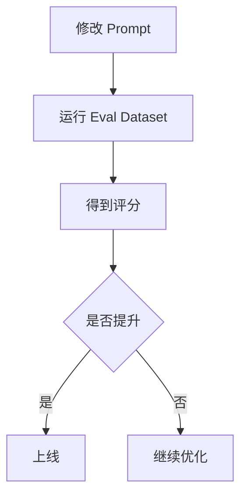
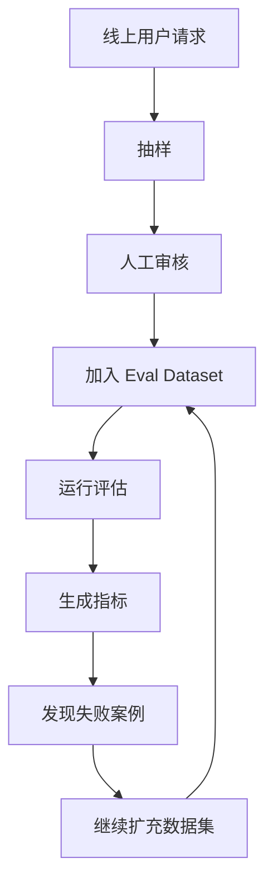
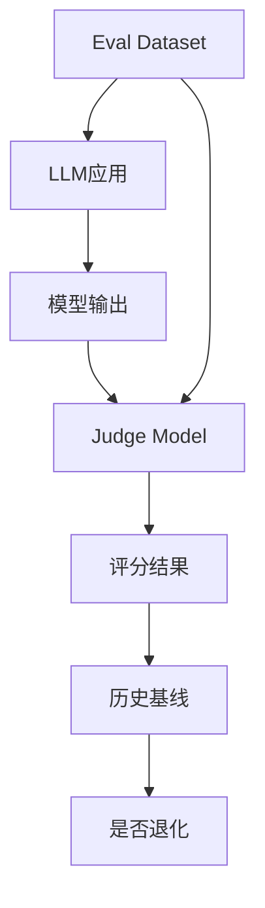
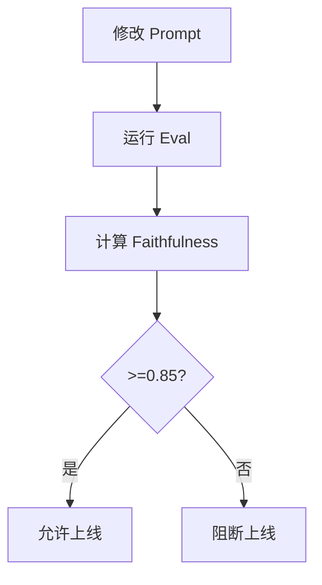
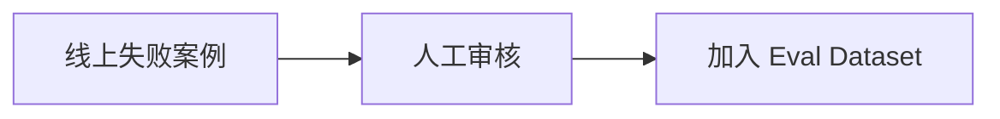
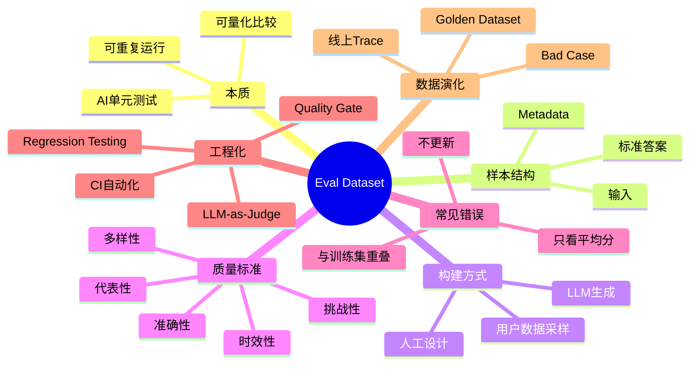

# 第28章 Eval Dataset（评估数据集） [L2-L3]

## Part 1：为什么要学这个？[认知冲突先行] [L2-L3]

### 你可能已经“优化成功”了，但其实只是自我感觉良好

你花了两周时间优化 Prompt，把模型从 A 换成了 B。

测试了几个例子之后，你感觉：

* 回答更流畅了；
* 语气更自然了；
* 好像更准确了。

老板问：

> “具体提升在哪里？提升了多少？”

你只能回答：

> “感觉更好了。”

于是系统上线。

一周后，用户投诉暴增。

原来：

* FAQ 问答变好了；
* 复杂场景却变差了；
* 某些边缘案例开始频繁幻觉；
* 原本能答对的问题，现在反而答错。

最糟糕的是：

**上线前，你完全没有发现。**

---

很多 AI 开发者都有一个错误假设：

> 我凭感觉和几个样例，就能判断模型是否变好了。

这在传统软件开发中几乎不可想象。

假设：

* 修改了支付代码；
* 不跑单元测试；
* 随便点几下页面；
* 觉得“应该没问题”。

没有工程师敢这么干。

但很多 AI 项目每天都在这样做。

原因在于：

AI 的输出不是固定函数。

一个 Prompt 的修改：

* 可能提升 A 场景；
* 同时破坏 B 场景；
* 可能让平均效果提升；
* 但让关键业务指标下降。

如果没有固定的评估基准：

你永远不知道：

* 是真的变好了；
* 还是只是换了一种错误方式。

---

### 本章要解决的问题

本章将回答：

* 为什么 AI 系统必须有 Eval Dataset？
* Eval Dataset 和 Few-shot 示例有什么区别？
* 如何构建可重复运行的评估集？
* 如何把 Eval 集成到开发流程中？
* 为什么说：

> Eval Dataset = AI 的单元测试套件。

当你学完这一章，你会理解：

> AI 工程不是“感觉工程”，而是“数据驱动工程”。

---

## Part 2：学习路径定位 [L2-L3]

### 它在 AI Native 工程体系中的位置

Eval Dataset 已经属于工程化能力。

它通常出现在：

* Prompt Engineering 之后；
* LLM 应用开发之后；
* RAG 开发之后；
* 进入质量控制阶段。

没有 Eval Dataset：

系统无法进入真正的生产级开发。

### 学习路径


### 前置知识

建议已经掌握：

* Prompt Engineering
* Few-shot
* RAG 基础
* Python 开发
* LLM API 调用

### 后续知识

掌握 Eval Dataset 后，可以继续学习：

* LLM-as-Judge
* Regression Testing
* Quality Gate
* AI CI/CD
* Online Monitoring

### 能力等级定位

| 等级 | 能力        |
| -- | --------- |
| L0 | 只会调用模型    |
| L1 | 能写 Prompt |
| L2 | 能开发 AI 应用 |
| L3 | 能构建质量体系   |
| L4 | 能建立 AI 平台 |

Eval Dataset 正是：

> 从“会开发”进入“会工程化”的分水岭。

---

## Part 3：用生活理解它 [L2-L3]

### 学校考试的类比

假设一所学校进行教学改革。

校长问：

> “学生成绩提高了吗？”

老师说：

> “感觉学生更聪明了。”

显然没人会接受。

真正的做法是：

每次改革后，

都使用同一套标准试卷重新考试。

这样才能比较：

* 去年平均分：82；
* 今年平均分：88；
* 阅读理解提高；
* 数学下降。

Eval Dataset 就像：

> AI 系统的标准化考试。

每次：

* 改 Prompt；
* 换模型；
* 改 RAG；
* 更新代码；

都重新考一次。

数字说话。

---

### 类比的边界

学校考试与 AI Eval 并不完全一致。

不成立的地方：

1. 学生会主动学习，模型不会；
2. AI 输出具有随机性；
3. AI 的评价指标可能不止正确率；
4. 不同业务需要不同评分标准。

因此：

Eval Dataset 不是“一套试卷永久使用”。

它需要持续演化。

---

## Part 4：AI 如何映射到传统概念 [L2-L3]

很多传统开发者第一次接触 Eval Dataset 时，会觉得陌生。

实际上，它对应的是软件工程中非常熟悉的概念。

### 对应关系

| 传统软件世界      | AI 世界              |
| ----------- | ------------------ |
| 代码          | Prompt + 模型 + RAG  |
| 单元测试        | Eval Dataset       |
| 测试用例        | Eval Case          |
| assert      | 评分指标               |
| 测试结果        | Eval Score         |
| CI Pipeline | Regression Testing |
| Bug Case    | 失败样本               |
| Bug 修复后加入测试 | Bad Case 加入 Eval   |
| 覆盖率分析       | 场景覆盖分析             |
| 回归测试        | 重新运行 Eval          |

---

### Few-shot 与 Eval Dataset 的区别

这是最容易混淆的地方。

| 维度     | Few-shot 示例 | Eval Dataset |
| ------ | ----------- | ------------ |
| 用途     | 帮助模型回答      | 检测模型质量       |
| 模型是否可见 | 可见          | 不可见          |
| 参与推理   | 参与          | 不参与          |
| 是否允许重复 | 允许          | 禁止           |
| 目标     | 提升效果        | 衡量效果         |
| 角色     | 教材          | 考试卷          |

一句话：

> Few-shot 是让模型学习；Eval Dataset 是给模型考试。

---

### 心智模型



这其实就是：

传统软件中的：

> 写代码 → 跑测试 → 决定是否发布。

---

## Part 5：技术本质深讲 [L2-L3]

### Eval Dataset 的本质

Eval Dataset 本质上是一组：

> 可重复、可量化、可比较的测试用例集合。

每个用例通常包含：

### 输入

用户问题。

例如：

```text
法国首都是哪里？
```

---

### Reference Answer

标准答案。

```text
巴黎
```

---

### Metadata

用于分类。

例如：

```text
国家知识
简单问答
中文
```

---

### 一个 Eval Case 的结构

```python
{
    "question": "法国首都是哪里？",
    "reference_answer": "巴黎",
    "category": "geography"
}
```

---

### 为什么需要 Metadata？

因为：

总体平均分没有意义。

例如：

| 类别    | 得分   |
| ----- | ---- |
| FAQ   | 0.95 |
| 数学推理  | 0.81 |
| 长文本总结 | 0.76 |
| 金融问答  | 0.62 |

如果只看平均值：

```text
0.84
```

你可能会误以为：

系统很好。

实际上：

金融场景已经严重失效。

Metadata 的作用：

就是定位问题发生在哪。

---

### Eval Dataset 的质量标准

#### 1. Representative（代表性）

覆盖真实用户场景。

错误做法：

只测试最简单的问题。

正确做法：

覆盖：

* 高频问题；
* 边缘问题；
* 极端情况。

---

#### 2. Diversity（多样性）

不能全是同一种题。

例如：

错误：

```text
法国首都？
德国首都？
日本首都？
```

正确：

* 摘要；
* 推理；
* 问答；
* 多轮对话；
* RAG。

---

#### 3. Challenge（挑战性）

不能都是简单题。

否则：

所有模型都 99 分。

没有区分度。

---

#### 4. Accuracy（准确性）

黄金数据集必须经过人工审核。

否则：

错误答案进入数据集，

模型答对反而会被判错。

---

#### 5. Freshness（时效性）

业务变化后，

数据集也必须更新。

否则：

半年后的 Eval，

测的是半年前的业务。

---

### Golden Dataset

最可信的数据集。

特点：

* 人工审核；
* 标准答案可靠；
* 可长期作为基线。

例如：

```python
{
    "question": "退货期限是多少天？",
    "answer": "30天",
    "verified_by": "客服主管"
}
```

---

### Eval Dataset 的构建方式

#### 方法一：用户数据采样

来源：

真实生产流量。

优点：

最接近真实业务。

缺点：

需要脱敏。

---

#### 方法二：人工设计

专家编写。

优点：

质量高。

缺点：

成本高。

---

#### 方法三：LLM 自动生成 + 人工校验

优点：

速度快。

缺点：

仍需人工审核。

---

### Eval Dataset 生命周期



---

### Eval Dataset 与训练数据必须隔离

错误：

```text
Few-shot 示例：
法国首都是巴黎

Eval：
法国首都是哪里？
答案：巴黎
```

模型其实已经见过题目。

得到的高分毫无意义。

正确做法：

训练集：

```text
德国首都是柏林
```

评估集：

```text
法国首都是哪里？
```

两者完全独立。

---

### 与 LLM-as-Judge 的关系

Eval Dataset 提供：

* 输入；
* 参考答案；
* 场景标签。

LLM-as-Judge 提供：

* 自动评分；
* 原因分析；
* 改进建议。

两者结合：

才能形成真正自动化的质量体系。

---

### 整体原理



一句话记忆：

> Eval Dataset = AI 的单元测试集，每次变更都必须重新运行，用数字而不是感觉决定是否上线。

## Part 6：动手 Demo（可运行代码） [L2-L3]

### 一个最小 Eval Dataset 示例

下面演示：

* 定义评估集；
* 模拟模型输出；
* 自动计算准确率。

```python
eval_dataset = [
    {
        "question": "法国首都是哪里？",
        "reference_answer": "巴黎"
    },
    {
        "question": "日本首都是哪里？",
        "reference_answer": "东京"
    },
    {
        "question": "德国首都是哪里？",
        "reference_answer": "柏林"
    }
]


def fake_model(question):
    responses = {
        "法国首都是哪里？": "巴黎",
        "日本首都是哪里？": "东京",
        "德国首都是哪里？": "慕尼黑"
    }
    return responses.get(question, "")


correct = 0

for case in eval_dataset:
    prediction = fake_model(case["question"])

    print("问题:", case["question"])
    print("预测:", prediction)
    print("标准答案:", case["reference_answer"])
    print()

    if prediction == case["reference_answer"]:
        correct += 1

accuracy = correct / len(eval_dataset)

print("Accuracy =", round(accuracy, 2))
```

### 关键代码说明

#### eval_dataset

定义测试集。

每个样本包含：

* question；
* reference_answer。

#### fake_model()

这里用假函数模拟真实 LLM。

实际项目中：

这里通常是：

```python
response = client.responses.create(...)
```

#### correct += 1

统计正确样本数。

#### accuracy

得到最终指标：

```text
Accuracy = 正确数量 / 总数量
```

### 运行后你会看到

```text
问题: 法国首都是哪里？
预测: 巴黎
标准答案: 巴黎

问题: 日本首都是哪里？
预测: 东京
标准答案: 东京

问题: 德国首都是哪里？
预测: 慕尼黑
标准答案: 柏林

Accuracy = 0.67
```

于是：

不用“感觉”。

直接得到：

> 当前系统正确率 = 67%。

---

## Part 7：真实项目场景 [L2-L3]

### 场景：企业 RAG 报表系统

业务背景：

一家企业开发：

> 上传文档 → 自动生成分析报告。

支持：

* PDF；
* Word；
* Excel；
* 邮件记录。

技术架构：


---

### 遇到的问题

团队频繁：

* 修改 Prompt；
* 更换 Embedding；
* 升级模型；

但没有统一评估标准。

结果：

某次升级之后：

总体效果看起来更自然。

然而：

* 财务数字开始幻觉；
* 引用来源出错；
* 客户投诉增加。

团队根本不知道：

到底是哪一次修改导致问题。

---

### 技术选型

构建 Golden Dataset：

```json
{
  "input_document": "...",
  "question": "今年收入是多少？",
  "reference_answer": "320万美元",
  "category": "finance"
}
```

分类：

* 财务；
* ESG；
* 法律；
* 风险分析。

---

### 自动工作流



---

### 最终效果

以前：

```text
靠经验上线
```

现在：

```text
靠指标上线
```

最关键的收益：

* 幻觉率下降；
* 回归问题减少；
* 每次升级都有依据；
* 出现 Bug 可以快速定位。

---

## Part 8：这里容易踩坑 [L2-L3]

### 错误一：训练集和评估集重叠

错误代码：

```python
few_shot_examples = [
    "法国首都是巴黎"
]

eval_dataset = [
    "法国首都是哪里？"
]
```

问题：

模型已经见过答案。

得到的高分是假的。

---

正确做法：

```python
few_shot_examples = [
    "德国首都是柏林"
]

eval_dataset = [
    "法国首都是哪里？"
]
```

### 为什么会犯错

很多人为了快速提高效果：

直接拿 Few-shot 示例当 Eval。

结果：

测出来永远 95 分以上。

但上线后依然翻车。

---

### 错误二：半年不更新 Eval Dataset

错误：

```text
2025年1月建立
↓
2025年8月还在使用
```

问题：

业务已经变化。

测试集却停留在过去。

---

正确做法：



### 为什么会犯错

很多团队认为：

“数据集建一次就结束了。”

实际上：

Eval Dataset 是持续演化的资产。

---

### 错误三：只看平均分

错误：

```text
总体得分：0.88
```

于是认为：

系统很好。

实际上：

```text
FAQ：0.95
金融：0.61
法律：0.59
```

关键业务已经崩溃。

---

正确做法：

按场景分析：

```python
score_by_category = {
    "faq": 0.95,
    "finance": 0.61,
    "legal": 0.59
}
```

### 为什么会犯错

平均值会掩盖局部灾难。

生产系统更关注：

> 最重要的场景是否安全。

---

## Part 9：面试怎么答 [L2-L3]

### L1

#### 问题

为什么 AI 系统需要 Eval Dataset？

#### 回答框架

① Eval Dataset = AI 的单元测试；

② 提供可重复、可量化基线；

③ 每次变更后运行；

④ 防止质量回退；

⑤ 用数字代替感觉。

---

### L2

#### 问题

如何设计客服系统的评估体系？

#### 回答框架

数据层：

* 真实用户 Trace；
* Golden Dataset；
* 分类标签。

评估层：

* Accuracy；
* Faithfulness；
* Relevance。

自动化层：

* LLM-as-Judge；
* 批量运行；
* 历史对比。

工程层：

* CI 门禁；
* 阈值报警。

---

### L3

#### 问题

如何避免 Eval Dataset 过时？

#### 回答框架

动态更新：

* 每周采样生产流量。

失败驱动：

* 每个 Bad Case 进入数据集。

版本管理：

* Git 管理；
* 保存 Baseline。

持续演化：

* 数据集跟随业务一起成长。

---

## Part 10：考点速查 [L2-L3]

* **Eval Dataset = AI 的单元测试**

  每次系统变更都必须重新运行。

* **质量 > 数量**

  100 个高质量样本优于 10000 个垃圾样本。

* **训练集与评估集必须隔离**

  否则结果虚高。

* **必须进行场景分类**

  平均分不能代表真实质量。

* **Eval Dataset 必须持续更新**

  否则会逐渐失去价值。

---

## Part 11：必背金句 [L2-L3]

[原则]：不要凭感觉优化 AI。

[解释]：数字比直觉更可靠。

---

[原则]：Eval Dataset 是 AI 的单元测试。

[解释]：每次变更都必须重新运行。

---

[原则]：质量门禁比事后补救更便宜。

[解释]：问题应在上线前暴露。

---

[原则]：训练集与评估集必须隔离。

[解释]：考试题不能提前泄露。

---

[原则]：Eval Dataset 是活资产。

[解释]：它必须跟随业务一起演化。

---

## Part 12：快速参考表 [L2-L3]

| 概念                 | 作用      | 示例值     |
| ------------------ | ------- | ------- |
| Question           | 输入问题    | 法国首都是哪里 |
| Reference Answer   | 标准答案    | 巴黎      |
| Metadata           | 场景分类    | finance |
| Golden Dataset     | 人工审核数据集 | 500 条   |
| Accuracy           | 正确率     | 0.92    |
| Faithfulness       | 忠实度     | 0.88    |
| Threshold          | 上线门限    | 0.85    |
| Bad Case           | 失败案例    | 线上投诉样本  |
| Baseline           | 历史基线    | 0.91    |
| Regression Testing | 回归检测    | CI 自动运行 |

---

## Part 13：思维导图 [L2-L3]



---

## Part 14：本章小结 [L2-L3]

### 三句话总结

第一句：

Eval Dataset 是 AI 系统的单元测试套件。

第二句：

每次 Prompt、模型或系统变更后，都应该运行同一套评估集。

第三句：

优化是否成功，不靠感觉，而靠指标。

### 成长路径

L0：

会调用模型。

↓

L1：

会写 Prompt。

↓

L2：

会开发 AI 应用。

↓

L3：

会建立 Eval Dataset 和质量体系。

↓

L4：

会构建 AI 平台和自动化流水线。

真正的分界线是：

> 从“我觉得不错”升级为“数据证明不错”。

---

## Part 15：下一章预告 [L2-L3]

这一章中，我们解决了：

* 如何建立评估基准；
* 如何衡量系统质量；
* 如何发现质量退化。

但新的问题出现了：

如果 Eval Dataset 有几千条样本：

难道每一条都要人工打分吗？

显然不现实。

于是下一章将进入：

# LLM-as-Judge

你将学习：

* 如何让强模型充当评委；
* 如何自动评分；
* 如何生成改进建议；
* 如何构建真正可扩展的 AI 质量系统。

至此：

Eval Dataset 提供“试卷”，

下一章的 LLM-as-Judge 将提供：

> 自动阅卷老师。

## Part 6：动手 Demo（可运行代码） [L2-L3]

### 一个最小 Eval Dataset 示例

下面演示：

* 定义评估集；
* 模拟模型输出；
* 自动计算准确率。

```python
eval_dataset = [
    {
        "question": "法国首都是哪里？",
        "reference_answer": "巴黎"
    },
    {
        "question": "日本首都是哪里？",
        "reference_answer": "东京"
    },
    {
        "question": "德国首都是哪里？",
        "reference_answer": "柏林"
    }
]


def fake_model(question):
    responses = {
        "法国首都是哪里？": "巴黎",
        "日本首都是哪里？": "东京",
        "德国首都是哪里？": "慕尼黑"
    }
    return responses.get(question, "")


correct = 0

for case in eval_dataset:
    prediction = fake_model(case["question"])

    print("问题:", case["question"])
    print("预测:", prediction)
    print("标准答案:", case["reference_answer"])
    print()

    if prediction == case["reference_answer"]:
        correct += 1

accuracy = correct / len(eval_dataset)

print("Accuracy =", round(accuracy, 2))
```

### 关键代码说明

#### eval_dataset

定义测试集。

每个样本包含：

* question；
* reference_answer。

#### fake_model()

这里用假函数模拟真实 LLM。

实际项目中：

这里通常是：

```python
response = client.responses.create(...)
```

#### correct += 1

统计正确样本数。

#### accuracy

得到最终指标：

```text
Accuracy = 正确数量 / 总数量
```

### 运行后你会看到

```text
问题: 法国首都是哪里？
预测: 巴黎
标准答案: 巴黎

问题: 日本首都是哪里？
预测: 东京
标准答案: 东京

问题: 德国首都是哪里？
预测: 慕尼黑
标准答案: 柏林

Accuracy = 0.67
```

于是：

不用“感觉”。

直接得到：

> 当前系统正确率 = 67%。

---

## Part 7：真实项目场景 [L2-L3]

### 场景：企业 RAG 报表系统

业务背景：

一家企业开发：

> 上传文档 → 自动生成分析报告。

支持：

* PDF；
* Word；
* Excel；
* 邮件记录。

技术架构：


---

### 遇到的问题

团队频繁：

* 修改 Prompt；
* 更换 Embedding；
* 升级模型；

但没有统一评估标准。

结果：

某次升级之后：

总体效果看起来更自然。

然而：

* 财务数字开始幻觉；
* 引用来源出错；
* 客户投诉增加。

团队根本不知道：

到底是哪一次修改导致问题。

---

### 技术选型

构建 Golden Dataset：

```json
{
  "input_document": "...",
  "question": "今年收入是多少？",
  "reference_answer": "320万美元",
  "category": "finance"
}
```

分类：

* 财务；
* ESG；
* 法律；
* 风险分析。

---

### 自动工作流


---

### 最终效果

以前：

```text
靠经验上线
```

现在：

```text
靠指标上线
```

最关键的收益：

* 幻觉率下降；
* 回归问题减少；
* 每次升级都有依据；
* 出现 Bug 可以快速定位。

---

## Part 8：这里容易踩坑 [L2-L3]

### 错误一：训练集和评估集重叠

错误代码：

```python
few_shot_examples = [
    "法国首都是巴黎"
]

eval_dataset = [
    "法国首都是哪里？"
]
```

问题：

模型已经见过答案。

得到的高分是假的。

---

正确做法：

```python
few_shot_examples = [
    "德国首都是柏林"
]

eval_dataset = [
    "法国首都是哪里？"
]
```

### 为什么会犯错

很多人为了快速提高效果：

直接拿 Few-shot 示例当 Eval。

结果：

测出来永远 95 分以上。

但上线后依然翻车。

---

### 错误二：半年不更新 Eval Dataset

错误：

```text
2025年1月建立
↓
2025年8月还在使用
```

问题：

业务已经变化。

测试集却停留在过去。

---

正确做法：


### 为什么会犯错

很多团队认为：

“数据集建一次就结束了。”

实际上：

Eval Dataset 是持续演化的资产。

---

### 错误三：只看平均分

错误：

```text
总体得分：0.88
```

于是认为：

系统很好。

实际上：

```text
FAQ：0.95
金融：0.61
法律：0.59
```

关键业务已经崩溃。

---

正确做法：

按场景分析：

```python
score_by_category = {
    "faq": 0.95,
    "finance": 0.61,
    "legal": 0.59
}
```

### 为什么会犯错

平均值会掩盖局部灾难。

生产系统更关注：

> 最重要的场景是否安全。

---

## Part 9：面试怎么答 [L2-L3]

### L1

#### 问题

为什么 AI 系统需要 Eval Dataset？

#### 回答框架

① Eval Dataset = AI 的单元测试；

② 提供可重复、可量化基线；

③ 每次变更后运行；

④ 防止质量回退；

⑤ 用数字代替感觉。

---

### L2

#### 问题

如何设计客服系统的评估体系？

#### 回答框架

数据层：

* 真实用户 Trace；
* Golden Dataset；
* 分类标签。

评估层：

* Accuracy；
* Faithfulness；
* Relevance。

自动化层：

* LLM-as-Judge；
* 批量运行；
* 历史对比。

工程层：

* CI 门禁；
* 阈值报警。

---

### L3

#### 问题

如何避免 Eval Dataset 过时？

#### 回答框架

动态更新：

* 每周采样生产流量。

失败驱动：

* 每个 Bad Case 进入数据集。

版本管理：

* Git 管理；
* 保存 Baseline。

持续演化：

* 数据集跟随业务一起成长。

---

## Part 10：考点速查 [L2-L3]

* **Eval Dataset = AI 的单元测试**

  每次系统变更都必须重新运行。

* **质量 > 数量**

  100 个高质量样本优于 10000 个垃圾样本。

* **训练集与评估集必须隔离**

  否则结果虚高。

* **必须进行场景分类**

  平均分不能代表真实质量。

* **Eval Dataset 必须持续更新**

  否则会逐渐失去价值。

---

## Part 11：必背金句 [L2-L3]

[原则]：不要凭感觉优化 AI。

[解释]：数字比直觉更可靠。

---

[原则]：Eval Dataset 是 AI 的单元测试。

[解释]：每次变更都必须重新运行。

---

[原则]：质量门禁比事后补救更便宜。

[解释]：问题应在上线前暴露。

---

[原则]：训练集与评估集必须隔离。

[解释]：考试题不能提前泄露。

---

[原则]：Eval Dataset 是活资产。

[解释]：它必须跟随业务一起演化。

---

## Part 12：快速参考表 [L2-L3]

| 概念                 | 作用      | 示例值     |
| ------------------ | ------- | ------- |
| Question           | 输入问题    | 法国首都是哪里 |
| Reference Answer   | 标准答案    | 巴黎      |
| Metadata           | 场景分类    | finance |
| Golden Dataset     | 人工审核数据集 | 500 条   |
| Accuracy           | 正确率     | 0.92    |
| Faithfulness       | 忠实度     | 0.88    |
| Threshold          | 上线门限    | 0.85    |
| Bad Case           | 失败案例    | 线上投诉样本  |
| Baseline           | 历史基线    | 0.91    |
| Regression Testing | 回归检测    | CI 自动运行 |

---

## Part 13：思维导图 [L2-L3]


---

## Part 14：本章小结 [L2-L3]

### 三句话总结

第一句：

Eval Dataset 是 AI 系统的单元测试套件。

第二句：

每次 Prompt、模型或系统变更后，都应该运行同一套评估集。

第三句：

优化是否成功，不靠感觉，而靠指标。

### 成长路径

L0：

会调用模型。

↓

L1：

会写 Prompt。

↓

L2：

会开发 AI 应用。

↓

L3：

会建立 Eval Dataset 和质量体系。

↓

L4：

会构建 AI 平台和自动化流水线。

真正的分界线是：

> 从“我觉得不错”升级为“数据证明不错”。

---

## Part 15：下一章预告 [L2-L3]

这一章中，我们解决了：

* 如何建立评估基准；
* 如何衡量系统质量；
* 如何发现质量退化。

但新的问题出现了：

如果 Eval Dataset 有几千条样本：

难道每一条都要人工打分吗？

显然不现实。

于是下一章将进入：

# LLM-as-Judge

你将学习：

* 如何让强模型充当评委；
* 如何自动评分；
* 如何生成改进建议；
* 如何构建真正可扩展的 AI 质量系统。

至此：

Eval Dataset 提供“试卷”，

下一章的 LLM-as-Judge 将提供：

> 自动阅卷老师。

CHATGPT_ERROR